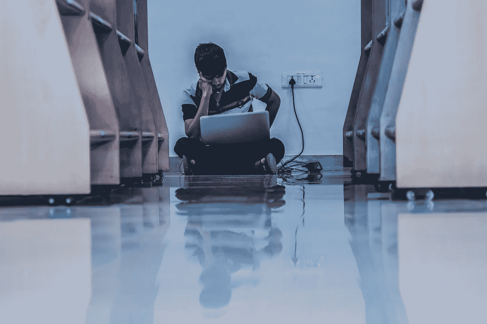

# 图书馆在哪里？

> 原文：<https://medium.com/swlh/wheres-the-library-184441a1fde6>

知识工作需要专注。为此，大学里有图书馆，人们可以在里面专心学习。在我们的大多数公司里，没有这样的不受干扰的工作区。那里的信条是团队合作，它的最高价值是沟通。其结果是工作日主要由预定或自发的会议组成，中间有大量工作，时间太短，无法进行任何有意义的深入工作，只能用来回复这些会议期间积累的大量电子邮件，或者多少有些娱乐性地浪费在智能手机上。所有这一切都发生在开放式办公室里，那里的噪音水平降低了任何形式的集中知识工作的荒谬性，或者只能通过使用降噪耳机进行隔离来使其变得可以忍受。

> *当你按照创造者的时间表运作时，会议就是一场灾难。一个会议可以浪费一整个下午，因为它被分成两部分，每部分都太小，以至于不能做任何困难的事情。另外，你要记得去开会。对于经理日程表上的人来说，这不成问题。下一个小时总会有事情发生；唯一的问题是什么。但是当创客日程表上的人开会的时候，他们就要考虑一下了。*
> 
> [T5【保罗·格拉厄姆】T6](http://www.paulgraham.com/makersschedule.html)

布莱恩·多诺霍和他的产品工程团队 100 天前已经在 Pinterest 开始了一项有趣的实验。星期二到星期四之间不允许开会。根据保罗·格拉厄姆对制造商时间表的论证，目标是为专注的软件开发创造不间断的时间。Brian Donohue [最近报告的结果令人印象深刻，尽管并不令人惊讶:超过 90%的开发人员说他们从那以后变得更有效率。](/@Pinterest_Engineering/three-day-no-meeting-schedule-for-engineers-fca9f857a567)

Pinterest 的这个实验清楚地表明，为知识工作者创造“适合物种”的条件是值得的。然而，会议，尤其是那些参与者太多的会议，无聊的幻灯片之争，以及对自恋倾向者毫无结果的讨论，只是干扰的一个原因。单方面为沟通和协作而设计的不适当的办公室景观至少也是一个巨大的祸害。

> 事实证明，每周 5 天，每天 3 到 4 个小时不间断的、精心安排的集中注意力可以产生很多有价值的产出。
> 
> *卡尔纽波特*

沟通和协作没有错。但是你也需要空间和时间以集中的方式独自工作(或者在结对编程的意义上成对工作)。不幸的是，时间通常不是由 Pinterest 这样的规则给出的，空间也不是由不同区域的合适的办公室景观给出的。所以每个人都必须以某种方式为自己创造这些工作条件。日历中的“不开会”框会有所帮助。家庭办公室也一样，除非你家里有小孩。降噪耳机也是一种非常实用的方法，可以让你在开放式办公室里与外界隔绝，并表明你不想被打扰。也许在大楼的某个地方有一个更安静的角落可以工作，由于有笔记本电脑和无线局域网，这通常不成问题。

> *一些组织还没有意识到这一点，或者还没有阐明这一点，但我们需要艺术家。艺术家是一群有天赋的人，他们能找到一个新的答案，一种新的联系，或者一种完成事情的新方法。那就是你。*
> 
> *塞思·戈丁*

分散注意力的另一个主要来源仍有待消除或最小化。正如[尼克拉斯·戈克令人震惊地观察到的](https://betterhumans.coach.me/a-phone-setup-that-will-make-you-more-mindful-1c5d8be7e661)，我们平均每天使用智能手机 2.5 小时。我们可以也应该对此做些什么，因为无论是智能手机制造商还是应用程序提供商，尤其是脸书等大型平台，都不希望我们受到更多干扰。相反，他们尽一切努力确保我们尽可能频繁地拿起我们的智能手机，花尽可能多的时间使用它。正如[Niklas goke 的文章](https://betterhumans.coach.me/a-phone-setup-that-will-make-you-more-mindful-1c5d8be7e661)中所描述的，幸运的是，有一些简单的技巧和有用的设置可以抵消这一点，并使智能手机重新成为一个有用的工具，服从我们的意志，而不会让我们过于屈服于它的诱惑。

*原载于 2018 年 5 月 17 日*[*fuehrung-erfahren . de*](https://fuehrung-erfahren.de/en/2018/05/wheres-the-library/)*。*

## 这个故事发表在 [The Startup](https://medium.com/swlh) 上，这是 Medium 最大的创业刊物，拥有 325，962+人关注。

## 在这里订阅接收[我们的头条新闻](http://growthsupply.com/the-startup-newsletter/)。

