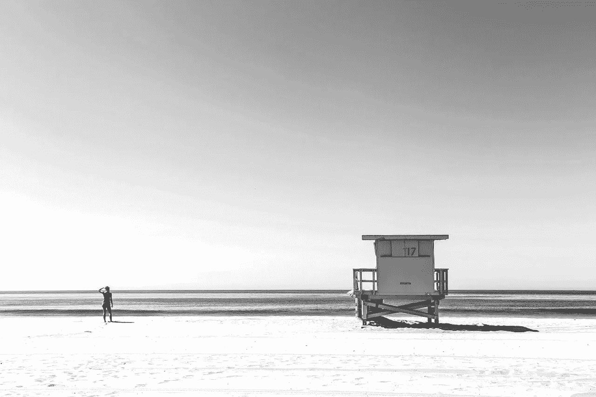

# 你的救生员呢？

> 原文：<https://medium.com/swlh/wheres-your-lifeguard-d43e4a26e0c6>

## 没有人应该独自沉浮。

当事情变得困难时，

你知道你需要说出来，

算出来，

整理一下，

你转向哪里？

忘记教练，导师，[插入行话]。

你知道谁会听吗？

一定有你信任的人。

与问题无关的人。

一个关心你的人，

想给你最好的，

并且会清楚而同情地，

给你打电话。

如有必要。

他们知道所有的细节可能并不重要，

或者你到底是做什么的。

重要的是，

他们认识你。

无论年龄、头衔或经历如何，在这个世界上，如果没有一个人可以在面临困境时向你求助，你将很难成功。

当你陷入困境或挣扎于艰难的决定时，你会感到孤独吗？

当你不知所措，感觉自己快要淹死的时候，你的救生员在哪里？

救生员知道，她可能犯的最严重的错误之一是跳入池中抓住溺水的人并把他拉到安全的地方。

溺水的人很可能会把他们两个都拉下来。

相反，她立即寻找更好的选择来帮助这个人到达安全的地方，比如一根长杆或救生圈。

只有作为最后的选择，救生员才会进入水中，然后用某种物体将受害者拉上岸。

这是我们救生员的职责。

它们不会下水和我们一起嬉戏，所以我们不会因为溺水或试图把我们拖到安全的地方而感觉更好。

他们也不会站在池边大喊最新的游泳技巧，或者就我们未能掌握蛙泳教训我们。

他们是那些给予理解、挑战、想法和选择的人，帮助我们保持清醒，直到我们能够自己游泳。

他们一直在困境中挣扎，经历了艰难的教训，并向一路上帮助他们的救生员学习。

在我们的生活和工作中，我们都需要那个人。

找到那个人。

求助。

跟随他们的领导。

学游泳。

树立你的信心。

成为一名救生员。

*原载于 2018 年 5 月 30 日*[*【soul2work.com】*](https://soul2work.com/2018/05/wheres-your-lifeguard/)*。*

## 这篇文章发表在 [The Startup](https://medium.com/swlh) 上，这是 Medium 最大的创业刊物，有 329，974+人关注。

## 在这里订阅接收[我们的头条新闻](http://growthsupply.com/the-startup-newsletter/)。

