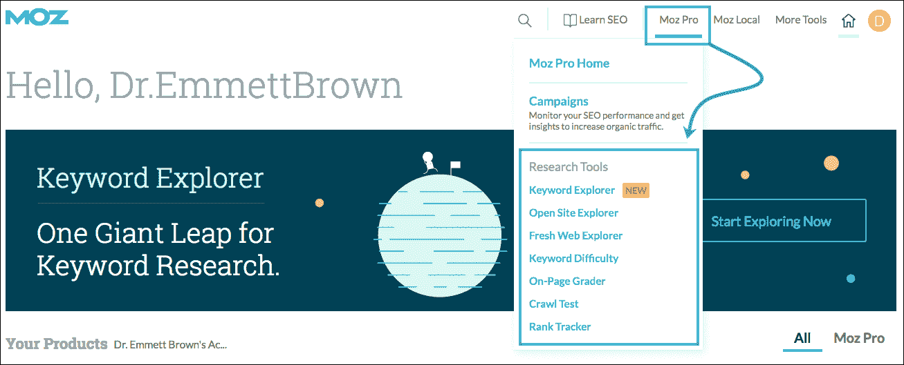
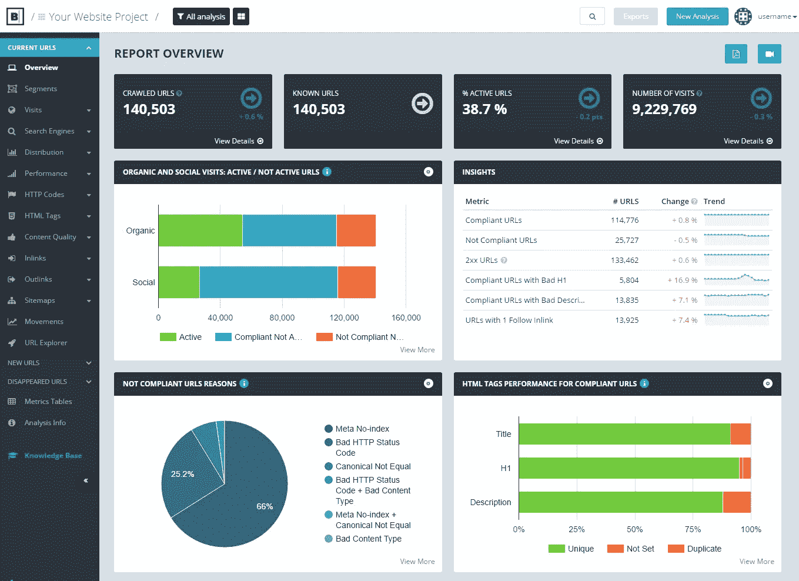
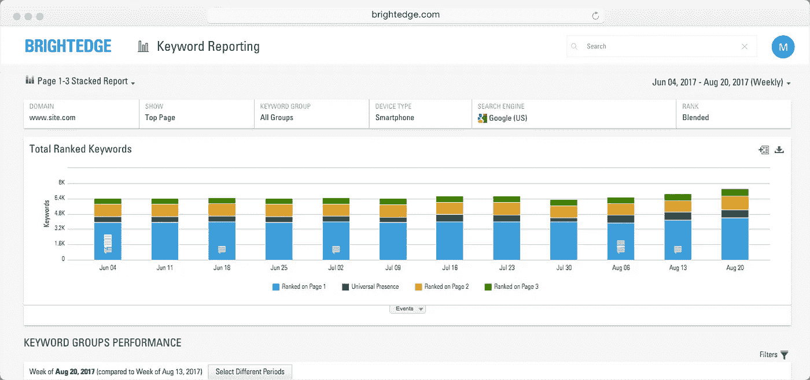
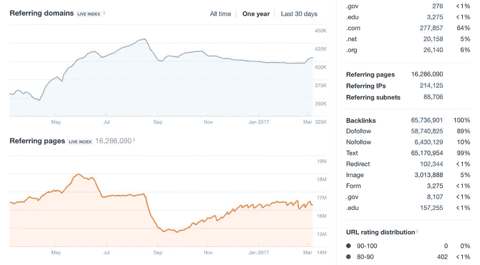
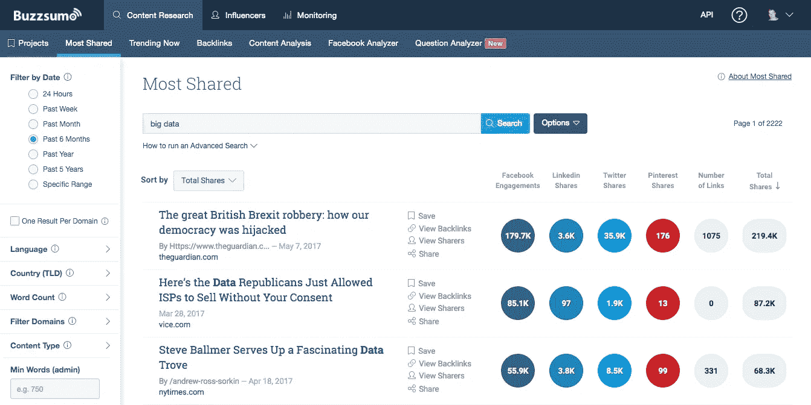

# 我应该购买哪些工具来推进我的 SEO 策略？

> 原文：<https://medium.com/swlh/which-tools-should-i-buy-to-advance-my-seo-strategy-3cfcc328d373>

有机搜索活动的复杂性需要一些技术援助。市场上有很多工具，但是它们在价格、功能和有效性方面各不相同。

**一旦你有了所有的基础，你应该投资哪些搜索引擎优化工具来使你的战略更上一层楼？**

搜索引擎优化领域竞争激烈，每家公司都在争夺第一页顶部的宝贵空间。竞争对手之间的差异点分为以下几个相互交织的类别:人员和技术。假设你已经有了自己的 SEO 团队或[代理合作伙伴](https://searchenginewatch.com/2017/11/27/how-to-hire-the-right-seo-agency/)，你需要让他们拥有市场上最好的技术。

谷歌拥有的产品(关键词规划器，搜索控制台，谷歌分析)是必不可少的，但一个先进的搜索引擎优化策略通常需要一些第三方技术的投资。这种需求创造了一个拥挤的市场——一个没有指导就很难驾驭的市场。

此外，由于如此多的工具似乎在做如此多类似的事情，因此需要应对重叠问题。

事实上，每种工具都倾向于在一两个领域表现出色。许多人将承诺成为一个一体化的解决方案，但这个任务太庞大，难以令人信服地解决。相反，需要工具的组合来涵盖所有的基础。

任何大规模的搜索引擎优化活动都包括以下几个方面:

*   **研究**
*   **技术 SEO**
*   **关键词跟踪**
*   **反向链接分析**
*   **内容营销**

在每个转折点，我们都会遇到一长串技术解决方案，这些解决方案可以揭示新的见解，自动完成繁重的工作，并告诉我们我们的战略是否奏效。

营销人员应该优先考虑这些类别，因为预算很少是无限的，许多最好的 SEO 工具确实需要投资。

之前，我们已经介绍了[最佳免费 SEO 工具](https://searchenginewatch.com/2016/08/02/26-expert-recommended-free-seo-tools/)和移动 SEO 策略的最佳工具。在这篇文章中，我们将回顾投资于高级 SEO 策略的每个核心领域的最佳工具。

# 研究:Moz Pro

Moz Pro 许可证提供了一套令人印象深刻的 SEO 工具。客户可以利用网站爬虫、关键字跟踪器和页面分级器等等。

这给了 Moz Pro 巨大的吸引力，但重要的是要注意它的优势，以及它被其他解决方案超越的地方。

关键词浏览器工具对于研究尤其有价值，远远超过了谷歌的关键词规划器所能提供的。Moz 的关键词研究工具提供了一系列针对关键词的建议，并根据词汇相似度将这些建议分组。

当成熟的 SEO 专业人员已经超越关键字匹配，转向更加细致入微的目标定位方法时，这种能力是必不可少的。

开放站点浏览器(OSE)是标准 SEO 工具箱的长期成员，它保留了对竞争对手反向链接分析的有用性。

域名权限、页面权限和垃圾邮件评分等专有 Moz 指标为 OSE 增加了额外的深度，尽管它还不够全面，不足以作为 SEO 军械库中唯一的反向链接检查器，但它是 Ahrefs 和 Majestic 等网站的自然补充。

Moz 工具栏也在我们的搜索引擎优化最佳 [Chrome 扩展列表](https://searchenginewatch.com/2017/08/17/the-15-best-google-chrome-extensions-for-seo/)中，当你访问网站时，它提供了所有 Moz Pro 功能的访问。

**费用:**从 99 美元/月的基本套餐到 599 美元/月的高级套餐不等。

荣誉奖: Similarweb。

# 技术搜索引擎优化:Botify

技术 SEO 是一个复杂的领域，其特点(甚至可能是漫画式的)是永无止境的电子表格和难以理解的代码。

因此，SEO 技术专家和商业领袖之间的差距一直很大。像“尖叫的青蛙”这样的工具，对新手来说非常有价值，但很难破译，却无助于弥合这一鸿沟。

**然而，技术型 SEO 对性能的重要性意味着其信息需要传达给非技术型受众。**

Botify 设法深入到足够的数据，以提供有意义的分析，但也以令人信服的方式显示这一点，以传递信息。

其有效性的核心是 Botify 日志分析器，它在服务器级别收集和分析数据。这提供了 Googlebot 访问该网站的准确记录，并突出了任何爬行问题。

这些数据的重要性在上周得到了强调，谷歌的 John Mueller 建议日志文件分析是网站所有者的理想资源，他们希望了解他们是否已经切换到了移动优先索引:

> 我想你可能会在日志文件中认出它。如果你现在看看，大概 80%的抓取是在桌面上进行的，20%是在手机上进行的。
> 
> *很可能这种情况会改变，大部分的抓取将会用智能手机谷歌机器人来完成，用桌面谷歌机器人来抓取会减少。*
> 
> *所以，如果你真的想留意你的日志文件，你可能会注意到这一点。*

技术 SEO 的另一个瓶颈是它的改进很难与性能联系起来。例如，除了导致网址被完全排除在谷歌索引之外的严重问题之外，许多技术建议最终可能会被尘封，而更具魅力的变化将付诸实施。

从这个意义上来说，Botify Keywords 是一个方便的功能，因为它引入了搜索控制台排名数据，这些数据可以追溯到网站上的任何技术变化。这为技术性 SEO 带来了额外的责任元素，所有这些都在用户的仪表板中自动跟踪。

**费用:**因地点不同而异。

**荣誉奖:** Deepcrawl。

# 关键词跟踪:BrightEdge

现代关键字跟踪是一件吃力不讨好的工作。随着个性化和本地化的双重进步，每个关键词都没有真正的排名。谷歌的排名基于如此多的因素而不同，以至于它们不再被视为静态资源，但我们不能简单地忽略排名。

因此，SEOs 通常会使用多种工具的组合，包括 Google 的搜索控制台，来了解他们的网站运行情况。

由于其用户友好的界面、可定制的报告和分析集成，许多大公司选择 BrightEdge 进行 SEO 性能跟踪。它还提供了跟踪特定大都市地区排名的能力，这对于在一系列地区开展业务的品牌来说是非常宝贵的。

尽管该平台已经发展到包含这些新产品，但其核心 BrightEdge 仍然是一个可靠的排名追踪器，为从 SEO 专家到 CMO 的利益相关者提供一目了然的性能洞察。

**费用:**取决于所需的关键词、域名和区域的数量。

**荣誉奖:** STAT Search Analytics，SearchMetrics，SEMrush，Conductor。

# 反向链接分析:Ahrefs

当评估一个反向链接分析工具，有一些基本领域要考虑。

首先，应该评估该技术的 URL 索引的大小，以辨别其结果的准确性。

没有一个能完全匹配谷歌索引的范围，这当然比任何搜索引擎优化工具所能达到的范围要大得多。然而，重要的是要记住，每个工具都会抓取并创建自己的索引，因此您在每个工具的仪表板上看到的结果可能会有所不同。

接下来，检查索引更新的频率。鉴于链接对 SEO 排名的重要性，大多数从业者希望至少每周看到指向他们网站的反向链接的数量和质量。

Ahrefs 的索引包含 3 万亿个网址，并且每天更新，这使它比竞争对手更有优势。

它提供了历史反向链接性能的全面概述，并帮助 SEOs 查明任何可能妨碍性能的问题。Ahrefs 也是一个很好的竞争对手分析资源，可用于通过外展活动寻找新的目标网站。

> 总而言之，Ahrefs 为高级反向链接分析提供了最好的包。

**费用:**从 99 美元/月到 999 美元/月。

**优秀奖:**威严 SEO。

# 内容营销:Buzzsumo

反向链接是谷歌抓取网页和网站排名的重要因素，但社交分享和提及是内容营销策略的下一个发展阶段。

从本质上来说，如果一个网站的内容吸引了大量相关的权威链接和大量的社交媒体互动，那么在针对特定查询对网站进行排名时，这个网站可能会受到好评。

当然，说起来容易做起来难。

Buzzsumo 已经成为 SEOs 的一个重要工具，因为它可以帮助我们完成这项艰巨的任务。营销人员可以输入一个域名或一个关键词，看看哪些内容在反向链接和社交媒体份额方面表现最好。

直观的界面允许大量定制，因此可以专注于特定的社交网络、日期或主题。

这也使它成为影响者研究的有用资源，因为它还识别了帮助某些内容资产“病毒式传播”的个人。

Buzzsumo 不能为你写内容，但它至少可以告诉你写什么。它还提供了关于你的内容表现的即时反馈，使它成为一个高级 SEO 策略的无限有价值的工具。

**费用:**$ 79/月到$ 499+/月。

*原载于***。**

**

## *这个故事发表在 [The Startup](https://medium.com/swlh) 上，这是 Medium 最大的企业家出版物，拥有 285，454+人。*

## *在这里订阅接收[我们的头条新闻](http://growthsupply.com/the-startup-newsletter/)。*

**