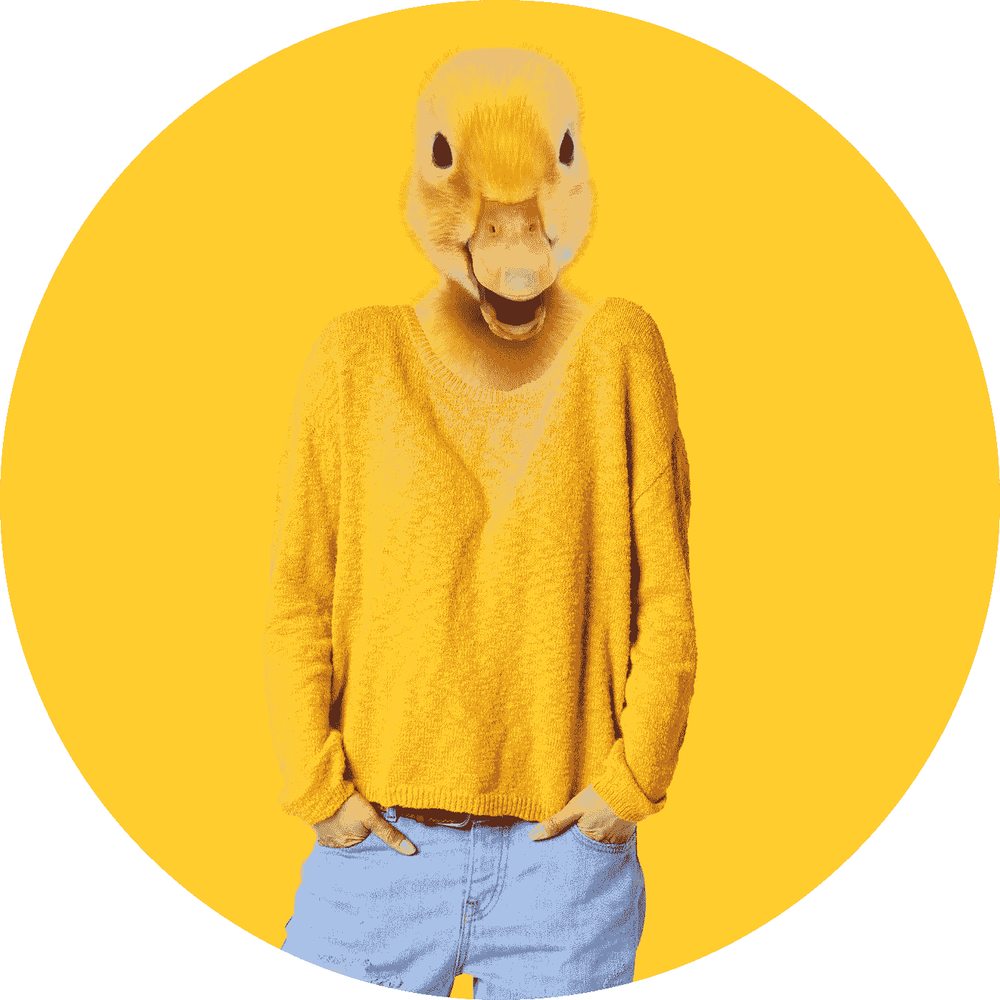
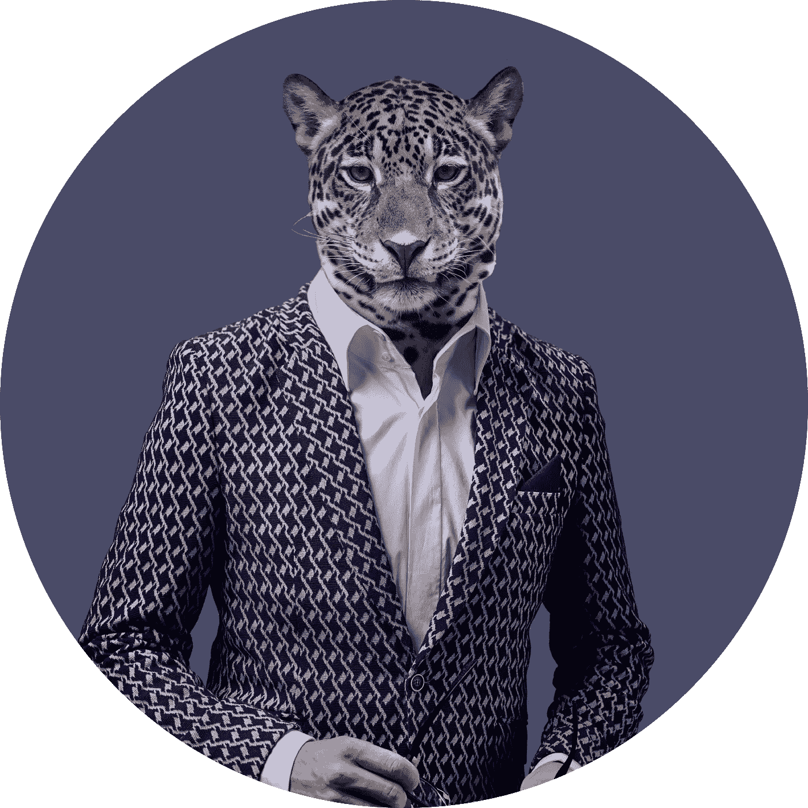
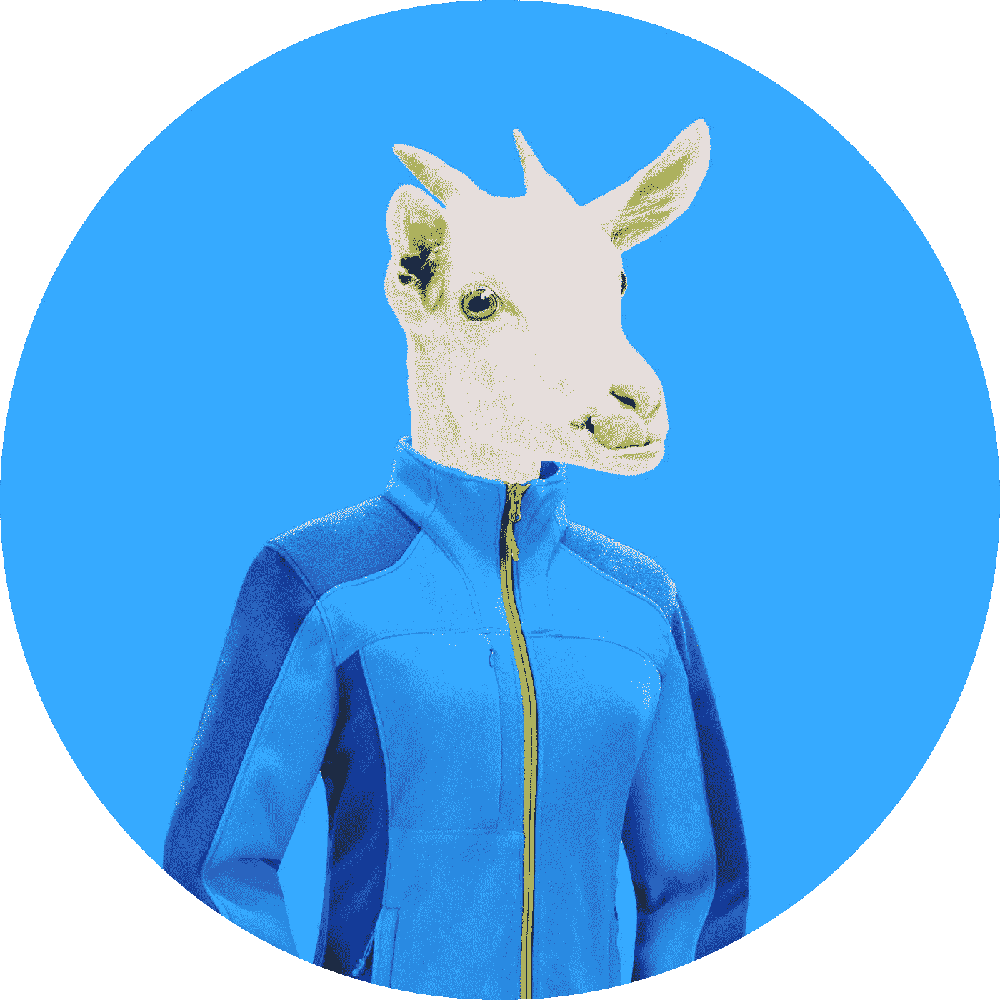
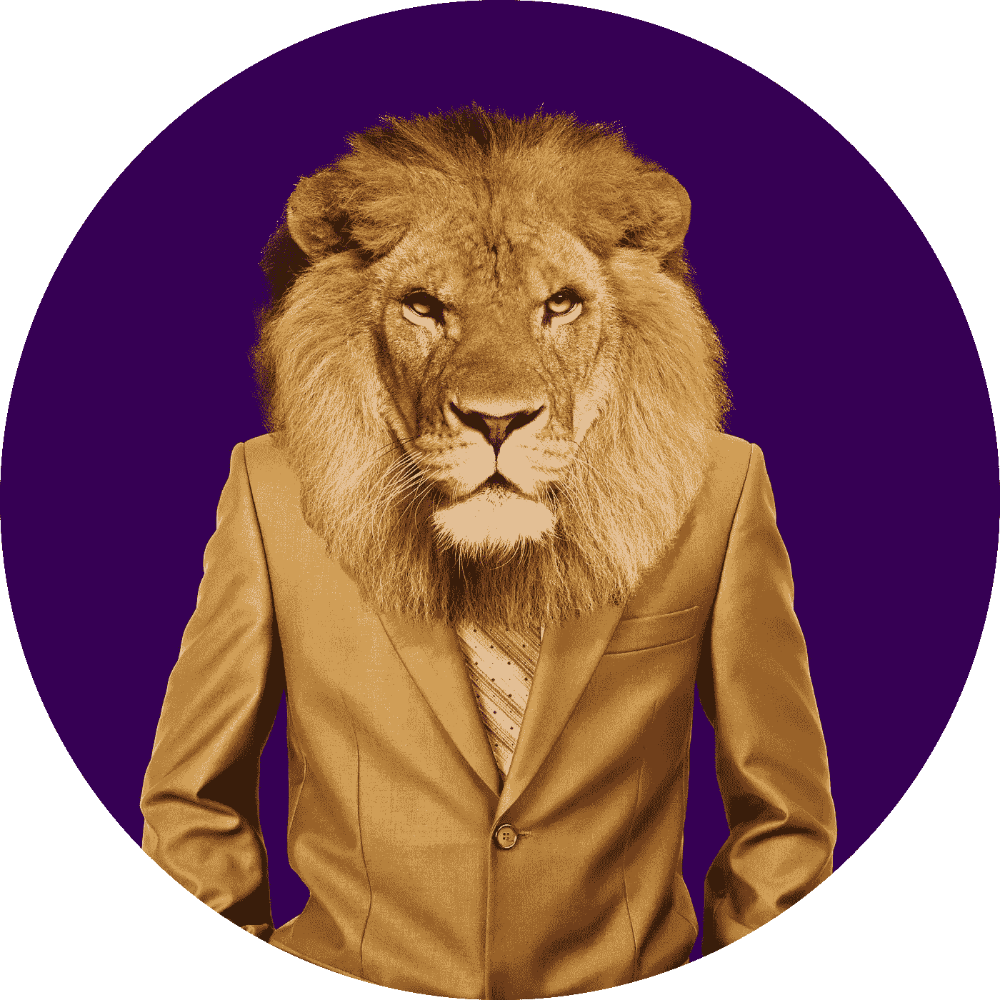
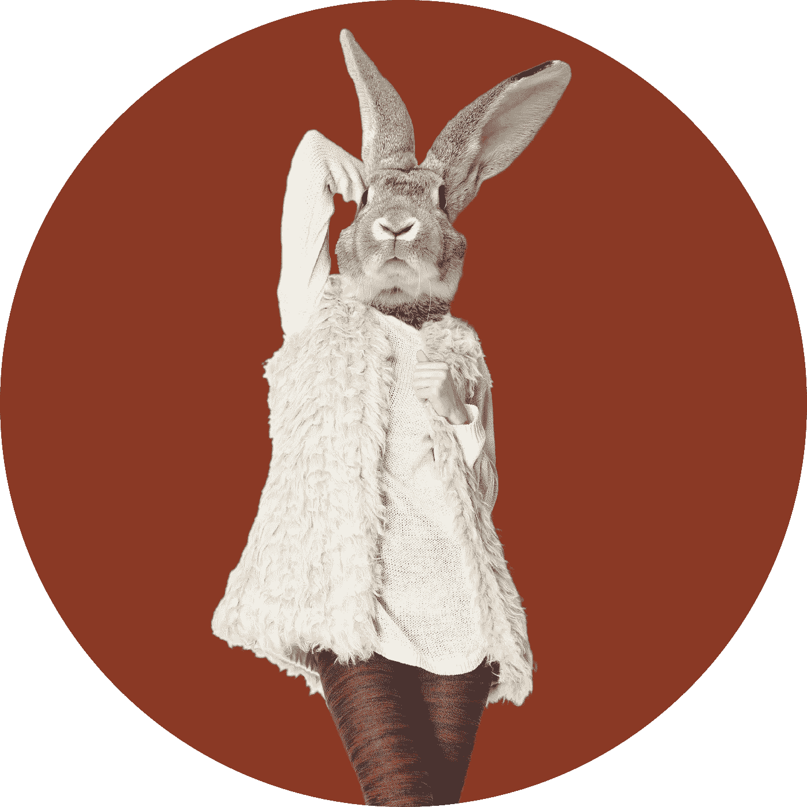
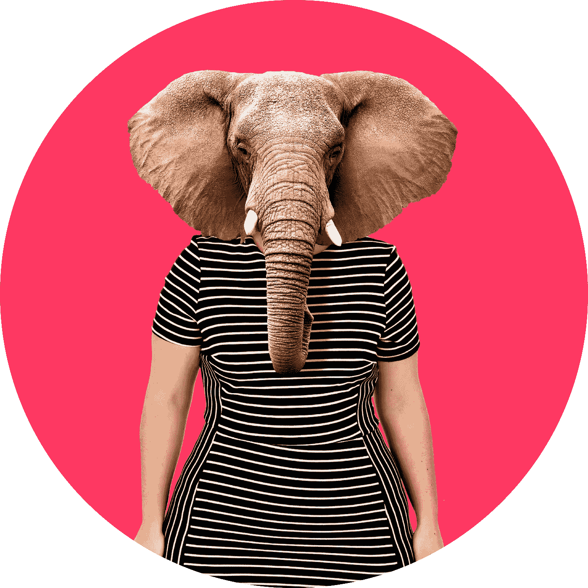
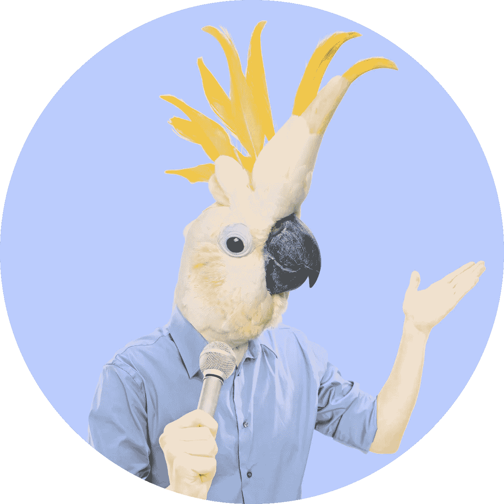
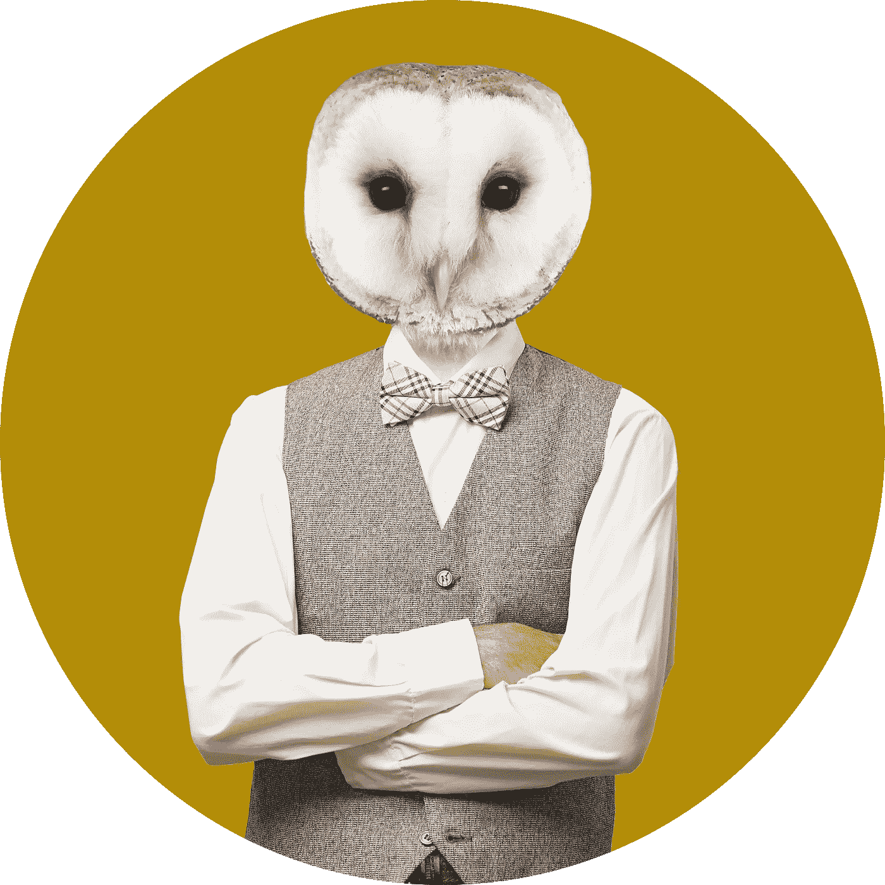

# 你会选择哪种性格？

> 原文：<https://medium.com/swlh/which-type-of-personality-would-you-choose-b0356f5a5c06>

设计师拿钱做选择。有些选择很简单，哪种色彩方式，什么比例，重点在哪里。其他的是关于投资，什么样的摄影，我们需要涉及一个插画师或者排版师。我们也考虑语言和语调。我们会推荐渠道和策略。我们会冒险，尝试新事物，比如技术或颠覆性的想法。

为了引导决策，我们关注品牌。感觉合适可信的。期望是什么，我们如何在不与拥护者失去联系的情况下联系新的受众。

有不同种类的品牌模型可用，金字塔，钥匙，支柱等。我喜欢和三个 p 一起工作，目的，承诺和个性。其他人用原则和主张对此进行扩展，但如果我们想让品牌成为一种速记，就需要保持简单。有些型号需要根据不同的受众进行调整，或者承载一个传统故事。对于任何产品、服务或组织来说，一个有用的平台都应该易于回忆，并始终如一地嵌入每个接触点。

## 好的，目前为止一切顺利

这一切听起来都合乎逻辑。困难在于找到一个焦点，并给人们信心去相信一些简单的事情。设计思维会有所帮助。开发选项，设想未来状态，与观众一起测试，迭代解决方案。

品牌个性不同于其他 Ps。不太理性，有灰色地带。它需要感觉正确，就像一本书或电影中的一个全面发展的角色。

品牌利用个性特征来提供保证并吸引志同道合的人。这些决定性的特征是什么使一些人和相关的。

品牌希望成为所有人的一切。不幸的是，这种方法导致出现像壁纸，只是另一个例子，安也然。传达太多的信号或模仿其他品牌不会让你被注意到。消费者希望被引导，他们在寻找影响他们决策的不同点。

想想人们如何行动和表现，他们的价值观和态度。想想一个人如何将他们的个性转化为身份，他们穿的颜色，他们使用的语言，他们随身携带的东西。这些都是信念的线索，也是他们希望被别人如何看待的线索。

## 品牌原型

> 在具体的文章中使用原型是一种整体的方法，它可以帮助文章赢得普遍接受。这是因为读者可以从社会和文化的角度来理解和认同人物和环境。通过在语境中运用常见的原型，作家旨在将现实主义赋予他们的作品。根据许多文学批评家的观点，原型在特定的人类文化和/或整个人类中有一个标准的和反复出现的描述，它最终奠定了具体的支柱，并能塑造文学作品的整体结构。

心理原型的概念是由瑞士精神病学家卡尔·荣格于 1919 年提出的。在荣格的心理学框架中，原型是思想的先天的、普遍的原型，可以用来解释观察结果。20 世纪后期，一位名叫 T2·迪希特博士的维也纳心理学家将这些心理学概念应用于市场营销。

共有 12 个被认可的[品牌原型](https://www.thehartford.com/business-playbook/in-depth/choosing-brand-archetype)分为四个领域:

*   发现/知识:无辜者、探索者、智者
*   **愿景/结构:**创造者、统治者、英雄
*   归属/关心:爱人，普通人，养育者
*   **变化/风险:**亡命之徒，魔术师，弄臣。

下面是对每一个的简短描述，包括它们如何被用来创造一个营销利基，以及体现这一原型的示例品牌。

## 无辜的人

*目标*:快乐
*特质*:努力向善、纯洁、年轻、乐观、简单、有道德、浪漫、忠诚
*缺点*:可能幼稚或无聊
*营销小众*:公司具有强大的价值观，被视为值得信赖、可靠和诚实，与道德、美德、简单相关，可以怀旧
*例子*:鸽子肥皂或无害饮料

## 普通的男人或女人

*目标*:归属，或与他人联系
*特质*:脚踏实地，乐于助人，忠诚，平易近人，邻家的人，与他人联系
*缺点*:可能缺乏鲜明的身份，融入太多
*营销利基*:平易近人，美德扎实，给人一种归属感
*例子*:龙西尔或易贝

## 英雄

*目标*:帮助改善世界
*特质*:勇敢、大胆、尊贵、坚强、自信、励志
*缺点*:可能傲慢或冷漠
*营销利基*:对世界做出积极的贡献，解决重大问题或促使/激励他人这样做
*例子*:耐克或宝马

## 逃犯

*目标*:打破规则与权威
*特质*:叛逆、打破常规、狂野、为改变铺平道路
*缺点*:可能做得太过火而被人以负面方式看待
*营销利基*:变革的代理人，为被剥夺的权利辩护，允许人们发泄或打破常规
*例子*:哈雷戴维森或维珍

## 探险家

*目标*:通过发现和新体验找到满足感
*特质*:躁动不安、敢于冒险、雄心勃勃、个人主义、独立、开拓性
*缺点*:可能不适合主流
*市场定位*:刺激、冒险、真实
*例子*:路虎或红牛

## 创造者

*目标*:创造有意义和持久价值的东西
*特质*:创造力、想象力、艺术、发明、企业家、不墨守成规
*缺点*:可能是完美主义或不切实际
*营销利基*:有远见，帮助客户表达或创造，培养他们的想象力
*例子*:乐高或索尼

## 统治者

*目标*:控制，从混乱中创造秩序
*特质*:领袖、负责、有组织、榜样、管理者
*缺点*:可能缺乏共同联系，或者过于权威或控制
*营销利基*:帮助人们变得更有组织，恢复秩序，在混乱的世界中创造更多的稳定和安全
*例子*:微软或奔驰

## 魔术师

*目标*:让梦想成真，创造一些特别的东西
*特质*:有远见、有魅力、富有想象力、理想主义、精神上的
*缺点*:能够承担导致坏结果的风险
*营销利基*:帮助人们改造他们的世界，激发变化，扩展意识
*例子*:迪士尼或苹果

## 情人

*目标*:创造亲密关系，激发爱
*特质*:热情、感性、亲密、浪漫、热情、忠诚、理想主义
*缺点*:可能太无私或不够接地气
*营销利基*:帮助人们感受欣赏、归属、联系、享受亲密关系、建立关系
*例子*:维多利亚的秘密或哈德达斯

## 护理员

*目标*:关心和保护他人
*特质*:关心、母性、养育、无私、慷慨、富有同情心
*缺点*:被利用、被认为理所当然或被剥削
*营销利基*:通过医疗保健、教育或援助项目帮助人们关心自己、服务公众
*例子*:强生&强生或沃尔沃

## 小丑

*目标*:给世界带来欢乐
*特质*:有趣、幽默、轻松、顽皮、不敬
*缺点*:可能被视为轻浮或无礼
*营销小生*:帮助人们度过美好时光或享受他们正在做的事情，让人们变得更加冲动和自发
*例子*:彩虹糖或旧香料

## 圣人

*目标*:帮助世界获得智慧和洞察力
*特质*:知识渊博、值得信赖的信息来源、智慧和智力、善于思考、善于分析、导师、权威、顾问
*缺点*:可能过于沉思或过于固执己见
*营销利基*:帮助人们更好地了解世界，提供实用信息和分析
*例子* : BBC 或 Google

就单一原型达成一致可能很困难。通常会有意见分歧，缺乏焦点或试图拥有太多。然而，与众不同且令人难忘的品牌让它变得简单。专一而不复杂。

为了帮助设计师做出更好的选择和引导决策，我们需要一个强大的品牌平台；明确的目标感，对承诺的理解和有吸引力的个性。

*感谢您抽出时间阅读本文。我真的很感激。*

## 这个故事发表在 [The Startup](https://medium.com/swlh) 上，这是 Medium 最大的创业刊物，有 318，120 多人关注。

## 在这里订阅接收[我们的头条新闻](http://growthsupply.com/the-startup-newsletter/)。

