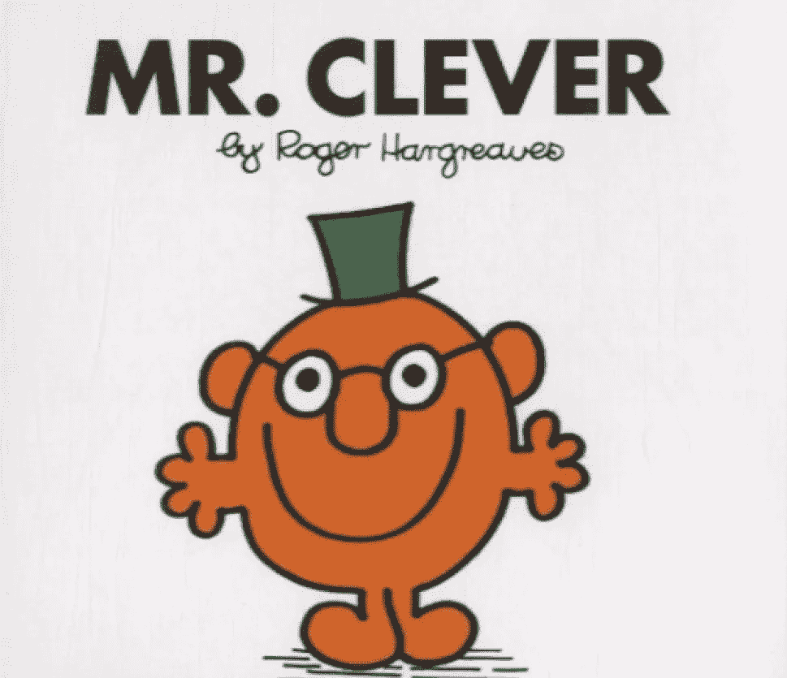
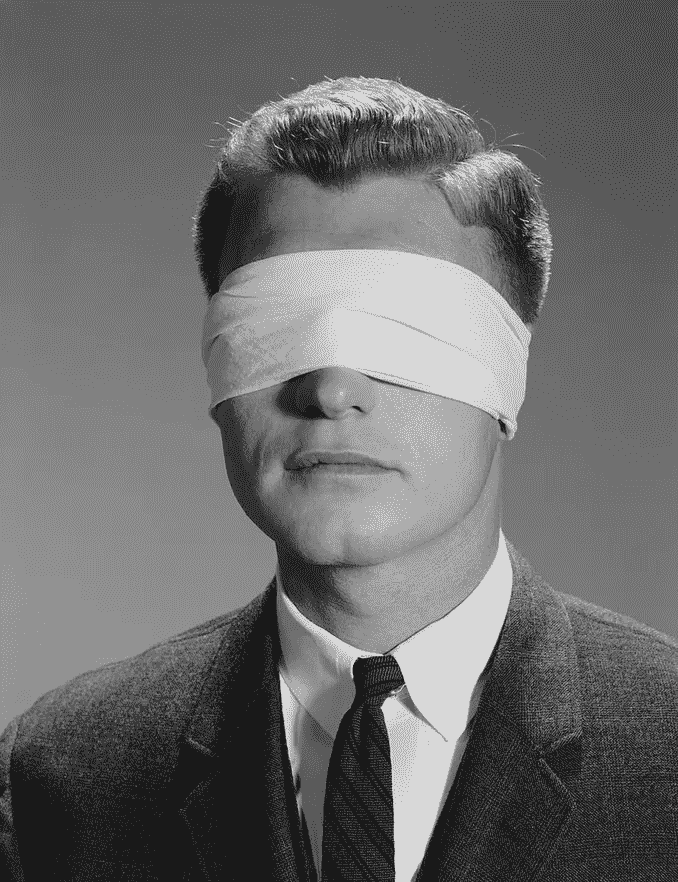
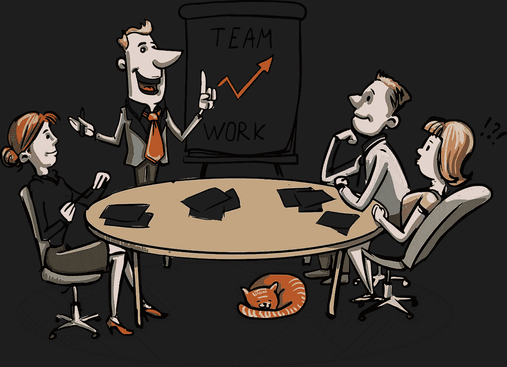

# 你是哪个职场 Mr 人物？

> 原文：<https://medium.com/swlh/which-workplace-mr-character-are-you-147f364bc5ac>

## 有时候真相太接近真相了

image courtesy of author Roger Hargreaves

在工作中，你是超级巨星、慢吞吞的人还是介于两者之间的人？

你还能是谁？

受罗杰·哈格里夫斯的*男人先生*系列的启发，我把*先生带入了商业世界。你可能会惊讶于这些性格特征中有多少是你自己真正表现出来的，或者至少，你认识一个这样的人。*

*来自*政治正确先生*的旁注——以下所有字符应被视为性别和头衔不可知，即:用“女士”、“夫人”、“小姐”或“博士”或任何其他适用的头衔前缀替换“先生”是可以的。*

## *托勒先生还是搅局先生？*

****

*images @ pixabay*

*Toiler 先生——我们都知道这个人。一个有正确的职业道德、价值观和行为的人，但是一个不具备我称之为“理性”的那种难以定义的品质的人。他们很努力，但他们错过了角色的微妙之处，因此在没有意识到的情况下摸索着从一个任务到另一个任务。*

*做这样的人是可以的，只是不要指望在公司的食物链上有任何进一步的进步。*

***剧透先生**——视自己为组织良心的人，每次会议都需要的黑帽人。但对其他人来说，他们只是工作场所的讨厌鬼，总是试图给游行泼冷水。如果他们的意图是可敬的，那么他们可以增加价值，否则尽可能避免他们。*

## *盲人先生还是金德先生？*

***

images @ pixabay* 

****盲人先生—***这种人缺乏自我意识，无法理解同事对自己的看法。*

> *他们无法理解自己的弱点，这是他们最大的弱点。*

*他们继续盲目地做自己的事情，没有意识到这可能会惹恼别人，或者至少有点烦人。*

*不要做这个人。*

****善良先生——***不能说“不”的人。他接受每一个会议邀请，总是在需要时提供帮助，并且是每个工作组的志愿者。*

*人们认为他是一个可靠、能干的人，但这是以牺牲效率为代价的。*

*你看，他努力完成他的核心工作，因为他总是对其他事情说“是”。他通过长时间工作来弥补，以弥补他陷入的所有“是的工作”。*

**善良先生*的头衔看似诱人，但不要以成为*出租车先生*(总是很累，总是迟到)为代价去追逐它。*

## *是先生还是先生*

****

*images @ pixabay*

*先生是当前的摇滚明星。踢重要球的高水平运动员。被任命到一个引人注目的投资组合，并产生让高管、董事会和股东满意的结果。*

*做这个人挺 OK 的。*

***先生是——**这是*先生是*谁被提升(或追求)一个角色太多。他现在成了彼得原则的受害者…*

> *“在一个组织中，每个人都会提升到自己无能的水平”*
> 
> *劳伦斯·彼得*

*他们知道的足够多，也许可以胜任他们的新角色，但不足以成为他们曾经的摇滚明星。别变成这种人。*

## *收购先生还是解雇先生？*

****

*images @ pixabay*

***Mr Acquired–**主动被猎头看中并被直接任命担任该职位的人。*

*成为后天先生是一件好事；这意味着你很受欢迎。但要确保你能做好准备，因为在其他人判断这项任命是否值得大肆宣传的时候，收购先生可能会无意中发现自己处于聚光灯下。*

*被解雇的先生——我们在工作场所都尽量避免的人。别做这种人！*

## *下巴先生还是背后捅刀子先生？*

****

*images @ pixabay*

*Chin Wag 先生我们都知道这个家伙。地板上的社交聚会。他们喜欢聊天，即使是在最不方便的时候。*

*现在不要误解我的意思，工作场所的谈话是可以的…只要适度，并考虑到环境和其他人的胃口。*

*如果你被认为是一个摇摆先生，残酷的现实是你需要改变你的方式。这不是一个很好的工作场所处理方式。*

****背刺先生***——名字就说明了一切。别做这种人。如果你是一个背后捅刀子的先生，你可能也会被称为混蛋先生(在你背后…讽刺)。你也可以在注册办公室正式更名……介绍*被解雇的先生*(见前文)。*

## *格林先生或被看见先生*

****

*格林先生——没有经验的那个。很可能是团队中的新人，也许是他们大学毕业后的第一份真正的工作。潜力很大，但还没有进展。做这样的人完全没问题，我们都得从某个地方开始，对吗？不要在 3 年、5 年或 10 年后成为格林先生！*

***Be-Seen 先生—**总是通过课外工作组、宣传片、活跃的社交网络和与合适的人交谈来积极推销自己的人。这些都没有错，只要它不那么明显，不至于令人生厌。*

## *智能手表先生还是金表先生？*

****

****智能手表先生——***球队现任 MVP。时尚、现代、可定制和多技能。每个人都想拥有一个*智能手表先生*，但可以说它们可能会因你所得到的东西而定价过高。*

*关于 Mr Smart Watch 的一个挥之不去的问题是，它们会在下周、下个月或明年被更新的型号取代吗？*

*做这样的人很好但是要时刻提醒自己，如果今天你很时尚，明天你会是什么？*

****Mr Gold Watch—***传统有很多优点，25 年以上的工作经验给了这个人组织所需要的经验和智慧。有些人可能会把戈尔德先生的手表视为永恒的杰作。通常那个人就是金先生本人。*

*但其他人可能认为他们现在有点过时了。其他人知道，金表维护起来很复杂，随着时间的推移，寻找替换零件变得越来越难。这导致了被更新、更灵活的版本取代的危险(见上文)。*

*因此，如果你是一只 Mr Gold 手表，请注意你的老化机制，并定期校准自己，以确保你仍能提供众所周知的精度和可靠性。*

## *扔手榴弹先生还是割草机先生？*

****

*images @ pixabay*

****榴弹发射器先生——***又称*作物喷粉机先生。这种人会在会议中扔出臭弹，然后在影响完全生效之前，漫不经心地飞向夕阳。**

*这个人是另一个工作场所阻止者，但他是一个秘密行事的人。他们会在观众面前说所有正确的事情，然后在离开房间时悄悄扔出手榴弹以拖延进度。通常，电子邮件是他们的首选。*

*别做这种人。*

*割草机先生-这个人会随时帮你割草，尤其是在你没有要求的时候。不一定是亲密的工作同事，但一定是足够亲密的人，在本该属于你的时候抓住机会成为焦点。这是一个值得警惕的人，也是你绝对不想成为的人。*

## *支配者先生还是促进者先生？*

****

*images @ pixabay*

*支配者先生-------------------------------------------------------------------喜欢自己声音的人，用自己强烈表达的观点接管任何讨论。他们不断试图阻挠最基本的进化法则之一…*

> *我们有两只耳朵和一张嘴是有原因的*

*所以，如果你是那种在团队环境中感觉没有人敢说话，或者他们说的话不值得听的人，也许你就是*支配者先生。**

*给你个提示…也不要做这种人。*

*主持人先生-这个人善于让其他人参与讨论。他们的两只耳朵得到了很好的锻炼，他们的一张嘴只是周期性地放松。*

**辅导员先生*对任何企业来说都是一笔宝贵的财富，所以发展你的技能，成为其中一员吧。*

## *讨人喜欢的先生还是活在现实中的先生？*

**

*image @ pixabay*

****亲和力先生—*** 团队中受欢迎的人，和他在一起感觉很好。他们乐观的精神是有感染力的，当工作场所的压力水平上升时，这一点尤其有用。*

*做一个“讨人喜欢的先生”并没有错，只是不要用内德·弗兰德斯那种方式。*

*如果你同意这一点，就替我说*是的——毫不犹豫地说*。*

****现实生活先生***——也称为*太空学员先生*，这个人经常被诽谤和误解。问题是，它们被误解得如此之深，以至于没有人能从它们身上得到任何意义。就连 Chin Wag 先生也主动避免和这个家伙交谈，因为他是个十足的水果圈。*

*工作提示……如果你还没搞清楚谁是生活在自己现实中的先生,在你的工作场所，那很可能就是你！*

## *伯恩斯先生或渴望先生*

****

****伯恩斯先生—*** 我们都想或想成为的老板的对立面。他完全不了解组织的运作，包括每天为他辛勤工作的人们。*

*作为补偿，他身边有一大群薪酬过高的顾问，他们对他的每一个要求都俯首帖耳，他还让自己远离员工，保持豪华的角落办公室，其入口受到猎犬(也称为行政助理)的严密保护。*

*如果你的职位足够高，可以和伯恩斯先生相提并论，那就不要做伯恩斯先生。*

****先生朝思暮想——***又叫*先生要是，*这就是朝思暮想的人。无论是下一次大的晋升，还是在“更好的公司”中的角色，他们总是抱怨他们所拥有的，并渴望他们能够拥有的。*

*恩斯先生是那种选择继续做自己处境的受害者的人。他们擅长对可能发生的事情采取口头行动，但不擅长采取实际行动将他们从 A 地转移到 b 地。*

*渴望某些东西是可以的，但不要落入成为一个*渴望先生的陷阱。**

*所以你有它。对你公司中可能存在的一些职场角色的一点小见解。你现在知道应该避开谁或者应该效仿谁了。*

*也许增加或减少每一个的小元素来成长和发展你自己的性格？*

*如果你喜欢这篇文章，请分享并标记一位同事自己的*手柄先生(别这么刻薄先生就好！).并随意提名额外的人物对作为我正在策划的一个“ ***”你是哪个职场先生？—第二部分*** ”。**

**这是一个潜在的高峰，还会有什么……感恩先生还是态度先生？或者工作先生或者推卸先生怎么样？**

**你有什么建议？**

**PS:你是哪种类型的领导者？你是摇滚明星领袖、街头艺人还是淋浴歌手？一探究竟【趣味】 ***3 分钟“丑陋的真相”领导问答*** [*此处*](https://www.quiz-maker.com/Q2I9S03) *。***

****

## **这篇文章发表在 [The Startup](https://medium.com/swlh) 上，这是 Medium 最大的创业刊物，拥有+397，714 名读者。**

## **在这里订阅接收[我们的头条新闻](http://growthsupply.com/the-startup-newsletter/)。**

****