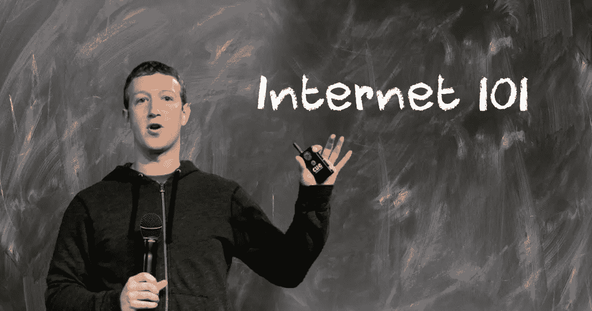

# 谁获得技术？不是立法者，老的和年轻的…

> 原文：<https://medium.com/swlh/who-gets-technology-not-lawmakers-old-and-young-d6fbe00d011b>

Via [CNET](https://medium.com/u/8a3d61af960e?source=post_page-----d6fbe00d011b--------------------------------) on Facebook

## 不得不承认，马克·扎克伯格在国会山的证词看起来很痛苦！

本周，脸书创始人、董事长兼首席执行官马克·扎克伯格在国会山的证词笼罩在阴影之下。从椅子上的额外衬垫和他笔记的病毒照片，到由达纳·米尔班克撰写的题为“亿万富翁马克·扎克伯格努力扮演成年人”的[华盛顿邮报](https://medium.com/u/f0c3167dc11d?source=post_page-----d6fbe00d011b--------------------------------) [专栏](https://www.washingtonpost.com/opinions/facebooks-boy-billionaire-leaves-the-tough-stuff-to-the-grown-ups/2018/04/10/694d48ce-3d0b-11e8-a7d1-e4efec6389f0_story.html?utm_term=.cb3c0af87248)

男孩？真的吗？

那是无稽之谈，纯粹的*阴影*……我认为，技术与年龄无关。

在观看这场为期三天的马拉松比赛的人们看来，给他们印象最深的不是那些无关紧要的东西，而是讨论的实质内容是多么的少。一些人说，代际墙阻碍了立法者和扎克伯格之间的任何建设性对话，反之亦然。但对我来说，更多的是相互理解的意愿，而这是缺失的。此外，扎克伯格当然已经做好了充分的准备，但参议员和众议员却没有。

这将人们的注意力从实质转移到了无关紧要的话题上，比如今天互联网的作用，以及技术和隐私的未来。这不仅仅是关于像脸书、谷歌、微软和苹果这样的大公司巨头。这也是关于年轻的创业公司和理解如何为平台和用户创造一个安全、有创意和开放的环境。

当然讨论了一点，虽然不是很详细。

欧洲及其通用数据保护条例(GDPR)似乎受到了极大关注，该条例将于 5 月底在欧盟生效，并将对欧洲互联网企业的运营方式产生重大影响，无论它们是否位于欧盟成员国境内。

 [## 马克·扎克伯格和欧洲的 GDPR

### 在国会山的证词中，脸书的创始人兼首席执行官似乎是新的…

hackernoon.com](https://hackernoon.com/mark-zuckerberg-and-europes-gdpr-9b76adebf8bd) 

当时讨论的是什么？

在观看了超过 10 个小时的证词后，看起来许多问题都是关于“技术支持”——用丹尼斯·克劳利的话来说——而不是技术政策。

Foursquare 的联合创始人克劳利在推特上发帖称:“扎克的一些证词听起来很像我在感恩节期间为我的亲戚提供技术支持。”

“参议员们真是个笑话！”Recode 的卡拉·斯威舍(Kara Swisher)在作证的第一天结束时颇为露骨地说道。

她将他们的问题比作扎克伯格“被柔软、柔软、柔软、非常漂亮的羊绒枕头击中”，她经常将这些证词称为“服务台”谈话。

“马克·扎克伯格的国会听证会看起来很痛苦，”伊丽莎白·林德写道，她是[查塔姆大厦](https://medium.com/u/60e0af439048?source=post_page-----d6fbe00d011b--------------------------------)的高级顾问，也是前脸书驻伦敦公共发言人。“这并不是因为马克本人在哈克广场的自然栖息地比在美国首都更舒服。而是因为大多数参议员的问题过于公开地暴露了他们很少根据数字时代的晴雨表来规划自己的生活。"

 [## 伊丽莎白·林德

### “如何在 21 世纪举办国会听证会”马克·扎克伯格的国会听证会看起来很痛苦…

www.facebook.com](https://www.facebook.com/photo.php?fbid=10101293399922992&set=a.535254738062.2084786.1110201&type=3&theater) 

她补充说:“全世界都在关注美国国会，想象一下，美国参议员会从他们所代表的人民和世界上遥远的角落获得尊重，他们积极倾听、吸收和消化他们精通数字技术的工作人员和世界上最大的社交媒体平台的首席执行官之间的激烈交锋中传递的信息。作为一名 21 岁的 WhatsApped 用户，当我们观看听证会时，我发现‘这些问题是错误的问题’。”

一位[今日美国](https://medium.com/u/979cb9a2cd42?source=post_page-----d6fbe00d011b--------------------------------)读者[写道](https://www.usatoday.com/story/opinion/2018/04/11/readers-mark-zuckerbergs-senate-hearing-facebook-not-going/506315002/):“那一定很艰难。一年级水平答题*不*笑。这些参议员真的应该和他们的一些大孩子坐下来，让他们解释网络浏览器和互联网是如何工作的。他们来到谈判桌前，完全没有准备好提出有意义的问题。”

Vox 的 Andrew Golis 在推特上开玩笑说:“这次国会听证会是一个强有力的证明，我们需要更多 75 岁以下的参议员。”他补充说:“我把 75 岁当成一个笑话，但实际上，到目前为止，至少有 5 名向扎克伯格提问的参议员已经 75 岁或以上了。格拉斯利，84 岁。纳尔逊，75 岁。费恩斯坦，84 岁。奥林·哈奇，84 岁。帕特里克·莱希，78 岁。引人注目。”

同样的感觉似乎很普遍。一篇由[马克·苏利文](https://medium.com/u/6b50e6f89c17?source=post_page-----d6fbe00d011b--------------------------------)撰写的[快速公司](https://medium.com/u/ada2289350de?source=post_page-----d6fbe00d011b--------------------------------)文章标题为:“扎克伯格再次证明了国会不懂互联网。”副标题是:“今天混乱的脸书听证会让人对国会能否起草一份有用的数据保护法案失去了信心，更不用说达成一致了。”

沙利文指出，扎克伯格在开场白中说:“你当然会有一些难以回答的问题。”

但在作证的第一天，这里有一个最热门的问题:

参议员奥林·哈奇:“如果(脸书的一个版本将永远免费)，你如何维持一种用户不为你的服务付费的商业模式？”

马克·扎克伯格:“参议员，我们做广告。”

参议员哈奇继续追问脸书是否会永远免费，“公平地说，参议员——正如 [MarketWatch](https://medium.com/u/afad1a2d7ad4?source=post_page-----d6fbe00d011b--------------------------------) 报道的——让扎克伯格公开表示，总会有免费的脸书‘版本’,并留下付费版本的可能性。”

这一系列问题不仅涉及脸书及其商业模式，还涉及脸书的一些应用，包括 WhatsApp。

“这是参议员不一定知道脸书及其产品如何运作的又一个例子，”Recode 在国会山的现场报道中写道。”参议员布莱恩·沙茨(Brian Schatz)多次询问他的 WhatsApp 信息是否可以用来宣传他看到的广告。扎克伯格多次回复说，WhatsApp 的信息是完全加密的——这意味着不，脸书无法阅读它们。沙茨肯定不是唯一一个有这个问题的人，但这次交流表明，脸书必须定期帮助人们了解其服务在相当基础的层面上是如何工作的。”

## 这篇文章发表在《创业公司》杂志上，这是 Medium 最大的创业刊物，有 316，028 人关注。

## 订阅接收[我们的头条新闻](http://growthsupply.com/the-startup-newsletter/)。

