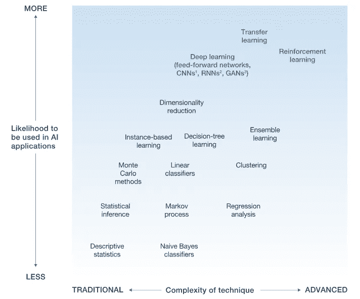
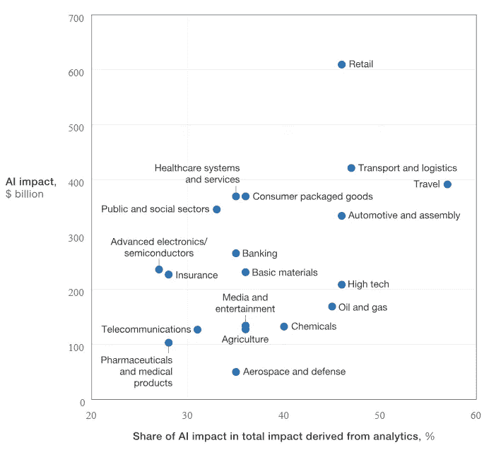
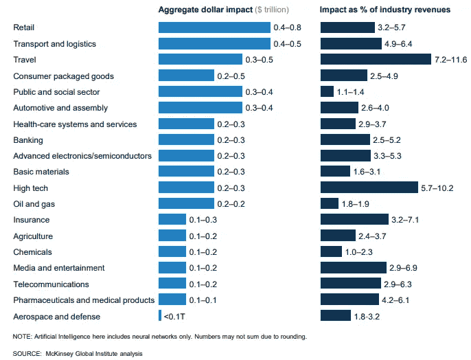
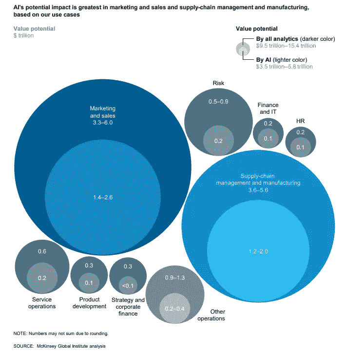

# 人工智能谁来赚钱？

> 原文：<https://medium.com/swlh/who-is-going-to-make-money-with-artificial-intelligence-4a9aa7dd11a9>

## 分析人工智能和深度学习的货币价值

*   咨询公司*麦肯锡&公司*估计，人工智能有潜力在 19 个行业的 9 项业务职能中每年创造**3.5 万亿**到**5.8 万亿**的价值
*   人工智能将在营销和销售中产生高达 2.6 万亿美元的附加值
*   额外的**2000 亿美元**价值将添加到定价&促销和**1000 亿美元**
*   麦肯锡的研究表明，人工智能和深度神经网络在 69 %的情况下能够提高现有分析技术无法提供的性能。

这些要点和许多其他有趣的内幕摘自*麦肯锡全球研究所*讨论文件“ [*人工智能前沿笔记:深度学习的应用和价值*](https://www.mckinsey.com/~/media/mckinsey/featured%20insights/artificial%20intelligence/notes%20from%20the%20ai%20frontier%20applications%20and%20value%20of%20deep%20learning/mgi_notes-from-ai-frontier_discussion-paper.ashx)

该讨论文件借鉴了*麦肯锡全球研究所*的研究和该公司在*麦肯锡分析*的人工智能方面的应用经验，评估了先进人工智能技术的实际应用和经济潜力。这份讨论文件的发现是基于麦肯锡全球研究所(McKinsey Global Institute)对 19 个行业和 9 项业务职能的 400 多个用例进行的深入分析。

在我们进一步分析哪些市场受到 AI 的影响以及影响到什么程度之前，我们先讨论一下人工智能到底是什么意思。

# 1.多种形式和多方面的人工智能

如今，许多公司声称在他们的应用程序或服务中加入了某种人工智能。但人工智能只是一个更广泛的术语，它描述了当机器模仿人类与其他人类思维相关的"*认知*"功能时的应用，如"学习"和"解决问题"。

在较低的层面上，人工智能只能是一种编程规则，它决定了机器在特定情况下以特定方式行事。相反，当谈到人工智能时，只值得考虑两种不同的方法:**机器学习**和**深度学习**。

**机器学习**结合了各种任务的*经典*算法，如聚类、回归或分类。这些算法中的许多已经使用了几十年。**然而，深度学习**是一个相对年轻的领域，它结合了**神经网络**，能够解决经典以及更高级的任务，例如图像识别和语言生成，仅举几例。在这一点上，我不会进一步解释各种神经网络体系结构以及它们如何用于特定的业务领域(不过，这些是后续文章的主题)。

你必须随身携带的一件事是，如果一家公司想要将人工智能融入他们的服务或产品，深度学习是必经之路。

这可以从图 2 中看出。1 从*麦肯锡全球研究所*的讨论文件中，我们可以看到**深度学习**(蓝色)比经典的**机器学习**算法(黑色)更有可能用于人工智能应用。甚至*迁移学习*和*强化学习*都是只有使用神经网络才能展现其全部潜力的技术。

Fig.1 The vast scope of AI.

# 2.工业

仅人工智能在全球经济中的 19 个行业和 9 个商业功能中的年潜在价值总额就在 3.5 万亿美元到 5.8 万亿美元之间。这构成了所有分析技术可能带来的 9.5 万亿到 15.4 万亿美元年度影响的 40%。

图 2 更详细地显示了对人工智能的影响(以**$ 10 亿计**)以及人工智能影响在分析技术得出的总影响中所占的百分比份额。

据估计，就每个行业而言，人工智能的潜在价值相当于 2016 年收入的 **1** 至**9**。即使潜在价值最小的行业，航空航天和国防(不到 500 亿美元)也能创造相当于黎巴嫩 GDP 的年价值。

Fig. 2 Impact of AI on 19 different industries.

此外，图 3 显示了人工智能在 **$万亿**中对 19 个行业的影响，以及人工智能影响占行业收入的百分比。相比之下，作为整体收入的一个百分比，人工智能在旅行中的潜在年度价值大约在行业收入的 7%到 11%之间。这是对整个行业收入的最高相对影响。

货币影响最大的是零售业，估计有**0.4-0.8****万亿美元。**

Fig . 3 Percentage of the industry revenue

# 3.商业职能

现在来说说 AI 对各种业务功能的影响。图 4 不言自明。它显示了人工智能的价值潜力，并与九个不同业务功能的经典分析的价值潜力进行了比较。

说到商业领域，人工智能最大的价值机会在市场营销和销售，以及供应链管理和制造。

Fig. 4 Businesses Functions

# 如果你对更多人工智能/深度学习相关的文章感兴趣，请查看我在 TowardsDataScience 上的其他文章:

*   [自学 AI 智能体系列](https://towardsdatascience.com/self-learning-ai-agents-part-i-markov-decision-processes-baf6b8fc4c5f)
*   带有[波尔兹曼机器](https://towardsdatascience.com/deep-learning-meets-physics-restricted-boltzmann-machines-part-i-6df5c4918c15)或[深度自动编码器](https://towardsdatascience.com/deep-autoencoders-for-collaborative-filtering-6cf8d25bbf1d)的推荐系统
*   还有更多

## 这篇文章发表在 [The Startup](https://medium.com/swlh) 上，这是 Medium 最大的创业刊物，拥有+386，966 名读者。

## 在此订阅接收[我们的头条新闻](http://growthsupply.com/the-startup-newsletter/)。

