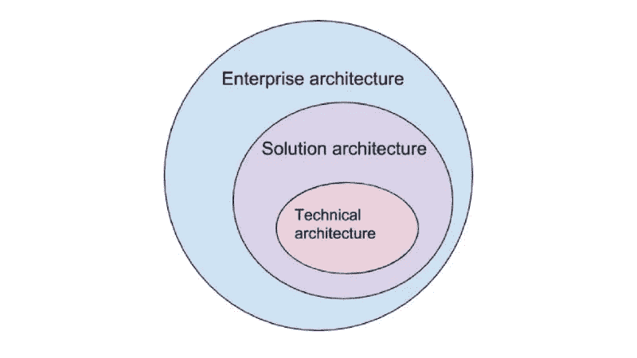
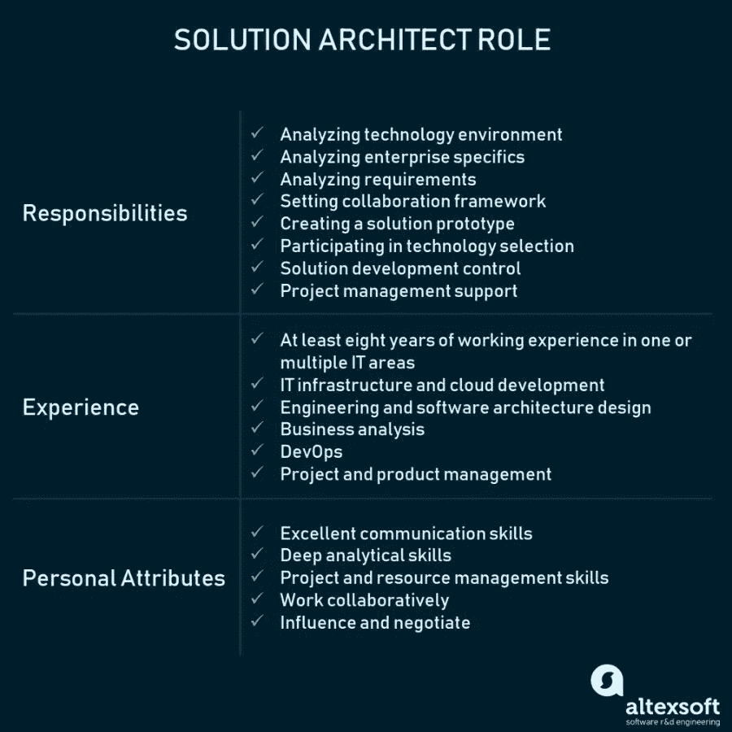

# 谁是解决方案架构师:流程、角色描述、职责和成果

> 原文：<https://medium.com/swlh/who-is-solution-architect-processes-role-description-responsibilities-and-outcomes-1d8fc977d95e>

根据 2017 年项目和投资组合管理前景[总结](http://info.planview.com/rs/456-QCH-520/images/2Planview_Landscape_Report_2017.pdf)的结果，Planview 调查的 49%的公司在过去 12 个月中看到过项目失败。

在快速变化的技术环境中，组织面临着转变其流程和系统以满足新兴业务需求的需求。这种数字化转型需要特定的专业知识和一套实践来将业务重点与技术解决方案结合起来。

解决方案架构属于在任何技术解决方案开发开始之前执行的最重要实践的列表。在本文中，我们将讨论什么是解决方案架构，描述解决方案架构师的角色，并解释采用这种实践如何帮助解决业务问题。

**解决方案架构**是设计、描述和管理与特定业务问题相关的解决方案工程的实践。

**解决方案架构师**是负责领导实践并介绍特定解决方案的总体技术愿景的人。

虽然实践可以在内部管理，但也有公司提供**解决方案架构咨询**作为一组特定的服务。

这些术语中的每一个都包括我们将在本文中讨论的多个方面。

# 企业架构师 vs 解决方案架构师 vs 技术架构师

**企业架构师。** [企业架构](https://www.altexsoft.com/blog/business/how-enterprise-architects-close-the-gap-between-technology-and-business/)，我们在一篇专门的文章中讨论过，专注于构建复杂的企业生态系统并解决高层次的战略问题。企业架构定义了业务架构的战略方向，从而导致对支持该架构所需的技术设施的理解。

**解决方案架构师。**解决方案架构(SA)是一个复杂的流程，包含许多子流程，它在业务问题和技术解决方案之间架起了一座桥梁。它包括:

*   在所有可能的技术解决方案中寻找最佳的技术解决方案来解决现有的业务问题。
*   向项目涉众描述软件的结构、特征、行为和其他方面。
*   定义功能、阶段和解决方案需求。
*   提供定义、管理和交付解决方案所依据的规范。

**技术架构师。技术架构师主要负责工程问题和软件架构。**

有些人特别在范例中添加了一个基础架构架构师。对于在内部维护复杂硬件基础设施以支持运营的组织来说，这一角色变得非常重要。

*Solution architecture in the context of the enterprise and technical architecture*

解决方案体系结构描述了在特定的解决方案中如何使用不同的业务、信息和技术体系结构组件。由于解决方案架构更关注细节和解决特定业务问题的解决方案技术，因此它提供了企业架构和技术架构之间的通道。后者只关注技术问题。对公司来说，一种有效的方法是将企业架构活动与解决方案和技术架构活动相结合。

# 解决方案架构涵盖的主要流程

构建良好的解决方案体系结构有助于团队按时、按预算开发产品，并确保产品解决了设计要解决的问题。解决方案架构实际上执行什么任务？

## 将解决方案与企业环境相匹配

通常，公司已经有了操作系统、信息环境和集成需求。解决方案架构有助于确保新系统适合现有的企业环境。要执行这项任务，解决方案架构师必须了解业务模型的所有部分如何协同工作，包括流程、操作系统和应用程序架构。了解这些流程后，他们将能够设计出最适合环境的特定解决方案。

## 满足所有利益相关方的要求

软件产品开发最重要的挑战之一是满足涉众的需求。通常，一个产品有许多技术和非技术专家的涉众。解决方案架构的目标是确保他们的所有需求都被考虑在内。利益相关者必须定期了解产品开发过程、成本和预算。这些任务通常由解决方案架构师完成，他将技术项目细节翻译成管理层和非技术风险承担者可以理解的语言。

## 项目限制的会计处理

每个项目都有其局限性，通常称为约束。其中包括:

*   技术
*   风险
*   范围
*   费用
*   质量
*   时间
*   资源

例如，一个产品是用必须适合其特定模块需求的技术构建的。项目范围是[软件文档](https://www.altexsoft.com/blog/business/software-documentation-types-and-best-practices/)的一部分，它定义了具体的目标、任务、特性和功能。所有项目都有分配的预算。

虽然这些方面本身都是约束，但每个方面都有自己的局限性。解决方案架构师必须理解所有这些限制，比较它们，然后做出许多技术和管理决策，以使这些限制与项目目标相一致。

## 选择项目技术堆栈

创建解决方案架构的一个重要部分是为产品开发选择技术。技术架构策略将直接取决于所选择的技术堆栈。有许多不同的实践与平台、编程语言和工具相关联。这里的解决方案架构功能是找出哪一个最适合特定的项目。这不是一项需要技术评估和比较的普通任务。

## 符合非功能性要求

所有的软件项目都必须满足大量描述系统特征的非功能性需求。这些也被称为质量属性。虽然非功能性需求的确切列表取决于每个产品的复杂性，但最常见的是产品的安全性、性能、可维护性、可伸缩性、可用性和可靠性。解决方案架构师的角色是分析所有非功能性需求，并确保进一步的产品工程将满足这些需求。

既然我们已经讨论了采用解决方案架构的高级目标，那么让我们将它们分解为具体的责任和底层技能。

## 解决方案架构师的职责

解决方案架构师的工作重点是解决方案级别的决策，以及分析这些决策对整体业务目标和结果的影响。此人的职责直接来源于实践过程:

1.  分析技术环境
2.  分析企业细节
3.  分析和记录需求
4.  设置协作框架
5.  创建解决方案原型
6.  参与技术选择
7.  控制解决方案开发
8.  支持项目管理

虽然这些职责中的大部分需要解决方案架构师的领导角色，但是这个人只是支持 PM 活动，以确保资源、风险识别和规划与解决方案目标保持一致。

# 解决方案架构师角色描述

如果你已经意识到解决方案架构在你的项目中的重要性，下一步就是寻找并雇佣这个角色的人选。我们已经考虑了一个优秀的解决方案架构师必须具备的核心技能。

## 技术背景和经验

为了向管理和工程团队提供技术建议，解决方案架构师必须具备技术背景，在一个或多个 IT 领域至少有八年的工作经验，包括但不限于:

*   IT 架构、基础设施和云开发
*   工程和软件架构设计
*   商情分析
*   DevOps
*   项目和产品管理

## 优秀的沟通技巧

解决方案架构师能力的一个重要部分是沟通。考虑到这一角色需要与利益相关者谈判、了解各方的需求、管理风险和产品交付，缺乏沟通技巧会造成真正的瓶颈。该职位需要与企业和软件架构师、业务分析师和项目团队密切合作。因此，一个有经验的解决方案架构师应该能够倾听、建议、理解和解释。

## 深刻的分析技巧

设计解决方案需要了解业务的不同部分如何协同工作。架构师必须认识到公司战略，并认识到定义公司如何实现其战略目标的所有业务流程。但是，架构师还必须了解技术细节。结果，解决方案架构师不断地处理分析工作，并在不同的业务层之间移动。

## 项目和资源管理技能

虽然解决方案架构师不直接参与项目管理，但是考虑期限和给定的资源是不可避免的。解决方案架构师必须能够决定在特定情况下哪些解决方案是有利的，哪些是无用的。他们必须专注于业务成果，并了解如何根据给定的时间框架和资源实现这些成果。

# 当公司需要解决方案架构咨询时

如果集成新软件系统的过程不系统，解决方案架构可以由技术咨询组织引入到公司结构中。最重要的是，没有必要为每个项目都配备一个解决方案架构师。如果你实现了一个单一的技术模块，并被证明可以在相似的环境中工作，你就不需要一个解决方案架构师。一旦软件工程项目变得越来越复杂，并且需要确定数量的过程和风险，最好考虑解决方案架构咨询服务。

让我们看一下推荐解决方案体系结构咨询的案例:

**你不知道哪种解决方案最适合企业生态系统**。您需要在现有的企业架构和特定的项目之间建立联系。解决方案架构师将保证解决方案符合您公司环境的标准。例如，如果您将许多现有的后台流程迁移到云中，解决方案架构师将负责分析多个选项，并从技术、人力和财务资源方面提出最相关的建议。

**你运营一个数字化转型项目**。[数字化转型](https://www.altexsoft.com/whitepapers/digital-transformation-reshaping-business-to-meet-digital-age/)要求企业重新考虑*他们如何*向客户交付价值或者*他们最终将交付什么*。如果不将技术和业务视角联系起来，就无法回答这些问题，而这恰恰是解决方案架构师的专长。

你面临很多风险。在存在许多技术风险、可能出现不确定需求、必须同时实现多个产品或者底层技术尚未获得批准的项目中，解决方案架构师是必需的。

你必须向投资者推销产品路线图。如果您必须向投资者和利益相关者展示一个未来的产品，解决方案架构师将会建议与产品需求相匹配的技术，并以简单明了的业务术语来传达理由。

**你需要在利益相关者和工程师之间建立沟通。**解决方案架构师将帮助填补技术专家和非技术专家之间的沟通空白。此外，通过与项目管理团队合作，解决方案架构师涵盖了产品与涉众需求不一致的风险，并确保解决方案符合定义的目的。

许多团队都参与了这个项目。您可能有一个大型项目，需要有人来管理设计师、技术或业务架构师团队，以产生高质量的技术项目成果。

# 最后的话

解决方案架构是任何 IT 项目的基础，不管您是否实际采用这种实践。通过有意识地引入解决方案架构，您构建了将技术、资源和技能与定义的业务目标相结合的框架。

在考虑解决方案架构之前，我们建议探索结合了解决方案和企业级别的[企业架构框架](https://www.altexsoft.com/blog/business/enterprise-architecture-frameworks-documenting-your-roadmap-to-change/)。

传统上，中小型企业认为解决方案架构的实践和各自的角色都不合理。解决解决方案架构问题的任务被委派给产品团队中的其他角色，并由他们共享。此外，对于具有可预测结果的小型项目来说，这是一个可行的选择。然而，如果你有一个复杂的企业架构，将多个软件产品引入到一个功能生态系统中，你需要完全地[重建你的遗留软件](https://www.altexsoft.com/whitepapers/legacy-system-modernization-how-to-transform-the-enterprise-for-digital-future/)，或者做出一系列战略性的技术决策，一个专门的专家的相关性是显而易见的。

**喜欢这个故事吗？为我们鼓掌，让更多人发现它！👏**
最初发表于 AltexSoft 的博客:“[谁是解决方案架构师:流程、角色描述、职责和成果](https://www.altexsoft.com/blog/engineering/solution-architect-role/)”

## 这篇文章发表在 [The Startup](https://medium.com/swlh) 上，这是 Medium 最大的创业刊物，拥有 318，120 多名读者。

## 在这里订阅接收[我们的头条新闻](http://growthsupply.com/the-startup-newsletter/)。

