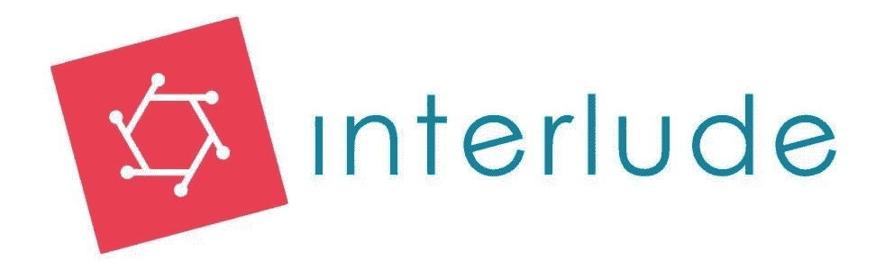

# 谁真正受益于脸书的新闻反馈更新？还有……我的 2017 年行业‘流行语’排名

> 原文：<https://medium.com/swlh/who-really-benefits-from-facebooks-news-feed-update-and-my-2017-industry-buzzword-ranking-ca6e8baae95a>

**脸书&其千变万化的新闻提要**

我在一家中小型[数字出版公司](https://doyouremember.com)工作，我们的主要收入来源之一是展示广告(在我们网站上展示的广告)。不幸的是，这些广告不会产生收入，除非人们真的看到它们。所以对于这种特殊的收入流，眼球非常重要。简单来说，**眼球多** *(流量)* **=钱多。和今天的许多出版商一样，我们的很大一部分流量直接来自我们的脸书页面(我们有 700 多万粉丝)。我们也从其他合作的网页上获得了大量的流量。不用说，脸书是我们业务的一大部分。**

我不会让自己听起来很聪明&告诉你，我早在 7 月份就预测到了这个特定的新闻提要更新，但这并不意味着我们没有为此做准备。这是一个不断变化的行业，如果你想保持领先，你必须知道如何适应。为了确保如果脸书休假 6 个月，我们的流量/收入不会受到影响，我们做出了一个决定**而不是**来限制我们的双头垄断(在出版界双头垄断指的是谷歌&脸书)。快速提示:虽然我们尽最大努力实现多元化，但我们会继续在谷歌和脸书工作和投资。

现在，我不能透露我们的战略，因为这是一笔糟糕的交易。也就是说，这是我对(提示鼓声)…的想法

## 如何减少对不断变化的脸书和谷歌的依赖:

*   创作优质内容！最重要的是，脸书和谷歌喜欢优质内容。
*   关注脸书和谷歌创造的产品。AMP & IA)。
*   金钱和独立是密不可分的，如果你的收入来自展示广告，确保它们得到优化！在对广告栈进行全面审计和优化后，出版商增加 15-30%的收入并不罕见。
*   如果你有观众，让他们开心！坚持品牌，确保你给他们提供一个伟大的 UX。
*   如果脸书明天就关门了，不管你有多少追随者，你都带不走他们！思考这个问题，并找出如何将它们引入你的生态系统。(例如:获得电子邮件注册)
*   与其他发行商达成交易，进行离线流量交换

在数字营销出版中，我发现某些短语每年都变得非常流行。我觉得这很有趣，因为一旦一个人变得受欢迎，我几乎每次开会都会听到。我的 2017 年似乎由我反复听到的 3 个流行语/短语组成。

**以下是我 2017 年听到最多的流行语:**

1.  "透视到视频"
2.  “粒度数据”
3.  “双头垄断”

**你对 2018 年有什么流行语预测吗？**发送你认为应该添加到我的 2017 年(简短)清单中的流行语/短语。

现在的大问题……**谁真正从脸书的新闻反馈更新中受益；用户、出版商还是 FACEBOOK？**

**出版商:**

*   我认为还没有一个明确的答案，但是，我相信大多数出版商都认为这对他们没有好处。我不禁想知道，这是否会在与脸书有直接联系的大型出版商和没有直接联系的小型出版商之间造成更大的差距。当我在[脸书](https://www.facebook.com/business/news/news-feed-fyi-bringing-people-closer-together?_rdr)我当然想知道他们会如何评价制作的内容。也不难相信，脸书可能会青睐它有既得利益的页面和拥有脸书代表的超大页面。

**用户:**

*   这部分我是问这篇文章的读者。如果你不参与出版，只是娱乐性地使用 FB，我很想知道你的想法。

**脸书:**

我没有时间列出这可能给脸书带来的所有潜在影响，但我会给你一个潜在的非常积极的影响，广告！如果脸书限制其出版商的影响力，而出版商又不想放弃他们花了多年时间发展的粉丝群，他们就必须……做广告。

**最后:**

这是一个不断发展、变化的行业和世界。随着几天前发布的算法调整公告，时间将会阐明它的影响。

我很乐意听到你的想法、问题、建议和/或意见(把它们放在评论里吧！)感谢阅读！

尼尔·帕克

[www.linkedin.com/in/nealparker1](http://www.linkedin.com/in/nealparker1)

## 这篇文章发表在 [The Startup](https://medium.com/swlh) 上，这是 Medium 最大的创业刊物，拥有 291，182+人关注。

## 在这里订阅接收[我们的头条新闻](http://growthsupply.com/the-startup-newsletter/)。

