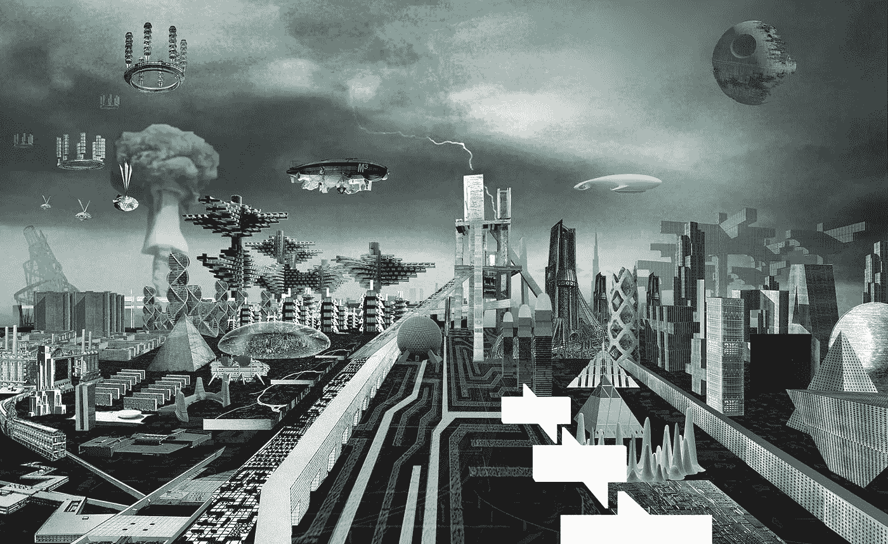
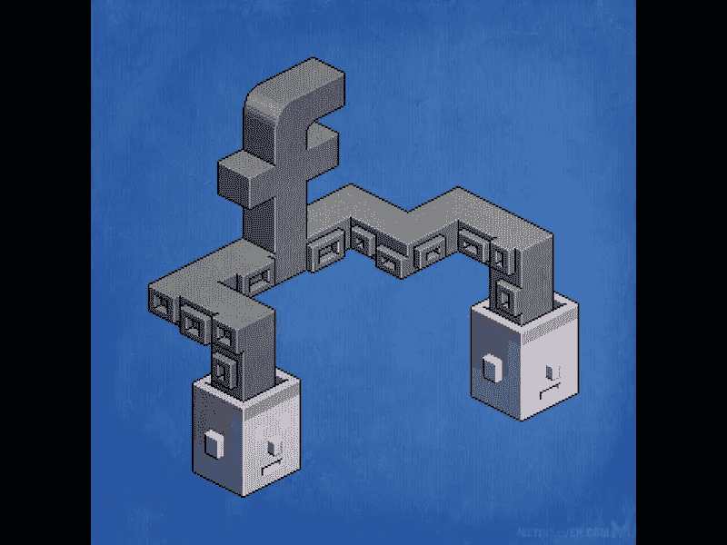
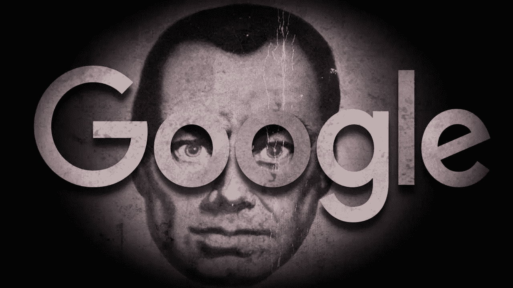
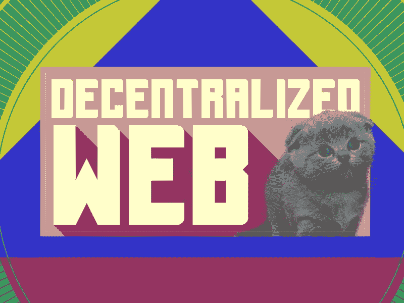

# 谁管理网络

> 原文：<https://medium.com/swlh/who-runs-the-web-1d1d19869ad5>

## …以及为什么变革可以拯救生命

‘Cities of the Avant-Garde’, by Wai Think Tank, 2012

今天的互联网远不如十年前。零星出现的网络创业公司让位于现代世界中一些最大的企业帝国。早期互联网的自由精神和丑陋的游牧环境变成了笼罩现代世界的反乌托邦大亨所有的云。

我们已经自愿放弃了选择在哪里搜索信息、保存数据、与其他人联系、表达自己以及私下交谈的能力。

> 我们用所有这些来换取不必要的便利、强制价值观、视觉享受和社交俱乐部的认可。

到目前为止，互联网已经经历了两个阶段:Web 1.0 和 Web 2.0。从内容消费到内容创作，这种需求让我们不得不再次做出改变。Web 3.0 就是这种变化的来源。

# 水会找到出路的…

当肮脏的政治和游说开始使用网络作为他们的主要影响力来源时，对“更好”互联网的需求变得显而易见。当你不知道该相信谁时，你根本不会相信任何人。从加密货币到安全信息和匿名浏览的各种技术联合起来为新的互联网——Web 3.0 做出贡献只是时间问题。

有意或无意的集中，现在开始分散到各个方向，让用户来控制。

> *但是 web 3.0 有什么不同吗？为什么分散的软件和技术供应商很重要？对我们的生活有什么影响？*

在网络技术出现的这些年里，我们见证了一系列的转变、变化和重大转变。这些不仅是硬件能力提高的结果，也是互联网哲学不断变化的结果。我们从阅读静态页面转向运行完整的基于交互的 web 应用程序。旨在改善我们福祉的网站变成了决定我们品味的媒体。

# Web 3.0 前提

作为自然现象，这种进步让我们中的一些人拥有了前所未有的权力。数字垄断从互联网的浑水中浮出水面。一开始并不是所有的都是坏的。

谷歌很棒，它生产的大多数产品都很棒。但是，感觉除了谷歌，你什么都不需要。我小时候旅行的时候，妈妈教我把现金放在几个不同的地方。

*   据称，谷歌会记录你在互联网上的每一次点击。
*   难怪黑客可以将谷歌作为信息收集的基本来源。
*   搜索结果也属于谷歌，这使得这个最大的搜索引擎不是一个公平的竞技场。
*   所有的数据都在它的掌握之中，不可能所有的信息都是安全的，不会违反国际法，也不能保证你不会因此而陷入麻烦。
*   谷歌拥有 Android 中最大的手机 OS，这使得谷歌成为所有互联网事物的最终垄断者。

> 谷歌很酷，但事实上，这样一个势不可挡的平台可以存在，并且所有事情都有可能出错，这太危险了。

同样，脸书管理我们的个人数据、信息、记忆和偏好。正如上次总统竞选所显示的那样，这个数据远非安全。因此，我们目睹了一些消息服务的展示试验，而其他服务则保持不变，这就留下了关于道德问题的疑问。

> 再加上商业巨头，你会得到一个巨大的循环，封闭你所有可能的需求。在亚马逊开展业务的地方，没有其他任何人的位置。谷歌控制着你的知识，脸书现在是你的社交外骨骼。

Image credit: [Metin Seven](https://dribbble.com/metinseven)

所有的技术都在某人的控制之下，我们习惯了功能和命令之间的权衡。

> *你能控制的任何东西都是微不足道的，使用它毫无意义，而大多数可用的数字技术都不在你的控制之内。*

互联网早期的美妙之处在于可以毫无后果地获取最酷的东西。找到什么就拿什么，想怎么用就怎么用。法律规定终结了狂野西部网络，让我们为一切买单。利用免费资源和平台？做好被他们利用的准备。

Web 3.0 的概念改变了这一点。你必须能够在不受大公司操纵的情况下使用互联网。网络中立被置于危险之中，每个人最终都会明白——互联网必须是一个公平的竞技场。在所有主要行业中，都有足够多的暗战在进行。没有必要将互联网纳入其中。

> *Web 3.0 是一个术语，它统一了构建独立技术和提供更好选择的所有实践。*

这种方法不需要破坏现有的结构，但有助于再生出最有效的结构。Web 3.0 寻求重新建立对互联网控制的方式是自下而上地通过区块链技术、密码经济学、P2P 商务、加密数据、开源框架和分散式 DNS 来实现的。

> *一般来说，任何与集中式 web 服务保持距离并允许用户控制其数字身份的东西都与 Web 3.0 有关。*

# 拯救多样性

那么，使 Web 3.0 成为可能的主要资产是什么呢？Web 3.0 的先决条件是新一代网络企业家的正确心态。旧的方式导致了所有针对互联网内容歧视的法律保护的消亡。被称为*网络中立的*显然是[死了](https://www.theverge.com/2018/6/11/17439456/net-neutrality-dead-ajit-pai-fcc-internet)。

> 简而言之，互联网提供商现在可以自由限制接入，并对他们想要的任何服务收取更高的费用。

反过来，服务和平台现在可以操纵它们的预算，在特定的地方为特定的用户群更频繁地出现。付费优先交易现在允许运营商推广特定的公司和产品，这取决于什么能让他们赚到最多的钱。

> *“将互联网铺成支付得起的人的快车道和我们其余人的慢车道，将把网络变成一个最富有和最有权力的人可以听到的地方，而普通人和另类的声音被淹没。”—埃文·格里尔，《为未来而战》导演。*

与此相反，Web 3.0 方法可能会缓解这种恶性循环，但正如我们上面提到的，这需要改变思维模式。首先要考虑和研究以下资产。

# 分散服务

现代在线企业家使用的大多数服务都是由少数几家公司提供的。谷歌和亚马逊的服务可以 360 度覆盖互联网的大部分业务需求。可以肯定地说，谁运行服务，谁就运行网络。通过这些服务，公司控制第三方应用程序并影响发展趋势。

幸运的是，可能还有其他选择。产品和服务不一定要被某个人拥有。就像区块链科技一样，比特币没有首席执行官(或者至少我们知道有一个首席执行官)。

> *分散的系统不为特定的用户群体服务，影响的机制如此复杂，试图集中是没有意义的。*

只有在开源场景中，分散化才是可能的。多项选择选项是先决条件。例如，许多由不同公司开发的独立应用程序都在一个开源生态系统中工作。每个客户端应用程序都会推送它必须推送的内容，提供不同的功能，但是所有的应用程序都遵守某些规则，这些规则通常放在一起，不属于任何人。

> *更重要的是，除了一个复合字符用户之外，将不会有任何验证器，而复合字符用户实际上是唯一应该存在的验证器。*

有些指导原则通常是有用的，但是它为 API 访问撤销留下了一个开放的窗口，这不仅是因为糟糕的 UX 或社区规则违反，还因为不同的性能可能会将服务的垄断置于危险之中。它将允许开发者与中立的开源公司合作，专注于彼此之间的良性竞争。限制大公司对基于网络的服务的控制的想法比以往任何时候都重要。争夺用户必须是目标。不竞争服务供应商接受的平台。

有一些免费的基于端到端加密的信使的好例子，如 Cyphr、Telegram、Wire 等。，在收到消息之前，它们只使用临时存储在其服务器中的最少量的元数据。

> 从某种程度上来说，web 服务去中心化不会给公司留下作恶的机会。

Image credit: [NowSourcing](https://dribbble.com/nowsourcing)

# 硬币

近年来，我们对资金流动的看法发生了巨大变化。加密货币第一次让传统金融系统相形见绌。在很多方面，作为对不正当金融系统的自然反应，加密货币的出现仍然不受机构的控制。

加密货币是完全自主的。他们不需要绑定实体离线系统。他们需要的只是互联网连接。网络货币不需要纸币或黄金。数字货币就是技术。互联网货币将银行排除在外。它使用户能够降低某些交互的成本，它没有边界、限制和兼容性。这是迈向密码经济学的一大步。

> *密码经济学是利用激励机制和密码学来设计新型系统、应用和网络。*

加密货币的自主性也是由去中心化原则提供的。没有权威，即使参与模式可能在大小和强度上有所不同，我认为一个完美的类比是各种各样的动物都平等地依赖它，没有人特别拥有它。

Web 3.0 分散加密经济学不是一种状态，它更像是一种处理金融的方法。没有“去中心化”的服务列表，相反，这意味着无限量的服务可用于特定需求。

例如，比特币不受任何类型的监管机构的审查，这意味着它缺乏通缩措施的杠杆，也不能因为人为原因而受到抑制。这就是让比特币一致的不一致性。加密货币的趋势和准入不容易理解和控制，导致其工作人员被称为“金融流氓”。

> *这反映了数字货币设计的基本原则——允许人们根据自己的喜好加入某人的货币和信用生态系统。*

# 个人数据和身份

社交媒体巨头是泡沫。没有我们自愿发布的所有个人数据和用户生成的内容，它们就不存在。空网是互联网上最可悲的事情。还记得 [Vero](https://www.thedailybeast.com/as-vero-blows-up-backlash-builds-against-shady-social-app) 吗？然而，我们最终成为这些社交网络的商品。

我们的身份属于我们随意加入的公司。集中的数据门户将保护他们的财富，也就是您的数据。这个问题的解决办法可以在前面两个原则中找到。数字加密货币的存在由仅属于用户的私有数据定义。

分散的身份服务将无法根据给定的信息操纵您的数据、分析数据并影响社会。这只有在用户自愿为这种“研究”作出贡献的情况下才有可能。

> *这会让像脸书这样的媒体巨头不再为你的数据付费，而是为你付费！*

同样，人们的创造性工作、发明和新奇事物也不属于为这些资产的展开提供场所的媒体。

Image credit: [Radu Vilcu](https://dribbble.com/radon3)

# 外卖食品

程序员安德雷·斯塔尔茨在《T2》杂志上发表了一篇题为《网络在 2014 年开始消亡》的文章，他在文中指出，现代科技巨头让我们忘记了互联网是什么样的，他们有能力保持匿名，“或者说，创办一家互联网初创公司，让自己的独立服务器按照与 GOOG 服务器相同的权限运行是多么容易”。

公司对网络服务、资金和身份的过度控制，可能会让我们无法接触到目前被视为理所当然的东西。Trifecta 负责监管我们的日常信息交流，它越复杂，我们就越难以掌控。这一变化是在 Web 3.0 的大背景下发生的。Web 3.0 旨在解决互联网多样性受损的问题，它依赖于基础技术、加密经济学和作为新时代互联网核心的未被选择的用户数据的分散化。

现有政治体系的力量被内联到了网络中，并污染了它的许多最佳能力。然而，如果这种变化可能发生，我们不得不把我们允许的控制自己的程度的限制。作为数字开发者、设计师和影响者，我们有自己的责任，我们有未来，有机会夺回互联网，我们必须改变我们的思维方式，并利用游击队的力量，我们有，而它持续。

## 本文发表于《T4 创业》杂志，这是 Medium 最大的创业类出版物，335，210 多人阅读。

## 在此订阅接收[我们的头条新闻。](http://growthsupply.com/the-startup-newsletter/)

