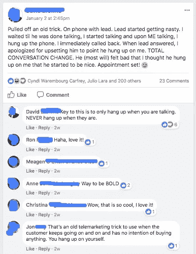

# 那是谁的声音？

> 原文：<https://medium.com/swlh/whose-voice-is-that-anyway-37d8c5f8f333>

**快速提示:**这些事件【下图】其实是昨天发生的。事实上，我昨天就写了这篇文章。我一直等到今天早上才发表，因为那个声音告诉我这是最安全的做法。

你知道，这样我今天就不用想别的东西写了。]

**你能理解吗？**

*什么事？如果是这样，请在下面评论，让我知道这个声音告诉你什么，以及你正在做的一件事，以淹没或忽略无意义的聊天。*

故事是这样的…

周四凌晨 4 点 52 分。我的精神警报响了。

我把闹钟设定在早上 5:00，而不是 4:30，因为我前一天晚上 11:00 还没睡——在一个研讨会上。

起床不是我的问题。我的身体已经适应了早起的要求。这是我对自己和自己做出的承诺。

但是在这里事情变得有点古怪。

> 我:*“今天是什么日子？”*
> 
> 声音:“*今天是星期四。”*
> 
> 我:“*好的……没错……今天早上在教堂的男团……我今天还有什么事？义务？会议？来电？约会？事件？”*

你知道，那种挑战我们内向者的东西。]

> 声音:*“没有，直到今天下午时间表都很清楚。记住，你是在为下周的凯特做准备。”*

凯特是我的新团队成员。她是我在周二的邮件中简单提到的独角兽。她周一开始上班。她已经通过在幕后做一些侦查工作获得了回报。]

> 我:“*哦对了……当然……我现在想起来了。”*
> 
> 声音 **:** *“是啊，谢天谢地你今天正忙着那个，这样你就不用做 ___________________________。”*

[填空……我知道自助活动对我和我的业务有好处，但经常被推到后面。因为，你知道，我实在太忙了。忙着做什么？忙得不可开交，这样我就不必去做那些我知道会有所作为的事情。]

女士们，先生们，这是我的内部谈话。

到了凌晨 4 点 53 分——在我还没从温暖的被窝里挪出一只脚之前——我脑海中的声音已经为我计划好了一切。他确切地告诉我今天我会怎样和不会怎样玩生活的游戏。

迷人的不是吗？

有趣的是，我们的生活是由那个小小丑掌控的。

我告诉你，有时候，他是个巨人。尖叫着让我屈服。放弃战斗。走捷径。

他恳求我“安于现状”

但是我不能。我不会。

因为那个声音不是我。

我知道这一点，这意味着我可以嘲笑他语气的荒谬。

那么该怎么办呢？

答案是什么都没有，什么都有。

与声音本身无关，但与声音无关。

我做的第一件事就是记录下来。我跳下淋浴，轰隆隆下楼，抓起我的日志，记下我的想法。

全部都是。

我对自己做出了承诺。当我到办公室时，我会坐下来，写下一张清单，上面列有我能兑现自己承诺的所有方法。

我是一个强有力的沟通者。

我影响他人的方式。

我创造支持和鼓励环境的方式，在这种环境中，我的团队将茁壮成长。

我创造新的不同可能性的方式。

因为事实是……虽然我们行业中的“声音”可能坚定地主张相反，但当涉及到[商业原则时，我们不会遵循“传统”的脚本。](http://www.threepillarsrealty.com/our-core-beliefs/)

**你看，我们不做“挂断做作”**

**我们不“打电话要钱”，也不玩“陌生来电宾果”**

我们不想成为“律师”

***没有先生***——就像安迪在上面的评论里说的，在[三支柱房地产](http://www.threepillarsrealty.com/)和[冲击之声](http://www.voicesofimpact.com/)，我们在经营“真正的”企业。

具有复杂商业模式的真实企业。

复杂的商业模式建立在关系、内容、联系和社区平台的基础上。

**而且……我非常喜欢这种日常挑战！**

当然，复杂性的挑战需要解决更困难的问题。解决更难的问题往往会滋生阻力。

那个小小丑喜欢反抗。他是反抗者。

他想掌控大局。他绝对讨厌我们玩大牌，因为他知道我们比他强。

我听到他在大喊大叫…但我没在听。

他没什么帮助。

下次他打电话来，告诉他“去踢石头吧。”

无论如何，去做吧。你应得的。

=============

**瑞恩·弗朗斯**是得克萨斯州长角牛市奥斯汀人，全国冠军，两个孩子的父亲，超级早起者，狂热的读者，公认的播客迷&防弹咖啡迷。在过去的生活中，法国是一个有抱负的职业棒球运动员。如今，瑞安是一名企业家、作家和房地产行业的不懈创新者。

## 如果你喜欢阅读他的文章，请[加入我们的电子邮件圈内人](http://www.ryanfrance.com/insiders-weekly-email/)小组。每个星期五，Ryan 都会发送电子邮件，分享新的文章、见解和更新。

=============

图片来源: [Philippe Put](https://www.flickr.com/photos/34547181@N00/) (Flickr 知识共享)

## 这篇文章发表在[《创业](https://medium.com/swlh)》上，这是 Medium 最大的创业刊物，有 289，682+人关注。

## 在这里订阅接收[我们的头条新闻](http://growthsupply.com/the-startup-newsletter/)。

