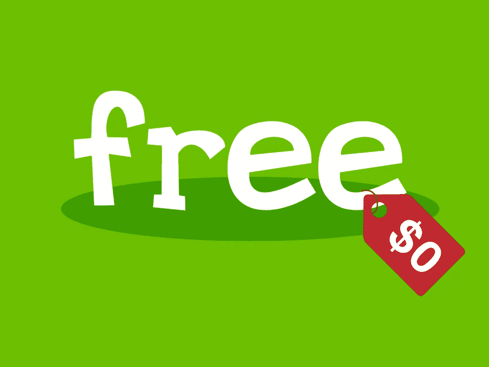
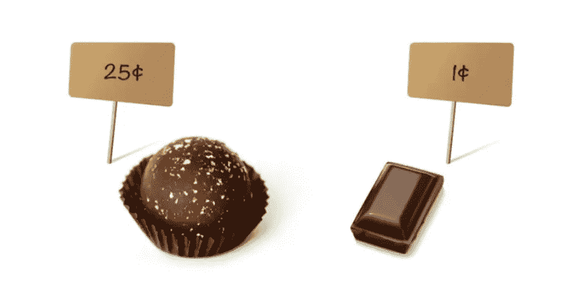
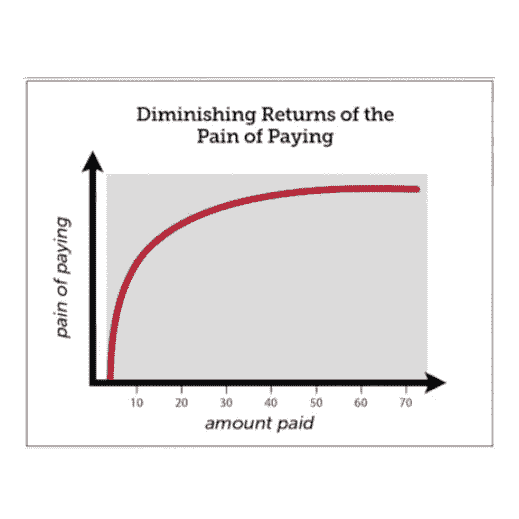
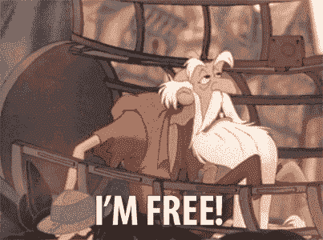

# 为什么$0 永远不会真正“免费”

> 原文：<https://medium.com/swlh/why-0-is-never-really-free-250ba824f65f>

## 免费的价格太贵了

credit: [Alan O’Rourke](https://www.flickr.com/photos/toddle_email_newsletters/)

## 我们生活在一个‘自由’的时代。

我们被如此多的免费产品和服务所包围，以至于在很多情况下我们讨厌为某些东西付费的想法。

你曾经在谷歌 Play 商店或苹果应用商店购买过应用吗？

# 如果能免费得到，我为什么要付费？

应用程序的价格从 0.99 美元到 6.99 美元不等。我们都同意这并不是很多钱，尤其是对于一个我们将使用数月或数年的应用程序来说。
**但是我们大多数人通常拒绝为应用付费。我们通常会寻找替代方案。免费的应用程序。事实上，对 2015 年的预测是，三分之二的美国移动用户将只下载免费应用。难怪 2018 年超过 94%的安卓应用是免费提供的。
如果有那么多免费应用— **我们为什么要付费？我们不重视开发人员花费的时间和金钱——我们现在就想要，而且是免费的。
然而，这种行为模式不仅仅是应用程序独有的。****

以书籍为例。自从数字图书出现以来，网上的图书数量急剧增加。出书变得更容易了。你只需要写一个上传到网上。就是这样。
**还有数百万本免费提供的电子书**。因此，许多人决定不买最新的畅销小说，而是找一本免费的电子书，好像这是同一种产品。虽然这两本书都被归类为“小说类书籍”，但它们绝对不是相同的。

音乐呢？一旦音乐可以在网上获得，尽管是非法的，人们就不再购买 CD。他们有办法免费得到同样的产品。低质量的 MP3 文件和对艺术家造成的经济损失无关紧要。

# 你会挑松露吗？

根据心理学和行为经济学教授丹·艾瑞里的说法，一旦某样东西被贴上“免费”的标签，我们就找不到它的负面价值。正如 Ariely 解释的那样，一个有钱人会排队去得到一份免费的 Ben&Jerry’s，即使冰淇淋的价格只有 3 美元。这个人不会想到排队等他的免费冰淇淋所浪费的时间。

在这段视频中，丹·艾瑞里分享了他做的一项有趣的研究。他让人们在价值 25 美分的奢侈松露和价值 1 美分的巧克力块之间进行选择。
**你会选择什么？**

*Credit: Antony’s Lab (*[*youtube*](https://www.youtube.com/watch?v=GrHJMfysrlk)*)*

**大多数人选择了松露。虽然它更贵，但人们乐于为更丰富的口味买单。接下来，Ariely 问他们，如果价格每降低 1 美分，他们是否会改变选择。现在哪个选项看起来更吸引你？**

*Credit: Antony’s Lab (*[*youtube*](https://www.youtube.com/watch?v=GrHJMfysrlk)*)*

大多数人回答了什么？
你猜对了。大多数人更喜欢免费的巧克力。当他们得到免费的其他东西时，很难为奢侈的松露付钱。

# “支付的痛苦”不是线性的

我们选择免费的 app 而不是付费的，也是出于同样的原因。付费应用可能会更加用户友好，具有额外的功能和更少的缺陷——然而“免费”的标签似乎更有吸引力。但是当我们使用免费应用程序时，我们会接触到数百个弹出广告。有时我们甚至不得不在继续之前观看 15 秒钟的广告视频。然而**我们不会支付 0.99 美元来移除广告，因为** [**支付**](/@saaroron/4-steps-to-spend-your-money-more-rationally-3c8bcd7872ec) 的痛苦。“《我的世界》”就是一个很好的例子。这是一个令人上瘾的流行游戏，可在许多不同的平台上使用，也是付费最多的应用程序之一。那些玩它的人没有免费的替代品，所以他们支付 6.99 美元。艾瑞里认为，我们不会因为付了两倍的钱而承受两倍的痛苦。因此，支付 0.99 美元和不支付任何费用相比，支付 6.99 美元和 0.99 美元更让人感到“痛苦”。

有趣的是，当我去星巴克时，他们问我:“你想要哪种尺寸的——4 美元的中号还是 4.99 美元的大号？”我通常会选择大号的，因为多付 99 美分似乎不是很多钱。其实并不是。但是那些是完全一样的 99 美分，我拒绝支付来消除那些耗时的广告。

*Credit: Antony’s Lab (*[*youtube*](https://www.youtube.com/watch?v=GrHJMfysrlk)*)*

# **跟我重复:没有“免费”这种东西**

我们 **总是用一些东西来换取免费的物品或服务。** 以免费应用为例，我们接触到的不仅仅是广告。
2017 年，[移动应用产生的大部分收入](http://www.businessofapps.com/data/app-revenues/)来自应用内购买。**我们下载了一个免费的应用程序，认为我们没有什么可失去的。但是一旦我们上瘾了，我们就开始为应用内的东西付费。
这里还有一个例子——我在一家超市购物，该超市为 50 美元以上的订单提供免费送货服务。通常，送货费是 3 美元。它总是让我买更多的东西，这样我就能达到 50 美元的门槛。
当我购买的食品杂货价值 47 美元时，增加 3 美元似乎是合乎逻辑的。我的总数仍然是 50 美元，我得到了免费送货。但是这些杂物(或者额外的卡路里)值得吗...)我购买的不需要的
物品？
**等等，还有更多—**
当我们想到我们的“免费”亚马逊送货和视频时，我们忘记了我们为亚马逊 Prime 会员支付的 100 美元。这就是“付出的痛苦”的美妙之处。当你提前付款时，你会感觉不那么痛苦。
这里还有最后一个例子——我的一些朋友一次又一次地乘坐同一家航空公司的航班。他们兴奋地说:“再过三次航班，我就可以免费飞行了。”。他们不会在飞行前比较价格，他们最终会花更多的钱，只为了得到一次光荣的“免费”飞行。太吸引人了。**

# 质量=付费

我读了许多关于[媒体](https://medium.com/u/a32c340ea342?source=post_page-----250ba824f65f--------------------------------)成员的文章。大多数人似乎不喜欢它。我并不惊讶。这又是“免费”代价。许多人说，既然有成百上千的免费博客，他们看不出有什么理由要为中级会员付费。
**真的是有效的比较吗？**
[媒介](https://medium.com/u/504c7870fdb6?source=post_page-----250ba824f65f--------------------------------)为艺术家和读者提供了一个干净、无广告的平台。
Medium 不跟踪、收集、存储或出售我们的信息(据我所知！Medium 支付作家的时间和创造力。

媒体上的一些付费文章质量很好，你在网上其他地方永远找不到免费的。如果你这样做了，你将不得不通过接触广告和/或提供你的电子邮件地址来付费。

可能还有其他的选择，我还不知道，但对我来说，付费会员是前进的方向——
**免费=数量，付费=质量。**

> "认为你每次都会做出正确决定的想法是不太可能的."~丹·艾瑞里

## 再一次，跟我说:没有免费的东西！

## **问问你自己——w**我愿意为‘免费’付出的代价是什么？

> 如果你觉得那是你想做的，就一起鼓掌👏

# 感谢阅读！欢迎[关注我](/@saaroron):

 [## 萨尔·oron⁦⁦👈—中等

### 我是萨尔。大多对音乐和人充满热情。在寻求…

medium.com](/@saaroron) 

**更多帖子:**

 [## 为什么拥有 0 美元比拥有 1 美元好得多

### (或 5 美元，或 100 美元)

medium.com](/swlh/why-having-0-is-much-better-than-having-1-15729410c2d1)  [## 乌拉圭总统的 7 条宝贵人生经验

### 以及为什么永远不会太晚

medium.com](/swlh/7-valuable-life-lessons-from-the-president-of-uruguay-e91600dcd0fc) 

## 这篇文章发表在 [The Startup](https://medium.com/swlh) 上，这是 Medium 最大的创业刊物，有 320，131+人关注。

## 在这里订阅接收[我们的头条新闻](http://growthsupply.com/the-startup-newsletter/)。

