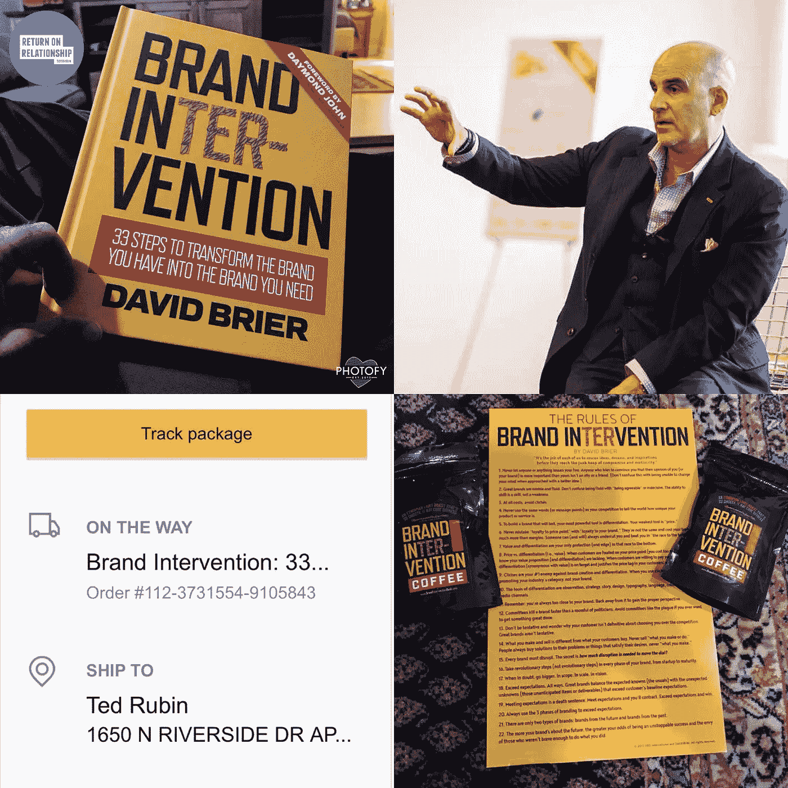

# 为什么 29 个读者疯了:如何将你的品牌转化为一场运动

> 原文：<https://medium.com/swlh/why-29-readers-went-insane-how-to-transform-your-brand-into-a-movement-8d61f68a6793>

为什么超过 29 位来自世界各地的读者给我发来他们和我新书的照片，就像他们和他们最亲密的朋友一样？

*看看这张照片上面是 Zaniboni Lighting【及其员工】为他们公司订购 10 本书的真实照片:*

这太不可思议了。

毕竟，这些见解酝酿了 30 年。

然而，六周前，我出版了这本书，历经两年的酝酿和三次改写。

新书《T2*品牌干预:将你拥有的品牌转变为你需要的品牌的 33 个步骤【T4》在短短两天内成为亚马逊畅销书，被《赫芬顿邮报*刊登在*上，最近又被 [Daymond John](http://www.risingabovethenoise.com/daymond-john-rise-to-grind/) 在 Instagram 上发表了一篇精彩的帖子。*

除了戴蒙德上面所说的，赫芬顿邮报称之为“企业必读”，亚马逊买家称之为“即时经典”和“品牌圣经”

# 对品牌干预的承诺

> 产品发布每天都在进行，与不那么频繁的运动相比可能稍纵即逝，但持续时间更长，往往会在文化的某些领域留下不可磨灭的印记。

当你推出品牌的任何部分时，有两条重要原则你必须遵守:

*没有终点线(永远不会结束，除非你决定结束)，以及*

*每天都是另一个新的发布日。*

说真的。

你必须问自己，“我如何每天、每小时、每分钟为我的产品/服务注入新的活力？”

虔诚地应用，*你可能会以一场运动而告终。*

这就是品牌介入的本质。不仅仅是这本书，还有那些以此为自己、自己的职业和品牌哲学的人的运动。

# 抓住机会…

品牌的一部分是始终关注。

时刻准备抓住机会。

因此，当我和一位图书所有者交谈时，我萌生了送我一张他读书时的照片的想法。(毕竟，当时人们吵着要这本书，他们的能量和热情是惊人的。)

当它出现在邮件中时，我打开邮件，不知道会发生什么。

照片实际上是歇斯底里的。

马克的是我收到的第一张照片。他的表情让我不禁发问，*“如果其他人也和马克一样激动呢？”*

这告诉了我一些我没有完全意识到的事情:人们不仅被这本书、内容和设计所震撼。他们为拥有它而自豪，就像一枚荣誉徽章。

# 运动始于包容，而非排斥

所以，我开始邀请其他买过这本书的人给我发他们阅读这本书的照片。

反应非常热烈。

此外，它还帮助我看到了品牌干预在人们生活中的作用:这是一场运动。(我只是注意到人们对这本书表现出的能量和热情。)

我从来没有 ***计划过*** 这个。

当我看到人们接受、拥有和阅读这本书是多么兴奋时，我就欣然接受了。

如果你想要一个运动，你必须非常密切地(并且持续地)关注，它就可能发生。

# 帮助粉丝分享他们的激情:终极品牌干预

一位读者发来了这张照片，照片上的他一边看书，一边在冰上钓鱼:

我收到了维克多的一张照片，他是[edtech digest背后传达“圣诞节提前到来”的人:](https://edtechdigest.com/)

一位牙医发来了这封信，表明他无法从自己的书上离开，即使有一个病人坐在那里:

随着《星球大战》热潮的持续，一位读者帮助确保了尤达的出现(尤其是因为他的一句名言被写进了书里):

在中西部的一家巧克力和咖啡店，三名员工带着他们的小鹿角(为了节日)拿着他们的书摆姿势:

[店的老板简单地扔了些木头，在火边享受品牌干预:](http://www.simplysnackin.com/)

肖恩·怀曼(Sean Wyman)的《能量与激情》(energy and passion)一笔勾销。这是我收到的早期照片之一，这是他和他的家人在一起，给户外带来一些热情的能量:

[播客天才 Jeremy Ryan Slate](https://www.jeremyryanslate.com/jeremy_ryan_slate/) 发了两张他的书的照片:1)和他的猪 Remington，以及 2)和九只出生两天的史宾格猎犬:

社会营销大师泰德·鲁宾(Ted Rubin)发来了这个蒙太奇:

Brian Butkowski 发来了这张他自己、他的大女儿和一些他雕刻成“嗯”字的奶酪的照片(灵感来自该书第 211 页上从各种奶酪上剪下的单词“CHEESE”的图像。才华横溢的 Brian，祝贺你在所有发送的照片中拥有最年轻的读者):

然后是来自明尼阿波利斯的杰西，她完美地表达了“1950 年代的震惊表情”:

总部位于费城的福布斯特约撰稿人兼营销大师史蒂夫·奥兰斯基发来了这张歇斯底里的照片(你能找到任何费城的随身物品吗？):

著名摄影师和畅销书作家马克·西尔伯发来了这张照片:

这张照片来自阳光明媚的佛罗里达，拍摄于 2011 年 1 月 26 日:

[Lucidpress](http://www.lucidpress.com/) 的优秀团队无法阻止团队成员围着“品牌圣经”团团转:

[新泽西的足病医生丹·马戈林](https://www.zocdoc.com/doctor/daniel-margolin-dpm-55243)发来了这张照片:

《新理论》的汤姆·拉韦基亚(Tom Lavecchia)发来了这张照片，在一天结束时，他抽着雪茄，看着一本令人惊叹的书(感觉像是《教父》中的一张照片)，完全放松了下来。

# 当你的运动进入新的领域

然后照片开始从世界各地传来。

[Ian Paget](http://www.logogeek.com/) 发来了他的灵感照片，反映了他的所在地英国和他对设计的热爱:

来自墨西哥的 Mayra Chavez 给我发了一条信息，“大卫，读这本书就像你在我身边，指引我穿越品牌的世界！”所以她发了这个神奇的幻想世界:

最后，但肯定不是最不重要的，来自英国莱斯特郡莱斯特的山姆·赫尔利不仅制作了一个动画 gif，甚至还制作了一个短片来表达他对这本书的热爱。

动画 gif:

视频:

非常感谢并祝贺你寄给我的所有精彩的照片。真的。

那么，你将如何把你的品牌变成一场运动呢？如果你不知道，[现在就去买你的那本](http://a.co/0z6rrmn)(还可以随时给我发一张你和你的书的照片！).

*最初发表于*[*www.risingabovethenoise.com*](http://www.risingabovethenoise.com/brand-intervention-transform-brand-movement/)

## 这篇文章发表在 [The Startup](https://medium.com/swlh) 上，这是 Medium 最大的创业刊物，拥有 287，184+人关注。

## 在这里订阅接收[我们的头条新闻](http://growthsupply.com/the-startup-newsletter/)。

