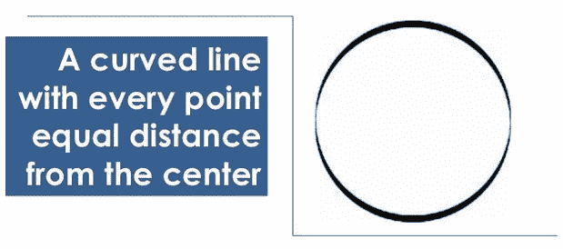
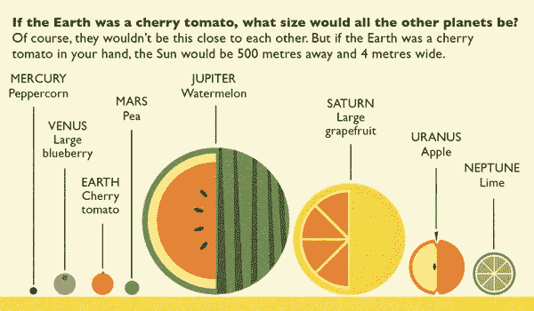
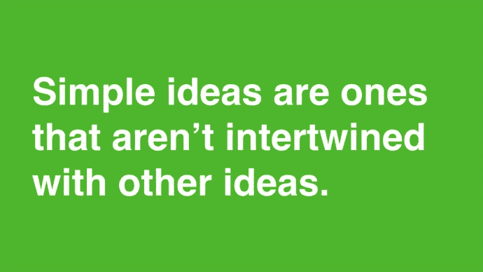
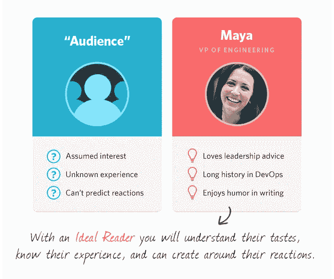
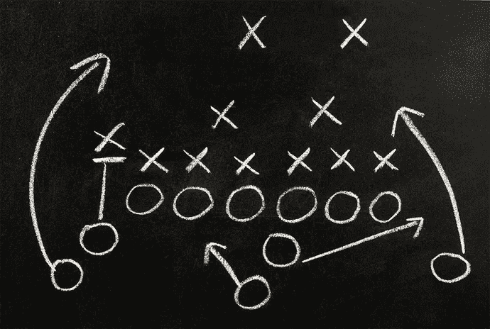
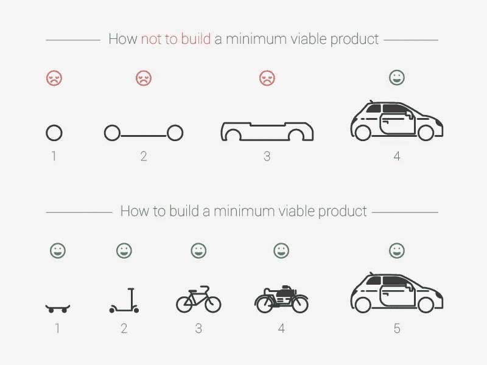
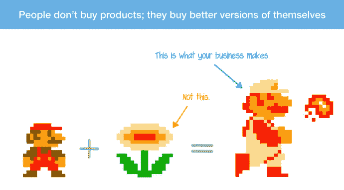
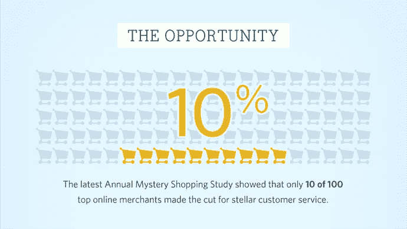
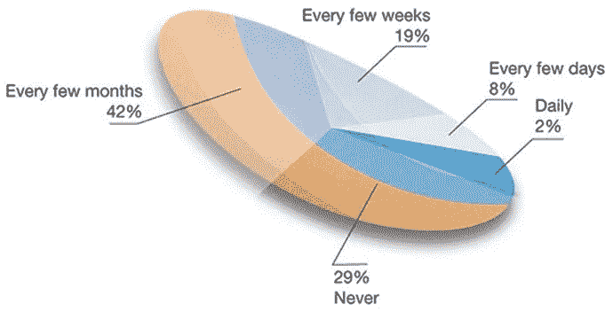

# 为什么一个视频真的值 1000 个单词

> 原文：<https://medium.com/swlh/why-a-visual-really-is-worth-1-000-words-401f21439f32>

## 视觉沟通技巧已经变得和清晰、引人注目的文字一样不可或缺。

几乎每个人都曾在教科书中被一段令人困惑的文字绊倒，但多亏了“见图 a”才恢复了清晰。

视觉、图形和图表能够以一种持久的方式集中和呈现信息。视觉沟通技巧已经变得和清晰、引人注目的文字一样不可或缺。

借用作者[迈克·帕金森](https://twitter.com/mike_parkinson)的一个例子，当你试图回答“什么是圆？”时，文字和视觉搭配的用处就显而易见了

只使用其中一个会造成不必要的混乱，并且需要读者付出更多的努力。最棒的地方在于展示*和*讲述。本着这种精神，让我们来看看几种有效的视觉传达方式。

 [## Help Scout 品牌的演变

### 在创办一家公司的最初几天，只有几件事情需要纠结。构建一个产品来解决…

www.helpscout.net](https://www.helpscout.net/blog/brand-evolution/) 

# 1.寻找纯文本交流中的缺陷

通过文字分享信息时，最难理解的是什么？当定义*为什么*可视化会有帮助时，这是一个有用的问题。

熟悉 [*Astro Cat 太空前沿*](http://www.amazon.com/gp/product/1909263079/) 的父母可能还记得这个例子，如果地球只有樱桃番茄那么大，太阳系会是什么样子:

仅仅用文字来描述行星大小的问题是它在说明尺度方面做得不好——知道木星的表面积是 6.1419×1010 km2 并没有太大的意义，因为它太大了，无法感知。通过视觉，我们可以具体感受到地球与其他行星相比有多大。

# 2.在演示文稿中以幻灯片形式查看视觉效果

伟大的视觉传达者把他们的天赋和说联系在一起，而不是写。事实上，当使用视觉效果时，将作品视为“演示”而不是一篇文章或短文会很有帮助——这样做会鼓励你从经验丰富的演示者那里学到经验。

以上是 YCombinator 的 [*如何设计更好的俯仰甲板*](http://themacro.com/articles/2015/11/how-to-design-a-better-pitch-deck/) 中的一张幻灯片。毫不奇怪，这个建议适用于任何形式的视觉交流。你创造视觉效果来浓缩信息和强调重点；不要一次说太多事情，淹没了自己的声音。

# 3.使用视觉效果来突出对比

视觉效果的本质鼓励“一目了然”的学习，这使得它们非常适合于展示两个项目之间的清晰对比。各种各样的这种与那种或前后比较都是可以争取的。

通常有一个赢家是你想要突出的，所以你会想要重温旧梦，使用一种经过测试的营销方法:强调你的观点是明智的，让其他人看起来很傻。难怪对比视觉在《劝导》中如此常用。

# 4.使用视觉效果来展示流程和进展

有插图的足球比赛让一件事立刻变得清晰:用视觉形式展示运动、进程和“流动”比用文字更容易(但是请在[流程图](https://xkcd.com/518/)上简单点)。

连接的想法是一个**路径**。当你有一个路径要展示时，选择一个视觉化的——仅仅几个分裂的路径很容易让观众不知所措:“嗯，你可以做 X，如果可行，你可以继续做 Z，但如果不行，你就必须做 W，或者可能是 V……”，从那里开始只会走下坡路。

甚至当显示线性级数时，例如 X → X2 → X3 和 X → Y → Z 之间的差异，视觉处理可以快得多。从 [*到现在广为人知的 Spotify 如何构建产品*](https://dl.dropboxusercontent.com/u/1018963/Articles/HowSpotifyBuildsProducts.pdf) 的图表，由[设计师 Kirill Shikhanov](https://dribbble.com/shots/1753131-MVP) 重新想象，证明了这一点:

# 5.联系现有的想法

创造力就是将想法联系起来。你要表达的观点肯定会有现成的描述——你需要做的只是找到其中的联系。抽象出你所说的核心思想；一旦到了那里，就更容易抓住真实世界的例子。

Samuel Hulick 提出,利益可以归结为向顾客出售“更好的自己”他把马里奥和火之花联系起来——这是一个经典的例子，说明最终的产品比其各部分的总和更好。

# 6.不要害怕变得明显

视觉可以补充文本和数据，而不需要太多的浮夸和浮华。以上是我们在研究中发现的关于糟糕的客户服务的[影响的例子。](https://www.helpscout.net/bad-customer-service/)

这是一个很容易通过文本分享的事实，但我们认为这些信息是有意义的，坦率地说，有点令人震惊——视觉的作用是作为一个荧光笔。当你考虑到我们都有多倾向于扫描时，让信息突出是一项非常重要的工作。

在阅读这一部分之前，您是否花了一点时间看一下图表？任务完成。

# 7.保持图表尽可能简单

我将为我们俩省去一篇冗长的“帖子中的帖子”，而是推荐你阅读 [*《华尔街日报信息图形指南》*](http://www.amazon.com/dp/0393347281) 。

图表和图形的工作是清楚地(负责任地)显示数据的变化和趋势，通常是随着时间的推移。数据要么有，要么没话说；首先你需要得到正确的信息，然后你需要得到正确的信息。

有机会说一些启示性的、有见地的或者只是简单的聪明的话，而不需要在执行质量方面与《纽约时报》的*竞争:*

*不去管它也是一种天赋。图表做工作不需要奢侈，只需要避免愚蠢。著名的“世界上最糟糕的饼状图”现在将做最后陈述:*

**

*当你发现自己添加了 3D 元素、过度着色或“活力”时，事情就变得非常糟糕了。*

# *展示和讲述*

*优秀的作家往往发现自己工作努力，而不是聪明，因为他们独自与散文打一场艰苦的战斗。这是一个可以理解的错误；当你挥舞一把结实的锤子时，所有的东西看起来都像钉子。*

*我们都需要被提醒，信息是唯一有价值的东西，而写作只是一种可用的媒介。*

*[**格里高利·奇奥蒂**](https://medium.com/u/515997e8c7e3?source=post_page-----401f21439f32--------------------------------) *在* [**营销团队中帮助侦察**](https://www.helpscout.net/help-desk/) 、*软件，为客户提供出色的支持。你会发现他在 Help Scout 博客上写了关于清晰沟通和编辑策略的文章。**

# *帮助童子军博客上的相关阅读*

* [## Help Scout 品牌的演变

### 在创办一家公司的最初几天，只有几件事情需要纠结。构建一个产品来解决…

www.helpscout.net](https://www.helpscout.net/blog/brand-evolution/)  [## 插图不仅仅是数字视觉糖果

### 从早期的帮助童子军开始，我们就为所有的博客帖子配备了自定义插图。虽然明亮…

www.helpscout.net](https://www.helpscout.net/blog/digital-illustrations/)*