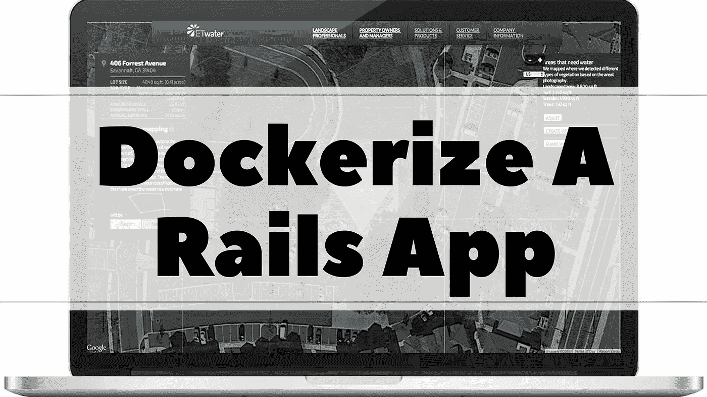
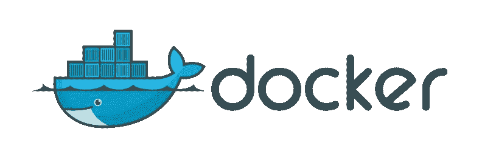

# 为什么以及如何对你的 Ruby on Rails 应用进行 Dockerize？

> 原文：<https://medium.com/swlh/why-and-how-to-dockerize-your-ruby-on-rails-app-91c1270591d9>

似乎其他所有的创业公司都在他们的宣传中增加了一个码头工人的角度。许多开发人员选择 Rails 是因为它允许他们非常快速地工作，但是这可能伴随着依赖性的权衡、版本管理和数据库的挫折以及文件大小的膨胀。Docker 通过限制依赖关系的范围，将进程相互隔离，并允许我们使用优化的映像，帮助缓解了这些问题。当然，代码的另一个抽象层很可能会带来问题。

一开始，指出 Dockerfiles、images 和 containers 之间的区别可能有点令人困惑。简而言之，Rails 应用程序是在短暂的、可替换的容器中启动的，而容器是基于图像的。大多数情况下，图像是使用 other 文件从其他图像构建的。

# 为什么是 Docker？

从开发人员的角度来看，有了 Docker，您再也不用担心“它能在您的本地环境中工作，但不能在生产环境中工作”的问题，以及“它能在我的 Ubuntu 机器上工作，但不能在五英尺外我同事的 Mac 上工作。”由于有了定义文件，在环境之间移植应用程序变得非常容易，从本地到实验室，再到生产。Docker 的速度非常快，由于使用了一些 Linux 内核特性，比如名称空间，您可以隔离网络、文件系统和进程。这种一致性对于用户来说是一个巨大的胜利，对于开发者来说是一个不可思议的机会。有了 Docker，您可以将极具破坏性的环境问题降低到几乎为零。

所以你看，Docker 是一个工具，它允许你将服务或应用程序连同其依赖项打包成一个标准化的单元。这个单元被标记为 Docker 映像，它包含了应用程序运行所需的一切。Docker 映像包含代码、系统库、运行时，以及在没有 Docker 的情况下运行它所需的一切。

# 使用 Docker 的优势

如果你发现自己一直在寻找提高生产力和改善整个软件开发体验的方法，你会感激 Docker 提供的以下好处。

*   Docker 允许您以某种方式封装您的应用程序，这种方式使您可以很容易地在不同环境之间移动它。它在所有环境和所有能够运行 Docker 的机器上都能很好地工作。
*   如果您运行的是 Ruby 的补丁版本、MySQL 的旧版本或其他使开发环境难以建立的依赖项，Docker 可以简化整个团队的开发。
*   使用 Docker，您团队中的所有开发人员都可以让您的多服务应用程序以自动化、可重复且高效的方式在他们的工作站上运行。他们所要做的就是运行几个命令，几分钟后一切都正常了。
*   您的应用程序可以在几毫秒内启动，因为它们位于预先构建的 Docker 映像中，这使得扩展和缩小变得容易。像安装依赖项这样占用你大量时间的任务只需要在构建时运行一次。映像构建完成后，您可以将它转移到许多主机上。这不仅有助于快速扩展和缩减，而且还使您的部署更具可预测性和弹性。
*   如果你只使用一种语言，你可能会使自己处于不利地位。通过尝试新的语言和框架来拓宽你的视野成为可能，因为 Docker 容器允许你隔离一个应用程序。你不必担心其他开发者不得不设置你选择的技术。你所要做的就是给他们一个 Docker 图像，让他们运行它。
*   Docker 附带的工具集允许运营经理和开发人员在部署应用程序时一起工作。Docker 的行为就像一个抽象。它允许您分发应用程序，而另一个团队的成员不需要知道如何设置或配置他们的环境。私下或公开分发 Docker 图像也变得很容易。您可以随时关注变更、新版本等。

# 入门指南

*   首先选择一个 Rails 基础映像。一个好的基础形象是最好的开始。它必须为您提供在开发中构建应用程序并在生产中运行它所需的所有依赖项。对于 Rails 开发，您希望 Ruby 语言本身伴随着创建 nokogiri、pg 或 mysql2 等 gem 所必需的系统库。
*   接下来准备您的基础设施或服务器环境。让你的码头运转起来。只要按照 Docker 文档来做就行了，非常简单。选择您的平台，按照说明操作，就可以了。
*   接下来，我们处理 Rails 图像。Docker 利用一个定义文件来描述环境将包含什么。Docker 使用一个图像，这是一个只读的模板，来运行你的代码通过一个容器。这幅图像充满了所有的魔力。它包含操作系统二进制文件、库、依赖项和运行代码或应用程序所需的所有应用程序。
*   现在，我们写一个 Dockerfile 文件。Docker 只需要使用少数几个命令。它们是:
*   **来自**:这描述了我们的容器将要基于的图像。
*   **运行**:一如既往地运行命令。
*   WORKDIR :这恰好定义了执行所有命令的基本目录。
*   **添加**:将文件从主机复制到容器中。每个命令都会生成一个新的缓存映像，以后可以在此基础上进行构建。变动较大的文件或可能发生变化的包必须放在 Dockerfile 的下方，以充分利用缓存。
*   尽管您已经成功地构建了一个 Docker 映像来存放您的 Rails 应用程序，但是还存在其他依赖关系。您可能需要配置类似 Postgres 的数据库，并确保数据库容器和应用程序容器可以相互通信。这是 Docker Compose 真正闪光的地方。
*   运行您的规范并总结。这只是介绍如何处理 Docker 中运行的一个应用程序。您的应用程序可能有不同的依赖集，所以请快速熟悉 Dockerfiles。

*原载于* [*产品洞察博客*](https://www.cognitiveclouds.com/insights/) *来自 cognitive clouds:Top*[*Ruby on Rails 开发公司*](https://www.cognitiveclouds.com/custom-software-development-services/ruby-on-rails-development-company)

## 这个故事发表在 [The Startup](https://medium.com/swlh) 上，这是 Medium 最大的创业刊物，拥有 292，582+人关注。

## 在这里订阅接收[我们的头条新闻](http://growthsupply.com/the-startup-newsletter/)。

