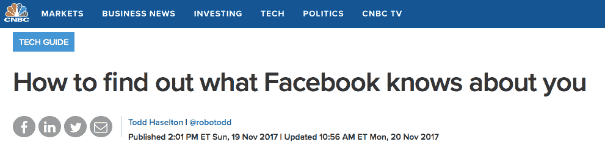
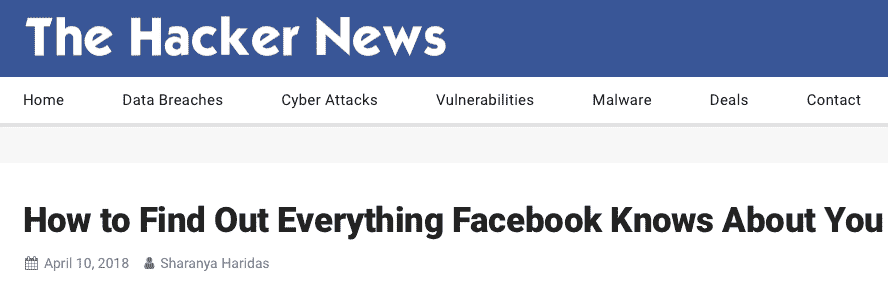
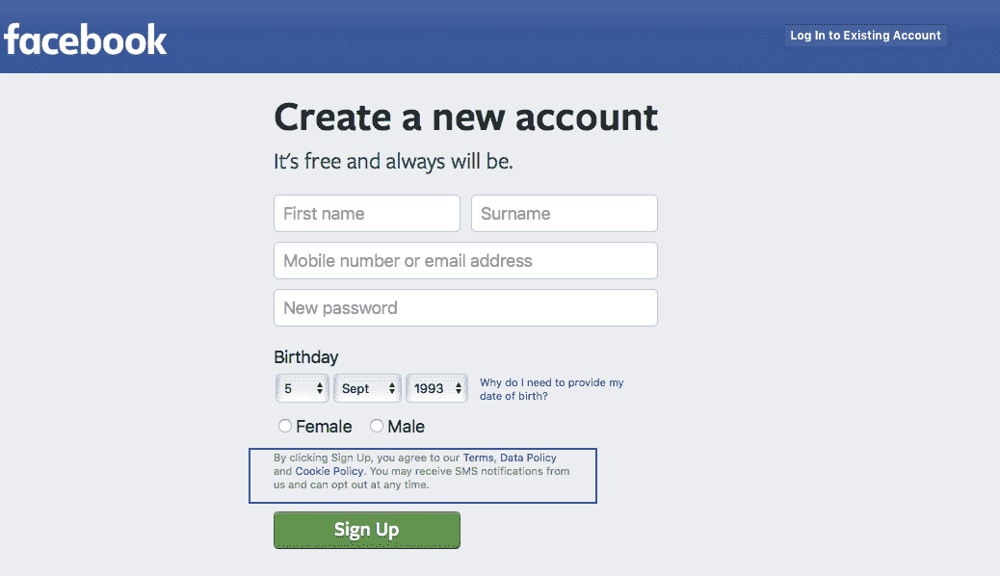
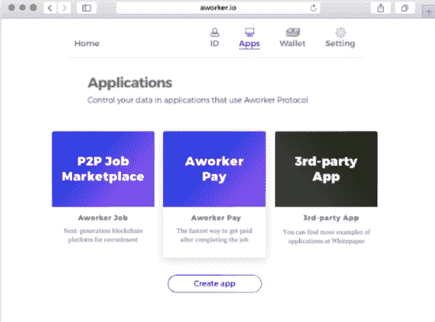

# 为什么应用开发者应该考虑数据协议

> 原文：<https://medium.com/swlh/why-app-developers-should-consider-data-protocols-75564e7c9865>

现在的公司每年都要花很多钱去买关于人的数据。作为一名开发人员，你必须决定你的应用程序中是否需要关于人的数据。只有极少数人会这样做，比如那些与客户、您的公司打交道的人，或者任何与您的数据源打交道的人，例如移动应用程序或移动应用程序后端会帮助您做出决定。如果这是你的情况，请继续阅读。

在过去一年左右的时间里，脸书和 LinkedIn 对我们了解得太多了，这已经被揭露了很多次。这包括但不限于我们的**联系方式**，我们喜欢**读什么**，我们更喜欢**如何放松**，我们的**爱好是什么**，以及我们喜欢或发送给朋友的模因有多少。他们将这些信息卖给其他公司。

人们起初担心“他们窃取了我的个人信息”，“他们怎么能这么做”，“我只是想告诉我的前同学我在生活中过得有多好”，等等。但人们在注册时同意数据政策也是众所周知的事实。

以脸书为例，它得到了如此多的关注，因为它是一个巨大的全球平台，目前地球上至少有四分之一的人口知道它。他们慢慢地收集人们的信息，年复一年地在媒体上添加新功能和推广平台。**但在 2018 年，作为一名开发者，你可能没有时间和金钱来缓慢而稳定地获取关于人们的信息。所以我想你需要一个快速，而不是超级昂贵的解决方案。**

# 去哪里找？

在 Aworker 中，我们基于公共区块链和分布式分类帐为应用程序和人员创建了一个分散且可靠的解决方案。我们的解决方案包括面向第三方应用的多链数据协议、身份识别系统、数据交换、P2P 就业市场、验证系统、支付和信誉。总之，这些特征形成了用于创建统一信誉系统的多功能基础设施。

Aworker 支持分散的数据交换。交换参与者将能够在不使用中介或中央服务器的情况下交换数据。所有数据都是加密的，可由数据所有者或经其同意后解密。如果读者要求，数据交换的顺序将在另一篇文章中解释。

应用程序开发人员使用 Aworker 协议的核心优势:

*   访问用户数据库，这可能会引起客户(公司)的兴趣。
*   一个访问数据库的人的数据。没有必要从零开始聚集观众。
*   您将通过您的应用程序从出售的数据中获得佣金形式的额外收入。

# 如何开始建立自己的网络帝国？

看到身边的机会。

工作协议是完全开放的，因此每个人都可以访问数据。因此，我们不限于协议的用户。任何感兴趣的开发人员都可以将协议中的数据用于他/她的应用程序。

这产生了许多优点。首先，许多应用程序将用户的一些信息存储在它们的中央服务器上。在分散化和数据所有者许可的帮助下，每个人都可以访问完整的配置文件。这也将有利于最终拥有他们的数据(货币化)的用户。第二，来自可靠来源的信息安全地存储在区块链，将避免求助于中间人和第三方。第三，越来越多的开发者和企业家不断地相互竞争用户(和他们的数据)。一个开放的协议将通过团结的力量创造更大的价值。

可以使用 Aworker 协议的应用程序示例:

*   教育合作伙伴
*   在线学校和课程
*   培训中心
*   就业市场
*   自由职业者董事会
*   人力资源应用
*   跟踪应用系统
*   评分应用程序
*   工资单应用程序
*   对银行的申请
*   劳动力管理系统
*   身份提供者
*   项目管理软件

我们的目标是开发一个开放和免费的解决方案，用于共享经过验证的数据，以在一个去中心化的世界中创建一个信誉生态系统。这是一项雄心勃勃、技术难度很大的任务。我们正在努力实现我们的目标。欲了解更多关于工作协议的信息，请访问 [aworker.io](https://aworker.io/)

如果你是一名应用程序开发人员，想要建立一个伟大的平台，让人们的生活变得更加轻松，请在下面发表评论！

## 这篇文章发表在[《创业](https://medium.com/swlh)》上，这是 Medium 最大的创业刊物，有+366，291 人关注。

## 订阅接收[我们的头条新闻](http://growthsupply.com/the-startup-newsletter/)。

