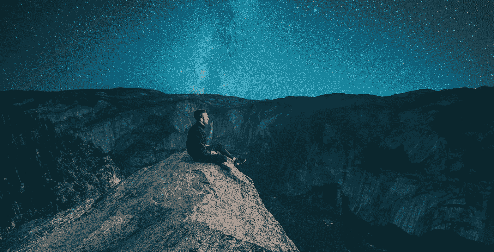

# 为什么我们害怕黑暗？

> 原文：<https://medium.com/swlh/why-are-we-scared-of-darkness-19c4f70f9b58>

Source: Unsplash

那是晚上 10 点左右，我坐在外面，游泳池旁边。

我喜欢花时间独自一人，除了活着什么也不做，让我的想法随心所欲。

我想知道:*为什么我们害怕黑暗？*

我们需要黑暗来欣赏白昼。如果黑暗根本不存在，一切都将是光明。

因此，没有什么是轻的。

就像没有丑陋，什么都不会是美丽的。
没有痛苦，就没有快乐。没有贫穷，没有人会富有。

一切都是平衡的问题。

我躺在吊床上，仰望天空，享受着这个结论，然后我笑了。

还有更多。

尽管黑暗使我看不到 10 米外的树，但它显示了 4 光年外的天空中悬挂着成千上万颗星星。

下次你经历黑暗时期的时候想想吧。

如果你周围的一切似乎都消失了，不要担心。抬起你的头，跟随你的指路明灯。

## 这篇文章发表在 [The Startup](https://medium.com/swlh) 上，这是 Medium 最大的创业刊物，有+ 375，985 人关注。

## 在此订阅接收[我们的头条新闻](http://growthsupply.com/the-startup-newsletter/)。

