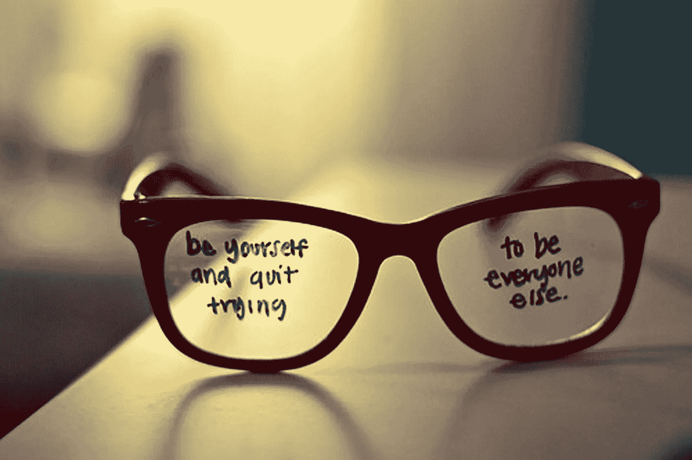
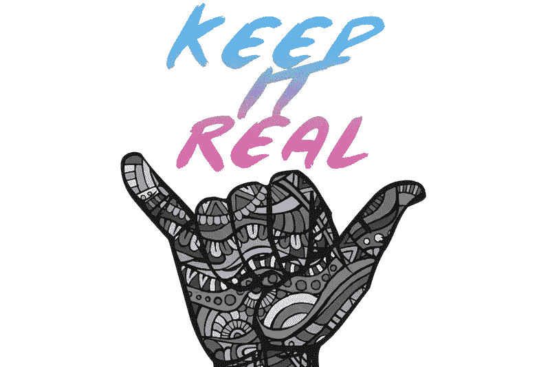

# 为什么“做真实的自己”未必是最终的成功之路？

> 原文：<https://medium.com/swlh/why-be-authentic-may-not-be-the-ultimate-path-to-success-b7721f8cde84>

最近一直有关于真实性的讨论。事实上，如此之多，有时听起来有点像一种宣传:“放弃吧，为了正宗的！”或者“做你自己，因为其他人都被带走了。”

毫无疑问，做真实的自己，以真实的自己追求目标，或者以真实的自己获得成功、被爱和被尊重，都是有价值的。

但是，成为我们的原始无脚本版本真的是一个好主意吗？[也许不尽然](https://hbr.org/2015/10/when-authenticity-does-more-harm-than-good)。

那大肆宣传是怎么回事？

# ***究竟什么是真实性？***

首先，让我们确定一个合适的定义。根据韦氏词典词典，真实意味着真诚和忠于自己的个性、精神或性格。也就是说，使我们的原则、价值观和道德与我们的行为一致。

在这个语境的范围内，真诚当然不应该被理解为缺乏过滤——我们应该说或做第一件想到的事情，没有关心、同情、原谅和考虑。

> ***确切地说，真实性是*** [***一种社会能力***](https://hbr.org/2012/12/what-being-an-authentic-leader-really-means) ***，它按照我们真正相信的东西来支配我们对世界的行为。***

自然地，我们都倾向于这样一种观点，即我们更愿意和那些开放、真诚、诚实和有道德的人打交道，而不是和他们的对手打交道。我们已经在一个基座上提出了真正领导的概念。

但是，我们真的完全理解这意味着什么吗？这听起来像是遥远的理想主义圣歌，类似于“解决世界饥饿”或“世界和平”？也就是说，我们只是喜欢抽象的真实性吗？

简单的回答是:有，也没有。

# ***津贴***

不可否认，做自己是有利的。[研究](https://www.researchgate.net/publication/222578792_A_Multicomponent_Conceptualization_of_Authenticity_Theory_and_Research)似乎不断重申与幸福、生活和关系满意度、逆境中更好的应对、成功的目标追求和改进的养育方式等有着积极的联系。

以下是最突出的优势:

***表现出真实的自己感觉很好。*** 这是解放。这很简单——我们不必根据情况去想我们需要成为什么样的人。做你自己就好。简单。

当然，在工作环境中，也有 [***【正宗领导***](https://hbr.org/2012/12/what-being-an-authentic-leader-really-means)】——公平、热情、关心他人和公司目标的榜样。他们说正确的事情，但他们也真诚地相信自己的话。他们的行为源于他们内心的信仰和道德准则。就世界而言，他们是“真正的交易”

此外， ***真实性是可取的，因为它与人类对自我认识、自我意识以及随后的*** — ***自我完善和自尊的重大而持久的追求交织在一起。毕竟，如果我们不了解镜子里的那个人，我们怎么能喜欢和尊重自己呢？如果我们首先不熟悉什么是真正的价值观和观点，我们怎么能表达它们呢？***

> 简而言之， ***真实是我们成功建立和培养人际关系、事业、友谊，甚至身心健康的必要基础*。**

正如奥普拉温弗瑞的名言所说:“我不知道做真实的自己能让我变得如此富有。如果我有，我会做得更早。”

鉴于上述收益，谁不想成为真实的呢？

然而，矛盾的是，许多人痛苦地意识到，我们的社会正在经历一场诚信、开放、真诚和仁爱的巨大危机。创造某种外在形象的愿望通常是我们行为的主要驱动力——即使这与我们内在的价值体系相冲突。我们只想变得“酷”，成为人群中的一员，被接受。

有时候，我们真实的个性会阻碍这些渴望。

# ***小字***

如果“真实的我”是一个害羞的人，或者缺乏自尊的人，或者想得太多的人呢？在一个将这些完全相同的个性特征视为主要缺点的社会中，我们应该如何追求我们的目标，取得成功，找到我们的灵魂伴侣，获得认可和欣赏？

因此，也许有可能接受这样一种观点:真实性通常是一种诱人的、被规定的存在方式，但它带有一些小字体。

> 在某些情况下,“保持真实”可能不是明智的，也不是理想的策略。

这里有一个想法:*也许，绝对的真实有时会适得其反，这一点值得推测。*

至少有几个伟大的科学家也对真实性的微妙观点进行了辩论。

*例如，查尔斯·达尔文在他的物种生存和自然选择过程的理论中，把后者视为进化的关键机制。也就是说，他认为， ***物种需要灵活，适应性强，对变化持开放态度，如果它们想要生存的话*** 。*

*尽管拒绝根据需要调整我们自己的思维、行为和对世界的态度可能不会导致过时(如最初的理论)，但它可能会损害我们因自己的技能、天赋或知识而被关注和欣赏的机会。*

*剑桥大学布赖恩·利特尔教授的流行研究为真实性的讨论提供了额外的支持。他声称，尽管我们的个性在很大程度上是永久的、固定的，但可以修补。这与他的概念*“自由特质”*或在需要时违背我们真实个性的能力有关。为了确保成功实现我们的目标和“个人项目”，*有时我们有必要按照预期或社会要求扮演角色和行动，以完成工作或融入社会。**

*还有所谓的 ***自我监控理论*** ，是社会心理学家马克·斯奈德在 70 年代发展出来的。这个想法是，个人分成两组——高自我监控者和低自我监控者(HSM 和 LSM)。*

*HSM 观察和分析人，他们的行动和行为，并根据特定环境的需要设计外观。他们往往有很多朋友，人缘也很好。相反，LSM 喜欢尽可能接近真实的自己。他们很少有亲密的关系，他们是可靠的和可预测的。*

*虽然 HSM 看起来有些不可思议，而 LSM 是善良、诚实的人，但斯奈德教授认为事实并非如此。归根结底是生存问题，HSM 更适合这项任务，因为他们知道如何调整。*

*同样值得认识的是，总的来说，我们都会在不同的环境下对不同的人做出“相应的”反应。例如，我们不会像对陌生人或同事那样对我们所爱的人说话。我们可能真诚地认为说谎是一种道德上的失败，但我们大多数人仍然会告诉朋友她穿着牛仔裤看起来很苗条，尽管我们可能不会真的相信。*

*一个*“善意的谎言，我们称之为*。或者，换句话说就是:*我们不真实。**

*. . .*

*这里的要点是，一方面*是真实的*，另一方面*是灵活的并且在需要时“表现出性格*”是有区别的。*

*毫无疑问，真实性是件好事——它是我们的道德指南针，是我们性格的表现。 它告诉别人我们是谁，我们代表什么的故事。在一个非常努力地试图规定某些行为和思维“标准”并告诉我们应该成为什么样的人的世界里，有一个观点是必不可少的——一个我们自己的、与众不同的、独一无二的、来源于我们个性核心的观点。*

****换句话说，当真实性涉及到了解我们是谁，我们的价值观和目标是什么，以及坚持我们的信仰时，它是好的。*** 也就是说，当它与自我认识和[自我意识](https://www.psychologytoday.com/articles/200805/dare-be-yourself)联系在一起时，它是一种需要表达的特质。*

*但有时，我们也需要成为形势需要的人——一个外向的领导者，而我们通常是内向的；当我们内心不抱希望时，一个鼓励我们的朋友；当我们内心的声音被怀疑所掩盖时，一个自信的榜样。*

*这也没关系。我们不会背叛镜子里的那个人。*

*相反，我们将微调我们的角色，发展、提高和练习生存技能。*

# *. . .*

# *感谢您的阅读！*

*如果你喜欢这个，请鼓掌帮助我与更多的人分享。你也可以看看我的网站[***www.evelynmarinoff.com***](http://www.evelynmarinoff.com/)***了解更多关于成功、自信和自我提升的小贴士和小贴士。或者在推特上关注我***[***Evelyn _ marin off***](https://twitter.com/Evelyn_Marinoff)***。****

**

## *这篇文章发表在 [The Startup](https://medium.com/swlh) 上，这是 Medium 最大的创业刊物，拥有+ 375，985 名读者。*

## *在这里订阅接收[我们的头条新闻](http://growthsupply.com/the-startup-newsletter/)。*

**