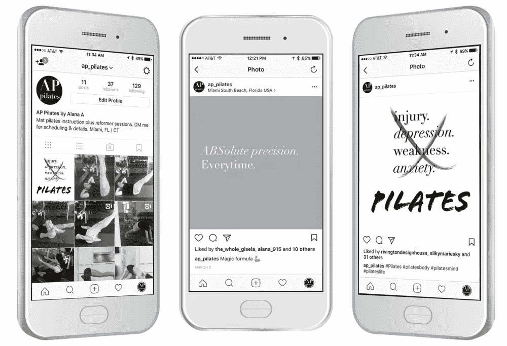
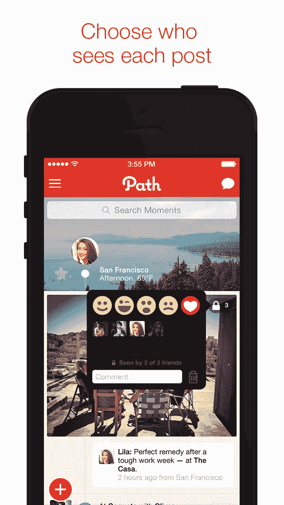
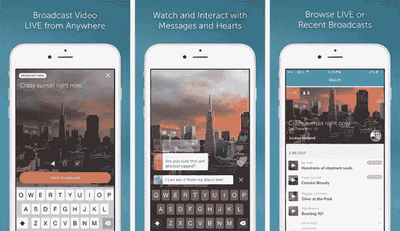
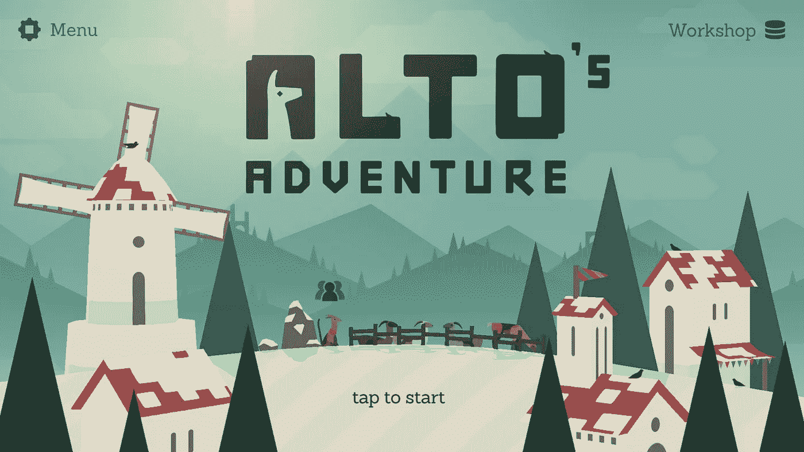
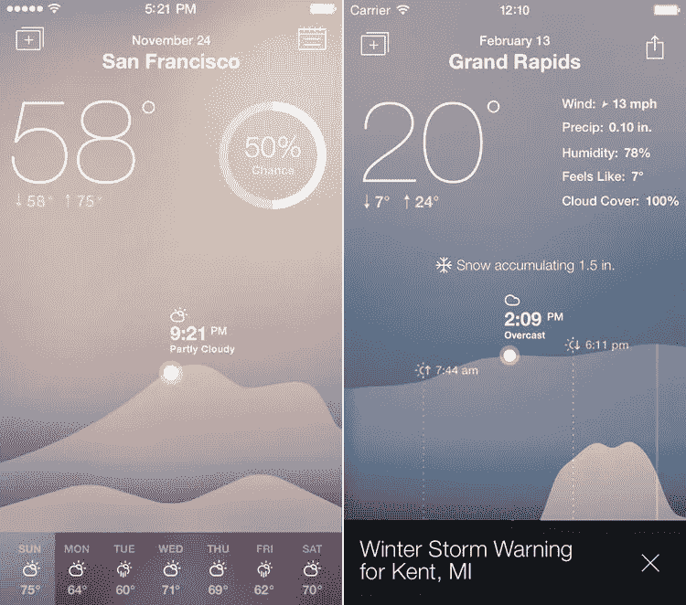
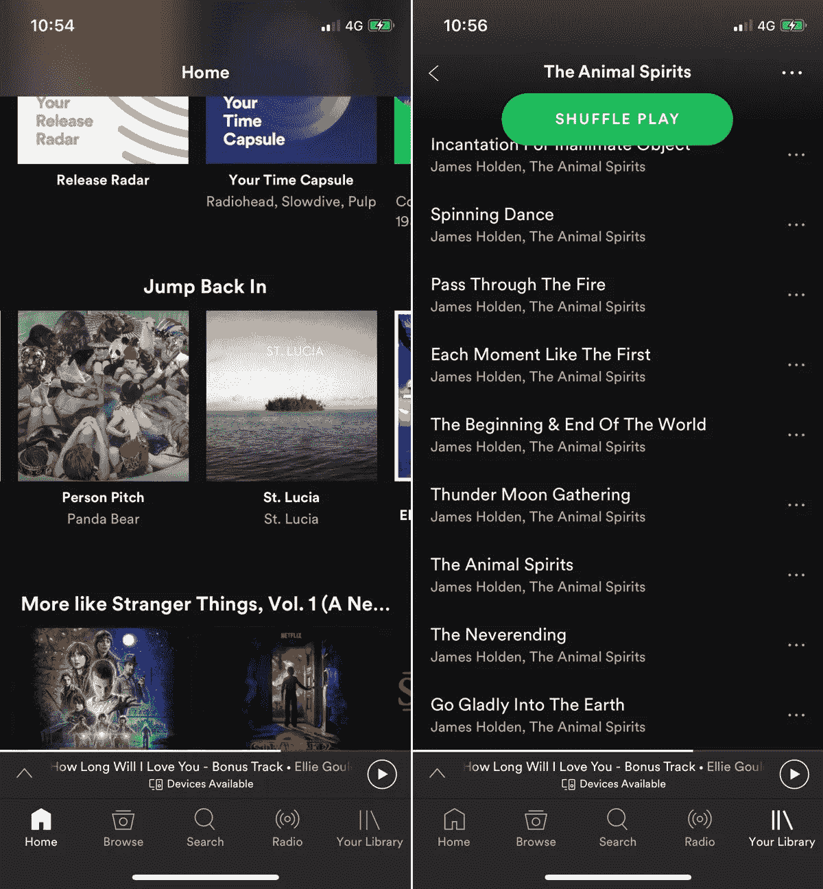
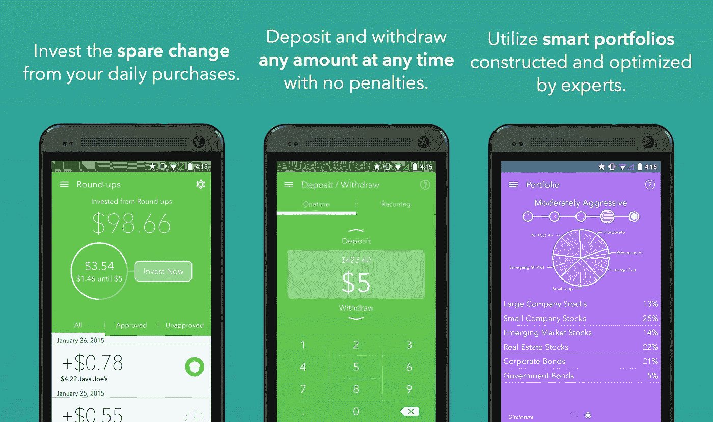

# 为什么漂亮的应用程序设计并不总是意味着有用的应用程序设计

> 原文：<https://medium.com/swlh/why-beautiful-app-design-doesnt-always-mean-usable-app-design-7878c2b62a21>

Why beautiful app design doesn’t always mean usable app design

可用性之上的美观有点像应用程序设计世界的#第一世界问题。那是因为有这样的问题是一种奢侈，你的好想法和意图被无害的……美淹没了？

互联网诞生之初，网页设计被称为“[用户界面设计](http://www.cognitiveclouds.com/custom-software-development-services/ui-ux-design-company)”和“人机交互”。这些标题告诉我们当时人类和计算机之间的关系是多么的破裂。冷，对吧？设计师们被赋予了可用性、信息架构和数据可视化规范，如果时间允许，还用 Adobe Flash 增添了一些才华。像大多数其他人类创新一样，世界上的设计师花了一段时间才找到一种将可用性和美学结合在一起的方法来制作伟大的软件产品。

是爱德华·塔夫特首先提出了一套全面的信息设计原则和流程。塔夫特的工作为许多早期的数字设计师铺平了道路，尽管直到 21 世纪初，互联网才完全采纳了他的原则。即使是最大的网站也有一些“丑小鸭”式的开端。他的教导已经渗透到新一代用户体验设计师()身上。像“最小有效差异”这样的原则，以及数据墨水和 chartjunk 之间的根本差异，现在正被教授给未来的应用程序设计师。

今天，你最常用的个人电脑是你的智能手机，而不是你家里的笔记本电脑或台式电脑。在任何时候，你的智能手机都触手可及，但房地产设计师不得不在移动设备上工作的屏幕是一个新的限制。当你设计一个应用时，它的可用性就是它的竞争优势。

阅读任何一个十大应用列表或者浏览苹果或谷歌 Play 商店，你会看到一个又一个应用看起来令人惊叹，但在实际可用性方面表现不佳。

# 仅仅因为它漂亮并不意味着它成功

说一个产品是“漂亮的”实际上并没有说太多关于它做了什么或者它如何很好地实现了它的目的。

许多以创造性的色彩味觉和令人惊叹的游戏环境开始的应用程序都悲惨地失败了，因为美丽无法弥补连续崩溃、丢失信息或难以导航的应用程序的糟糕体验。美丽是令人钦佩的，但是可用性不应该为了它而被牺牲。世界历史上还没有人坐在满是 bug 的、不直观的应用前绞着自己的双手，问:“你为什么不能变得更漂亮？”

Slack 利用客户反馈来增强产品功能，同时该应用的日活跃用户从 10 万增长到超过 100 万。通过优先考虑客户反馈而不是漂亮的设计，Kenneth Berger 跟上了 Slack 不断增长的用户群不断变化的需求。如果 Slack 只是专注于让每个屏幕都变得漂亮，他的发展可能会受到其外观的限制。

# Instagram 的获奖 UX

虽然 Istagram 是设计师的灵感，但它自己的设计故事更多的是可用性而不是美观。在最初的时候，至少在最初的两年，Instagram 有非常基本的视觉设计，但它有很好的用户体验。

Instagram 的前身 Scotch 没有滤镜，但它消除了漏洞，创造了最终的分享应用，推动了创作者凯文·斯特罗姆和迈克·克里格。凭借他们的 UX 技能，Krieger 和 Systrom 创建了一个可以用最少的点击次数拍摄、编辑和发布照片的应用程序。直到今天，Instagram 中的所有事情都可以通过在智能手机屏幕上点击三次或更少来完成。

经过几个月的原型制作和实验，Instagram 在 2010 年 10 月 6 日推出了大量用户。Instagram 虽然不是一个传统的美丽设计，但随着一种新的用户生成的照片涌入该应用程序，它变得无限美丽。Instagram 后来被脸书以 10 亿美元收购，后者将 Instagram 视为对其核心业务的威胁。

# 记得路径吗？

以漂亮的视觉设计为跳板，Path 允许用户在一个全面的时间线内共享丰富的状态——图像、视频、签到和帖子。此外，这些帖子可以分享到其他平台，包括脸书、Twitter、Foursquare (Path 于 2010 年推出，所以这很及时)、Tumblr、WordPress 和 email。无限的分享机会和广为吹捧的“漂亮设计”让 Path 登上了许多十大应用榜单。

早期，Path 以其设计和简化更大共享体验的承诺吸引了技术人群和早期采用者。Path 有一个完美的视觉设计，但它没有使用标准的苹果用户界面元素。另外，设计者没有考虑到交叉共享功能以及这对时间线意味着什么。因为用户分享他们所有社交媒体账户的更新，他们的时间线很快变得又长又拥挤。从 UX 的角度来看，小路成了我们不喜欢脸书的一切。

最终，Path 未能吸引到技术社区之外的用户，由于这些网络限制，Path 已经作为一个失败者被载入史册。大约一年前，它的创始人宣布将其社交网络应用出售给韩国的 Daum Kakao。

# 觉得你的 app 是美女？没有好的设计是不行的

应用程序创建者喜欢称他们的应用程序“漂亮”。如果你关注移动技术新闻，你会看到你的应用程序，如 Apple Watch 的天气转盘 2、Paper 和黑暗天空。

一个问题可能是，应用程序创建者正在使用“漂亮”来营销他们的应用程序，而不是告诉客户为什么应用程序能如此有效地解决问题。我们用来描述应用程序的形容词种类的转变肯定是一个问题——用“漂亮”+“应用程序”搜索任何东西，你就会看到——但真正的问题是应用程序商店充斥着应用程序，这些应用程序既漂亮又无用。

通过优先考虑可用性而不是美观的应用程序设计，我们接近了一个美妙的挑战:让视觉设计成为 UX 的一部分，以至于成为可用性的一部分。设计师:有没有一种方法可以设计你的应用程序，让用户进入一种有利于他们完成任务的情绪状态。一个例子是一个游戏，它以引导冥想阶段开始，使游戏者进入“游戏模式”,不管他们玩游戏的地方有多拥挤、嘈杂或分散注意力。这就是设计如何成为你的应用 UX 的基础元素。

# 证明:体验+设计= ❤的 5 大应用

给你一个可用的丑陋产品和一个可用的吸引人的产品之间的选择，你会选择哪个？这里有一些应用程序的例子，它们将形式和功能结合在一起，相互支持，相互促进。

# 1.潜望镜

就像 Instagram 把照片变成现场直播和公开对话一样，Periscope 正在为视频直播做着同样的事情。这个设计很漂亮，但最吸引人的是，你可以直接从你设备的摄像头开始直播。超直截了当的设计将焦点放在正在共享的场景上。

# 2.奥拓的冒险

奥拓的冒险给你一个滑雪板控制下一个无尽的山，而你在途中追逐骆驼，后空翻，并研磨轨道。很容易理解基于物理的游戏是彻头彻尾的直观。设计从夜晚到白天都在变化，环境和动画真的很棒。

# 3.新鲜空气

《新鲜空气》在极简主义的天气图上用好看的视觉效果向你展示未来的天气，因为它与你即将到来的约会有关。这是因为它只需轻轻一点就可以连接到你最喜欢的日历应用程序。

# 4.Spotify

Spotify 不像许多其他用户友好的应用程序那样一键操作，但它在简化一项具有挑战性的任务方面做了大量工作:建立、跟踪和分享我们赖以作为生活配乐的音乐库。Spotify 仍然是最好的音乐流媒体服务，因为它有可靠的 UX 和准确的人工智能，允许用户从任何设备上查找、收集和播放音乐。直到 2015 年，该应用程序才得到了期待已久的重新设计，将配色方案从橄榄绿改为光滑的黑色。

# 5.橡子

Acorns 让存钱和投资变得毫不费力。设置很容易，你甚至不会注意到，因为购买是四舍五入到最接近的美元金额，差额存入五个多样化的投资组合。一次总付的金额可以在任何时候贡献。它的最小设计符合诺贝尔经济学奖得主和现代投资组合理论创始人哈里·马科维茨博士的投资公式。

*原载于* [***产品洞察博客***](https://www.cognitiveclouds.com/insights/) *来自 cognitive clouds:Top*[***web app 开发公司***](https://www.cognitiveclouds.com/custom-software-development-services/web-application-development-company)

## 这个故事发表在 [The Startup](https://medium.com/swlh) 上，这是 Medium 最大的企业家出版物，拥有 301，336+人。

## 在这里订阅接收[我们的头条新闻](http://growthsupply.com/the-startup-newsletter/)。

