# 为什么美容品牌把 UX 做得最好

> 原文：<https://medium.com/swlh/why-beauty-brands-do-ux-the-best-3beb97057f94>

## 对任何创业公司来说，三大教训

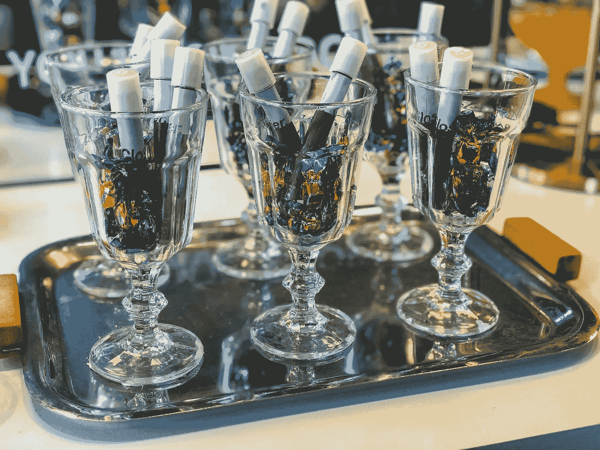

两周前，Glossier 的 SF pop-up 商店关闭了它的千年粉红门。

这个概念可能看起来很奇怪:在瑞亚咖啡馆，美容产品和炸鸡三明治一起出售。但是这种体验是如此专业地品牌化+执行，以至于这种配对看起来很完美——并且顾客们接受了它。

> **据报道，该弹出窗口每 20 秒就会导致一次更华丽的购买。**

让我们从用户体验设计的角度来看看 Glossier 的 pop up，看看(1) **他们做了什么让它变得如此正确** t 和(2) **你如何为任何行业或平台复制他们的“正确”**，无论是 IRL 交互还是数字驱动的购买漏斗。

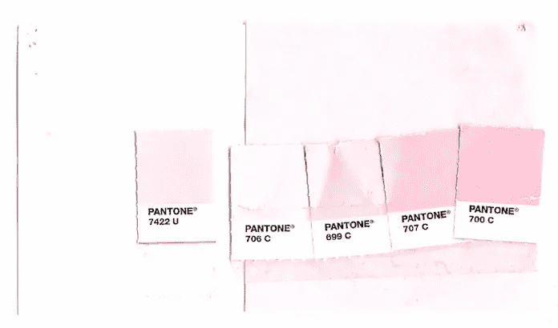

# **用户体验(UX)设计镜头**

用户体验设计一词的发明者 Don Norman 说“没有一个产品是孤岛。这是一系列紧密、完整的体验。”

**无论你是销售眼线笔、汽车，甚至是数据解决方案**，你都需要分析围绕你的产品的所有阶段和互动，并确保它们是一个无缝故事的一部分。

在美容界，一只 2 美元和 50 美元的口红的区别就在于这个故事。这使得它成为任何初创公司学习 UX 经验的绝佳场所。

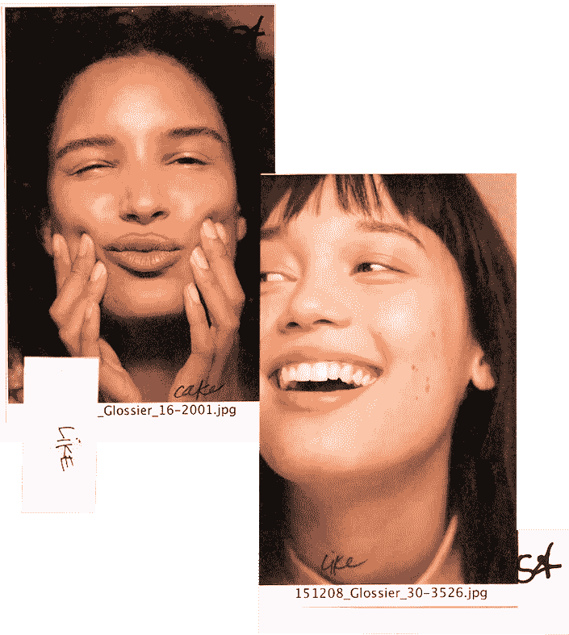

# **UX 考虑 1:为什么**

在 Glossier 开始为 SF pop up 设计创意概念之前，他们已经牢牢抓住了品牌“为什么”的两个主要元素。

**为什么#1:
用户购买产品的动机** Glossier 女孩是一个极简主义的美女[，她用心购物](https://beautymatter.com/2017/12/the-1-things-brands-miss-about-their-customers-what-it-means-to-shop-with-the-head-vs-the-heart/)。她希望自己看起来漂亮，而不是在外表上花太多时间，成为自己的美容专家。

**为什么#2:与产品所有权相关的价值观&观点** 光泽女孩颂扬她的个性。她不想掩盖自己的缺点，因为这些缺点让她独一无二。她喜欢开放、真实、诚实、有趣且愿意尝试的品牌——像她一样的品牌。

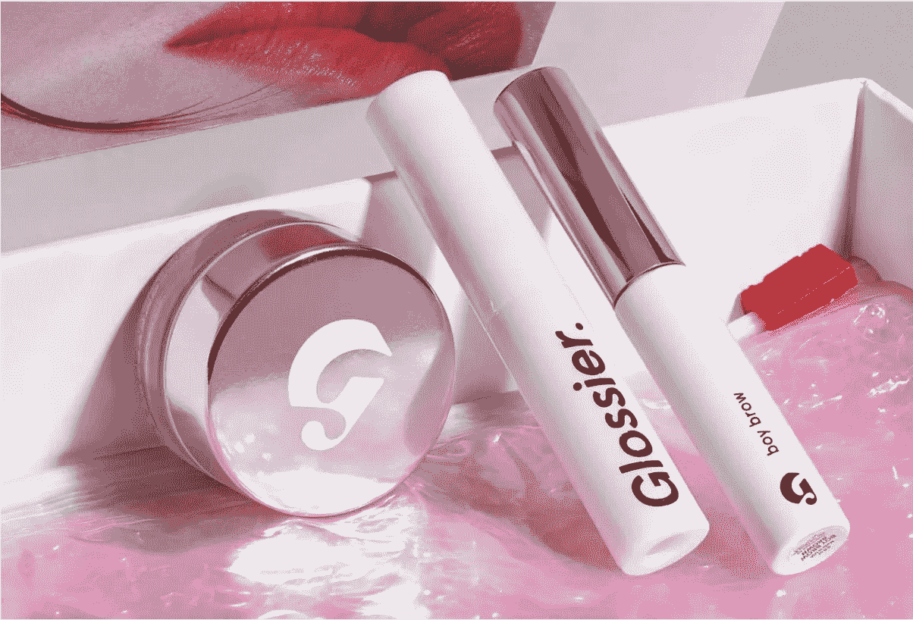

# **UX 考虑之二:什么**

由于 Glossier 是从一个流行的美容博客中诞生的，他们已经有了一个互动的粉丝群。Glossier 培育和发展这些关系的方式已成为客户参与的黄金标准，尤其是在他们开发产品时。

在 UX，“什么”是指产品的功能和特性。就 Glossier 而言，产品都是:

*   简单+有效:他们说到做到，说到做到
*   **使用有趣:**令人兴奋的格式，如牛奶果冻洁面乳和云漆腮红
*   **个人+真实:**基于客户需求和社区反馈

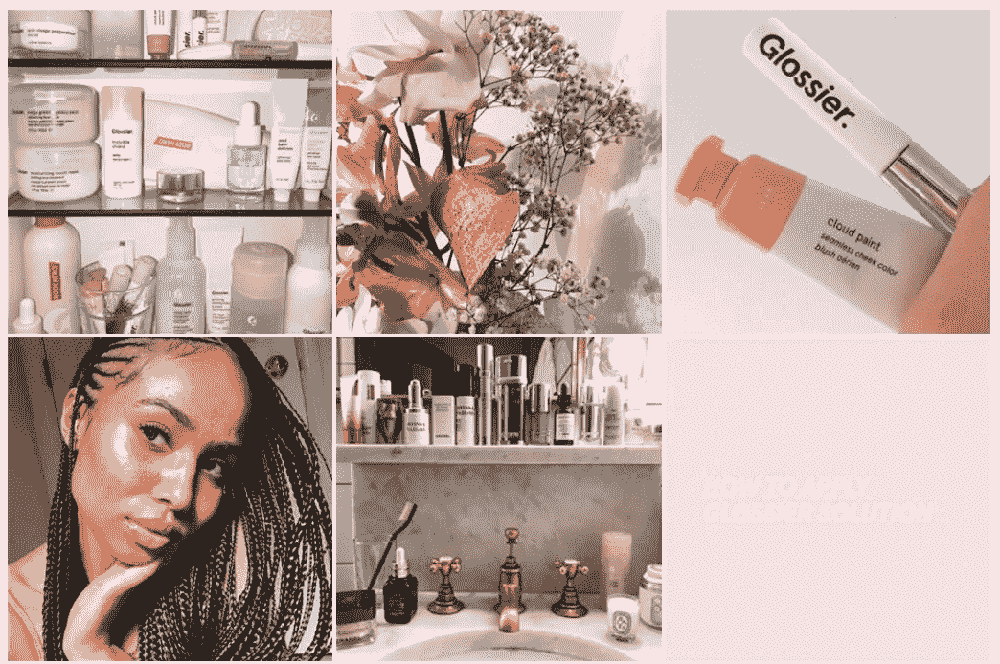

# **UX 考虑之三:如何**

在用户体验设计中,“如何”指的是以一种可访问的、美观的方式设计功能。这是 Glossier 弹出式商店的天才之处。

## **找到你的三巨头**

像写作一样，品牌体验的“方式”可以遵循三原则:三人组在执行故事和吸引读者方面比其他数字更有效。

每个品牌都应该专注于我所说的“三大要素”——品牌的三个核心要素，需要整合到每个用户体验中，以使品牌联系起来。

基于他们的“为什么”和“什么”,我会说 **Glossier 的三大要素是“简单的”、“有趣的”和“个性化的”**他们确保这三个要素始终发挥作用。

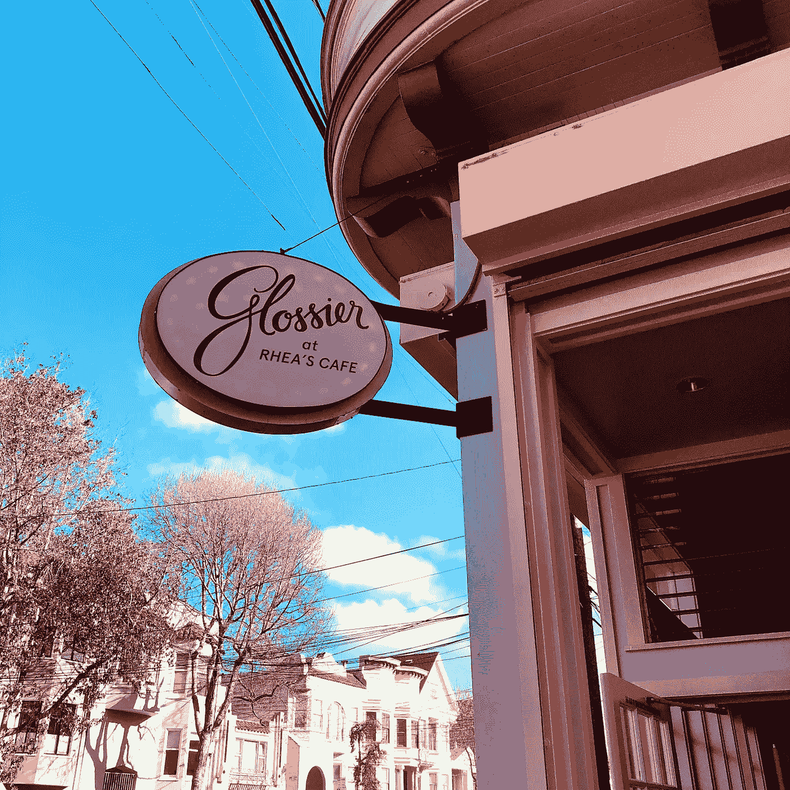

## **把你的切入点变成机会点**

瑞亚咖啡馆位于使团的一个时髦区域。一旦 Glossier 接管了这个月，前门就被改造了——完成了粉红色和紫色的外墙，一个看起来复古现代的标志和巨大的 Insta-magnet 户外墙，上面写着“祝你有美好的一天，旧金山。”

设计的一切都很友好、新鲜和有趣，邀请任何好奇的人进来玩。大多数日子里，都有一排排新面孔的女孩等着进去。而这一行成为 Glossier 创造切入点魔力的又一次机会。

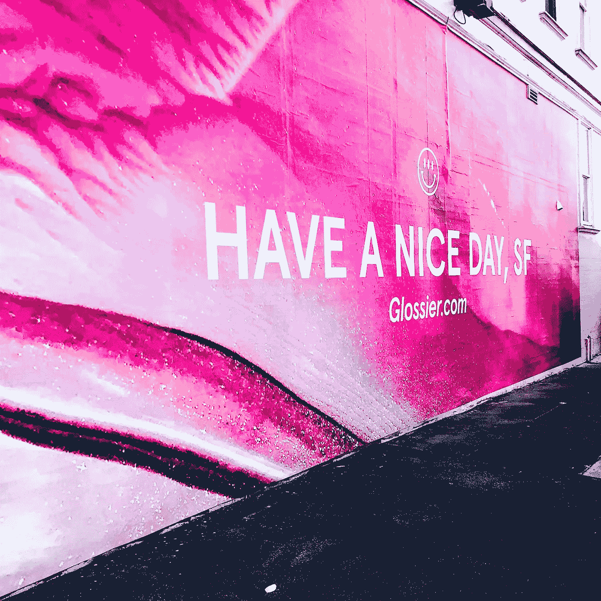

一个阳光明媚的周五下午 5 点，当我和我的代理公司的女孩们站在外面时，管理入口的粉红色 Glossier 员工拿着一瓶该品牌的香水 *Glossier You* 走下队伍。

“你试过我们的香水了吗？太不可思议了，”他说着，让我们五个人都迫不及待地伸出了手腕。“每个人身上的味道都不一样。它与你身体的化学物质一起发挥作用，让你变得完全独特。试试看——好了，现在闻闻彼此吧！看看你们都有多不同！”

我们照做了。它闻起来确实有点不同。但是这种香水是否以某种显著的方式与我们的皮肤发生化学反应并不是最值得注意的事情。

Glossier 将我们排队等候的经历变成了快速学习产品的时刻，并让我们以完美的心情消化他们的品牌故事。很简单。很有趣。这是私人恩怨。三巨头，大功告成。

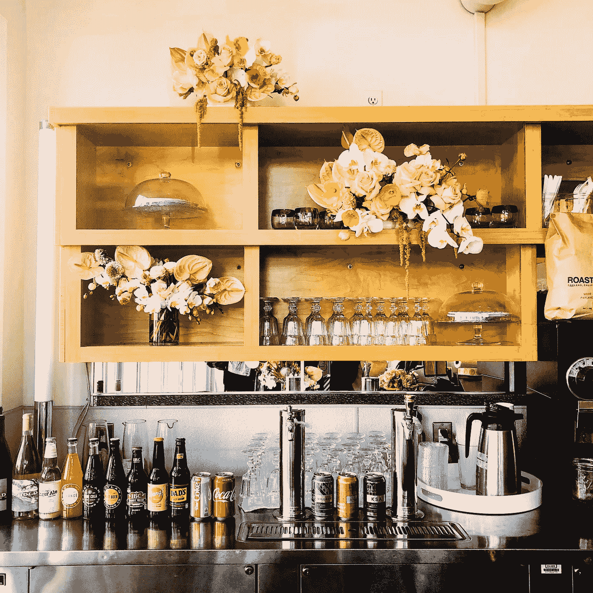

## **给你的体验 360°治疗**

一旦你进入瑞亚咖啡馆，你就被带到了玫瑰复古餐厅天堂。

一切都是独一无二的美丽。一切都非常适合 Insta。一切都让你自我感觉良好，包括字面上告诉你“你看起来不错”的镜子

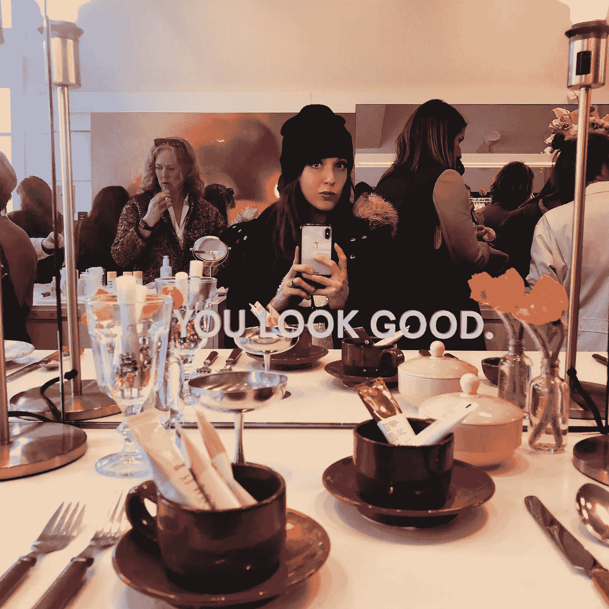

虽然每一个细节都经过精心设计，但没有任何东西让人觉得过度设计或大惊小怪。

事实上，除了啤酒和葡萄酒，他们还在 Rhea's 提供有限的特色菜菜单，比如炸鸡三明治，让你和你的影子一起啜饮？

这看起来非常自然，拥抱与众不同的存在和行为。

简单？是的。好玩。非常。私人的？

甚至镜子都在直接和你说话。

## **走，走，走购买流程**

一群群女孩围着遍布整个空间的产品站，对 Glossier 的所有产品进行采样和实验。更多穿着粉红色衣服的员工在那里转来转去，询问问题，而不是试图以任何方式向你推销。

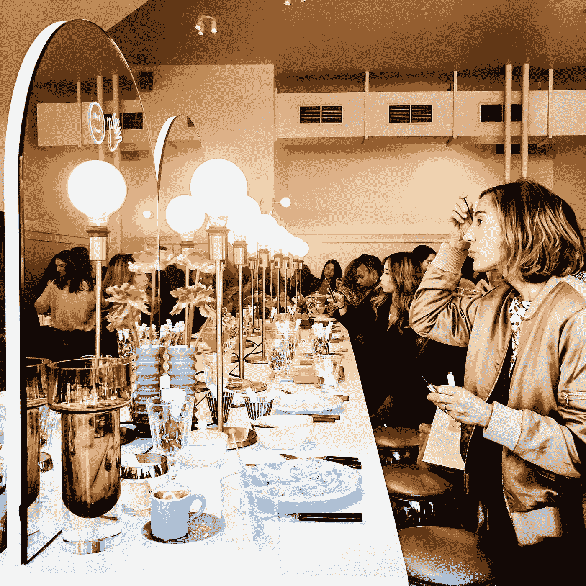

这个地方不仅被设计成让每个人都可以玩脸上的产品…它还被设计成可以拍照。柜台上到处都是点缀着餐厅元素的产品，比如玻璃杯、盘子和大盘子。因为你的美容产品的照片是乐趣的一部分。

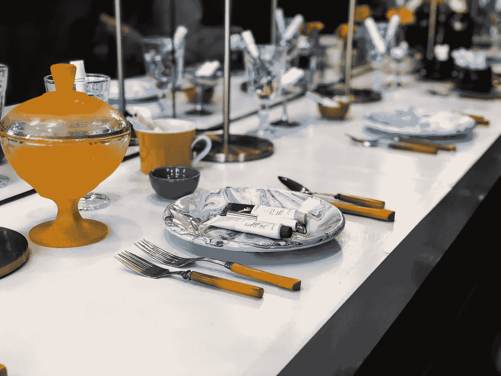

一旦你在你的个人和 Insta 上被推销了这个产品， **Glossier 保持了这个过程(你猜对了):简单、有趣和个性化。**

拿着 iPads 的员工拿着你的订单，刷了一张卡。当你点的菜准备好了，叫到你的名字——你得到了装在漂亮袋子里的漂亮产品和 Glossier 著名的粉红色泡沫包装。

# **你的见解**

Glossier 品牌“了解你”,因为他们离自己的社区很近。他们对自己的 **Wh** y(与客户相关)和**Wh**(与产品相关)有着难以置信的深刻理解。

# **你的行动**

无论你是一个以形象或功能为主导的品牌，无论你是在卖遮瑕膏还是护肤品，你都需要知道你的原因和目的，无论是过去还是现在。

当你着手你的 How 时，**挑出你的三大要素**来融入 UX 的每一个细节和每一次互动。

那么你的品牌在你身上看起来会和在 Glossier 身上一样好💋。

> 像这样？给它一些👏👏👏爱情。
> 
> 关注我，获取每日发布的创业品牌洞察: [Instagram](https://www.instagram.com/kimberlybrizzolara/) || [脸书](https://b-m.facebook.com/brandsthatgetyou/) || [LinkedIn](http://www.linkedin.com/in/kimberly-brizzolara-0b95093)
> 
> 你也可以[注册电子邮件](http://kimberlybrizzolara.com)并在媒体上继续关注我[。](/@Kbrizz)

## 这个故事发表在 [The Startup](https://medium.com/swlh) 上，这是 Medium 最大的创业刊物，有 324，834+人关注。

## 订阅接收[我们的头条新闻](http://growthsupply.com/the-startup-newsletter/)。

