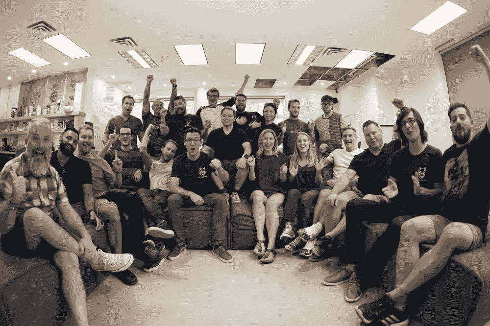

# 为什么在办公室里可以让一家初创公司变得与众不同

> 原文：<https://medium.com/swlh/why-being-in-the-office-can-make-all-the-difference-in-a-startup-25d17400cded>

如今，初创公司的创始人有一种趋势，那就是建立一个地理上分散的团队(所谓的数字游牧者)。
然而，在这篇文章中，我将抛出一根棍子，陈述相反的情况**(办公室里的员工！)成为成功的最佳环境之一。**

不要让房屋租金、供应成本和企业标准让你望而却步— **生产力、学习和管理方面的优势会让你赚回更多。**

在我的职业生涯中，我经历了所有可能的团队分配，从远程工作到成为银行交易大厅中的一员，我必须说，我目前的职位——在 [Altar.io](https://altar.io/?atm_id=MTUzODY1MTUyNDQzMQ==) 办公室的同处一地、专注、同步的团队中——是我觉得我的合作伙伴和员工最快乐、最有灵感和最有效率的地方。

当然，许多成功故事都见证了企业家在团队混乱的情况下崛起，并取得令人难以置信的成就——然而这并不是你必须坚持的标准。

作为企业家，我们喜欢挑战自我。因此，当我们走到一起时，我们互相挑战，成倍地扩展我们的创造潜力。跳跃的想法，杀死坏的概念，合作提炼一个单一的，金色的愿景。通过会面，我们的学习曲线变得更陡；通过合作，我们互相帮助。没有什么比从统一峰的顶端看更好的了。

同处一地的团队合作使任何团队团结起来，因为社交吸引了内省和深思熟虑，扩展了精力充沛者漫无目的的想法。相互鼓舞士气，合作愉快，这比一个孤独的企业家的精神发展更有价值。但是不要只相信我们的话。

哈佛商业评论收集并分析了美国和欧洲科技行业 2000 多名员工两年的数据，同意这一观点。通过比较员工的生产力、单独工作的效率和优质客户满意度，得出了结论:

在隔壁办公桌旁有一个拥有替代技能的邻居的员工获得了 10%的“绩效溢出”，这是在三种类型的员工中观察到的:有生产力的(快速完成任务但缺乏质量)、有质量的(产生优秀工作但进展缓慢)和多面手(生产力和质量两个维度的平均值)。

管理层也可以利用这些工人的组合，比如将具有相反优势的工人分组——例如，一个“高质量”的工人和一个“有生产力”的工人。**这对搭档的工作质量提高了 13%,效率提高了 17%**。

工人们最容易接受他们所缺乏的那方面的绩效溢出，而相同实力的员工配对则没有表现出显著的结果。就像我们学校的老师把[差生和](https://www.wsj.com/articles/use-your-seat-to-get-ahead-at-work-1502199000)神童配对一样，我们看到了这么多不同智力的人聚集在一个创业办公室环境中的好处。

从弗洛伊德·奥尔波特 1920 年的[社会促进](https://www.simplypsychology.org/Social-Facilitation.html)研究到马乔里·e·肖 1932 年的[社会心理学实验](http://www.psych.nyu.edu/gollwitzer/Wieber_etal_AJP_125_3.pdf)证实了问题最好由紧密的团队而不是个人来解决，历史向我们展示了一条通往成功企业的最佳路径。你的创业越大，美丽的多米诺骨牌效应就越大。而且不要把它限制在工作场所，因为那些[分享午餐](https://www.cbc.ca/news/canada/british-columbia/jennifer-newman-eating-lunch-with-colleagues-can-boost-productivity-1.3509016)分享生产力的人也会同样提高！

## **外包的时候呢？**

有时你决定外包你的产品和软件。这是游戏的本质，但不应该有损于你蓬勃发展的创业办公室文化。**在寻找合适的合作伙伴时，记住**同样的逻辑:**非常接近的优秀人才意味着更好的质量、更快的产出**——以及更直接的产品和项目管理。当代理机构将工作外包给其远程合作者时，获得更高质量、更快产出的可能性就会下降。

从简化管理到无止境的沟通和优质福利，一个紧密团结的办公环境是创业成功的有力途径。游牧者来来去去——就像他们名字的含义——但是不要因为一点点的花费而忽略了一个有凝聚力的亲身团队。相反，投资于活力，看看回报有多大。

自由职业者很时尚——这是毫无疑问的。但我认为交货和邻近有明显的关联。如果你看不到和你一起工作的人是谁，你就不能指望有效率地生产。

当然，你可能会离开原来的工作，离开办公室，但它不一定是你曾经严肃地跋涉到的那个耗尽灵魂的资源。不再有严格的着装要求、吹毛求疵的老板或强迫性的庆祝活动。更确切地说，你自己对创意发生器应该是什么样子的充满活力的解释，一个 [**新时代的创业办公室**](https://hbr.org/2016/04/if-work-is-digital-why-do-we-still-go-to-the-office) 。

这种心态让现有的头脑保持敏锐，并吸引新的身体。再多的电子邮件也无法超越团队内部一系列微笑所带来的友情。这就是有机成功的美妙之处。它是无限的，是一个由创造力、快乐、生产力和获得成功的学习推动的循环。

在 T4，我们相信智慧的结合。我们一起加强我们的集体意识。啊，想象一下——美丽的大脑分支有机地恢复了人类元素，这在现代科技文化中越来越罕见了！

听着——我们绝不是说你应该有意识地充实你的团队，并设定值得被称为旧企业环境的行为标准。然而，我们强调的是**创新地将你的团队团结在一起，或者与团队中的某个人合作，以最大化你创造的魔力。**

***

**对了，**

我是 [**祭坛. io**](https://altar.io/?atm_id=MTUzODY1MTUyNDQzMQ==) **，**的联合创始人，这是一家位于伦敦和里斯本的产品和软件精品店，帮助初创公司和企业打造优秀的科技产品。

如果你有一个想付诸实施的绝妙想法——给我发几行 [**私信**](https://www.messenger.com/t/paolo.dotta.5) 让我们聊聊，

## 感谢阅读。如果你喜欢这篇文章，请随意鼓掌👏帮助其他人找到它。