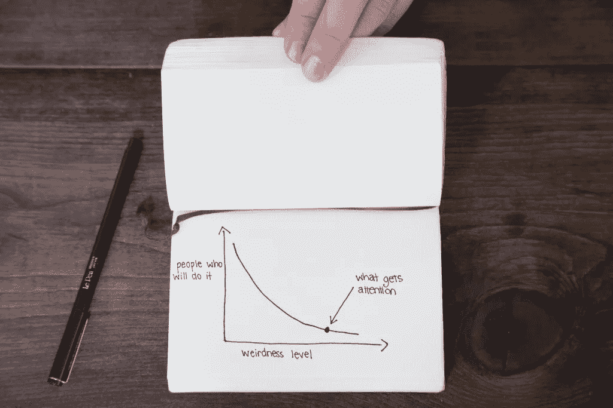
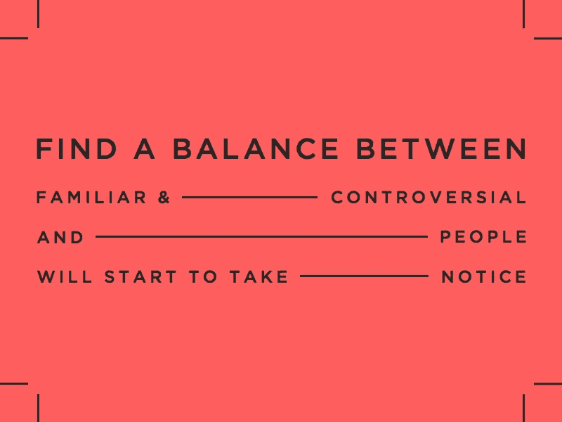
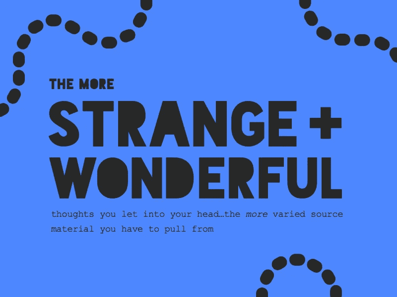

# 为什么古怪是你最好的创造性特质

> 原文：<https://medium.com/swlh/why-being-weird-is-your-best-creative-trait-eb0d349fbbac>

Want more articles like this as they’re published? Sign up for the Crew newsletter [here](http://ooomf.us2.list-manage1.com/subscribe?u=655606e77350bfa30e1ab5457&id=2afdbea3a0).

很难找到比创新和独特的眼光更有价值的创造技能了。

只要看看过去几十年中一些最大的行业颠覆者:优步、AirBnB、亚马逊。从表面上看，这些公司的想法很“疯狂”。

谁能想到世界上最大的住宿公司会没有房产？或者最受欢迎的交通方式是不拥有车辆，也不雇佣司机？

后见之明可能是 20/20，但我保证如果我几年前提出这些想法，你会给我一件直夹克。

无论你是在创业、写论文还是设计产品，现状都是创新的杀手。这就是为什么当你工作的时候保持事情“怪异”是如此重要。

不一致，新奇——无论你如何定义“怪异”,它都是与普遍接受的东西背道而驰，并且行得通的东西。“怪异”是用不同的眼光看待事物。它把我们通常不会连接的点连接起来。

正如插画家杰西卡·海吉在她的帖子 [*中解释的那样，为什么怪异是美妙的*](http://www.forbes.com/sites/jessicahagy/2011/12/13/why-weird-is-wonderful-and-bankable/2/) :

> "不同并不总是更好，但更好总是不同的。"

# 为什么奇怪的作品

心理学家早就知道[当我们经历一个新奇的情境时，我们更容易将这个事件储存在记忆中](http://www.sciencedaily.com/releases/2006/08/060826180547.htm)。

为什么会发生这种情况背后的科学原理有点冗长，但可以归结为:

“怪异”的经历会导致我们大脑中负责发现、处理和存储新感官印象的部分释放多巴胺(一种与动机有关的神经递质)。多巴胺的冲击不仅让我们更有动力去探索，而且新的研究表明，它还与长期记忆建立了更强的联系。

我们的大脑会从物理上记忆怪异和非典型的事物。

> “想象力模仿。批判精神才是创造。”

在心理层面上，我们给予奇怪的想法比那些支持我们已知的想法更大的价值。

正如作者默里·S·戴维斯在他的著名文章 [*中解释的那样，这很有趣！*](http://www.sfu.ca/~palys/interest.htm) :

> “如果它不是挑战，而仅仅是确认他们的一个理所当然的信念，(观众)会以否定它的价值而肯定它的真实性来回应它。”

怪异的想法和元素不仅伴随着我们，而且我们赋予它们比那些只是确认我们已经知道和接受的东西更多的文化价值。

# …在某种程度上

这是不是意味着你需要走出自己的路去违背所有的社会规范才能得到认可？

不完全是。毕竟，某些想法和理论是有原因的。

Image from the [InVision blog](http://blog.invisionapp.com/keeping-work-weird/)

我们的大脑每天都会接收数量惊人的感官信息，这就是为什么我们开发了过滤器来帮助我们判断新信息并挑选出重要的信息。

谷歌 2012 年的一项研究显示，网站的新访客在 1/20-1/50 秒内就能对网站的功能和美观做出判断。在你眨眼的时间里，你的大脑已经接受、过滤并决定了什么是重要的。

这一切都与[认知流畅性](http://www.uxmatters.com/mt/archives/2011/07/how-cognitive-fluency-affects-decision-making.php)以及我们的大脑找到一项任务有多“容易”的想法联系在一起。典型和常见的元素更容易处理，因为我们已经习惯了它们。他们[觉得我们简单](https://blog.crew.co/the-psychology-of-simple/)。

太多复杂或不典型的因素，你的大脑会告诉你这是一项潜在的艰巨任务，你可能会继续前进。让你的作品脱颖而出并令人难忘的关键是在怪异和典型之间找到平衡。

# 创造一种怪异的文化

怪异正成为一项大生意，许多公司开始意识到接受怪异的重要性。这里有两个例子:

*   在在线零售商 Zappos，每个面试都有一个著名的问题“从 1 到 10，你有多古怪？”
*   在位于旧金山的 Method 公司，员工会被布置家庭作业，问“你如何让 Method 保持怪异？”

奥斯卡·王尔德(一个同样古怪而富有创造力的人)说“想象力模仿。批判精神才是创造。”

> "不同并不总是更好，但更好总是不同的。"

复制是安全的。它让你抓住已经被广泛接受的观点。但这也是平庸的陷阱。只有对陌生和不同的事物持开放态度，我们才能创作出出类拔萃的作品。

所以，无论你是在寻找灵感还是想在竞争中胜出，这里有一些方法可以培养你自己的古怪文化:

# 1.拥抱你内心的古怪(或者，为什么你应该总是去 TMI)

心理学家最近将认知去抑制的想法与创新创造力联系起来。

认知去抑制是未能忽略与当前目标无关的信息。如果我们回想那些帮助我们解析感官信息的过滤器，它们也是阻止我们达到“啊哈！”的过滤器创造性洞察力的时刻。

> "我们赋予奇怪的想法比那些支持我们已知的想法更大的价值."

虽然其中一些归结于遗传，但有一些被证实的方法可以让看似不重要和奇怪的信息进来。像做白日梦、让你的思想开小差或散步这样的练习。

不管你怎么做，这里的想法是进入一个地方，在那里那些过滤器变得放松，新的想法形成。

# 2.利用 Lady Gaga 效应

20 世纪 30 年代，德国心理学家海德薇格·冯·雷斯托夫发现我们更容易记住突出的事情。

以这个单词列表为例:苹果、汽车、西红柿、狗、石头、香蕉、铅笔、Lady Gaga、直升机、猫、奶酪。

你记得哪个？我打赌那不是番茄。

Image from the [InVision blog](http://blog.invisionapp.com/keeping-work-weird/)

在这份名单中，Lady Gaga 像一只疼痛的拇指一样突出——这在这份名单中是不典型的。当怪异和奇怪的事物存在于熟悉的环境中时，它们更容易让人记住。

一次有太多的“在那里”,你独特的想法会在怪异中消失。但是在熟悉和有争议之间找到平衡，人们会开始注意到。

# 3.给对面一个机会

自我审查是创作独一无二且令人难忘的作品的主要障碍。

我们不是一头扎进一个激动人心的想法，而是通过提问来改变我们的思维方式，使之更符合“正常”的情况:

*人们会因为我们的想法而嘲笑我们吗？*

*他们会对我们说的话生气吗？*

遵从自我审查意味着否认真实的你。拥抱你的个人特质可以大大提高你的创造性产出。

> “如果你接受怪异的理论，与其说你必须学习什么，不如说你必须忘掉什么。”— *伊萨克·阿西莫夫*

每当你发现自己出拳时，问一问为什么？然后反其道而行之。

# 4.想办法一起破解奇怪的想法

当被问及如何想出创新的想法时，苹果创始人史蒂夫·乔布斯简单地说:“创意就是把事物联系起来”。

真正创新和创造性的想法来自于发散性思维——把别人没有的点连接起来。

你让越多奇怪和奇妙的想法进入你的大脑，你就必须从越多不同的素材中提取。

> "尽可能创作出最好的作品意味着接受奇怪的想法."

以斯坦福大学教授兼作家罗伯特·萨顿的故事为例，他曾为一家软件公司提供咨询。当提出新想法时，公司会拿出两叠抽认卡，一叠写技术，另一叠写行业。

洗牌，从每一堆中抽出一张，看看有什么疯狂的(潜在的创新)想法冒出来。

# 5.奖励成功和失败。惩罚不作为。

作家、记者和真正的怪人亨特·S·汤普森有一句名言:

> "当事情变得不可思议时，不可思议的人就会变成专业人士."

创造你最好的作品意味着接受奇怪的想法。尤其是那些与普通事物背道而驰的。

那些突破界限，创造我们尊敬和认可的工作的人失败的比成功的多。这不仅仅是记分，这是一种尝试。拥抱自己的古怪意味着不断地把工作拿出来，试着看看什么可行，什么不可行。

让你的古怪成为你的名片。记住，每一个新的创新或趋势都源于某人的古怪想法。

# 得到了[一个想法](https://crew.co/?utm_source=Medium&utm_medium=CTA&utm_campaign=MediumCTAs)？

## 与最好的设计师和开发人员一起工作。超过 1000 万人使用了剧组生产的[产品。超过 300 万人阅读了我们的博客。在这里加入他们](http://crew.co/?utm_source=Medium&utm_medium=CTA&utm_campaign=MediumCTAs)。

[*这篇文章的一个版本*](http://blog.invisionapp.com/keeping-work-weird/) *最初出现在 InVision 博客上。去看看！*