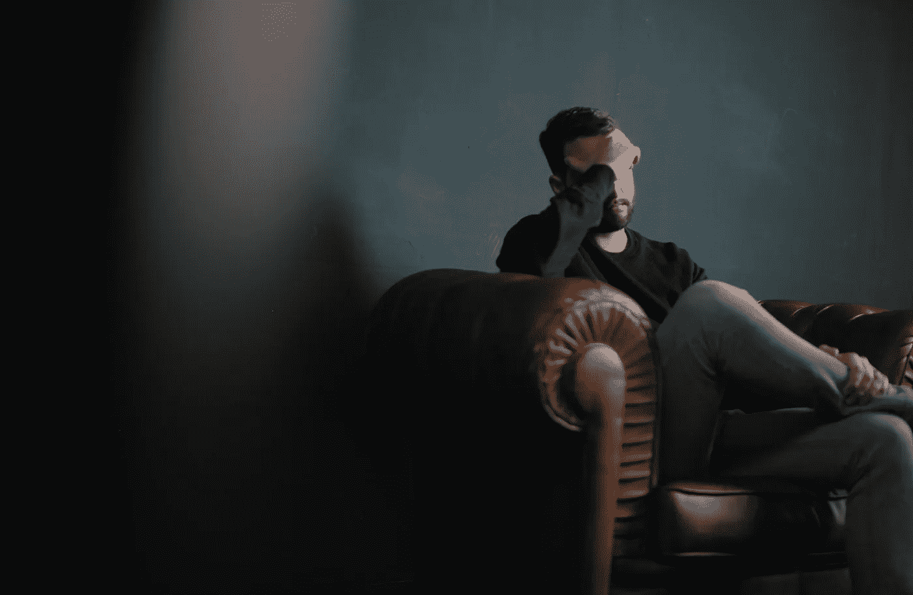

# 为什么对自己最苛刻的批评会损害你的职业生涯

> 原文：<https://medium.com/swlh/why-being-your-own-worst-critic-is-hurting-your-career-6770bf0a8f1e>

Originally published on [**JOTFORM.COM**](http://jotform.com)

我们往往是自己最糟糕的批评家。

我们专注于我们认为缺少的东西。我们评判自己的挫折比评判他人的挑战更为苛刻。

更糟糕的是，反复思考已知的缺点会耗尽本可以更有效利用的宝贵精力。