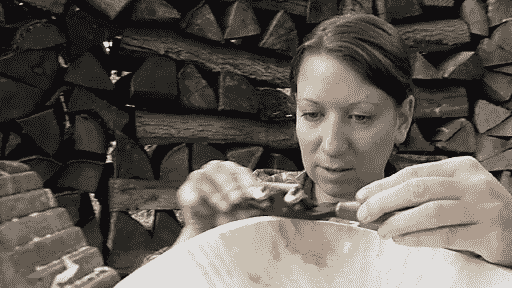
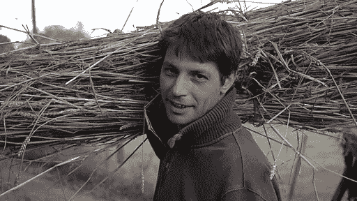
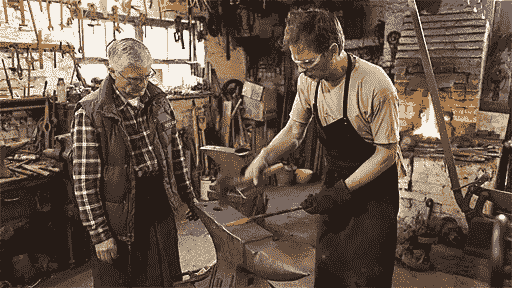
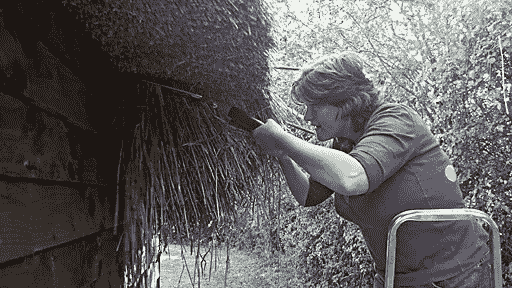
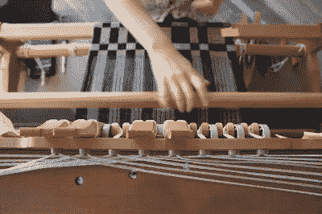
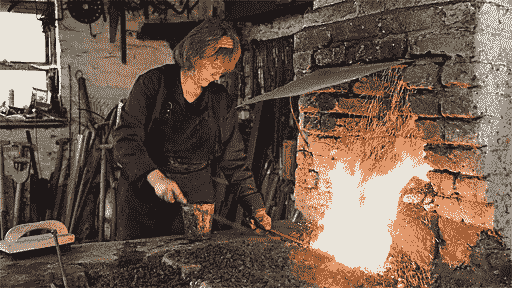
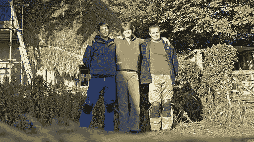

# 为什么铁匠比你更擅长创业

> 原文：<https://medium.com/swlh/why-blacksmiths-are-better-at-startups-than-you-dcbffe5c004c>

艾米·霍伊

有一个很棒的节目叫做[工艺大师](http://www.bbc.co.uk/programmes/b00qvrcj)，是英国广播公司的迷你系列纪录片。我建议你现在就出去想办法看。

手工艺的全部意义在于——惊喜！—工艺大师:

*   锻造
*   砌石工程
*   茅屋
*   手工编织
*   彩色的玻璃
*   绿色木质家具制造

我们今天几乎想都没想过的交易；过时的家庭手工业。

尽管如此，仍有人梦想学习这些行业，这就是手工艺大师的用武之地。每集都讲述了 3 名准学生在一位大师级工匠的指导下，在为期 6 周的紧张课程中经历的考验和胜利。

我已经看了两遍，两次都很喜欢。因为事实证明，学习手工熨烫和编织是创业的完美推论。

无论是谁选角，都做得非常出色。每一集的特色都是学生个性的完美融合。因为这是一种真人秀——虽然是一种非常精致的、穿着吸烟夹克的真人秀——这些个性被带到了前台。当学生们在塑造石头、悬挂茅草、旷课、在帐篷里的脚踏车床上旋转木头，或者锤打热铁的时候，他们正在积极地做人。我们看到他们最好的一面……和最坏的一面。

**你在“初创公司创始人”身上看到的每一个缺点，都会在《手工艺精品》中体现出来。**如果你坐着&一次或两次看完整个系列，这些模式就会*跃出*在你面前。

# 你会认识到的不良行为

以下是我发现的一些性格缺陷:

不同集的几个同学**执着于“表达自己”**而不是遵循 brief(工作规范)。他们把宝贵的时间浪费在“创造性”的勾心斗角上，而不是真正完成任务。

其他人**沉迷于幼稚的无聊和叛逆**当谈到学习早期阶段的重复时，而不是全心全意地致力于基础。

更多的人把完美主义作为反对自己成就的武器……一种武器，一个借口。

有些人表现出很强的自视甚高，毫无根据——他们自吹自擂，认为自己会赢，对大师的建议视而不见，或者一点点批评就崩溃。

其他人在经历最简单的挫折时，进行痛苦的自我贬低，毫无根据的自我贬低——宿命般地哀叹，“我永远做不到这一点”。他们想在第一次碰壁时就认输。第二个。第三个。

最后，也可能是最致命的，许多学生似乎毫无耐心。他们希望直接看到结果，直接看到有趣的东西——创造性的东西。他们不想缴纳会费。他们认为自己很特别。所以当他们的捷径失败时，他们会烦躁地跺脚。

**这些学生声称想要掌握一门手艺，但他们抵制“手艺”的本质尽管如此，为了获得学徒资格，他们不得不申请和面试，并中断他们的生活 6 周或更长时间！**

# 等等？所以节目很烂？

我确信我让这个节目听起来像是一种恶毒的恐怖游行，但是没有什么比这更远离事实了！通过简单、诚实、困难的工作和实现现实的回报，除了少数几位，这些天后都在 6 周内发生了转变。

他们发现自己取得了非凡的成就……就在他们决定忘掉那些垃圾的时候。

这种转变很值得一看。这就是生活。

因为这就是生活——因为，如果你看了它，你会认出你的同事、朋友，也许还有你自己——我们不禁要问…

# 为什么？为什么这是普遍的经验？

这是我花了半辈子思考的事情。这是我的结论，正在进行中。

**学生们抵制这一过程的每一步是因为他们的整个自我概念都处于危险之中**:

他们从未在结果至上的环境中工作过。他们被父母、学校系统和老板宠坏了。他们的工作是抽象的；他们很少看到他们工作的最终产品被使用，他们很少见到任何人使用他们工作产品的最终形式。

直到现在，他们一直在努力获得认可，从结果中抽象出来:问题一直是，*这是老师想要的答案吗？委员会喜欢吗？*——**不是** *是真的吗？*和*这对顾客有帮助吗？*

这就好像伽利略从塔顶扔下了他的球和羽毛，当它们落下时，他试图通过辩论来说服他的观众，而不是简单地看着。

这是我们大多数人成长过程中生活、学习和工作的方式。而且有毒。

# 被宠坏的孩子

你曾经和一个真正被宠坏的孩子交往过吗？

人们很容易把被宠坏的孩子想象成冷酷、算计的小屁孩，冷静地把发脾气作为操纵的工具。但是如果你曾经是一个被宠坏的孩子，你就会知道这与事实相差甚远。当一个被宠坏的孩子得不到他想要的东西时，他会觉得这个世界完全失去了控制。他是自己情绪的受害者(他真的感觉和他的行为一样糟糕)。

一个被宠坏的孩子根本无法面对事情没有按他期望的方式发生的现实。他被自己的感情所束缚。

当他的借口不起作用时，一个被溺爱的孩子真的无法应付。

当这个世界没有给一个被宠坏的孩子或被溺爱的孩子带来预期的结果时，他们会觉得他们的世界就要结束了。他们的自我会做出相应的反应，迫使外部改变，保护他们对宇宙的心理模型。

# 听起来熟悉吗？

当你生活和工作在一种与世隔绝的生活中——与你工作的最终结果脱节——**你被宠坏了。**与你的工作成果相比，你在取悦和管理把关者的能力方面得到的评价更高。守门人是人；人类可以被说服接受借口。*那对我不适用。我知道但是。我不擅长那个。我真正想做的是。当事人说。我尽力了。*

发现自己陷入了一个现实驱动的环境中，blam！你精心培养的守门技能毫无用处。你的自我处于危险之中。它会反击。

斯通不在乎你是否过了艰难的一天。铁不会因为你拿着锤子犹豫不决而保持更热。如果你没有得到你的茅草正确，它会泄漏，就是这样。没有犯错的余地。

感觉一定很恐怖。

*啊*，你可能会想，*但是在《手工艺》中，这些学生是由一位大师教授&评分的。主人是人类。他们试图取悦主人。主人是看门的吧？主人会接受借口。*

理论上，是的。但现实中呢？不是*这些*高手。2012 年没有比铁匠或撒切尔更务实的了。他们很务实，因为如果不务实，他们将无法生存。

这些大师知道分数。他们知道他们服务于现实，而不是更高的权威。他们知道现实是无法否认的。不管是布料有瑕疵、石头不平整、椅子坏了，还是客户不付钱……他们的感受无关紧要，他们的借口站不住脚，对他们独特价值的任何信念都不会改变这一点。

正如铁匠大师所说，当客户要求“再做 10 个”时，当你带着更新、更有创意的设计回来并说“但这个做起来更有趣”时，他们会非常沮丧然后你就拿不到钱了。

简而言之，这就是 21 世纪的状况:我们是过着抽象生活的抽象的人。我们不知道如何以其他方式生活。当我们发现自己突然撞上坚硬的、非中介化的现实时，我们的自我就像被宠坏的孩子一样大叫，又踢又叫，大发脾气。

这就是当这些心不在焉的人在第一天来到女工匠大师的工作室时发生的事情，他们想，

“哎呀，我经常和布料打交道。我完全可以在织布机上手工编织。几百年前的人就做到了。这能有多难？”

答案当然是*居然他妈的硬*。令人麻木的努力。编织就像演奏管风琴，只是有机会折断、折断、打结和扭动。犯一个错误，几个小时——也许几天就会过去！—单独使用*配置*。

掌握一门手艺很难。这很难，而他们被宠坏的小顽童认为这很容易。难怪他们会反抗。难怪他们纵容自己的“完美主义”或对无聊感到极度烦躁。

正是这种相同的态度导致你在麻烦出现的第一个迹象就放弃你的项目。同样的态度导致你没完没了地谈论特征。推迟营销；相信如果你建造了它，他们就会来。或者，见鬼，根本不去建造或运输它。从你的同行而不是你的客户那里寻求反馈……花更多的时间去迎合风险资本家，而不是为你的产品买单的人。把精力浪费在“创新”上，而不是掌握基础知识。

由于幼稚的不当行为而失败的努力比由于市场、经济、顾客或竞争而失败的努力要多得多。

**商业是现实引擎:**

不要天天从基础做起？你会失败的。

不要不断营销？你会失败的。

不解决你客户的痛点？你会失败的。

不出货？哈！

给你:四句话谈生意。

商业是真正的杰作。严格、诚实、公开地攻击它——并致力于控制你被宠坏的内在孩子——哦！你要去的地方。现实将成为你最亲密的朋友。你的驾驶问题将从*演变而来，这让我听起来很聪明吗？*到*这是否能激励顾客购买？哎呀，我今天想做什么？*到*今天，我将如何让我的客户生活得更好？*

你会用你的手和你的大脑做一些东西来帮助人们，那些你可以与之见面、交谈、学习的人们。你会感到有回报。

不过，如果你不是长期从事这项工作，就不要费心了。如果你太特别而不能练习基础，那就别麻烦了。如果你更想得到认可，而不是获得一个结果，那就别麻烦了。如果你宁愿维持现状也不愿成长，现在就放弃吧。

这是你每天都要面对的决定:

**你只是想在儿童泳池里戏水，一看到严肃的迹象就反抗吗……**

还是你想以现实为你最喜欢的盟友，打造一个真正的企业和真正的生活？你想用你能达到的成就给自己惊喜吗？

你有成为大师级工匠的潜质吗？

# 厌倦了被迎合？

工艺的理念和实践不是凭空而来的——它来自与正确的人在一起，在正确的环境中学习正确的东西，以及实践、实践、实践。T2 独自完成这件事几乎是不可能的。

*不想自谋生路？我写了一篇* [***偶遇简讯***](https://unicornfree.com/get-your-free-7-part-guide-to-kicking-product-ass)**关于将工匠精神带入商业的艰苦工作。**

**

**发表于* **创业、旅游癖和生活黑客***

******

*-*