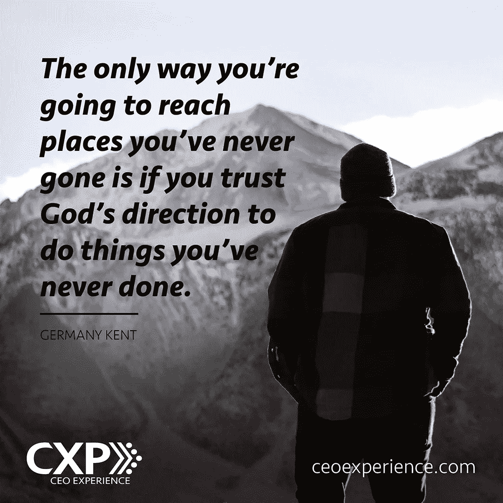

# 为什么首席执行官应该接受首席销售官的角色

> 原文：<https://medium.com/swlh/why-ceos-should-embrace-the-role-of-chief-sales-officer-d460699b01e3>

# 作为创始人和首席执行官，你经常身兼数职，扮演不同的角色。然而，每位首席执行官都应该扮演的一个重要角色是首席销售官。

根据美国小企业管理局发布的一项研究，只有 44%的小企业熬过了经营的第四年。虽然企业失败的原因有很多，但确保失败的一个可靠方法是忽视，而不是专注于公司的销售成功。

每个首席执行官都应该明白一个基本事实:销售是首席执行官销售和履行其首席销售官职责的反映。Greta Schultz 写了一篇名为“[每位 CEO 今天应该做的 5 件事来提高销售额](https://yfsmagazine.com/2013/09/03/5-things-every-ceo-should-do-today-to-improve-sales/)”的优秀文章，概述了融入 CEO 角色的行之有效的策略。

如果你准备增加销售额，看看为什么你——首席执行官——应该担任首席销售官的三个理由。

# 首席执行官比任何人都更了解产品或服务

许多企业主创业是因为他们开发了一个伟大的产品，或者他们有一个如何做得更好的想法。他们不一定*开公司成为销售人员。然而，没有人比创造产品或服务并拥有其开发成果的人更了解产品或服务。这些知识将有助于你说得可信和有激情——这可以间接导致销售的增加。*

**辅导问题:**你是否利用你的产品知识向内部和外部的人介绍你的产品或服务的好处？

# 首席执行官通常能更有效地与关键决策者沟通

与销售人员相比，决策者对高管层领导(如首席执行官)的反应更好。通常情况下，看门人会比销售人员打照本宣科的销售电话更尊重创始人、首席执行官和企业主。首席执行官们能做的促进销售的最好的事情之一就是给其他首席执行官打电话。

**辅导问题:**你是否有每周都会联系的顶级潜在首席执行官和决策者的名单？

# 首席执行官在他们的公司中设定重点领域

这是一个简单但重要的事实。如果首席执行官不相信销售是重要的，那么销售就不会被认为是重要的。当首席执行官高度重视推动销售和收入增长时，其他人也会关注销售。CEO 关注哪里，公司就去哪里。

**辅导问题:**您认为贵公司员工最关注的领域是什么？

# 最后的想法

不幸的是，许多首席执行官从未学习过销售艺术。然而，当首席执行官知道并提倡销售基本面时，整个组织会变得更好。因此，他们将雇用更好的销售人员，并更有能力培训他人克服销售异议和达成更多交易。

正如马克·库班[建议](https://www.inc.com/kimberly-weisul/mark-cuban-three-rules-business-success-one-secret.html)的那样，“没有*的销售*，就没有*的企业*取得成功。”因此，重要的是，尤其是对首席执行官来说，“知道你的公司将如何赚钱，你将如何实际销售。”

*本文已编辑。* [*肯·戈斯内尔*](https://www.linkedin.com/in/kengosnell/) *是*[*【CXP】(CEO 经历)*](http://www.ceoexperience.com/) *的 CEO 兼仆人领导。他为领导者服务，帮助他们获得巨大的体验，从而转变他们和他们的组织，使他们走得更快。他与数百名首席执行官和领导团队合作，提升战略、运营和人员成就。他是作家、教练，也是 CEO 们的战略伙伴。Ken 是基督教首席执行官 Linkedin Group 的创建者和推动者，也是首席执行官体验影响评估的创建者。他与肖恩达结婚，他们有四个孩子。*

*原载于 2018 年 3 月 21 日 https://yfsmagazine.com**的* [*。*](https://yfsmagazine.com/2018/03/21/ceos-embrace-role-of-chief-sales-officer/)