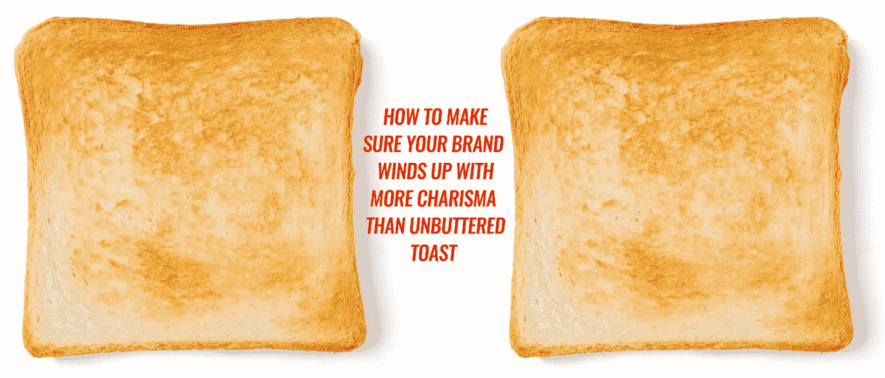

# 某些设计成功而其他设计失败的真正原因，在 60 秒内

> 原文：<https://medium.com/swlh/why-certain-designs-work-and-others-fail-in-60-seconds-1ea67dc4a301>

## 设计不是四个字母的单词。不涂黄油的烤面包不应该比你的品牌更有魅力。

公司和品牌都在纠结(并且经常想知道)为什么某些设计会奏效。

设计是一门艺术和科学。

如果做错了，你失去的不仅仅是销售。它稀释了你品牌的基础和意义。

这是本周《周三一分钟》第 16 集的内容:

# 为什么某些设计行得通

设计不是一个四个字母的单词*如果你知道设计的作用以及为什么一个公司首先要树立品牌。*

*正如我之前所写的，品牌是差异化的艺术。*

*那么什么是设计呢？*

*设计实际上充实了品牌的核心。*

> *设计是当今世界上最伟大的放大器。*

*设计师的职责是为企业和品牌注入生命和意义，而不仅仅是装饰它们让它们看起来更漂亮。这实际上是关于[连接其他人可能错过的点](http://www.risingabovethenoise.com/25-second-video-stunningly-connects-dots-design/)。*

*这是新设计师经常错过的，令人惊讶的是老品牌也错过了，把设计当成蛋糕装饰或买衣服，就像在说，“这让我看起来好吗？”没有进一步的检查。*

*让我们回到食物上来(因为我们是从烤面包开始的)。*

*你知道最好的厨师知道什么吗？*盐的用途*:为了 ***放大*** 你菜里的味道而不是增加味道。*

*设计对于品牌就像盐对于食物一样。如我所说，设计是当今世界上最伟大的放大器。*

*理解了这一点，就知道了为什么某些设计行得通，而其他设计就像未涂黄油的烤面包片。*

*这和了解销售和品牌的区别一样重要。*

**原载于【www.risingabovethenoise.com】**。****

**

## *这个故事发表在 [The Startup](https://medium.com/swlh) 上，这是 Medium 最大的创业刊物，有 317，238+人关注。*

## *在这里订阅接收[我们的头条新闻](http://growthsupply.com/the-startup-newsletter/)。*

**