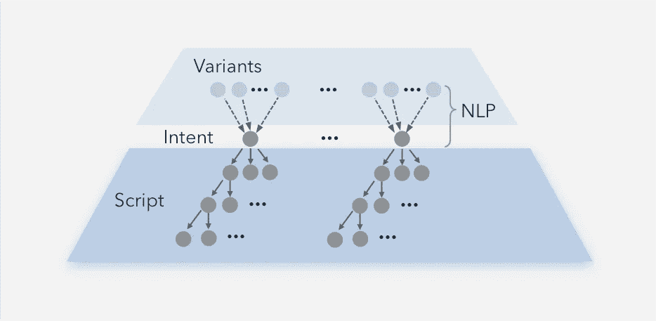
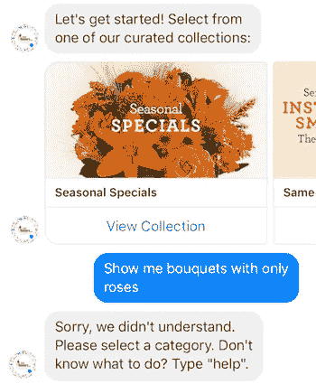
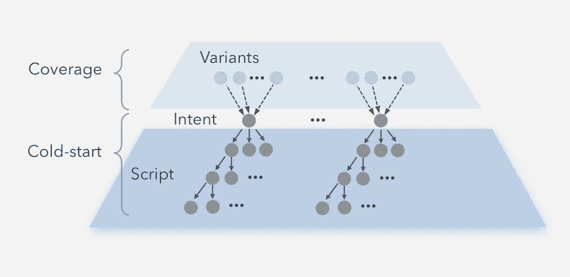
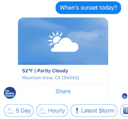
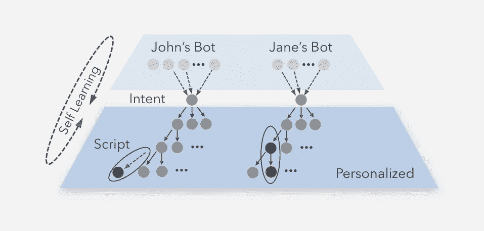

# 为什么聊天机器人很烂

> 原文：<https://medium.com/swlh/why-chatbots-suck-f9dad7a54d5c>

FB Messenger 商务机器人和谷歌助手变得很大，几乎每个公司都发布了自己的机器人，亚马逊 Echo Dot 和谷歌 Home Mini 成为顶级节日礼物-聊天机器人和助手终于在 2017 年成为主流。也许你已经用它来获得商店营业时间，修理你的网络，甚至买一只备用的火鸡。

尽管聊天机器人在自然语言处理方面取得了巨大的进步，但它们最大的缺点是仍然是脚本化和手工制作的；无非是一个美化了的 IVR 或者更糟，一个基于查询的搜索。偏离剧本太远，你会得到可怕的“*我不明白这个问题*”。

要理解为什么聊天机器人如此糟糕，你需要了解它们是如何构建的。

Chatbot Components

*步骤 1)* 决定你希望聊天机器人服务于什么场景，并收集它将回答的所有相关问题。这些问题的每一个都定义了一个 ***意图*** 。所有这些意图然后被构建到 NLP 引擎的树中。

*步骤 2)* 每个问题和意图都由用户可以表达的多种方式来表示。例如，用“*查看天气山景城的天气如何*vs“*今天有多冷*”。这些被称为 ***差异*** 。聊天机器人的所有变化都被 NLP 引擎翻译成相应的意图。

*第三步)*最后聊天机器人 ***脚本*** 或 ***对话*** 将这一切联系在一起。例如，如果你要买一件衬衫，输入性别、尺码和颜色。如果用'*跑题，这件衬衫是棉质的吗？*’，倒霉。

聊天机器人很糟糕，因为所有这些步骤都有巨大的缺点。

Chatbot problems

要在 ***能力覆盖*** 方面做得很好，你需要知道用户可能会问的所有问题。没有用户数据，你碰到一个 ***冷启动问题*** ，得到一个能力有限的 beta 版聊天机器人。它收集数据来学习，但让用户感到沮丧。但是很少有公司一开始就有大量的数据。所以绝大多数发布的聊天机器人都很平庸，目标是随着时间的推移不断改进。

为了 ***很好地对问题*** 进行分类，你需要包含该行业广泛领域知识的各种问题，例如，“*互联网无法工作*”与“*我的浏览器无法加载*”相同。如今，这些差异大部分是手动生成的——除了减少用户问题的覆盖范围之外，这还会导致成本过高。新的大规模自动创建这些差异的方法正在变得可用，尽管这种智能需要一些时间来获得领域上下文。

最后，为了在丰富的对话脚本 中脱颖而出，聊天机器人需要捕捉用户可能想要遍历意图场景的所有方式，包括回溯到上一个选项、跳转到其他选项，并且希望不会被卡住。在不知道用户将如何使用它的情况下，很难制作一个脚本，这是一个不可避免的让用户感到沮丧的第 22 条军规。

自学和个性化的树将解决这些挑战，并极大地增强体验。

Chatbot Opportunities

1.  自我学习:聊天机器人变得更好，因为使用数据被捕获，反馈用于手动扩展服务支持、差异和脚本选项-这是一个缓慢而乏味的过程，也无法扩展。相反，聊天机器人智能应该促进自我学习，以便它识别用户想要的新功能、问题、变化或脚本更改，并相应地调整体验。通过这种方式，它自动为#1 添加问题(和答案)，为#2 添加变体，并为#3 更改脚本，以快速构建一个健壮的服务。
2.  个性化:聊天机器人还没有提供神奇的个人体验。个性化与自我学习相关，因为每个用户基于他们学习到的行为获得不同的脚本。该机器人应该是一个定制的实例自动调整与您的数据，动态更新所提出的脚本越多，它学习。理想情况下，每个人都有自己的个人机器人版本，类似于电影“)*”中的*萨曼莎*。*

*随着人工智能创新的步伐加快，2018 年将会更广泛地采用这些智能功能，以实现聊天机器人中更深入的个性化对话。*

**

## *这个故事发表在 [The Startup](https://medium.com/swlh) 上，这是 Medium 最大的企业家出版物，拥有 284，454+人。*

## *在这里订阅接收[我们的头条新闻](http://growthsupply.com/the-startup-newsletter/)。*

**