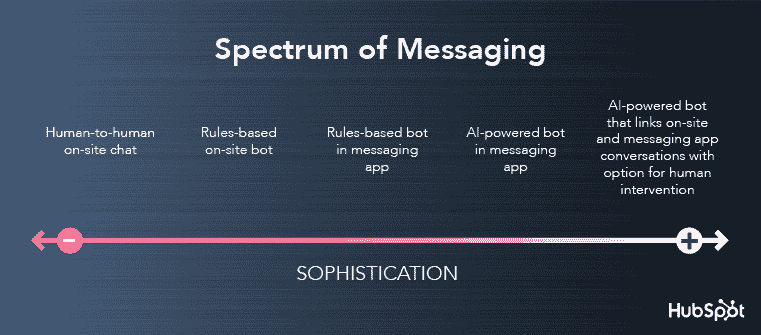
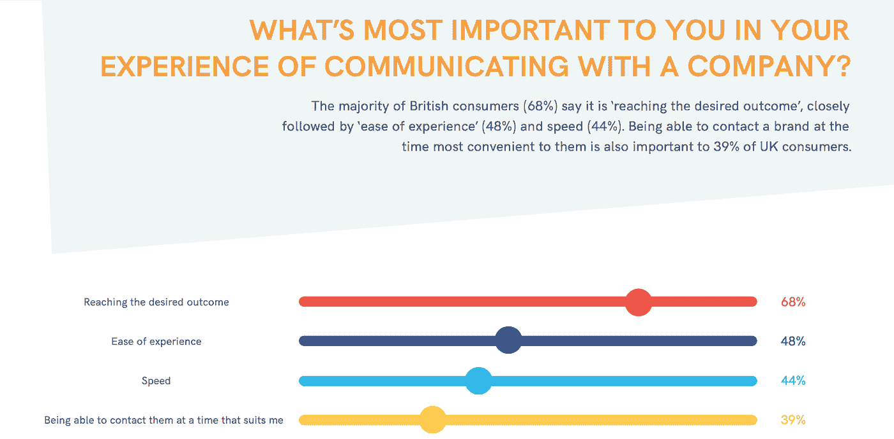
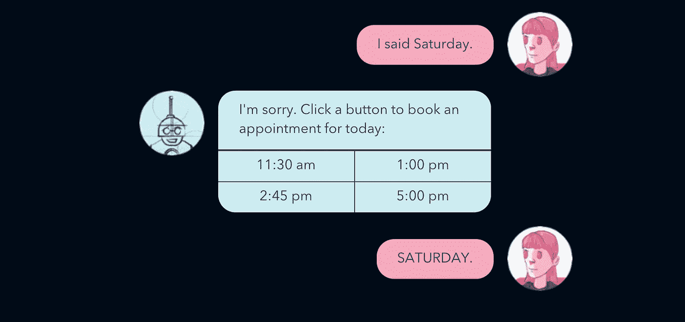
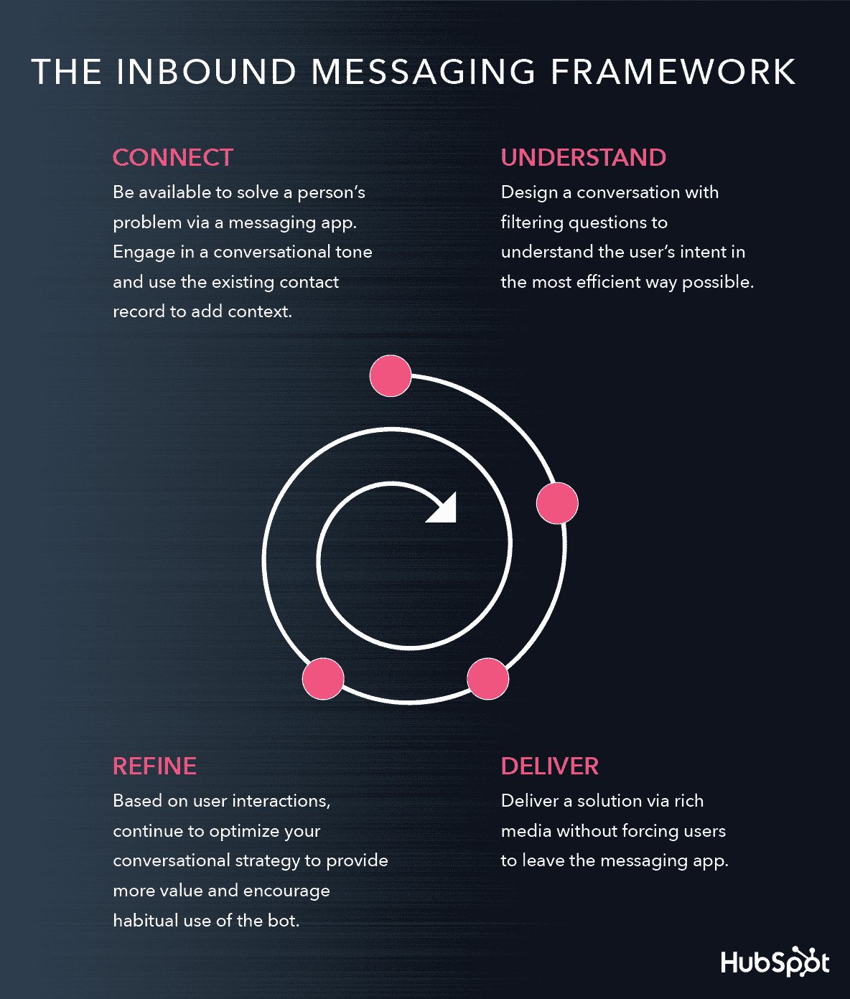
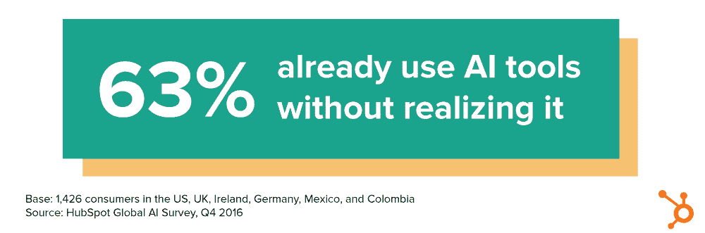
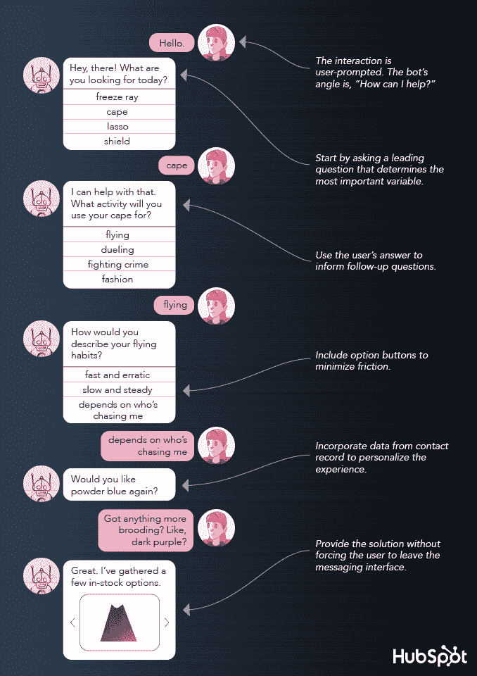
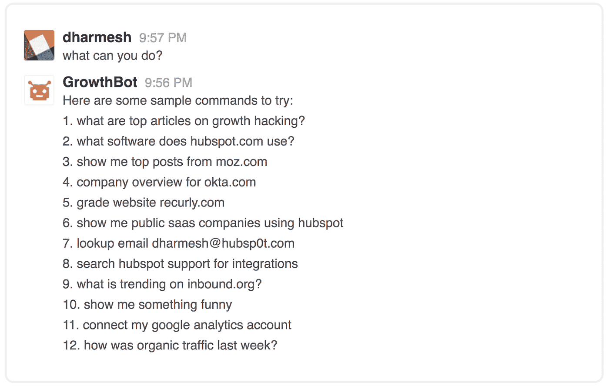

# 为什么聊天机器人会改变我们所知的营销

> 原文：<https://medium.com/swlh/why-chatbots-will-change-marketing-as-we-know-it-7fa140aa2e58>

## 善恶之战

这是一个美丽的星期五下午。

你在午餐时给一个朋友发了一条短信。

> "麦克拉伦 7 点去喝酒？"

时间和地点不费吹灰之力就被添加到您的日历中。

你一下班，一个开着漂亮的黑色优步的司机就出现了，准备带你去目的地。你甚至没有拿出你的手机。

不，没有无人机在监视你。

但是有些事情已经发生了。

# 进入机器人。

[Source](https://www.hubspot.com/stories/chatbot-marketing-future)

我说的不是像 [Tay](https://www.bloomberg.com/features/2016-microsoft-future-ai-chatbots/) 这样的音盲 Twitter 机器人，也不是像 [HAL 9000](https://www.youtube.com/watch?v=ARJ8cAGm6JE) 那样过于感性的操作系统。我说的是今天的聊天机器人。

最简单地说，现代聊天机器人是通过对话界面传递特定结果的数字助手。

在最复杂的情况下，它们是人工智能驱动的工具，将使高度个性化的营销变得可扩展。

正如我们所知，它们将改变营销的面貌。

我们中的许多人都使用过机器人。我们当中很少有人喜欢它们。这就是为什么我们必须在为时已晚之前表明立场。

你听过了。机器人是未来。但是他们将迎来怎样的未来取决于我们。营销人员。销售人员。创始人。创业者。人工智能实施者的第一线。

从现在开始，我们必须围绕如何使用这些机器人为善而非为恶来巩固[框架](https://blog.hubspot.com/marketing/how-to-build-a-chatbot?_ga=2.65963566.1886260479.1519081587-361136615.1505839570)。

# 但首先，我们必须做出承诺。

作为营销人员，我们有很多过错。并不是所有的都是好的。

当我们找到有用的东西时，我们有这种抓住不放的倾向。直到最新、最有前途的营销渠道[完全落地](https://blog.hubspot.com/marketing/marketers-this-is-why-we-cant-have-nice-things?_ga=2.175940258.1886260479.1519081587-361136615.1505839570)，我们才会放手。

不是因为我们邪恶。外面是一个竞争激烈的世界，我们都在努力为自己的企业寻求成功。

如果一个电子邮件营销活动达到了我们的领先目标，我们就会堆积更多的电子邮件。内容营销是趋势？让我们给人们提供比他们可能消费的更多的内容。

现在，软件被制造出来*特别是*来阻止、退订或者压制我们努力创建的活动。

什么时候到了这种地步？是时候做出改变了。

消息是营销的新领域。机器人让我们有机会通过直接与消费者建立可扩展的一对一互动来利用它。

但是等一下。这种*并不意味着*我们应该涌向那些不断提供不必要的模糊信息流的即时通讯应用。

我们的机器人应该只在用户请求时被激活——我们需要他们的完全许可。它们应该提供从问题到解决方案的最直接的途径。他们的输入应该内容丰富，高度相关，并且尽可能简短。

这一次，我们可以承诺做得更好。

[*Source*](https://www.hubspot.com/stories/chatbot-marketing-future)

# 消费者变了。

坦率地说，他们厌倦了我们抛出的东西。

人们不想搜索你的整个博客数据库，你的时事通讯完全消失在他们的电子邮件收件箱的垃圾堆里，如果他们发现你的社交反馈铺天盖地或无关紧要，他们会毫不犹豫地取消关注你。

当一个人遇到问题时，他们会沿着阻力最小的路径去寻找答案。一个可以在他们已经使用的消息接口中满足他们的机器人，以最小的投资提供解决方案？

这是消费者和新营销人员相遇的地方。

> 在他们的 [2016 年移动通讯报告](https://insights.ubisend.com/2016-mobile-messaging-report)中，ubisend 发现超过 50%的消费者表示他们会选择通讯应用而不是电子邮件来联系公司。
> 
> 在他们的 2017 年聊天机器人调查中，近 70%的受访者表示，他们宁愿与聊天机器人交流，而不是与人类交流，因为他们想要即时的答案。
> 
> 五分之一的受访者表示，他们会心安理得地用聊天机器人平均消费 440 美元。

对于一个 24 小时免费工作的机器人来说，这是一个不错的结局。

*Source:* [*ubisend*](https://blog.ubisend.com/hubfs/white-papers/ubisend_chatbot_survey_2017.pdf)

## 所有优秀的营销人员都知道——在你的受众所在的地方与他们见面。

现在，你的消费者正在使用消息应用程序，这些应用程序的月活跃用户已经超过了社交网络。

人们不再需要下载他们永远不会使用的单独应用程序:

> 通过在 Facebook Messenger 或 Slack 等已经使用的信息渠道内运行，机器人解决了人们对应用程序造成的孤岛日益增长的挫折感。

当一个机器人可以从他们已经打开的消息应用程序中完成所有这些事情时，为什么消费者必须下载并打开三个不同的应用程序来选择餐厅、预订房间和将活动添加到他们的日历中？

为什么一个忙碌的销售人员必须花几个小时研究，同时摆弄应用程序并跟踪几十个标签，而他们可以[只需让机器人](https://growthbot.org/)在几秒钟内生成一个列表？

很简单。他们不应该这么做。很快，他们就不会了。

# 这一次我们可以做得更好。

当你成功的时候，结果是令人难以置信的。机器人为你已经拥有或将要拥有的每一个用户提供难以置信的定制通信。

然而，[坏的时候](https://www.topbots.com/common-chatbot-ux-mistakes-in-bot-design/)，几乎不可原谅。

[Source](https://www.hubspot.com/stories/chatbot-marketing-future)

机器人在一个脆弱的空间运行——人们的个人交流渠道。如果他们不能提供高效和愉快的体验，用户会毫不犹豫地取消订阅你的机器人，并且永远不会回头。

你能意识到的最重要的一件事是，建造一个机器人的挑战不在于技术细节。这是因为它太像人类了，以至于人们几乎分不清他们是在和一个程序交流，而不是一个活生生的虚拟助手。

> “…你永远不会只是‘建造一个机器人’,而是启动一个‘对话策略’—一个根据用户与它的实际交互方式不断发展和优化的策略。”
> 
> ——[克拉拉·德索托](https://venturebeat.com/2017/07/12/why-building-an-ai-company-should-not-remind-you-of-a-blind-date/)，Reply.ai 的联合创始人

## 机器人通信既简单又复杂。

至少，基于规则的机器人应该能够提供你的用户群可能寻求的解决方案。

这意味着你必须深入了解你的受众，确定他们可能会提出什么样的要求，并找到提供满意解决方案的方法。

[你的对话流程至关重要](https://blog.hubspot.com/marketing/beginners-guide-to-designing-a-chatbot-conversation?_ga=2.128943500.1886260479.1519081587-361136615.1505839570)，应该包括一系列相关问题。对这些问题的回答将为机器人提供足够的信息，使其既能理解客户想要什么，又能满足他们的要求。

*Source:* [*HubSpot*](https://www.hubspot.com/stories/chatbot-marketing-future)

当人工智能机器人可用时，背景也非常重要。

就像现实生活中的助手能够解开请求中所有未说出口的上下文一样，机器人也应该能够对相同的线索做出反应。

假设一个用户发起一个请求，要求在星期五找到一个旅馆房间。人工智能可以帮助机器人了解用户周五将在哪里，他们什么时候可以入住，他们是否喜欢他们的住宿有健身房，等等。

此解决方案的交付应尽可能在最少的步骤内完成。包括解决方案在内的整个交互都应该在消息应用程序中进行。大多数机器人构建平台都包括富媒体选项，以帮助用户在得到答案后执行任何必要的操作。

老实说，你和你的机器人可能不会第一次就做对——或者在那之后无数次。

growth bot——我们的销售和营销机器人旨在帮助您发展业务——已经快两年了，但它仍在向营销人员、销售人员和其他日常使用它的人学习。

人工智能机器人的惊人之处在于，每当它们[与数据](/slack-developer-blog/building-an-active-user-base-in-slack-6609731ad218)互动时，它们就变得越来越有用。

# 这正是机器人应该做的:有用。

[有用的机器人](https://thinkgrowth.org/how-to-build-a-charming-and-useful-chatbot-ba71dfd61bfb)有办法吸引推荐并留住满意的顾客。

[Source](https://www.hubspot.com/stories/chatbot-marketing-future)

你的机器人应该帮助它的用户减少他们每天不得不做的微小决定和行动。

它不应该做的是充当另一个传播渠道，在那里你推出非定制的、一揽子的内容。

仅仅因为机器人是最新的营销流，并不意味着它们突然成为唯一的营销流。对于更复杂的任务，表单或实时客户服务代理可能仍然是为消费者服务的最佳方式。

即使是机器人通常工作的不太复杂的任务，如果他们不能达成令人满意的解决方案，客户也应该可以选择使用其他渠道或人工。

选择一件事，并把它做得非常好。总是考虑你希望你的机器人在哪个平台上执行什么任务。适用于 Facebook Messenger 的东西可能不太适合 Kik。

[研究表明](https://research.hubspot.com/artificial-intelligence-is-here?_ga=2.162972988.1886260479.1519081587-361136615.1505839570)人们非常乐于与客服机器人互动，即使他们没有立即意识到正在发生的事情。

这仍然不是试图把你的机器人当成人类的借口。人们不喜欢被欺骗的感觉。

*Source:* [*HubSpot*](https://research.hubspot.com/artificial-intelligence-is-here?_ga=2.67537169.1886260479.1519081587-361136615.1505839570#LINK3)

现在，机器人必须比以往任何时候都保持高标准。

正如我们所知，随着这项技术迅速发展营销，企业利用它的方式将为未来定下基调。

这就是为什么我们作为营销人员和制造商必须了解我们的角色，确保我们不会在另一个渠道有机会彻底改变我们所知的沟通之前烧焦它。

*Source:* [*HubSpot*](https://www.hubspot.com/stories/chatbot-marketing-future)

# 机器人有无限的潜力。

现在，很难理解机器人到底能做什么。

当然，他们可以通过让平凡、重复的任务成为过去来节省你的时间和压力。

但是想象一下，一个人工智能机器人可以帮助跟踪健康状况，重新配药，并在感觉到有问题时自动提醒医疗专业人员。

今天的机器人通常分为两类:信息机器人和实用机器人。

信息机器人为用户提供了一个获取消费者信息的新渠道，比如基于你的兴趣的突发新闻提醒。

实用程序机器人通过用户提示的事务帮助用户完成一个动作或解决一个问题。

这可能包括招募一个机器人来处理更新机票预订的噩梦，或者[调出你的谷歌分析数据](https://growthbot.org/)，这样你的竞选统计数据就永远在你的指尖。

第一次，这不仅仅是一个比喻。

*Source:* [*GrowthBot*](https://growthbot.org/)

世界和市场已经为机器人做好了准备。[看看微信](https://www.economist.com/news/business/21703428-chinas-wechat-shows-way-social-medias-future-wechats-world)就知道了。

这款应用的 7 亿用户每天会回到它上面 10 次，做各种事情，从打商务电话到管理个人财务。你能做些什么来让你的机器人变得如此精简和有用？

如果你是我认为的优秀营销人员，你会尽最大努力开发一个工具，让人感觉受欢迎而不强加于人，并且有帮助而不让人不知所措。

你会明白机器人通信应该能很好地解决一个问题——并且只有在被提示时才这么做。

不是说大家不喜欢机器人。其实完全相反。当基本规则和界限得到尊重时，人们会乐于与机器人合作。它们满足了需求。他们同时提供价值和快乐。

毫无疑问，机器人是未来。那个未来是乌托邦还是反乌托邦取决于我们现在如何遵循[这个框架](https://blog.hubspot.com/marketing/how-to-build-a-chatbot?_ga=2.71681427.1886260479.1519081587-361136615.1505839570)。

我们有能力与消费者建立真诚友好的关系。消费者准备再次信任我们。这是一个很好的位置。

这一次，我们会做得更好。

*原载于*[*blog.growthbot.org*](https://blog.growthbot.org/why-chatbots-will-change-marketing-as-we-know-it)*。*

//