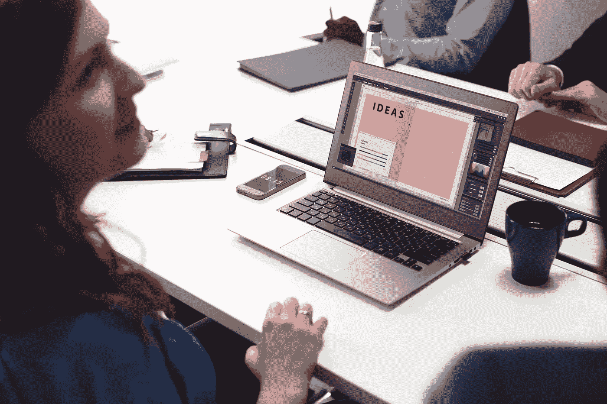

# 为什么客户是设计过程不可或缺的一部分

> 原文：<https://medium.com/swlh/why-clients-are-integral-to-the-design-process-176f92e409af>

探索作为客户和设计师一起工作的重要性，创造更好的设计的最终利益。

我们过去都有过那种不干涉客户的做法，我们都知道这会让你觉得如果他们更多地参与，这个项目可能会失败。

在我看来，客户的参与对设计的成功绝对至关重要。

客户了解自己的业务。他们拥有宝贵的行业知识和经验。

设计师知道如何设计。他们拥有宝贵的行业技能和经验。

当你将两者结合起来，无论你是在开发一个应用程序，设计一个网站，还是创建一个独立的内容，你都会看到好的东西。

对于一个成功的项目来说，协作和相互欣赏对方的领域是必要的。

# 我们需要谈论商业目标

我所有的项目都是从最初的简报开始的。从一开始，我就倾向于让我的客户明白，他们可以让我去担心更好的细节。我不会去找我的医生，告诉他我认为我得了什么病。我会带着问题去找他，让他找到解决办法。

正是因为这个原因，我建议客户在接触设计工具之前，先关注业务目标。

# 一起寻找解决方案

不仅仅是找出下一步该做什么。对我来说，同样重要的是找出我们之前做了什么，让我们需要新的设计。阻碍业务发展的潜在问题是什么？我们想要实现什么，是什么阻碍了我们实现目标？

一旦我们能够回答这些问题，我们就可以开始工作了。

这可能是一个网站或应用程序变得不适合现代用户消费的情况。如果是，我们需要探索问题以及解决方案。我们需要了解它对业务有什么样的影响，因为很可能有一些部分没有损坏，不需要修复。

设计是一门非常主观的学科。我们都有自己的偏好，但是作为协作过程的一部分，我们应该问的是潜在的解决方案是否满足业务需求。

我喜欢坐下来听客户谈一会儿，这样我们才能真正探索它，所以这是整个过程的必要部分。只有经过这种探索，我们才能找到真正的解决方案，帮助企业实现其目标。

# 获得反馈的重要性

反馈是设计过程中不可或缺的一个环节。

如果我的客户不确定我的设计提案的任何特定方面，我总是乐于讨论这个问题，并利用例如 InVision 上的评论功能来促进它。

让其他人参与反馈会议也很重要——那些没有参与过项目的人的观点可以被证明是非常宝贵的。

如果可能的话，外部用户测试是非常有益的，但是对于较小的设计项目并不总是必要的。

# **这完全是信任的问题**

最终，一个项目的成功往往可以归结为一件事:信任。客户愿意把多少信任交给设计师，他们愿意合作吗？

雇佣专业设计师总是有原因的，通常是因为这项任务不能在内部完成，所以给予设计师信任和相关行业的知识和专业技能是任何项目，无论大小，都必须的。

采用这种方法总是能在设计师和客户之间建立更紧密的联系，这意味着输出会比其他方式更强大、更简短。

合作，合作，合作。

## 这个故事发表在[的创业](https://medium.com/swlh)上，这是 Medium 最大的创业刊物，有 310，538+人关注。

## 订阅接收[我们的头条新闻](http://growthsupply.com/the-startup-newsletter/)。

