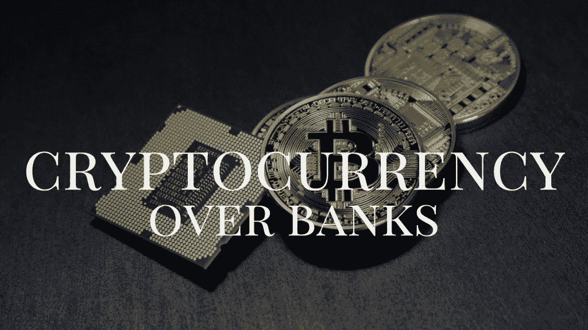

# 为什么加密货币比银行好

> 原文：<https://medium.com/swlh/why-cryptocurrency-is-better-than-banks-799f39bc4d5>

[Bountie.io](http://bountie.io)

世界正在改变。P2P 技术曾经是一种以非法下载电影而闻名的技术，现在是一种强大的工具，将权力和透明度放在用户手中。加密货币最大的杀手锏是去中心化，即在不同的互联节点上创建一个账本(你的个人信息和资料)的副本，以确保所述账本是不可变的。

## 因此，现在已经到了这样一个地步，把钱存在银行的老派方法可能需要升级了。为什么？因为保管你的加密货币的分散系统比保管法定货币有很多优势。

# 1.你可以全天候访问

在美国的一个假日期间，当地银行倒闭，无法向可能急需金融结算服务来处理支付的个人和企业提供金融服务。

> 比特币等加密货币能够在一天内处理超过 10 亿美元的交易。加密货币不休息或者需要休息一天；加密货币用户甚至可以通过他们的电子钱包在假期和周末自由交易。

非托管加密货币钱包使用户能够完全控制自己的资金，只允许用户访问自己的私钥，而不允许用户访问其他集中式实体或平台。正因为如此，一旦私钥丢失，某些加密货币钱包无法退还交易或恢复用户账户。

记住这一点，这样你就有了财务意识和责任感。

**阅读更多:** [**Bountie Tech 与我们的 CTO Darren Lee 交谈。**](https://bountie.io/blog/bountie-talk-episode-21-tech-talk-darren-lee/)

# 2.没有消费限制

银行通过部分准备金银行运作。这意味着不是每个人都能同时存取他们的钱。银行需要用每日消费限额来限制购买和取款。

使用加密货币，你没有任何消费限制，这意味着你可以根据需要花多少钱。但是一定要负责任地消费；你没有一个极限并不意味着你应该为了测试它而测试它。

# 3.你的账户没有被征收

如果想申请银行和信用卡账户，可以；但是你的申请受到银行和信用卡公司的支配。有些人甚至被拒绝开户。

开立银行账户或申请信用卡需要填写长长的表格，签署对你不利的合同。比特币可以免费使用，任何人都可以不受限制地使用。

# 4.你被收取比平常更低的费用

加密货币是廉价发送国际交易的最佳方式。以下是其他支付方式的统计数据，无论是在线还是离线支付:

*   **国际银行电汇:**收费率在 22-50 美元之间(1-3 天)
*   **贝宝:**贝宝的利率是 2.9%，外加 0.30 美元，2.5%的外汇手续费(需要 3-5 天才能存入账户)
*   **汇款:**9-13%不等(通常需要 5 分钟)。
*   **信用卡:**从哪里开始？你要为商家收取 3-5%的费用。对于消费者来说，年费从 0 美元到 200 美元不等，有 2.5%的外币兑换。如果你按时支付账单的话。逾期付款会有很多额外的费用和利息。
*   **其他电子钱包:**有许多不同的电子钱包，但交易的外汇手续费从 2%到 4%不等，发送和接收支付的%或固定费用，以及银行存款/取款的 1%到 5%。

# 5.加密货币不是欠条

大多数银行账户中的钱是代表某人付款承诺的信用。我们不会说今天的银行系统类似于庞氏骗局，但我们会说，为旧债务支付利息以创造新债务的全球体系可能会导致永无止境的循环，而这种循环理应在短期内解决问题。

你的加密货币被锁定在公共账本上。每枚硬币代表一个实际的价值单位，而不仅仅是在未来某个日期支付价值的承诺。如果大多数人对加密货币的想法持开放态度，就有可能实现真正的债务结算。

***了解一下***[***Bountie 如何帮助玩家***](http://bountie.io/) ***用这种新发现的方式让人们为他们的热情付费。***

*最初发表于*[*bountie . io*](https://bountie.io/blog/cryptocurrency-better-banks/)

## 这篇文章发表在 [The Startup](https://medium.com/swlh) 上，这是 Medium 最大的创业刊物，有 317，238+人关注。

## 在这里订阅接收[我们的头条新闻](http://growthsupply.com/the-startup-newsletter/)。

