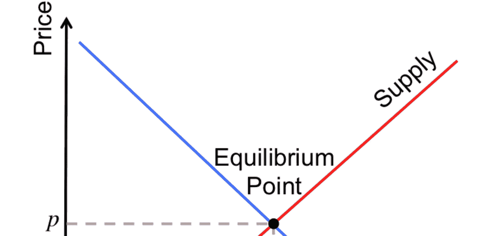
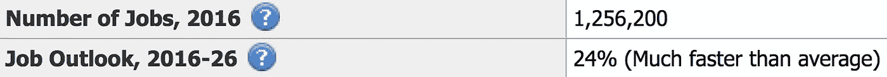

# 为什么对软件工程师的需求会居高不下

> 原文：<https://medium.com/swlh/why-demand-for-software-engineers-is-going-to-stay-high-5acb789c5015>

似乎每个人都需要软件工程师。需求远远高于供给。这意味着高薪工作和大量的选择。想要一份全职工作？有股权的创业工作？每年休假 3 个月的远程合同工？没问题！

当我刚刚开始学习编程的时候，我想知道是否会永远需要成千上万的程序员。

我在这个行业干了 15 年，看起来需求似乎没有了。来自美国劳工部的一些数据:

仅在英国，现在就有 [10k 科技创业公司](https://www.forbes.com/sites/davidprosser/2018/04/06/uk-technology-start-ups-hit-all-time-high/#5654d1415d85)。

以下是我对原因的观察:

# 1.整个世界都运行在软件上

这可能是显而易见的，因为这是一个已经持续了几代人的转变。但是，不能轻描淡写。世界上每一个企业和组织都需要一个应用程序或一个网站，外加大量软件，如果公司规模很大，这些软件通常是定制的。每个能上网的人(最终将是全世界)每天都会使用大量的应用程序和网站。

# 2.大多数东西都是经过多次建造的

为什么有谷歌就有必应？为什么会有一千个竞争的电商平台？为什么有一百万个消息应用程序，每个都是由不同的团队从头开始构建的？这看起来像是重复劳动，但很正常。这就是竞争的方式，并不是软件行业独有的。比如有很多车企，每家都有几万名员工，设计制造非常相似的汽车。

部分原因是软件仍然是本地的。几乎所有你能想到的 X 都有“亚洲的 X”。

# 3.代码具有有限的生存期

看起来，一个应用程序一旦建立起来，它就“完成”了。当我在脸书工作时，人们问我“还有什么事要做吗？”然而，大多数代码都在不断地被修改，大多数公司都在不断地招人。每一行代码的生命周期只有几年。有时候，当一个产品变旧了，就更容易扔掉它，用现代技术重新组装。我见过这种情况发生在定制的内部系统和面向公众的网站上。这也类似于汽车公司不断创新和设计新车。

从以上 3 点，您已经可以看到一个清晰的模式:

*   每个人都需要越来越多软件
*   有越来越多的软件解决方案来做任何事情
*   每种解决方案都需要软件工程师不断努力

但是如果编程随着时间的推移变得更容易了呢？那我们肯定需要更少的程序员了吧？请继续阅读…

# 4.代码共享没有发生

在 90 年代，有一个代码共享的梦想，我们设计的软件组件中有商业逻辑，任何人都可以像乐高积木一样重用它们。这没有成功，甚至没有在用 Java 编写的项目中重用业务逻辑。在整个技术堆栈中，情况甚至更糟。有 COM，但只限于 Windows。是的，你可以从 Python 中调用 Rust，但它并没有成为构建软件的标准方式。有许多编程语言，新的编程语言也在不断涌现。在我的上一家公司，我们从 Ruby 到 Rust 重写了现有的代码库。

由于包管理器、GitHub 和开源库的激增，代码重用在过去几年中确实有所提高。像 npm 这样的系统是一个巨大的进步。然而，我们离真正的代码共享的梦想还很远。开源库帮助很大，但不足以显著减缓对工程师的需求。

# 5.工具在改进，但项目变得越来越复杂

在一个有很多库的现代 IDE 中使用一种带有垃圾收集器的语言并“无服务器化”比在 1995 年编写 C++更有效率。你现在能为同样的项目雇佣比 1995 年少五倍的工程师吗？大概吧。但是，更有可能的情况是，你雇佣了同样数量的工程师，项目会更加雄心勃勃，因为客户开始期待更多。

# 6.新平台出现了

十年前，雇佣网络开发人员就足够了。现在你需要雇佣 web、Android 和 iOS 开发者。根据您的产品，您也可以构建信使机器人和微信应用程序。

这里最大的进步可能是网络。突然间，你不必构建 Mac、Linux 和 Windows 桌面应用程序，而只需用 JavaScript 构建你的产品，然后它就可以在任何地方工作(除了浏览器不兼容，这一点随着时间的推移会变得更好)。web 标准的出现是一个小小的奇迹——还记得浏览器大战吗？然而，由于手机的发展，网络现在已经不像 10 年前那么重要了。今天，像 Unity、React Native 或 Flutter 这样的框架正试图在多个平台上进行抽象，以使软件开发更容易、更便宜。

# 7.号外(为了好玩):AI 要取代软件工程师？

想象一下，有人设计出可以取代大部分工程师的软件。例如，不是十个工程师组成的团队，而是一个人类“技术领导”，他给出非常高级的命令，程序将它们翻译成无错误的代码。

没人知道这什么时候会发生。如果发生这种情况，对工程师的需求将大幅下降。但是有了这样的技术，其他职业对人类的需求也可能下降，所以相对于其他职业来说，编程*可能*仍然有需求。

## 这篇文章发表在[《创业](https://medium.com/swlh)》上，这是 Medium 最大的创业刊物，有+ 377，643 人关注。

## 在这里订阅接收[我们的头条新闻](http://growthsupply.com/the-startup-newsletter/)。

