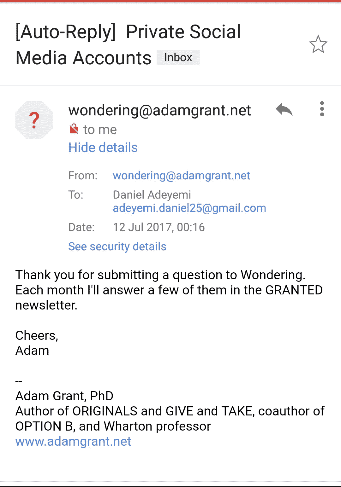

# 为什么人们要保持社交媒体账户的私密性？

> 原文：<https://medium.com/swlh/why-do-people-keep-their-social-media-accounts-private-d009a8222ea0>

## 一个我已经思考了一段时间的问题

Photo by [NordWood Themes](https://unsplash.com/photos/yyMJNPgQ-X8?utm_source=unsplash&utm_medium=referral&utm_content=creditCopyText) on [Unsplash](https://unsplash.com/search/photos/private%20social%20media%20account?utm_source=unsplash&utm_medium=referral&utm_content=creditCopyText)

这是我不关心我的生意，但几年来，我忍不住试图理解为什么人们保留他们的社交媒体账户隐私，就像我开始询问我周围的人，我注意到谁有他们的私人账户一样。大多数时候，我真的得不到一个合理的答复，“因为我想”，“我不知道”，等等等等，大量的掩蔽。有些人很乐意给我具体的理由，我很感激你们。

hehehe, I even went this far to get an expert opinion but it wasn’t among the few that was answered

经过大量的询问和在线阅读，我总结出了 4 个原因。

> 当然，有些人享受他们的隐私，我完全同意这一点，但同时，如果你加入了一个“社交”网络，难道不就是为了“社交”和分享吗？不仅仅是和朋友，还有和你有相似兴趣的陌生人和同龄人。

# 其他原因

*这是第一个原因，因为我想谨慎行事，并被视为一个不做评判的人。*

假设你只发布成人内容，明智的做法是筛选那些可以看到你的帖子的人。

假设你已经或正在经历网络欺凌，审查那些可能打扰你的人是没问题的。

> [我不知道为什么有些人会将他们的账户设为私人账户，但其中一些原因可能是他们不想让某些人看到他们的照片，远离变态和跟踪者，可以自由选择谁进入他们的朋友/信任圈，不想与世界分享他们的生活，而只是他们选择的少数人。Asem Yasser](https://www.quora.com/Why-do-some-people-make-their-Instagram-profile-private) ，对 Quora 上类似问题的回应。

假设你刚刚适应社交媒体，想观察正在发生的事情，不想被人看到，暂时没问题。

> 不是每个在社交媒体上的人都想完全沉浸其中。他们可能只是想让它跟上正在发生的事情，而不是真的想让世界上的每个人都知道他们在做什么。玛丽亚·塔克(Mariah Tucker)对 Quora 上类似问题的回应。

假设你说这是你的生活和你的选择，你可能真的想追踪是什么在驱动你。

# 骄傲

对自己的尊严、重要性、优点或优越性的高度评价，无论是在头脑中还是在举止或行为中表现出来的。

决定谁追随谁不追随你的能力很酷，这就像人们申请进入查看你的牛逼。这更像是一次工作面试，你开始了解被面试者，而面试官只透露他想让面试官知道的东西。

# 群体本能

Nice!

我曾经问过我遇到的一个年轻人，在检查他的 Instagram 时，我发现他的账户是私人的，所以我问他为什么，我甚至暗示说，也许他不想让他的父母或亲戚找到他，但他拒绝了这个理由，并将其归因于**的群体本能**，他的同龄人有他们的私人账户，看到这是新的酷决定做同样的事情。

> 从众心理:人们不考虑原因就像其他人一样行事的情况。

# 不安全

*缺乏信心或把握*

我们在生活的不同领域都会面临不安全感，这是人之常情。与全世界分享你的生活需要信心——如果每个可以访问互联网的人都能看到你的帐户，那么这就是全世界。

认为你分享的东西可以帮助别人或照亮别人的白天/夜晚需要信心。

因为某人或某些人可能不会立即或永远同意你的观点，并且可能会说一些负面的话，所以不被打扰或被打扰保持你的帐户隐私需要信心。

理解更多地分享你的生活是可以的，理解这样做我们允许他人这样做，我们拥有一个更真诚和真实的世界，这需要信心。

我想用赛斯·戈丁和我自己的话来结束我的演讲:-)

> 你认为我们不需要你的艺术还是太害怕生产它。塞思·戈丁
> 
> 你认为我们不需要看到你的了不起，还是你太害怕给我们看。丹尼尔·阿德耶米

感谢[科思](http://kendyson.com/)阅读本帖初稿并提出有益建议。

## ***感谢阅读，希望你从我的帖子中学到一些东西。你可以在任何平台上@danieltadeyemi 并访问我的*** [***网站***](http://danieladeyemi.com.ng/) ***在那里你可以注册我的*** [***时事通讯***](http://danieladeyemi.com.ng/newsletter/) ***以获得关于我的进展或我正在学习的内容的每月更新。***

## 这个故事发表在 [The Startup](https://medium.com/swlh) 上，这是 Medium 最大的创业刊物，有 286，184+人关注。

## 订阅接收[我们的头条](http://growthsupply.com/the-startup-newsletter/)。

