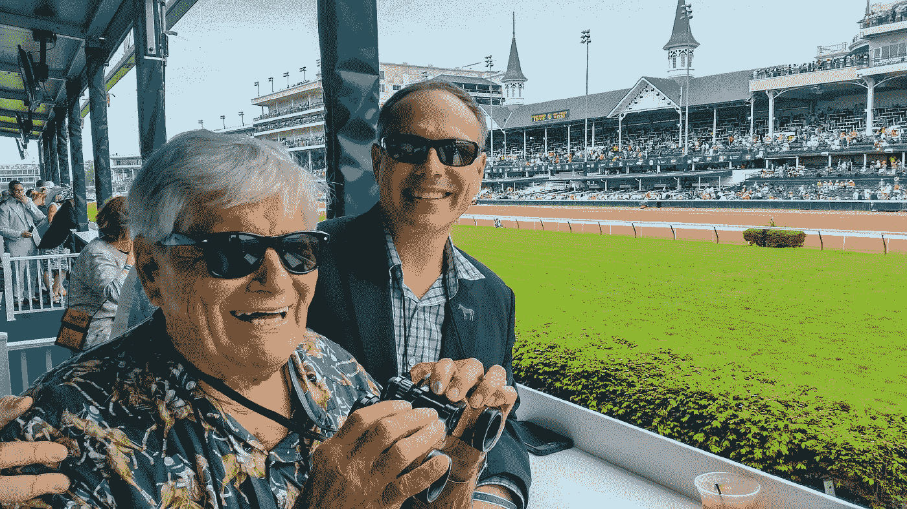
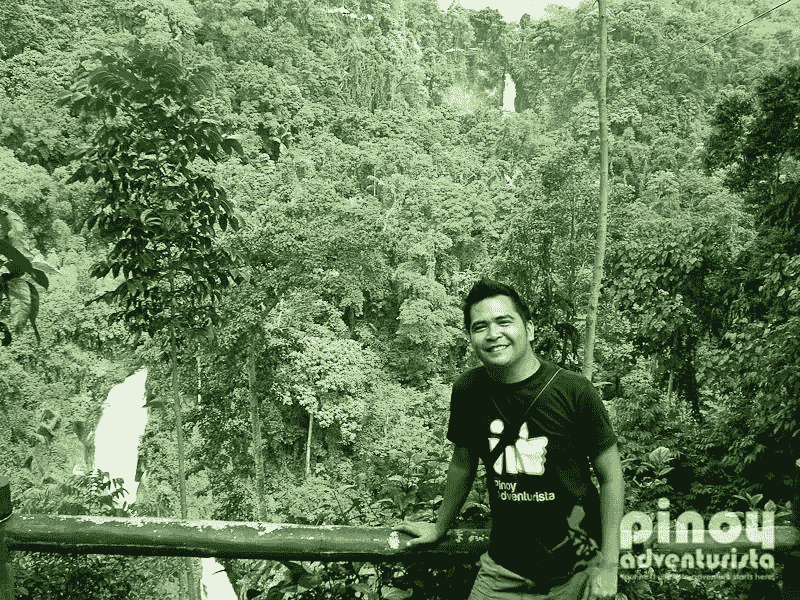

# 人为什么要旅行？以下是 14 位顶级旅游博主告诉我们的

> 原文：<https://medium.com/swlh/why-do-people-travel-heres-what-14-top-travel-bloggers-told-us-65095a50fd34>

问任何人他们的梦想是什么，结果几乎肯定会包括:**环游世界**。

很长一段时间，这在我自己的愿望清单上也排在很高的位置，但我并不是我认为的那种独一无二的蝴蝶。旅行癖似乎是男人和女人的一种普遍欲望，几乎就像[是我们共有的一种基因](http://elitedaily.com/life/culture/wanderlust-gene-people-born-travel/953464/)。

(或者说[有精神病](https://foxnomad.com/2014/07/22/ask-psychiatrist-constant-desire-to-travel-sign-mental-illness/)。但是我跑题了)

但是说真的，为什么人们喜欢旅行呢？这仅仅是在社交媒体上看了太多关于旅行的引言的影响吗？

为了回答这个问题，我们决定问问那些把环游世界作为自己的工作和人生使命的人。我们采访了几个国家的顶级旅游博主，问了他们一个简单的问题:*你最喜欢旅行的什么？*

好像我们还需要更多的理由去旅行。免责声明:我们不会对任何突然出现的旅游癖负责(或者我们会吗？).

以下是他们与我们分享的内容。

# 约翰尼喷气机来自[约翰尼喷气机](http://www.johnnyjet.com/)

**最后一次出现:** [在佛蒙特州 Mad River Valley 滑雪](http://www.johnnyjet.com/best-of-the-mad-river-valley-vermont/)。

**他为什么喜欢旅行:**

> 旅行中我最喜欢的事情是游览新的地方，结识当地人，品尝他们的食物，并与我的朋友/家人/追随者分享我的经历。

# 来自[的塞布丽娜·约维诺只是一张单程票](http://www.justonewayticket.com/)

**最后一次露面:** [驾驶全地形车穿越纳米比亚](http://www.justonewayticket.com/2016/11/07/travel-guide-to-namibia-the-most-surreal-country-you-will-ever-visit/)，南非。

**她为什么喜欢旅游:**

> 对我来说，这绝对是尝试新的美食和体验新的文化。通过观察地球另一边的世界，我们可以学到很多东西。

# 亚亚和劳埃德只从[手提行李](http://handluggageonly.co.uk/)

**最后一次见到:** [在马尔代夫晒黑](http://handluggageonly.co.uk/2016/11/08/hello-from-the-maldives/)。

**他们为什么喜欢旅行:**

> 我们最喜欢旅行的一点是你体验的多样性，没有什么是一成不变的。旅行确实打开了你的思维，开阔了你的视野……它有一种感染力，能丰富你的生活，真正体会到我们的世界是多么特别。
> 
> *此外，旅行是关于你对一个地方或时间的体验和情感联系。对我们来说，旅行创造了永久的记忆和宝贵的美好经历。*

# 来自[遗愿清单之旅](http://bucketlistjourney.net/)的安妮特·怀特

**最后一次见到:** [在印度尼西亚拉贾安帕(Raja Ampat)水域潜水](http://bucketlistjourney.net/2016/10/raja-ampat-bucket-list-things-to-do/)。

**她为什么喜欢旅行:**

> 我旅行纯粹是因为对这个世界的迷恋和想要更好地了解它。但是，我旅行主要是为了学习，不仅是为了了解我去过的地方和遇到的人，也是为了了解我自己。

# 来自[我们伟大星球](http://www.ourawesomeplanet.com/)的安东·迪亚兹

**最后一次出现:** [探索菲律宾萨加达的埋葬传统](http://www.ourawesomeplanet.com/awesome/2016/11/hanging-coffins-sagada.html)。

**他为什么喜欢旅行:**

> 当我旅行时，我喜欢通过食物发现其他文化，并与当地人待在一起，但我最喜欢旅行的是沿途发生的不幸，以及它如何让你的旅伴展现出最好的(或最坏的)一面。

# 莎伦·古尔利来自[莎伦在哪里](http://www.wheressharon.com/)

**最后一次见:** [游览澳大利亚 Ballina 的海滩和市场](http://www.wheressharon.com/australian-travels/top-10-things-ballina/)。

**她为什么喜欢旅行:**

> 我是一个体验迷——我想体验一切！旅行帮助我实现了这一点，这也是我最喜欢旅行的地方。

# 来自[Pinoy adventuresta](http://www.pinoyadventurista.com/)的 Mervin Marasigan

**最后一次见到:** [在菲律宾塔盖泰市闲逛](http://www.pinoyadventurista.com/2016/11/top-10-things-to-do-and-see-in-tagaytay-city.html)。

**他为什么爱旅游:**

> 我喜欢旅行的原因是认识新的人和学习新的文化。这是我们在学校或书本上学不到的东西。

# 来自[迁徙学](https://migrationology.com/)的马克·威恩斯

**最后一次露面:** [在巴塞罗纳拉博克里亚的市场和餐馆里吃东西。](https://migrationology.com/la-boqueria-market-barcelona/)

**他为什么喜欢旅行:**

> 当我旅行时，我最喜欢在典型的氛围中吃当地食物，最好是在街头小吃摊或家庭经营的餐馆。品尝菜肴和不同的食材组合，并通过食物与当地文化联系起来，这是一种刺激。

# 来自[普通旅行者](http://ordinarytraveler.com/)的克里斯蒂·伍德罗

**最后一次看到:** [在加拿大阿尔伯塔省观赏大自然](http://ordinarytraveler.com/articles/alberta-canada-photos-banff-jasper)。

**她为什么喜欢旅行:**

> 我最喜欢旅行的一点是它让我们对其他文化大开眼界。世界各地的人们可能有不同的生活经历，说另一种语言，或信奉不同的宗教，但我们相似的方式远远大于我们不同的方式。

# 来自[大黄蜂妈妈](http://bumblebeemum.net/)的林莹

**最后一次看到:** [在新加坡查看适合儿童的桌游商店](http://bumblebeemum.net/2016/11/11/mind-games-westgate/)。

她为什么喜欢旅行:

> 旅行中我最喜欢的是体验一些在新加坡找不到的东西，比如触摸雪景、观赏秋叶、品尝地道的当地美食等等。

# 尼克·沃顿来自[山羊在路上](http://www.goatsontheroad.com/)

**最后一次见到:** [准备离开格林纳达，他们在那里度过了 1.5 年](http://www.goatsontheroad.com/time-next-adventure-leaving-grenada-upcoming-travel-plans/)。

**他们为什么喜欢旅行:**

> 我们最喜欢旅行的事情是了解新的文化和与当地人交流。我们喜欢了解他们的生活，并与我们所到国家的人民建立友谊。这就是旅行对我们的意义。

# 来自[的艾琳·本德和本德一起旅行](http://travelwithbender.com/)

**最后出现:** [在墨西哥马里瓦尔的豪华度假村享受设施](http://travelwithbender.com/travel-blog/mexico/marival-residences-luxury-resort/)。

**她为什么喜欢旅行:**

> 看到世界都是一样的能力。每个人都会笑，每个人都会哭，语言是通用的，所有的文化都是美好的。而如果能和一个孩子一起看，就变得更加神奇了！

# 来自[的丹·米勒带着一个摄制组](http://www.pointswithacrew.com/)

**最后一次看到:** [试图订一张去秘鲁的平躺机票(是的，有这种事情存在)](http://www.pointswithacrew.com/trying-to-get-a-lie-flat-flight-to-peru/)。

**他为什么喜欢旅行:**

> 我最喜欢旅行的部分是游览新的地方，向我的家人和 6 个孩子介绍不同的生活方式和不同的做事方式。

# 来自[书呆子游牧民](http://nerdnomads.com/)的玛利亚·伍尔夫·豪格兰

**最后一次出现:** [在东京待 2 周而不是 5 天，因为为什么不？](http://nerdnomads.com/what-to-do-in-tokyo)

**他们为什么喜欢旅行:**

> 我们喜欢旅行的每一天都是不同的。当我们在一个新的地方醒来时，我们永远不知道当我们踏出家门时，新的一天会带来什么。这很令人兴奋。

**奖励:又多了 2 个热爱旅行的顶级博主！**

# 来自[的 Clelia Mattana 保持冷静，继续旅行](http://www.keepcalmandtravel.com/)

**最后一次看到:** [在菲律宾享受阳光、沙滩、大海。](http://www.keepcalmandtravel.com/memory-lane-traveling-around-philippines/)

**她为什么喜欢旅游:**

> 我最喜欢旅行的是不断的挑战。每个人都正确地理解结识新朋友和发现新的文化可以开阔你的思维，我非常同意。
> 
> *特别是对我来说，鉴于我从 17 岁起就一直受到恐慌症的困扰，旅行也是一种鞭策自己、直面自己最大恐惧的方式，结果是个人成长。当然，你也可以在家里做，但是当你在一个完全不同的环境中时，会更有挑战性(也更有收获)!*

# 雅各布·傅来自[当地的冒险家](http://localadventurer.com/)

**最后出现:** [探索世界上最小的公园。](http://localadventurer.com/smallest-park-in-the-world-mill-ends-park/)

**为什么他们喜欢旅行:**

> 我们喜欢你永远不会对这个世界感到厌倦，因为总有新的东西可以体验。它可能是拍摄一个新的风景，或者尝试新的食物或活动，或者学习另一种文化的新东西。

# 你也喜欢旅行吗？在 Twitter 上告诉我们为什么(或为什么不)[@ bonapptour](https://twitter.com/BonAppetour)！

*原载于 2016 年 11 月 14 日*[*www.bonappetour.com*](https://www.bonappetour.com/blog/why-people-travel-top-bloggers/)*。*