# 你为什么买东西？原因如下

> 原文：<https://medium.com/swlh/why-do-you-buy-something-heres-the-reason-96bcc7b808fa>

营销和关系靠的是信任！

> “信任是生活的粘合剂。这是有效沟通中最重要的因素。这是维系所有关系的基本原则。”斯蒂芬·科维

我们人类是群居动物。我们的决定、生活方式和大部分日常环境都受到其他人的影响。

让我问你一个问题，当你决定去一家餐馆或一部电影的时候，你做什么？

我打赌你最有可能先查看评论或者和你的朋友讨论。我们需要证据或其他人的建议来做决定。

> “在现实生活中或通过 Twitter 和脸书更新讨论的朋友和同事的支持，比在 Yelp 或亚马逊等网站上发布的正面用户评论更有可能推动销售(但这些也很重要)。"- *杰森·米特斯塔德，现在 CMO*

下面是来自[维基百科](https://en.wikipedia.org/wiki/Social_proof)的社会证明的解释，

> *“社会证明是一种心理现象，人们假设他人的行为，试图反映给定情境下的正确行为。这种效应在人们无法确定适当行为模式的模糊社会情境中尤为突出，其驱动因素是人们认为周围的人对情境有更多的了解。*

我们人类随大流，举个例子:

让我们假设，你正在参观一个动物园，有两个大门。数百人在 1 号门后排队。但是 2 号门是空的(没有人)。

我们的大脑下意识地认为，“1 号门一定是正确的门，因为更多的人在沿着这个门走。我应该用那个门。”

> “人类行为的一个关键因素是，比起享受成功，人类更害怕失败。所有的学术研究都会告诉你，对资本损失的恐惧远远大于对收益的享受。” *—劳伦斯·d·芬克*

在他们的歌曲《黑金》中，灵魂收容所唱道:“没有什么比人群更能吸引人群。”

我给你带来了一些实验，让你更多地了解人类心理学。

看一看:

# 来自[群众智慧](http://wisdomofcrowds.blogspot.in/2009/12/social-proof-and-street-corner.html)的街头实验

1968 年，社会心理学家斯坦利·米尔格拉姆、伦纳德·比克曼和劳伦斯·伯克维兹决定制造一点麻烦。首先，他们让一个人站在街角，让他仰望空旷的天空 60 秒钟。一小部分路过的行人停下来看这个人在看什么，但大多数人只是走了过去。

下一次，心理学家把五个仰望天空的人放在角落里。这一次，四倍多的人停下来凝视空旷的天空。

当心理学家让 15 个人站在拐角处时，45%的过路人停下来，而观察人群的增加又一次让 80%以上的行人歪着头向上看。

乍一看，这项研究似乎是人们愿意从众的又一证明。但事实上，它说明了一些不同的东西，即“社会证明”的想法，这是一种倾向，即假设如果许多人在做某事或相信某事，一定有一个好的理由。

# [电梯实验](http://www.elevatorworld.com/blogs/the-elevator-experiment/)

你有没有想过人们会为了合群而改变？1962 年，社会心理学家所罗门·阿施(Solomon Asch)与电视节目《偷拍相机》(Candid Camera)合作，展示了一种基本的社会规范(人们在电梯里的站立姿势)可以多么迅速地被群体从众所逆转。通过社会压力的力量，你可以被骗去追随所有的行为和信仰，这是非常令人惊讶的。

点击此处观看这项实验的惊人再现:

# 为什么你的企业需要社会证明？

*   社会证明建立信任。或者我们可以说，购买者希望从他们的同行那里得到证明，而不是销售产品的品牌。
*   社会证明建立可信度。没有任何证据是很难买东西的。
*   使用社交证明作为营销策略来增加你的转化率。

你是营销人员、博客作者还是企业？

你必须使用社交证明来安慰你的潜在客户或未来的顾客。

还心存疑虑？

让我们来看看一些事实:

63%的顾客更有可能从有用户评论的网站上购物。(来源— [经济咨询](https://econsultancy.com/blog/9366-ecommerce-consumer-reviews-why-you-need-them-and-how-to-use-them/))

消费者的评论要比制造商的描述可信得多(近 12 倍)。(来源— [经济咨询](https://econsultancy.com/blog/9366-ecommerce-consumer-reviews-why-you-need-them-and-how-to-use-them/))

客户证明和案例研究被认为是最有效的内容营销策略，分别有 89%和 88%的 B2B 营销人员认同。(来源— [帕多](http://www.pardot.com/content-marketing/13-must-know-content-marketing-stats/))

88%的消费者表示，他们像信任个人推荐一样信任在线评论。(来源— [搜索引擎登陆](http://searchengineland.com/88-consumers-trust-online-reviews-much-personal-recommendations-195803))

你如何利用社会证明的力量？

这里有 11 种最佳的社交证明，可以让你与潜在客户建立信任。

# 1.用户评价

说出来就是营销。当你的顾客说出来的时候，就是社交证明。有了推荐，社交销售更容易成功。

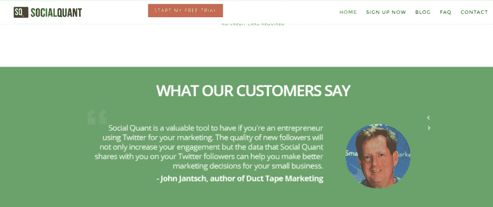

# 2.个案研究

人们很容易进入一个故事。不要错过记录成功案例以吸引潜在客户的机会。

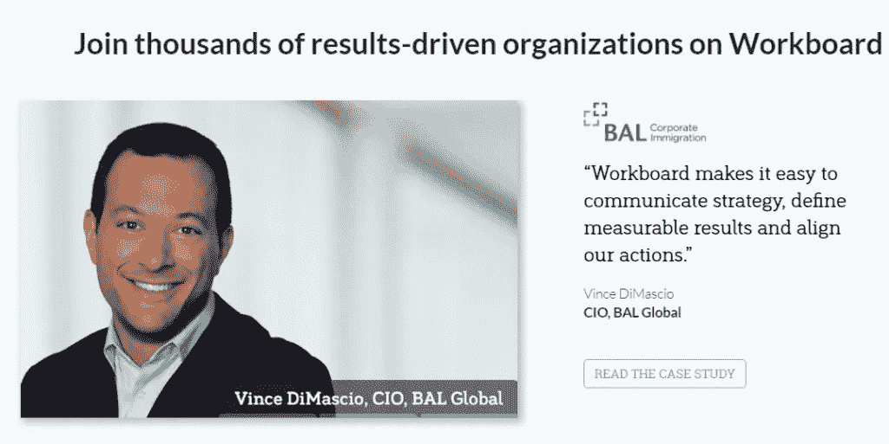

# 3.客户评论和评级

评论和评级是证明的近亲。我们在任何电子商务平台上购买商品时，都会浏览顾客评论或产品评级。

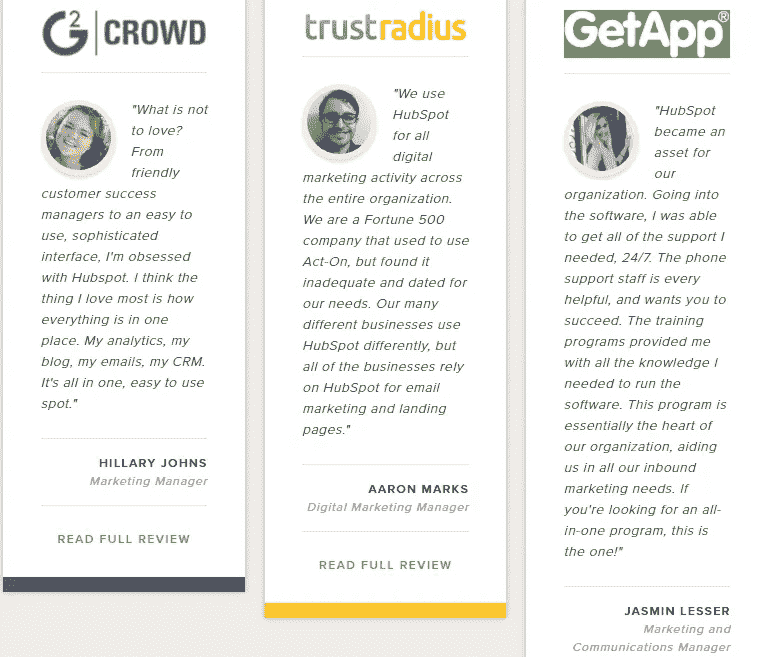

# 4.客户

展示你的客户或公司的标识是强有力的社会证明，可以说服你的潜在客户尝试你的服务或产品。

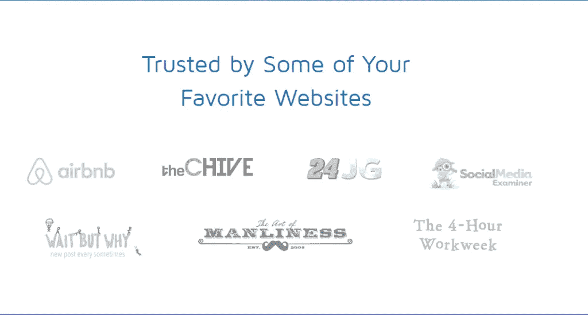

# 5.媒体提及

媒体提及是提高你可信度的一个强有力的方法。当你、你的产品或网站出现在另一个知名平台上时，以此作为社交证明。

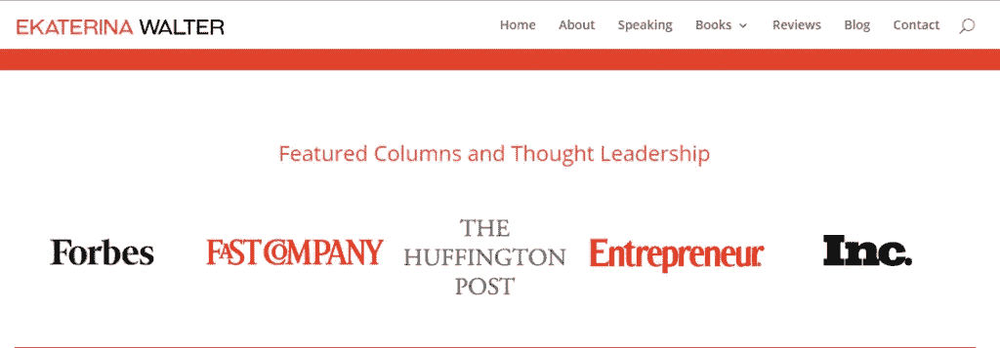

# 6.证书和徽章

证书和徽章是提高可信度或与新客户建立信任的有力证明。

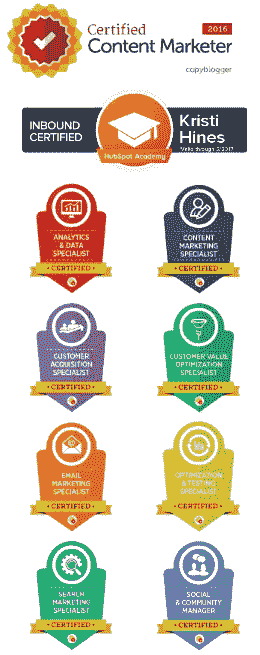

# 7.社交媒体好评

显示你的用户的推文、脸书评论或帖子、评论。让你的潜在客户知道人们在社交媒体上对你的评价。

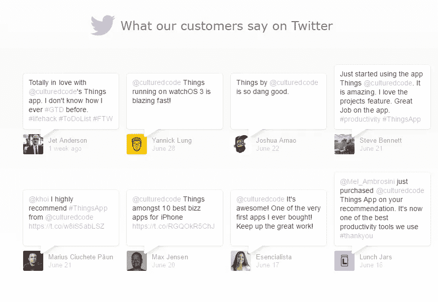

# 8.玩数字游戏

一个数字有千言万语的力量。这是一个很好的机会，你可以告诉他们有多少人喜欢你或你的产品。

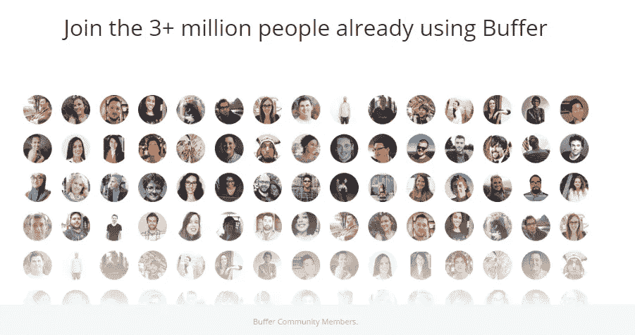

# 9.专家或名人代言

一个行业影响者或名人的话有很大的力量。如果你或你的企业曾经得到过某个影响者的称赞或赞美，把它展示给你的观众(在你的主页上)。

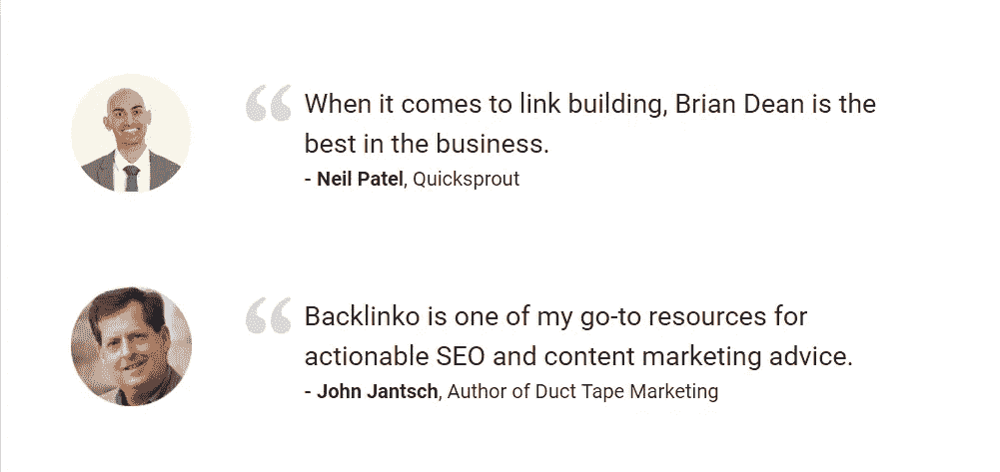

# 10.订户或社会关注者的数量

正如我们上面已经讨论过的，人们乐于加入人群。如果你有一个很棒的社交媒体或者一大堆订阅者——告诉人们。这是吸引新追随者或订户的万无一失的方法。

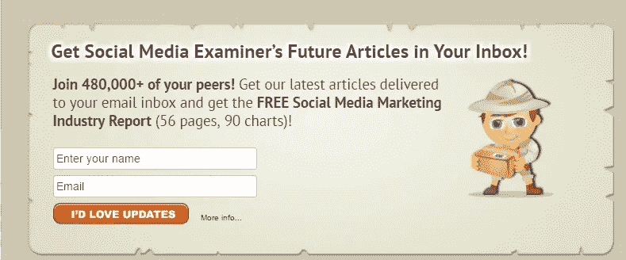

# 11.与其他平台的集成

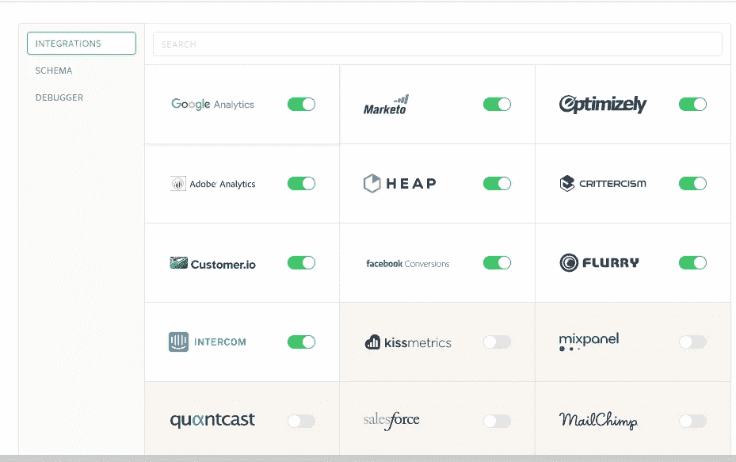

# 行动起来！

**感谢**聆听这个故事。如果你喜欢这个故事，点击👏按钮，并与他人分享！

## 你想从成功作家那里得到可操作的写作建议吗？[获得你的免费拷贝](https://mailchi.mp/d0442b655c31/get-your-ebook)。

*文章最初发表于* [*MarketHub*](https://www.markethub.io/use-social-proof-build-trust-prospects-examples/)

## 这篇文章发表在 [The Startup](https://medium.com/swlh) 上，这是 Medium 最大的创业刊物，拥有 307，871+读者。

## 在此订阅接收[我们的头条新闻](http://growthsupply.com/the-startup-newsletter/)。

