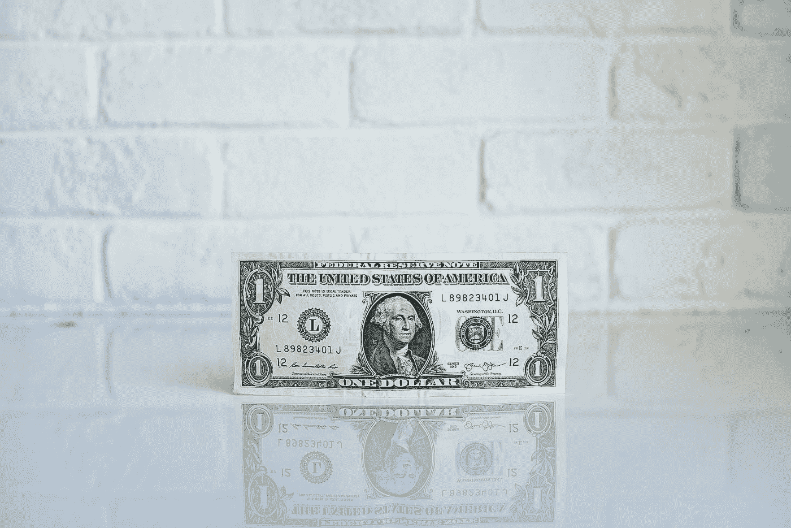
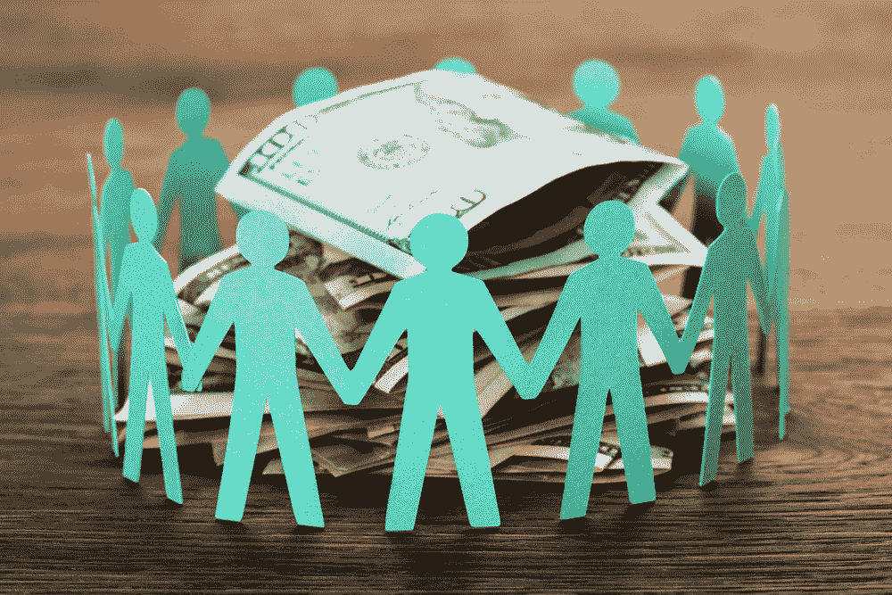

# 为什么企业家会向大众寻求资金

> 原文：<https://medium.com/swlh/why-entrepreneurs-will-turn-to-the-crowd-for-funding-e0b8ef3b5c12>

The dollar commands tremendous power in business. Without it, you cannot operate, grow, or profit.

我认为，每个企业家都应该有机会获得资本，每个企业家都应该能够根据自己的条件筹集资本，而不管地理位置、性别、种族、行业、获得风投、银行和合格投资者的渠道，以及影响公司是否能够筹集资金的任何其他无数因素。

影响企业家成功融资能力的唯一因素，应该是他们的商业想法是否是一个好主意，以及他们是否有技术和商业头脑、耐力和毅力来实现它。

传统上，这不是融资的方式。创业者去风投或者银行。这些方面提出要求，寻找某些基准或增长因素，并且不可避免地受到自身偏见的限制。众所周知，风投界缺乏多样性，这些小型网络主要来自其他小型网络，最著名的是斯坦福和哈佛。

2012 年，美国总统巴拉克奥巴马(Barack Obama)签署了《就业法案》(JOBS Act)，该法案的两个部分分别于 2015 年 6 月和 2016 年 5 月成为法律，成为股权众筹的法律框架。股权众筹旨在打开融资过程的大门，为企业家和投资者提供更多机会。目标是创造机会。

有了股权众筹，企业家可以向任何人推销他们的业务和勇气:朋友、粉丝、用户以及介于两者之间的任何人。如果大众同意企业家的观点，那么他们就可以投资于他们和他们的梦想，然后顺其自然。如果工作成功，如果运气持续，时机对市场合适，那么企业家和投资者都有机会从他们的时间、金钱和企业家的汗水中获得回报。

这是美国梦和资本主义的延续和发展:让市场决定什么是最值得投资的。为什么把这些机会限制在[认可的投资者](https://www.fool.com/investing/2018/02/14/what-is-an-accredited-investor.aspx)身上，自从 1934 年《证券法》颁布以来，他们是唯一可以在公司首次公开募股前购买股票或其他证券的人？“大众的智慧”是一个有原因的短语，公众应该能够投资创业公司。

当然，大萧条是由普通大众投机私人股票引起的，而经济崩溃是欺诈者能够欺骗公众时发生的事情。这就是为什么《就业法案》制定的法规要求公司公开提交上市文件。公司不能在不披露其业务的情况下向公众出售证券，这些信息对投资决策过程至关重要，并为潜在的骗子提供了障碍。

对于那些有兴趣了解更多关于股权众筹和就业法案的细节的人，请查看这篇关于企业家支配的[不同法规](https://www.wealthforge.com/insights/the-difference-between-regulation-a-and-other-capital-raise-options)的文章。但忽略成本、备案、限制和两种监管之间的差异的具体细节，股权众筹的论点是这样的:

**众筹为创业者创造更多机会。**

它帮助企业筹集资金和发展业务，否则他们可能无法获得这笔钱。也许是俄亥俄州农村的一家餐馆想开第二家店，并且正在为此筹集资金。风险投资者不会对这笔交易感兴趣，因为它没有达到他们要求的回报门槛，以证明其投资者的资本承诺。也许当地银行没有提供优惠的贷款条件。作为一种替代方案，那家餐馆可以转向大众，也许瞄准在那里吃饭的人，来筹集开第二家店所需的资金。

**众筹为普通投资者创造了更多机会。**

传统上，种子基金仅限于富人。当脸书还是一家生机勃勃的初创公司时，下层和中产阶级不可能投资它，当亚马逊准备开始销售图书时，他们也不可能投资它。这些没有一美元收入的 5 人小团队发展成为价值数十亿美元的公司，这些巨大的回报只给了那些有机会早期投资的富人。通过股权众筹，投资者可以为俄亥俄州的第二家餐厅提供资金，并获得适度的贷款回报。他们也可以投资下一个梦想成为下一个大人物的软件公司。如果投资者做出了正确的投资决定，就有可能致力于一个企业家的愿景，从而实现他们的投资，甚至更多倍。

众筹创造了更多的流动性。

越来越多的投资者正在参与融资轮，根据股权众筹法规，这些股票和债务协议实际上可以在公共二级市场上交易(最多等待一年的锁定期)。参与这些种子轮的投资群体越大，这些轮的二级市场就越大。投资者不再将他们的资金锁定在一家初创公司 5-10 年，因为他们等待这家初创公司要么在 M&A 被收购，要么通过 IPO 上市。他们可以比以前更快地交易他们的投资来获利或亏损。

伴随着这种流动性，出现了所谓的“流动性溢价”

投资者愿意为流动资产支付更多，因为它们是更安全的投资(投资者可以更快地撤出)。这里面还有一个[心理因素](https://www.marketwatch.com/story/if-the-stock-market-can-make-you-rich-why-are-so-many-americans-poor-2017-07-26)。人是厌恶风险的，长期持有是有风险的。传统上，对于这些类型的资产，在今天的市场上有一个非流动性折扣，即你可能向一家初创公司投资 40，000 美元，但你可能必须给出 20-30%的投资折扣，才能让另一个合格的投资者有足够的兴趣购买你的股票。

股权众筹的这些好处越来越明显。去年 3 月，监管众筹，这种类型的众筹的两个监管之一，在资本筹集方面越过了[1 亿美元大关](https://blog.startengine.com/the-startengine-index-march-2018-b3f778d73403/)，现在正朝着 2 亿美元迈进，在此后的 5 个月里筹集了[1 . 35 亿美元](https://blog.startengine.com/the-startengine-index-august-2018/)。请记住，自 2016 年 5 月监管众筹开始以来，花了近 2 年时间才筹集到第一笔 1 亿美元。

这不是一个小变化，但从长远来看，[风险投资在 2017 年向美国公司](https://venturebeat.com/2018/01/08/vcs-invested-the-most-capital-in-2017-since-the-dotcom-era/)注入了 840 亿美元。这是一个不同的规模，也是一个不同的模式，因为我们正在讨论的股权众筹针对的是种子融资轮，而不是 C 轮、D 轮等融资轮，这些融资轮需要越来越多令人瞠目结舌的数字，这些数字构成了上述风投融资的大部分。

同样值得注意的是，1 . 35 亿美元的监管众筹忽略了通过监管 A+筹集的所有资金(没有关于监管 A+的报告总数，但福布斯去年报告称，只有 [32 家公司通过监管 A+](https://www.forbes.com/sites/rodnturner/2017/03/14/how-they-did-it-32-companies-successfully-raised-capital-via-regulation-a/#26d48d017cde) 筹集了 3 . 96 亿美元)。相比之下仍然很小，但代表了一个只有几年历史的增长模式。

时间会告诉我们有多少市场采用股权众筹，但我敢打赌，它的市场份额会比现在大得多。这种模式有太多的机会和潜力。当企业可以设定自己的条款、自己的估值并筹集同样多的资金时，它们为什么会接受风投的条款呢？当存在流动性和获得可观回报的机会时，普通投资者为什么不参与这个市场呢？

随着流动性通过用户采用和推出新的经纪自营商来促进这些私人持有证券的二级市场交易而增长，企业家和公众准备控制筹资过程。决策不再由有钱有势的人做出，而是由大众做出。谈论民主。

*StartEngine 是一个领先的股权众筹平台，已经帮助 250 多家公司筹集了超过 8000 万美元。我们目前也在筹集资金。加入已经投资我们的近 3500 名 StartEngine 所有者。* [*这里投资 start engine*](https://www.startengine.com/own?utm_source=Medium)*。*

*更多信息，查看我们的* [*发售通函*](https://www.sec.gov/Archives/edgar/data/1661779/000114420419013344/tv515967_253g2.htm) *。*

## 这篇文章发表在 [The Startup](https://medium.com/swlh) 上，这是 Medium 最大的创业刊物，拥有+ 377，345 名读者。

## 在这里订阅接收[我们的头条新闻](http://growthsupply.com/the-startup-newsletter/)。

