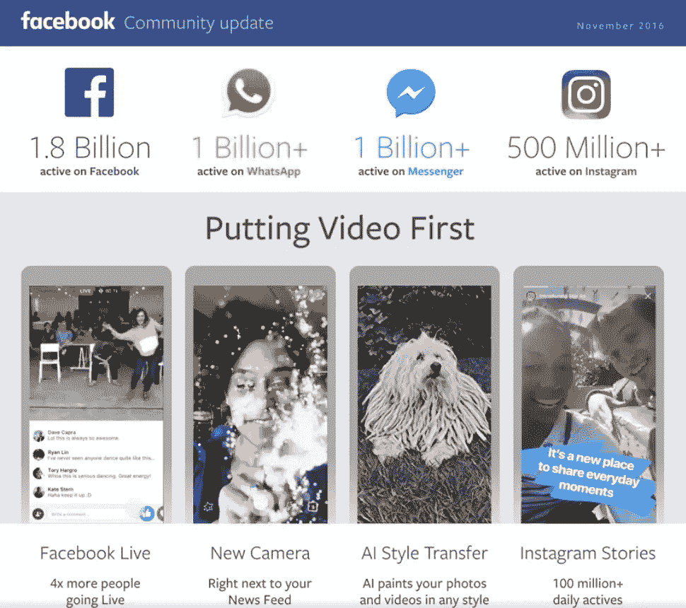
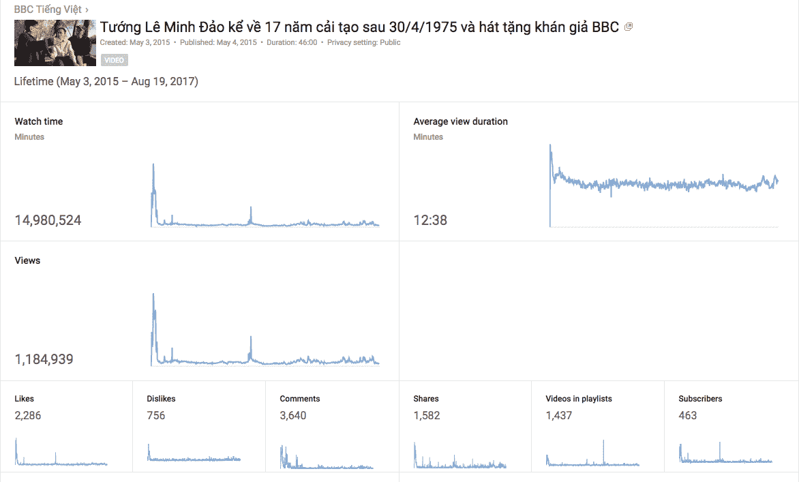

# 为什么脸书最近的变化是塞翁失马焉知非福

> 原文：<https://medium.com/swlh/why-facebooks-latest-change-is-a-blessing-in-disguise-ee7019ea6cc0>

新闻提供者被赋予了两条腿走路的机会，而不是一条腿，到目前为止主要是脸书。

Facebook has been doing all it can to compete with YouTube with some help from news organisations

你以前一定听过很多次，如果某件事好得不像真的，它很可能就是真的。在 reach for news on 脸书的例子中，你可以说如果某事太好而不能持续很长时间，它可以说是。

在过去的一两年里，新闻页面的粉丝数量、互动数量和网站的推荐数量稳步上升，一些网站有一半的访问者来自脸书。当我在 BBC 世界服务亚洲区担任数字编辑和社交媒体编辑时，我亲眼目睹了这一点。我还发现，通过脸书上的链接访问包括 [BBC 印地语](http://www.bbc.com/hindi)、 [BBC 中文](http://www.bbc.com/zhongwen/simp)和 [BBC 印尼语](http://www.bbc.com/indonesia)在内的 11 个亚洲语言网站的人，与直接访问这些网站或通过谷歌搜索相比，花在阅读上的时间更少。我很清楚，许多语言服务机构在接触和推荐方面过度依赖脸书。

我确实在尝试建立另一个社交分支方面取得了一些成功，这里是 YouTube，提供一些语言服务，包括 [BBC 乌尔都语](https://www.youtube.com/channel/UCvm8V4Dwtz0fbPGbpk7RYAg)、 [BBC 越南语](https://www.youtube.com/user/BBCVietnamese)和 [BBC 中文](https://www.youtube.com/user/BBCZhongwen)。BBC 越南语的 YouTube 频道继续成为亚洲地区表现最好的频道，在我于 2017 年 8 月离开 BBC 世界服务时，观看时间每月上升至 2000 万分钟。他们代表了我所说的两条腿走路的服务。其他大部分服务还是在社交上一条腿走路。那条腿是脸书的，它每天都在变得不稳定。

**为什么选择 YouTube？**

让我带你回到 2015 年，参加一个 YouTube 合作伙伴代表与 BBC World Service 的 YouTube 编辑和高级数字和技术高管之间的会议。这位来自 YouTube 的女士恳求房间里的 BBC 人员给 YouTube 一个机会。与会的 BBC 老板们并不信服。在接下来的几个月里，YouTube 的编辑离开了 BBC，因为他们没有得到他们认为应该得到的支持和关注。公平地说，BBC 的老板们一定认为他们没有带来预期的结果。

从那次会议到现在，脸书一直在尽最大努力与 YouTube 竞争，成为领先的视频平台和社交平台。他们付钱给包括英国广播公司在内的媒体机构，让他们采用脸书直播视频。他们逐渐减少了短视频的覆盖范围，他们可能会以同样的方式对待 YouTube 视频链接。回到 2017 年 8 月，他们宣布了[脸书秀](https://techcrunch.com/2017/08/09/facebook-watch/)，这是 YouTube 闻名的[长格式视频](https://www.youtube.com/watch?v=GofREVeNbcw)的类型。

那么，你为什么要把脸书的影响力下降视为塞翁失马，而花更多时间开发你的 YouTube 频道呢？你一定看过一些关于花在社交媒体平台上的时间可能对我们的心理健康产生负面影响的文章。2017 年 5 月发布的[一项针对全英国近 1500 名 14 至 24 岁青少年的调查显示，YouTube 被认为对他们的健康和福祉有积极影响。脸书和脸书旗下的 Instagram 分别位居第三和第五。](https://www.cbsnews.com/news/instagram-snapchat-social-media-worst-for-mental-health/)

1.  YouTube(最积极)
2.  推特
3.  脸谱网
4.  Snapchat
5.  Instagram(最负面)

你想想，肯定有道理。你倾向于带着搜索信息或娱乐的特定目的来 YouTube。你做更少的滚动和更多的搜索。YouTube 旨在通过他们的搜索引擎给你你需要的东西。脸书旨在让你从一个岗位到另一个岗位，直到你累得不行为止。脸书认为它知道你想要什么。YouTube 认为你知道你想要什么，并告诉你去搜索。

与脸书相比，发现新旧最佳内容的能力是 YouTube 的独特优势。试着搜索你两年前在脸书上发布的视频。如果你连试都不想试，我也不怪你。

**观看时长 1000 万分钟的视频**

2015 年初，当我还在为 BBC 越南语服务工作时，在越南战争 40 周年前夕，我搜索了一个关于一位将军的视频，他一直战斗到战争结束，而他的许多指挥官都逃跑了。他甚至不允许他的妻子和九个孩子离开。这位将军最终在各种再教育营度过了接下来的 17 年，他的家人在第二次尝试中幸运地乘船逃离了越南。当我在 YouTube 的搜索框中输入他的名字 Le Minh Dao 时，结果列表中根本找不到 BBC 越南语频道。如果你现在搜索他的名字，很有可能 BBC 越南语是你在视频列表中看到的前五名，如果不是第一名的话。这是因为 2015 年 5 月我在美国采访了这位将军。我自己用 iPad 拍了下来，在我们从他家回家的漫长路上上传到了 YouTube。

两年后，[视频](https://www.youtube.com/watch?v=IwvAHxa25Ek&feature=youtu.be&t=31m29s)的浏览量超过了 100 万，更重要的是，每个观众平均观看的时间超过了 12 分钟。许多人通过 YouTube 应用程序在智能电视上观看了该视频。仅在 YouTube 上就有超过 3600 条评论和 1500 次分享。当你选择花你生命中宝贵的 12 分钟在社交网站上看一些东西时，它应该对你真的有意义。你还记得上一次花超过 10 分钟看脸书的节目是什么时候吗？

You can tap in trending keywords to establish your reputation on YouTube

除了利用 YouTube 上的热门关键词来制作便于搜索的视频，我和一些同事还为 BBC 越南频道设计了一个每周一次的现场政治脱口秀节目。事实证明，该节目非常受欢迎，有多达 100 万人观看了一些节目，大多数是点播的。人们如此渴望政治讨论，以至于我上传的一段音频就获得了近 [30 万次‘浏览’](https://www.youtube.com/watch?v=S7768Xhh6TY)。

好了，我已经告诉了你一些关键要素[来建立一个成功的 YouTube 频道，面对脸书几乎所有事情和每个人都被拒绝的局面。这肯定需要时间和努力，但会有丰厚的回报。不要对脸书的所有变化感到惊慌。把它作为一个提示，你不应该把所有的鸡蛋放在一个篮子里。万一有一天它不在了呢。我已经失去了我的雅虎 360，并在大约 10 年前当你上网时写博客是一件值得做的事情。而如果你在 Storify 上，还没有听说过，2018 年 5 月以后就不会再有了。我已经把](/@kaytmolina/10-things-we-learned-from-doing-youtube-d07d81ae1558)[矿](https://storify.com/hunginternet)移到了韦克莱特。快来阅读 h [现在我花了 300 美元在 2013 年的脸书上创造了 50 万的点击量](https://wakelet.com/wake/bbe3bcd2-4aea-4493-8a43-7fc4271d447f)。顺便说一句，由于在 YouTube 上赚了数万美元，所有花在脸书身上的钱都收回来了。

## 这篇文章发表在 [The Startup](https://medium.com/swlh) 上，这是 Medium 最大的创业刊物，有 287，184+人关注。

## 订阅接收[我们的头条新闻](http://growthsupply.com/the-startup-newsletter/)。

