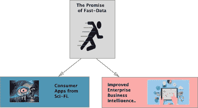

# 为什么快速数据突然无处不在。

> 原文：<https://medium.com/swlh/why-fast-data-is-suddenly-everywhere-3bb25bfff3b9>

## 使得一类新的应用在计算史上第一次成为可能

## 一个更好的问题..

几年前，脸书的一位招聘人员告诉我，脸书建立了自己的数据和基础设施解决方案，因为标准的解决方案不符合脸书的规模…

这句话在几年前可能是真的，Cassandra 的存储引擎肯定是出于脸书存储大量消息数据的需要。

然而，就在几年前，只有亚马逊(Amazon)、谷歌(Google)和脸书(Alibaba)这样的公司才会面临的挑战，正越来越多地被日常组织和初创企业所面临，即**大量实际上有意义的交易数据。**

对任何组织来说，访问快速数据的实际意义都是巨大的..运行快速数据分析的能力释放了流程改进的潜力，并直接提高了他们的底线。

## 大数据和智能数据

快速数据革命本身是由两个潜在的革命促成的，即**大数据**和**智能数据**。

像 [Hadoop](http://hadoop.apache.org/) 和 [HBase](https://hbase.apache.org/) 这样的大数据系统使得在商用硬件上存储海量非结构化数据成为可能。
微服务和通信协议的标准化意味着数据突然开始在某种*更大的事物方案中变得有意义*。

许多令人惊叹的开源项目都是出于解决快速数据这一独特挑战的需要而诞生的。

## 拼图的两个部分——存储和消息传递

始于 LinkedIn 的 [Apache Kafka](https://kafka.apache.org/) 项目和始于 Twitter 的 [Apache Storm](http://storm.apache.org/) 项目试图解决流媒体消息队列部分的问题。

像 [Apache Kudu](https://kudu.apache.org/kudu.pdf) 这样的项目开始解决对存储引擎的需求，以在商用硬件上运行快速数据分析。

基于 Redis+Cassandra 的系统也被提议作为运行快速数据分析的存储引擎。Redis 的速度与高度一致的事务性 Cassandra 实现的性能相结合，可以使处理快速数据应用程序变得实际上毫不费力。YugaByte 项目是一个多语言 Redis + Cassandra 解决方案，用于应对快速数据挑战。

## 为消费者和企业带来变革

2008 年 8 月 25 日，当卡珊德拉项目第一次宣布时，发布声明说-

> 该系统目前存储了超过 600 个内核和 120 TB 磁盘空间的索引。该系统的性能完全符合我们的 SLA 要求，更多的应用程序正在使用 Cassandra 系统作为其存储引擎。

这些在 2008 年只有脸书可以夸耀的数据量，看起来不再令人生畏，因为公司改善了他们的 IT 流程和存储能力来处理快速数据的大规模激增。
快速数据也突然为消费者应用开辟了道路，这在以前似乎只能在科幻小说中实现，并为企业提供了前所未有的潜力，使其能够做出更智能的决策系统并改善其流程。

## 这个故事发表在 [The Startup](https://medium.com/swlh) 上，这是 Medium 最大的创业刊物，拥有 286，184+人关注。

## 在此订阅接收[我们的头条新闻](http://growthsupply.com/the-startup-newsletter/)。

