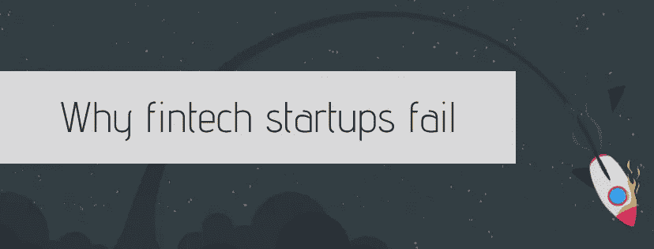

# 为什么金融科技创业公司会失败。5 个错误和结论

> 原文：<https://medium.com/swlh/why-fintech-startups-fail-5-mistakes-and-conclusions-b77e1bde23d2>

大多数企业家认为他们正在打造下一个大东西。但最终只有不到 90%的初创公司将他们的想法产品化，并被潜在用户采纳。然后，他们面临的挑战是扩大他们的企业，接触下一个一百万的客户，并让他们为他们的产品付费。许多创业公司在整个过程中都会犯错误，导致失败。在这篇文章中，我不打算谈论创业公司犯下和失败的[常见错误](/startup-grind/reasons-why-most-startups-fail-early-2e3a4b8b095c)——没有市场需求、雇佣不合格的员工、缺乏现金、竞争、劣质产品、没有以客户为中心等等。等等。相反，我将分享我对金融科技初创公司特有的**并导致金融科技初创公司失败的 5 个错误的见解。**

金融科技初创公司正在成倍增加，越来越多的资金正在投资于金融科技。[2018 年上半年，金融科技初创公司在全球筹集了 417 亿美元](http://fintech.global/2018-is-already-a-record-year-for-global-fintech-investment/)，超过了 2017 年金融科技投资总额的纪录。但是，当我们听到很多关于大型融资轮和成功的金融科技初创公司的消息时，我们往往会忘记，将一个想法转化为成功的金融科技企业并不是一件容易的事情，无论它有多么具有破坏性或创新性。

以下是导致金融科技初创公司失败的 **5 个主要错误。**

# **1。忽略法律方面**

除了金融法律，金融科技初创公司必须始终遵守他们想要运营的市场的“游戏规则”。这包括从反洗钱、了解客户(KYC)和反恐怖融资(AML/CLF)相关法规到今年早些时候在欧盟生效的新的支付服务指令 2 (PSD2)以及消费者数据保护。许多金融科技创始人没有深入研究规则，并制定他们遵守的 siple 合规规则手册，这增加了错误放置产品甚至没有机会推出产品的风险。

金融服务业受到严格监管，某些部门(如存款、投资、汇款等。)在法律界甚至是超专业的。这包括资本市场中的证券法、保护借款人的法律、适用于个人数据的隐私法等等。在制定商业计划时，涵盖法律方面至关重要，包括考虑适当的许可及其相关法律和要求，尤其是对开发软件的金融科技公司而言。

# **2。忽略金钱的概念**

一般来说，发展一家金融科技初创公司与发展任何其他初创公司都是一样的，但发展一家金融科技初创公司的一般概念并不适用，因为**金钱是一个非常不同、独特、同时也非常棘手的概念**。许多金融科技初创公司失败了，因为他们不理解金钱、信贷、储蓄、支付等方面的心理行为。当社会的不同阶层**试图投资、储蓄或消费时，他们对金钱的看法并不相同。例如，有些人受过金融教育，但有些人没有，不同人的净可支配收入也有很大差异，许多人被困在学生贷款等。此外，零售和机构层面的储蓄、投资和支出存在巨大差异。创业公司必须仔细研究这些微妙的行为。围绕金钱的行为也会影响金融科技初创公司如何处理营销，因为金融科技初创公司的营销工作与电子商务中的营销工作有很大不同。许多金融科技初创公司没有找到一种智能的方式来为他们的金融科技产品进行营销，并试图复制电子商务营销策略，忽视了人类和公司围绕金钱的行为方面。**

金钱是一个奇怪的概念。理解零售和机构层面上围绕金钱、信贷、储蓄、支付和投资的心理行为，可以给金融科技初创公司的创始人带来很多优势。大多数没有仔细研究这些行为的创始人最终会惊讶于他们获得牵引力的速度有多慢，因为他们“突然”发现扩大零售客户群比他们最初想象的要昂贵，或者向银行或保险公司销售 b2b 金融科技产品的周期比他们预期的长得多。

# 3.选择错误的战略投资者

金融服务业是一个非常独特的行业，在这个行业中**经验非常重要**。寻求从风投那里融资的金融科技初创公司必须选择那些既有经验又了解这个领域的公司。如果他们决定选择银行或保险公司(作为他们的投资者)，关键是要考虑如何从受监管的金融服务机构(银行、保险公司等)筹集资金。).除了工作文化的差异，这些现有的组织在不同的规则下工作。在完成现任投资之前，金融科技初创公司必须询问他们需要什么类型的报告，什么类型的治理，以及他们需要什么类型的持续信息。

# **4。忽略客户采用挑战**

在金融科技领域，通常最大的挑战不是技术，而是目标用户以及他们使用金融科技产品的意愿。许多金融科技创始人没有想到，个人热衷于使用金融科技产品，因为他们正在使用通信/聊天或社交应用程序，但事实并非如此。金融科技产品仍然没有在不同的客户群中得到广泛采用。许多人不愿意花业余时间学习银行产品。此外，他们中的大多数人习惯于自己的日常生活，没有改变的动力。[根据 EY 的数据，金融科技产品的客户采用率为 33%](https://www.ey.com/gl/en/industries/financial-services/ey-fintech-adoption-index) ，但最大一部分属于支付和转账服务(50%的客户采用率)，相比之下，金融规划、保险和借贷领域的客户采用率相对较低(10–24%的客户采用率)。这就像 5-10 年前的电子商务。金融科技初创公司可以认为，随着金融科技意识的提高，消费者担忧的下降以及技术进步降低转换成本，金融科技产品的使用只会增加。但他们也应该考虑到，与电子商务或娱乐创业公司相比，他们需要在客户意识和客户激活方面付出更多努力。

# **5。被“金融机构是我们的竞争对手”所困**

金融科技公司旨在解决金融业内部的问题。银行笨拙的客户服务、金融机构对大数据的低效使用以及缺乏可持续的客户参与模式等问题，现在都是金融科技颠覆的合理目标。但是在一个以繁文缛节著称的领域，“快速行动，打破常规”的模式并不总是奏效。许多金融科技创始人认为他们需要与金融机构竞争，并呼吁金融机构进行一场较量。金融科技初创公司带来了灵活性和技术诀窍，他们认为这足以赢得竞争。但传统的金融机构提供了经过几十年磨砺的资源和监管敏锐度。这就是传统金融机构凭借其多年的经验和知识可以向金融科技创始人伸出援手的地方。金融科技的创始人应该考虑到这一点，尽管他们似乎在与传统金融机构进行市场竞争。Fintech 创业公司和金融机构实际上可以合作和互利，fintech 创业公司应该共同认识到“新的战略应该是**伙伴关系而不是竞争”**。

因此，如果你有一个伟大的金融科技想法，或者已经领先一步，开发出了产品，并且可能已经获得了一些非常棒的早期牵引力，那么通过避免金融科技初创公司特有的这 5 个错误，你就有机会“再活一个月”。

## 这篇文章发表在[《创业](https://medium.com/swlh)》上，这是 Medium 最大的创业刊物，有+366，291 人关注。

## 订阅接收[我们的头条新闻](http://growthsupply.com/the-startup-newsletter/)。

