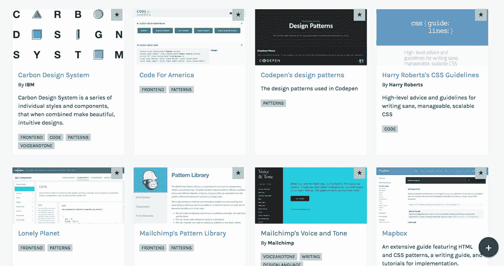
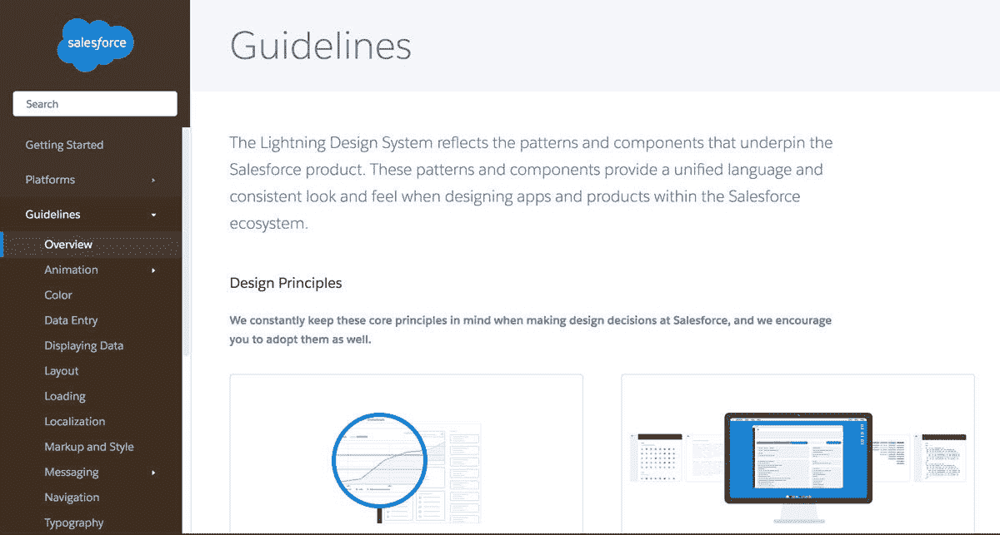
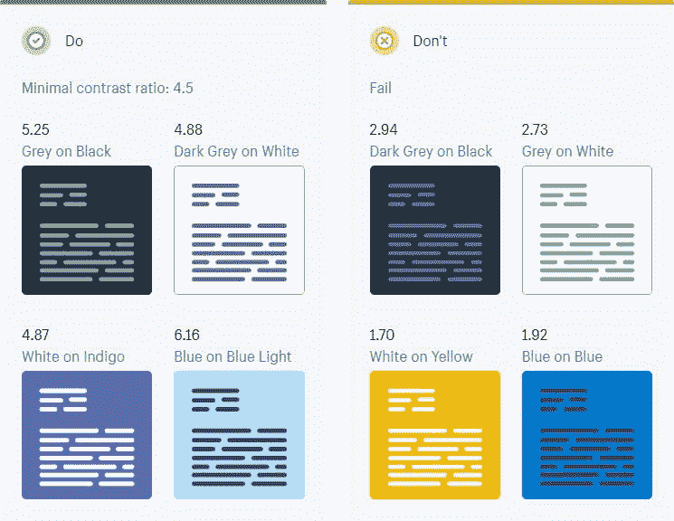
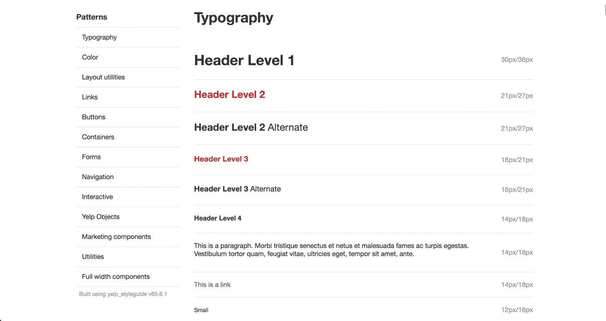
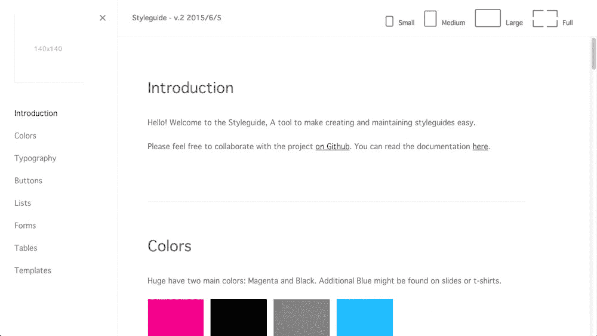

# 为什么自由设计师应该和风格指南一起工作

> 原文：<https://medium.com/swlh/why-freelance-designers-should-work-with-style-guides-2fca77e57921>

> “数字设计就像绘画，只是颜料永远不会干”
> ——内维尔·布罗迪

虽然这种想法似乎令人生畏，但现实是，随着时间的推移，我们在网上发布的任何东西都会被我们或其他人修改。

对于网站来说，这是*尤其是*真实的，网站倾向于频繁更新内容、功能或设计调整——比如改变图像或行动号召。

这种灵活的、迭代的方法带来了风险，有人可能会弄脏你的杰作。毕竟他们读不出你的心思…

***这就是*风格指南派上用场的地方。**

无论你是为几个小客户做自由职业，还是为一家跨国公司工作，你都可以为他们创建风格指南，以确保他们的工作保持一致——就像当一个内部团队试图维护你建立的网站时一样。

风格指南对客户工作的持续成功至关重要，它能让客户建立在你的思维过程之上。

在计费时间、分包和业务发展之间，你几乎没有时间挠鼻子。是什么让这个“风格指南”变得有用呢？你应该在乎吗？

## **风格指南如何节省时间并建立共享环境**

一次做一个项目很简单。不幸的是，这在自由职业者的世界里很少发生。如果你一次做不止一个项目，压力和[上下文切换成本](https://www.apa.org/research/action/multitask.aspx)就会增加。

如果没有清晰的组织和跟踪方法，你的记忆甚至会把项目搞混。

您客户的团队都面临着类似的挑战，但更加复杂。每个季度都会有新项目出现。团队成员被分配到不同的项目中，这意味着他们必须在每次转换时构建上下文。

> 为您的每个项目创建一个样式指南使您能够保留您设置的上下文，并将其介绍给任何不熟悉您的工作的人。

从个人自由职业者的角度来看，你会保持有条理，不再仅仅依赖你的记忆。相反，你可以参考你的风格指南，快速轻松地回到你几个月甚至几年前就已经完成的工作。

更好的是，一旦你开始阅读这个全面的指南，其他客户团队成员可以阅读它来理解你的逻辑和原则。他们可以很容易地保持网站或项目的基调和感觉，无论你是否仍然是该公司的自由职业者。这也可以让你在将来不必把所有的东西都教给不熟悉你工作的人。

所有这些的核心是这样一个事实，一个风格指南将帮助每个人节省他们最宝贵的资源:*时间*。

虽然这需要相当多的努力，是的，前期需要一点时间，但回报是令人难以置信的。随着其他人(设计人员和开发人员)的加入，更新尤其如此。

向你的客户传达这个工具的价值——共享的环境和设计的延长寿命，并把它包括在你的费用中。(或者，如果他们真的很顽固，就给他们看看这篇文章。)维护一个风格指南需要工作，但这是*而不是*与你的客户结算返回工作(因为你可能不做维护！)…

相反，它是关于做一些非常有用的东西，比你和他们的合同持续更长时间，并产生很好的口碑推荐营销。

## **什么是风格指南？来自 Shopify、Dropbox 和 BuzzFeed 的例子**

没有一个放之四海而皆准的定义可以概括一个风格指南必须具备或不具备的内容，但是功能通常是相同的。设计师苏珊·罗伯逊[写道:](https://alistapart.com/article/creating-style-guides)

> “[风格指南]是整个团队(从产品所有者和生产者到设计者和开发者)在讨论网站变更和迭代时的一站式参考。”

团队在这些对话中遇到的任何问题、症结或挑战都应该在风格指南中记录和解决。

有很多公司出版了他们的风格指南。Shopify 有一个有用的风格指南，它超越了颜色和标志定位。指南中有一部分专门介绍了[语言和](https://polaris.shopify.com/content/product-content#app)语气，这有助于始终将副本保留在品牌上。

[Dropbox](https://www.dropbox.com/branding) 和 [Buzzfeed](http://solid.buzzfeed.com/) 也有有用的指南，它们记录了 CSS 和徽标的使用。如果你想看看兔子洞有多深，这里有一整套风格指南供你阅读！

# 如何开始你的自由职业风格指南

创建一个风格指南可能听起来像一个高要求。如果你不知道从哪里开始，就从最基本的开始。你的网站或项目的基础是什么？

这些元素可以包括调色板、网格布局系统或不同文本的字体样式。这也可能意味着间距建议、配色方案、图像尺寸和排版指南…

找出对品牌最重要的元素，并从那里着手。

例如， [Yelp 的风格指南](https://www.yelp.com/styleguide)在进入更复杂的方面之前，概述了字体、网格系统和颜色的基础知识。

还有，划清你的界限。知道你的风格指南会涉及什么，不会涉及什么。在 Yelp 的例子中，他们的用户界面/UX 风格指南正好涵盖了这一点，他们有一个单独的[风格的品牌指南](https://www.yelp.com/brand)。

同样，你可以像 [Shopify 对 Polaris](https://polaris.shopify.com/) 所做的那样对其进行细分，并创建不同的部分，如产品开发、视觉设计和文案。或者，只关注你的部分——把剩下的留给其他产品负责人去完成。

# **让你的风格指南易于维护**

加载 InDesign 并发布新的 PDF(文件名可能是“style_guide_v9.3.22”)来更新您的样式指南并不是一个理想的解决方案。

如果你想从简单、可维护的风格指南开始，可以免费试用一下 [Frontify](https://frontify.com/styleguide) 或 [Huge 的免费风格指南工具](https://hugeinc.github.io/styleguide/index.html)。

确保更新风格指南就像更新网站一样自然，这样你就永远不会落后。

随着时间的推移，小心“僵尸风格指南”这种过时的指南。

你的风格指南会不断发展变化，所以要确保每个需要指南的人都能获得最新版本。确保你的指南是可维护的，最重要的是确保你的客户知道如何维护它。

# 最后的想法

请记住，即使您正在构建样式指南，它也是为每个人准备的。

虽然您以后可能会引用它，但您的风格指南现在属于您的客户。你必须确保他们知道如何使用它，为什么他们应该注意它，以及如何维护它。

他们中的一些人会比其他人理解得更快…

…但是一旦第一个非引导式设计出现，每个人最终都会改变主意。

# 设计网站？[试用 PageCloud，免费 14 天。](https://www.pagecloud.com/)

 [## page cloud——世界上最好的拖放式网站构建工具

### PageCloud 的网站生成器可以让您创建具有强大编辑体验的美丽网站。今天就免费试用吧！

www.pagecloud.com](https://www.pagecloud.com/) 

# 想多读点这样的？

 [## 如何在网页设计中使用动画和动作

### 自从几十年前华特·迪士尼让米老鼠出名以来，动画已经俘获了数十亿人的心…

blog.prototypr.io](https://blog.prototypr.io/how-to-use-animations-and-motion-in-web-design-2fd1f68e6e02)  [## 10 个免费工具帮助你选择网站的颜色

### 我们已经做了研究，并找到了最好的工具来帮助您为您的网站创建完美的颜色集合。

www.pagecloud.com](https://www.pagecloud.com/blog/free-tools-to-help-choose-website-colors) 

## 这个故事发表在 [The Startup](https://medium.com/swlh) 上，这里有 263，100 多人聚集在一起阅读 Medium 关于创业的主要故事。

## 订阅接收[我们的头条新闻](http://growthsupply.com/the-startup-newsletter/)。

