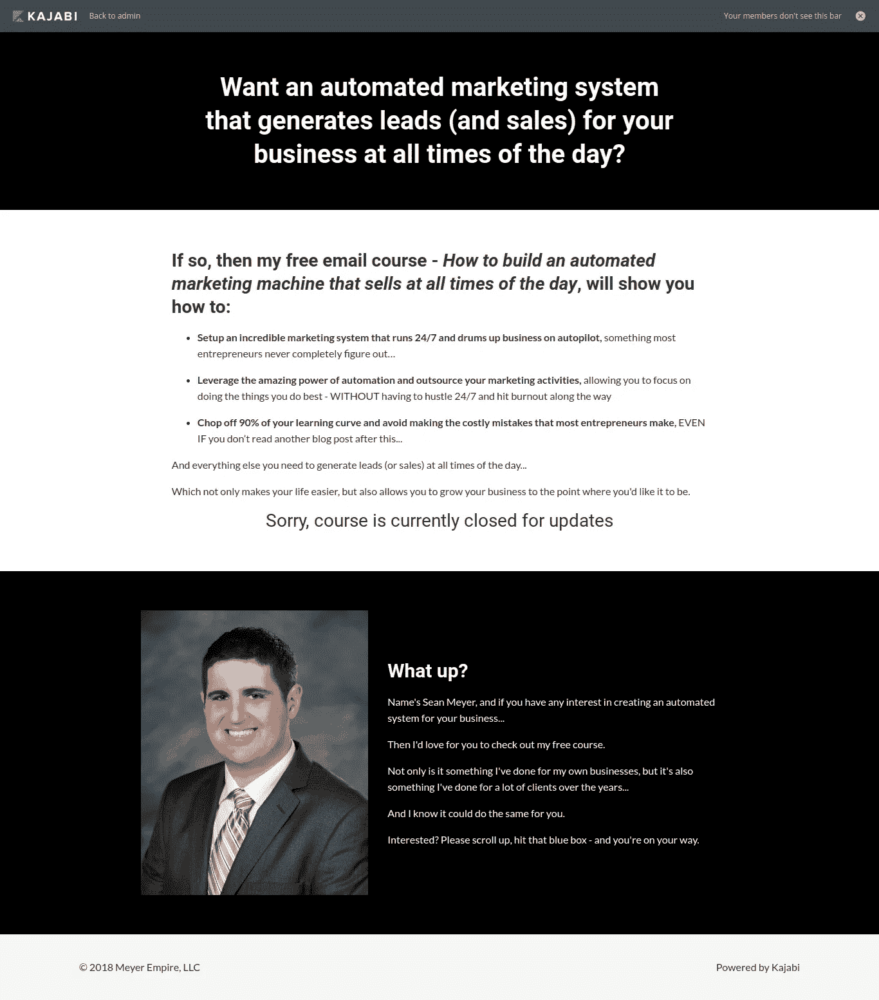

# 为什么自由职业者不需要作品集网站(以及如何获得没有作品集的客户)

> 原文：<https://medium.com/swlh/why-freelancers-dont-need-a-portfolio-website-and-how-to-get-clients-without-one-c7156ffd1978>

Photo by [rawpixel](https://unsplash.com/photos/cnseVhmbA7k?utm_source=unsplash&utm_medium=referral&utm_content=creditCopyText) on [Unsplash](https://unsplash.com/search/photos/business?utm_source=unsplash&utm_medium=referral&utm_content=creditCopyText)

前几天，一个新的自由职业者找到我，问了我几个不同的问题…

但真正让我印象深刻的是，当他问我应该在什么平台上创建自己的投资组合网站时。

我想我也不能说这真的让我吃惊，因为我一直都被问到这个问题…

但是看到这么多自由职业者认为他们真的需要一个，真的令人沮丧。

这通常发生在他们读到一位“经验丰富”的自由职业者的文章后，他发誓这是成功的关键…

所以他们在那之后出去，在一个看起来很棒的网站上花 1000 美元…

然后在接下来的 6 个月里摆弄他们的拇指，试图找出哪里出了问题。

不用说，这是一个在我脑海中存在了很长时间的话题——所以我最终决定快速整理一本入门书，展示任何人如何在不使用投资组合网站的情况下获得客户…

我们一会儿就会谈到这个问题，但首先，让我们回顾一下:

# 为什么投资组合网站(有时)有用

所以我显然不是投资组合网站的粉丝，但同时——我确实意识到它们有自己的时间和地点。

用最简单的话来说，这些网站被用作你的作品集的存放点——这样客户就可以看到你的作品…

这部分很好，因为它可以帮助…

但事实是，大多数时候，投资组合网站实际上弊大于利。

我的意思是…

每当你与客户分享你的作品集时，你最不想做的事情就是给他们发一整本作品集。

这就相当于给某人一叠文件，然后说“给，你自己去找”…

这就是为什么你总是想挑选一两件和他们相关的东西，然后只分享这些东西。

这很好，因为这是所有客户想要看到的——他们会感谢你为他们做了繁重的工作(而不是强迫他们浏览一个有多个项目的网站)。

最后但同样重要的是，有一个例外…

如果你的目标是一个明确的利基市场。

正如我第二次提到的，大多数投资组合网站不工作的主要原因是因为它们有多个项目，迫使客户四处寻找…

但是如果你的所有项目都与他们相关，那么投资组合网站会有所帮助。

例如，如果您专门做了:

*   牙医网站
*   税务公司博客
*   餐厅应用
*   等等等等。

好了，现在我们已经解决了这个问题…

让我们回顾一下我一直使用的帮助我获得客户的两种方法(没有投资组合网站)…

从以下内容开始:

# 向上工作

好吧，我知道你在想什么…

“是啊，显然你不需要一个来升级”…

但问题是，作为一个也雇佣自由职业者从事升级工作的人，我可以向你保证…

人们申请工作，并在求职信中分享他们的整个投资组合网站。

这通常是这样的:

“如果你想看我的作品，你可以查看我的作品集，网址是…”

事实上，我认为他们这样做是为了让客户停止工作——这样他们就可以得到报酬……

但无论哪种方式，都太过了，不起作用。

无论如何，你还是要给他们看相关的投资组合项目…

因此，与其分享你的整个投资组合，重要的是挑选一两个相关的项目，然后与他们分享这些网址。

如果这些例子是“实时”的，这意味着它们有一个实际的 URL，那么你可以与它们分享…

如果没有，就把它放在谷歌文档上，以这种方式与他们分享。

无论哪种方式都有效，只要确保它是相关的(即不要与会计公司分享关于狗粮的博客文章)…

你会没事的。

好的，这就是我一直在做的工作…

老实说，如果你刚刚起步，我认为这是最好的起点之一。

它不仅消除了自由职业带来的大部分头痛，如合同和付款…

但是它也能让你看到各种各样的工作，并且立刻对自由职业有更好的感觉…

这正是你所需要的，但与此同时，我也很务实，意识到在你积累了一些经验后，有更好的方法来获得客户。

这是我从事 Upwork 自由职业几年后遇到的事情，我不想撒谎——我绝对喜欢 Upwork…

但依赖一个平台总是令人害怕，因为我知道他们的一个调整真的会对我的业务产生整体影响。

老实说，我认为 Upwork 不会出现这种情况，因为他们会从你获得的每份合同中获得一定比例的收入，所以他们不希望你失去业务…

但不用说，有一个安全网总是好的…

经过几年的努力，我终于决定冒险出去，靠自己争取客户。

当时，我正在为自由职业者创建铅培养漏斗，所以我很清楚我需要做什么…

这让我想到了第二种方法:

# 铅培养漏斗

因此，在做了几年销售文案之后，我真正开始注意到与直接客户对话的文案的重要性。

当我与一个人交谈时，转化率似乎总是高得多，而不是有一个模糊的市场…

因此，当我为自己的企业创建线索培育漏斗时，我真的花了一些时间来确保我有正确的定位。

老实说，当我这样做的时候，我实际上是一个疯子——因为我试图变得完美，这是所有进步的杀手…

但是我最终克服了我的疑虑，决定把所有的“专家”作为目标。

如果你不熟悉术语“专家”，这是所有营销人员在谈论自由职业者、教练、顾问或课程所有者时所指的…

这永远是最好的目标市场，因为他们可以支付最高的价格。

无论如何，我在这个市场遇到的唯一问题是以一种打击所有人的方式制作文案——因为服务型公司(即自由职业者)的漏斗末端与课程略有不同…

因此，我最终决定找到一个快乐的媒介，并最终制作了一个展示这两种漏斗的视频(稍后会有更多介绍)。

无论如何，现在我已经有了我的目标市场…

**是时候继续前进，创建真正的销售线索培育漏斗了。**

现在，这些漏斗表面上看起来确实很“容易”，但我可以向你保证，地下发生的事情比你想象的要多得多…

所以我强烈建议

a)首先对这一主题进行更多的研究，或者

b)让文案替你做这件事…

但是本着学习的精神，每当你在做一个销售线索培育漏斗时，你总是想做一些形式的“培训活动”。

这很有用，因为这是潜在客户感兴趣的事情，因为你在教他们如何做他们需要的事情…

这也很有效，因为当他们完成你的漏斗时，他们会明白你到底在做什么。

也就是说，这将因每个行业而异，但对我个人来说…

由于我正在为自由职业者创建销售线索培育渠道，我决定创建一个名为:

**“如何打造一台全天销售的自动化营销机器”**

我知道这会很有用，因为这是每个自由职业者都想要的，之后我继续像往常一样创建我的漏斗…

但是在这一点上，我想提到的一件事是，在这个漏斗中，我确保展示了一些结果。

这样做是因为你必须记住，客户雇人的主要原因是因为一个被称为“权威”的心理学原则——他们想确保你确实知道你在说什么…

最好的方法是展示你在类似情况下取得的成果(无论是你自己的项目还是客户的项目)。

哦，在我继续之前，我想我应该提到我的销售线索培育漏斗…

我决定使用电子邮件漏斗。

这些方法效果很好，因为它们侵入性最小，选择率最高，但同样的原则也适用于:

*   网络研讨会
*   白皮书
*   电子书
*   等等…

所以你也可以用这些。

总之，我为潜在客户创建了一个电子邮件漏斗…

在这个漏斗中，我向他们展示了什么是销售线索培育漏斗。

我也没有隐瞒什么，只是告诉了他们需要知道的一切…

这是另一个需要记住的重要概念，因为很多人害怕这样做，因为他们认为他们会泄露太多信息，让自己变得“无用”…

但我可以向你保证，如果他们有钱，他们会付钱让你为他们做这件事…

如果他们没有，那又有谁在乎呢——反正他们也不是你的客户。

也就是说，在我的 5 天漏斗结束后…

我为他们制作了一个快速视频，主要是为了让他们能看到漏斗的内部(尽管他们刚刚经历了一次)…

在那个视频中，我简单地向他们展示了我的两个漏斗，一个用于课程，一个用于服务业务(这实际上是我让他们经历的同一个漏斗)。

我这样做是因为它实际上充当了我的作品集网站，他们都很喜欢，因为我通过视频向他们展示，而不是让他们去搜索整个网站…

视频结束后，我给了他们一个链接，允许他们注册免费咨询。

这总是最有效的，因为客户真的想先和服务提供商谈谈，因为他们想确保你的服务能帮助他们…

但此时他们已经看到了他们需要看到的一切，这些“咨询”实际上只是一个 15 分钟的聊天，说“嘿，我可以为你的业务做这些，这是我的收费”。

好了，这就是事情的漏斗部分——我希望你现在可以看到，这本身就消除了对投资组合网站的需要——因为它为你处理工作…

但是，既然我们已经走了这么远，让我们完成完整的循环，并向您展示其余的过程。

# 登录页面和博客

现在我对网站没有任何反感，我真的没有…

但对我个人来说，我没有。

我刚刚发现它真的没有任何好处，因为没有人会访问一个普通的网站并在那里做任何事情…

这就是为什么我创建了一堆专为特定市场设计的单页网站(即登陆页面)。

我稍后会解释我是如何知道如何设计它们的，但是给你一个我在这种情况下使用的登录页面的例子…

给你:

好了，现在来看看如何设计登陆页面…

因此，登陆页面的美妙之处在于，你可以准确地知道流量来自哪里。

无论是你刚刚写的博客，还是你刚刚发布的脸书广告…

你很清楚读者在想什么，因为你知道他们刚刚读了什么…

这就是为什么我总是喜欢通过为我的目标市场写博客来开始这个过程。

我发现这种方式最有效，因为它可以更早地建立关系，因为你预先给了他们有价值的内容，而不是用广告吸引他们…

至于你应该写什么类型的博客，只要创造一些你的目标市场想要阅读的东西——然后把它发表在他们所在的地方。

举个例子，如果你是一个面向自由平面设计师的文案，那么我会写一些类似这样的东西:

*   任何平面设计师都可以使用的 3 种不可思议的营销技巧(提升销售额)…

然后把博客贴在平面设计师所在的地方，在最后留下行动号召(让他们进入登陆页面)…

然后让奇迹发生。

# 长话短说…

在当今世界，你脱颖而出的唯一方法就是与众不同…

但好消息是，这真的没那么难。

其他人都在为冷冰冰的电子邮件和对他们没什么好处的投资组合网站而争斗…

如果您简单地设置了一个自动化漏斗:

*   博客帖子
*   登录页面
*   电子邮件渠道
*   和一个免费的咨询页面…

那么即使你没有投资组合网站，你也可以毫无问题地获得客户。

想了解更多关于如何开始赚钱的副业吗？[看看这个](https://sean-meyer.mykajabi.com/p/landing-page-freelancer)

## 这篇文章发表在《T4》杂志《创业》(The Startup)上，这是 Medium 最大的创业刊物，有 358，974 人关注。

## 在这里订阅接收[我们的头条新闻](http://growthsupply.com/the-startup-newsletter/)。

