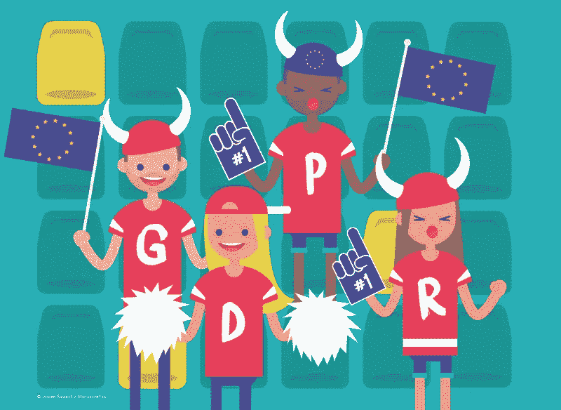

# 内容咨询公司的 Tim Walters 博士认为，为什么 GDPR 让内容营销成为新的黄金

> 原文：<https://medium.com/swlh/why-gdpr-makes-content-marketing-the-new-gold-according-to-the-content-advisorys-tim-walters-phd-1ab807fdf82e>

通过 GDPR 的 [**:通用数据保护条例**]( http://eur-lex.europa.eu/legal-content/EN/TXT/HTML/?uri=CELEX:32016R0679&from=EN) ，今天一定是最期待已久的清算日之一，至少自 Y2K 以来是如此。

它会影响任何处理居住在欧盟的数据主体的个人数据的企业，无论该公司位于何处或在何处处理所述数据。

当如此多的组织对围绕一般数据保护的新欧盟隐私法感到遗憾时，[的首席策略师兼隐私主管 Tim Walters 博士认为,【内容咨询公司】的战略教育、咨询和研究小组——内容营销研究所——GDPR 的适用性应该引起欢呼而不是嘲笑。](https://contentadvisory.net)

Give us a G-D-P-R!

他说，尤其是内容营销人员应该对这个数据稀缺的新时代感到最兴奋。

为什么？

在一个简短的问答环节中，蒂姆为我们分析了这一点:

## **问:如果你必须把 GDPR 归结为一个词，那会是什么？**

答:信任。这一切都始于信任。

在 GDPR 时代，如果没有这种信任，就很难甚至不可能获得许可——从客户那里获取数据。你通过值得信赖来培养信任，并通过不断表现出值得信赖来维持信任。

## **问:鉴于信任和 2018 年 GDPR 奥运会，为什么内容营销很重要？**

各种组织，无论大小，都会很好地实施内容战略计划，以维持或提高其公司的竞争力和整体成功。

没有他们曾经知道的数据挖掘资源，营销专业人员将需要发展。这也将是他们通过发布有价值的、令人满意的内容而大放异彩的时候——没有产品信息或推销。这些内容将把他们的品牌定位为一个可靠和值得信赖的价值来源。

作为回报，消费者会愿意——或者，为什么不呢，甚至渴望——提供他们需要的数据。所述数据第一次可能像电子邮件地址一样“无害”。

## **问:在需要“第二次”的时候会发生什么**

“许可营销”需要有创意。你必须想办法让你的数据请求得到更积极的回应。

*   如果你有一个能兑现承诺的可靠产品，那么你已经在接近信任的路上了。
*   仅请求特定的个人数据，以增强客户当时的体验。这将更容易更令人信服地描述消费者在交换他们的数据时将获得的价值。
*   继续兑现你对客户的承诺。
*   继续创作和分发有价值的高质量内容，以建立受众并获得他们的信任。内容营销的好处在继续对话中是无价的。

## **问:这个承诺的想法。能详细说说吗？**

在这种新环境下，公司必须做出可以兑现的承诺，提供可以兑现的交易。承诺的结构创造了一个未来的世界，在这个世界里，承诺者尽其所能来实现他们的承诺。然后信任发展或者信任变得更丰富。

如何处理客户数据将取决于公司文化。你必须为客户做正确的事，敏感地、合乎道德地处理他们的数据。

## **问:公司用这种方式成功建立信任需要多长时间？**

好问题。这将取决于客户的概况，但实际上我目前正在就这个问题撰写白皮书。它概述了公司和买家之间的实际信任结构。

**问:好的，白皮书发布后，我们一定会与您进行跟进。**

[笑]这肯定会是足够的动力来完成它。

## 外卖食品

欧盟 GDPR 与 Y2K 完全不同，尽管数据保护和保密是一条共同的主线。内容营销作为一种价值来源——黄金——的重要性成为未来成功的关键因素。

曾经的数据盛宴现在变成了饥荒，随意挖掘和劫持数据的时代已经结束。这并不意味着我们都得挨饿。

如果内容营销是新的黄金，那么[故事主管是你挖掘它的镐](https://get.storychief.com/content-publisher)，感谢 GDPR！

## 这篇文章发表在 [The Startup](https://medium.com/swlh) 上，这是 Medium 最大的创业刊物，有 328，729+人关注。

## 在这里订阅接收[我们的头条新闻](http://growthsupply.com/the-startup-newsletter/)。

