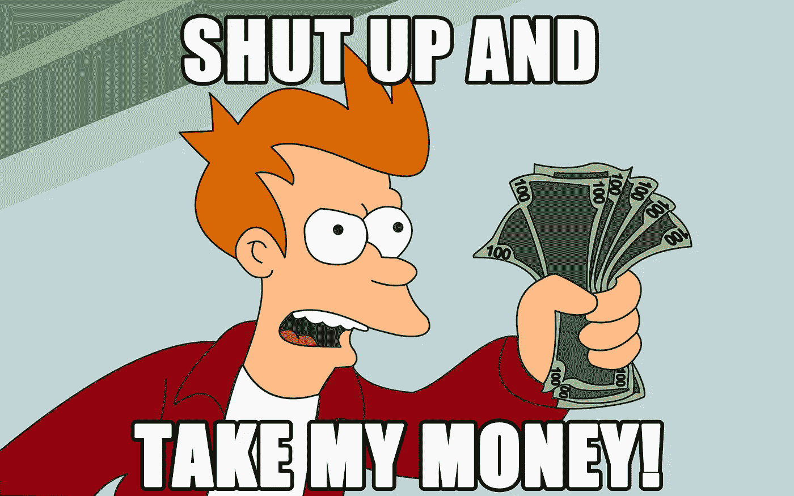

# 为什么给予永远比接受更重要。

> 原文：<https://medium.com/swlh/why-giving-will-always-be-more-important-than-receiving-1cd7b511737d>

在我的一生中，我不会说我生活在“一切为自己”的心态中，尽管我会说直到最近我才知道给予的真正力量。直到我发现我对同情、正直和简单地做正确的事情的爱，我才知道给予比接受具有指数级的力量。

这是一个狗咬狗的世界，竞争总是至关重要的。能够给别人 10 倍于你希望得到的回报，是普通人和影响数百万或数十亿人生活的人之间的差别。

# 证据。

很久以前，我爸在看一个我不记得名字的东西。我看它的时候大概 15 岁，也许更小(如果我知道它的名字，我会链接它。)

它是关于一个人和一家出版公司有一本书的交易。出版商出了点问题，他决定完全免费出版这本书。结果是，我清楚地记得他说过，“当我把我的书免费而不是收费时，我赚了更多的钱”。

这句话总是让我产生共鸣，多年后，我仍然记得它。

**我将分析为什么给予永远比接受更有价值的三个原因。**

# 1 —欣赏

*世界上到处都是只想自助的人，把所有人都甩在身后。幸运的是，有这种心态的人是那些被遗忘的人。当和那些仅仅把你当成顾客的人一起工作时，他们很容易被区分出来。*

无论如何，人们都希望与重视和欣赏他们的人一起工作。人们更愿意与那些把他们视为朋友的人打交道，而不仅仅是几个额外的本杰明·富兰克林。那些关心客户健康、家庭、人际关系和职业的人总是会脱颖而出。

我已经说过一次了，我还要再说一次..关怀是无可替代的。

不求回报地提供信息、服务、知识和专业技能的有趣之处在于，当你帮不上忙的时候，他们几乎会因为你重视帮助他们而向你砸钱。

**信不信由你，生意 100%是给予客户的；不是从他们那里拿走。**

你可能拥有世界上最好的产品，这是不可否认的，但无论它有多好，建立关系并致力于解决他们的问题总是会取得胜利。

# 2 —口碑。

**现在是时候将一家初创公司变成一家价值数百万美元的纯口碑公司了。给予多于接受极大地利用了这句话。**

我们生活在一个新闻几乎即时传播的世界。互联网和社交媒体永远改变了商业。

那些不适应新环境、不重视留住客户、不建立社交媒体品牌的企业最终会被遗忘或失败。

**创新或死亡——加里·维纳查克**

这是什么意思？为什么口碑会影响我的生意？
好吧，如果你在过去的 10 年里没有生活在岩石下，像 Yelp、Angie's list 和社交媒体这样的东西是*优秀的*工具，几乎任何人都可以对某个特定公司的经历发表意见。

当你给顾客留下不好的体验时，你可能会失去 3、4 甚至 100 个顾客。当你给他们留下好的体验时，你就有可能赢得 4、5 甚至 50 个长期客户。你开始明白为什么给予更重要了吗？这并不总是把东西送出去，而是因为它非常有价值，以至于你的竞争对手几乎被遗忘了。

你可以通过发送后续信件、询问家庭情况、赠送几件免费物品、打折商品，或者只是以任何可能的方式真诚地超越期望。如果你为他们多做一点，他们也会为你多做一点。

独一无二、善解人意和与人相关是 100%将你从狼群中分离出来的东西。

# 3 —良好的感觉

对有些人来说，给予会让人产生不好的感觉。对其他人来说，它推动他们，激发他们的内在动力。

如果你像我一样，当你给予某人或帮助某人时，它会让你脸上带着微笑，让你觉得自己很特别。实际上，我是那种在尽力帮助他人之后，觉得自己可以完成任何事情的人。这听起来很傻，但我真的有这种感觉。

我想到了数百万只关心自己的人，他们甚至不会把 25 美分扔给一个无家可归的人，也不会花一点时间去帮助别人。我无法理解那些人。

我很感激知道给予会让我在生活中走得更远。

我非常喜欢给无家可归的人捐钱。我不会扔掉超出我承受能力的东西，但是送出一张 5 美元的钞票，看着别人微笑，让他们开心，这是非常值得的。

当我给无家可归的人捐 5 美元时，这让我有一种成就感，我可以通过捐赠做一些不可思议的事情。

当我听到关于给无家可归者钱的说法时，我很鄙视；“哦，他只会买酒”或“他只会买烟”。

这可能是真的；他或她可能只是买酒、烟，甚至可能是毒品，但这与他用这些钱做什么无关；这是他的选择。

不管他用这笔钱做什么，帮助他是我的选择，我知道这样做是正确的。我知道上帝会感谢我偶尔拿出一些钱来帮助比我多奋斗 50 倍的人。我不在乎他们用它做什么，事实是我做了正确的决定。

我想在生活中非常努力地工作，这样我就可以做出我现在无法做到的贡献。捐赠超过 10 万美元的成就感是其他任何感觉都没有的。不是每个人都有这种感觉，但是我可以向你保证，那些有这种感觉的人会对这个世界产生更大的影响。

理解这一点非常重要，这并不意味着你不应该努力去赢，也不应该比你的竞争对手做得更好。这或多或少意味着以一种给予、关心和富有同情心的方式去做是游戏规则的改变者。如果你想要结果，你需要愿意付出 10 倍于你所希望的努力来回报你的努力。

成为一个只关心从个人那里接受和索取的人似乎是更快更聪明的途径。那些专注于超越客户和顾客期望的人将永远处于第一位。

## 如果你喜欢这篇文章，就把它拍下来。反馈总是很受欢迎。别忘了你最多可以鼓掌 50 次！❤

## 这篇文章发表在《创业公司》杂志上，这是 Medium 最大的创业刊物，有 312，043 人关注。

## 订阅接收[我们的头条](http://growthsupply.com/the-startup-newsletter/)。

