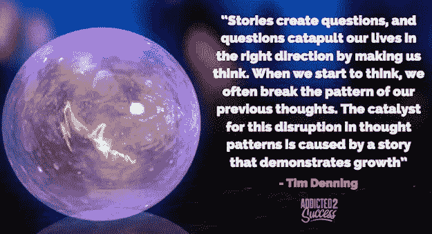

# 为什么全球有影响力的人和企业家用故事来发起运动

> 原文：<https://medium.com/swlh/why-global-influencers-and-entrepreneurs-use-stories-to-start-movements-afe45972187b>

我目前花了很多时间研究成功人士和有全球影响力的人。发起全球运动的人似乎都有一项关键技能；他们是伟大的沟通者，利用故事有效地表达自己的观点。

故事的概念已经存在了几千年，但越来越成为最重要的交流方式。

前几天我听了一个播客采访，采访了一位 Ted 演讲专家，他建议 80%的交流最好通过讲故事来完成。

他解释说，商界人士沟通失败的原因是他们没有使用真实世界的故事。

我给你的建议是尽可能多地研究讲故事的艺术。这是一种无论你做什么都会对你有帮助的技能，也是一种可以不断改进的技能。

## 故事引发全球运动的五个原因是:

# 1.故事激发灵感

在故事引发全球运动的所有原因中，排名第一的原因是它们激励了人们。运动是一群人，他们都相信类似的东西，并围绕这种想法或信仰形成一个社区。

**运动是由人组成的，人被其他人所感动。**为了让人们感动他人(我希望我说得有道理)，必须有一些人的因素促使他们采取行动。

**行动需要人们有不同于以往的感受，而最好的方式就是通过故事。**看看每一个成功的企业、品牌、地点或人物(都可以被视为运动)**它们都是由分享一个故事的人开创的。**

通过我的研究，我发现没有一个例子不是由一个故事引起的。当有人试图用事实、大量数据和非基于故事的内容来影响你时，你会开始觉得自己在做一些无聊的公司演示。

故事有激励人们的力量，因为它们是相关的，是人们可以抓住的东西。

人们抓住一个故事的方式是通过在他们自己的生活中找到一个与发起运动的人所讲述的故事相一致的故事。

例如，当 Wholefoods 说他们不仅仅代表健康，他们还代表营养食品、双赢的供应商关系、满足顾客、食品教育和先进的环境管理(老实说，我不知道这是什么)，他们代表的一些东西与我有关。

不是所有他们代表的东西都与我个人一致，但是他们关于食物教育的观点与我一致，因为我从未在学校接受过食物教育，我希望我接受过。如果我接受了食品教育，那么我可能会比现在有更好的健康水平。

所以我想说的是，我从 Wholefoods 的故事中提取了一部分，然后将我自己的故事应用到其中，这激励我成为他们全球运动的一部分。

如果他们试图通过除了他们的愿景和他们为什么开始的故事之外的事情来让我加入，我就没有必要受到他们的启发。

> *“一家公司卖什么并不能激发我的灵感，而是他们为什么要卖它才激发了我的灵感，他们的故事传递了这一信息”*

# 2.故事是个人的，需要脆弱性

买东西的时候想想。为什么要问你认识的人对你想买的产品的体验？简单，因为他们如何使用它的故事是个人的，不受广告炒作和营销旋转的影响。

你向朋友询问产品的原因是，你更倾向于听你信任的人讲述，因为这是一种个人购物体验。

故事是强大的，因为十有八九是个人的。分享个人故事，比如我在 Addicted2Success 上分享的故事，需要一定程度的脆弱。

不是每个人都想分享一个个人故事，因为他们担心别人看了之后会怎么想。

好吧，如果你还没想出来，我真的不在乎，你也不应该。对我来说，我想成为全球运动的一部分，我从经验中知道唯一的方法就是真实。

它要求我把自己放在线上，不要害怕或被恐惧阻挡。

**你越是不愿意分享自己内心深处最黑暗的故事，就越有可能让人们加入你的运动。**我所见过的脆弱的讲故事的最好例子之一来自一位成功迷刘易斯·霍维斯。

现在，这个人可能会被一些人认为是一个高大、健壮、爱踢足球的运动员，他一直是“受欢迎先生”**路易斯几年前分享了他小时候被另一个男孩强奸的故事。**

分享这种类型的故事会被大多数人认为是职业自杀，但刘易斯通过脆弱和分享他的故事建立了一个数百万人的全球运动。

这是 0.1%的人喜欢刘易斯做的事情，如讲述脆弱的故事，这创造了成功，并可以导致全球运动。

不要害怕，不要只是分享故事，尽可能让故事变得脆弱和个人化。

# 3.故事创造原始的情感

要让任何人对任何事情采取行动，或让某人加入全球运动，你必须运用情感。

情绪促使人们采取行动，它从各方面挖掘了我们人类的潜力。

当你讲述一个伟大的故事时，如果你做得正确，背后应该有原始的情感。如果你看看那些成名的歌手，他们做的一件事就是带着原始的情感演唱歌曲(一种故事形式)。

成功的歌手和失败的歌手之间的区别在于，成功的歌手将他们的心灵和情感与每一次表演联系在一起。

尽管你的脸皮很厚，但当一个故事让你感受到某种情感时，你很难不被它感动。

我们这些做过销售培训的人都知道，人们不会根据逻辑做出购买决定；他们基于情感做出购买决定。

如果你让某人感觉非常好，即使你的产品不是市场上最好的，这个人也很有可能会从你这里购买。

> *“故事创造情感，而情感就像一块磁铁，以前所未有的速度将人们吸引到你的身边”*

# 4.故事令人难忘

正如你们中的许多人所知，我一直在做演讲会来提高我的公开演讲技巧，因为它帮助我用我的愿景来激励世界。

当我开始的时候，我的第一个问题是“我到底是怎么记住我写的演讲稿中的所有单词的？”

我联系了我的网络，得到的回应很有趣。显然，我在一些演讲中经常忘记单词的原因是，我应该是在讲一些我并不热衷的东西。

你看，事实证明，当你讲故事时，你是在根据经验说话，而且通常是关于你所热爱的事情。

当你试图不用故事来交流时，很容易忘记事情，因为你是在要求你的大脑记住一些你根本不在乎的事情！

**全球有影响力的人使用故事，因为他们不需要记住它们。他们可以站起来讲一个故事，讲几个小时也不会忘记它的任何部分，因为这个故事很容易记住。**

观众也是如此。故事令人难忘，可以吸引人们参与运动，因为如果用正确的成分讲得好，很难忘记。在商业中，我多次与潜在客户分享故事，而我提供的产品绝不是他们能得到的最好的东西。

令我惊讶的是，这些潜在客户通常会和我一起去，不是因为我向他们提供的产品，而是因为我与他们分享的关于我为什么做我所做的事情的难忘故事。

通过查看我在 Addicted2Success 上发布的每一篇文章，你会发现几乎每一篇都是由发生在我身上的感人故事组成的。

这样做的原因是因为这是我如何让人们加入我们的运动，让他们不要忘记我们的立场。

故事是我让这么多人通过社交媒体联系的原因，也是我们的运动比以往任何时候都更加强大的原因。

人们希望受到鼓舞，而最好的方法就是通过故事的力量让他们永远不会忘记你！

# 5.故事展示成长

全球影响者使用故事的关键原因是因为一个故事做了一件非常强大的事情；一个故事展示了成长。

如果你分析很多故事是由什么组成的，你会很快意识到它们有一个起点和一个终点，表明了故事最初开始时的某种变化或增长。

正是这种成长吸引着人们，因为当你听到一个包含成长的故事时，你的自然反应是对自己说“如果他们能做到，那么也许我也能做到，或者也许我能克服他们做过的同样的事情。”

*原贴于*[*【Addicted2Success.com】*](https://addicted2success.com/success-advice/why-global-influencers-use-stories-to-start-movements/)

# 行动呼吁

如果你想提高你的工作效率，学习一些有价值的生活窍门，那就订阅我的私人邮件列表吧。你还将获得我的免费电子书，它将帮助你成为改变游戏规则的在线影响者。

[**点击这里立即订阅！**](http://timdenning.net/free-ebook)

## 这篇文章发表在 [The Startup](https://medium.com/swlh) 上，这是 Medium 最大的创业刊物，拥有 297，332+人关注。

## 在此订阅接收[我们的头条新闻](http://growthsupply.com/the-startup-newsletter/)。

