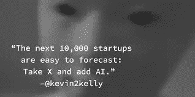

# 人工智能:为什么监管者需要首先了解初创公司

> 原文：<https://medium.com/swlh/why-governments-need-to-understand-ai-startups-first-dded674d3f8>

我们都喜欢在开车时思考生活中的重大问题。这使我们成为伟大的思想家和糟糕的司机。

企业家和科学家是本世纪的摇滚明星。人工智能正在世界各地和欧洲蓬勃发展。在这波[中搞什么鬼？我们想看看当其他国家宣称](http://www.oreilly.com/tim/wtf-book.html)[世界领导地位的时候，欧洲如何保持领先。除了普遍的看法，我们想说的是，人工智能和机器学习技术的主要驱动力是初创公司，而不是企业。因此，政府和监管机构需要首先考虑创业。初创公司会重新思考并时常改变我们对正常甚至可能的事情的想象——除非被法规禁止。听听我们通过初创公司理解人工智能的承诺。](https://www.nytimes.com/2017/07/20/business/china-artificial-intelligence.html)

政府应该了解人工智能初创公司的哪些信息，以及初创公司创始人在与监管机构交谈时应该提出哪些要求？

欧洲是深度技术的驱动者，拥有大量人工智能初创公司。就数量和交易数量而言，人工智能投资已经成为第一大投资，这使得人工智能成为欧盟初创公司的主要垂直领域。Atomico 的[欧洲技术状态](https://2017.stateofeuropeantech.com/)是一个有力的例证。然而，并不是每个人都意识到欧洲有潜力从超过 15 万亿美元的全球人工智能蛋糕中分得一杯羹。我们有成功的人才、公司和数据。但欧洲的监管框架将如何帮助我们实现这一目标，而不是赶走企业？

围绕人工智能的政治辩论似乎仍然没有聚焦，正如创新专员最近所说的，被批评家、危言耸听者和歇斯底里者所主导。人工智能值得一个视角的转变，或者甚至是一个范式的转变。首先，与其陷入杀人机器人的拟人化科幻逻辑，不如搞清楚人工智能是什么。我们应该找出我们目前在算术和奇点之间的位置。第二，如果没有“首先考虑创业公司”的方法，就无法讨论人工智能。正如我们将要展示的，初创公司是大多数人工智能的起点。第三，正如 Moedas 专员所说，我们希望摆脱歇斯底里，讲述真实的故事。

**敏捷灵活的人工智能政策方法**

对人工智能的理解和定义一直是不固定的。约翰·麦卡锡在 20 世纪 50 年代说过，“一旦它开始工作，就没有人再叫它人工智能了”。在 21 世纪初，分析和发现数据模式的系统被称为文本和数据挖掘(TDM)。

我们最接近的分类可能是看[窄人工智能对一般人工智能对超级人工智能](https://bdtechtalks.com/2017/05/12/what-is-narrow-general-and-super-artificial-intelligence/)。狭义人工智能是我们今天所处的位置——学习如何执行一项特定任务的系统，并且仅此而已。当机器下围棋、识别语言或进行销售预测时，情况就是如此。用吴恩达的话说，今天对人工超级智能的担忧就像“对抗火星上的人口过剩”。

政策制定者应该着眼于今天的人工智能，而不是着眼于未来可能发生的事情。今天最受欢迎的人工智能驱动的应用程序本身并不“智能”，而是增强和帮助人类智能做出决策和预测。在最近的历史中，80 年代和 90 年代的机器自动化向我们展示了洗碗机、洗衣机和推土机可以执行人类做的一些任务，但以不同的方式，而不是完全复制人类的过程。

今天的例子围绕导航交通，拼写检查，建议和数据分析。再说一遍 Siri？AI 不是撒在一堆数据上的仙尘，让它变成金子。它是开发者手中创造服务或产品的一个工具。这可能没有谈论《银翼杀手》中的复制人那么令人兴奋，但事实和证据为法律提供了更好的基础。对于我们不知道的一切，我们应该在我们的立法框架中保留一定的灵活性。对于我们所知道的一切，我们应该先问它是否坏了，然后再去修理它。

**没有创业公司能有人工智能吗？**

当今数字经济中一个流行且经常被引用的趋势是，大公司利用他们掌握的所有数据密切关注市场。事实是，大部分技术都是通过创业公司获得的。围绕人工智能的并购数量一直在稳步上升，从 2012 年 Q1 的两起增加到 2017 年 Q1 的惊人的 37 起。值得澄清的是，退出——初创公司被更大的公司收购——对整个生态系统都有好处，而不仅仅是对进行交易的企业家有好处。他们不太可能在一个小岛上啜饮鸡尾酒度过余生。更有可能的是，企业家会将资本和专业知识再投资于其他初创公司。联合创始人和早期员工也是如此。再加上投资者的新资金，它们让融资的车轮继续转动。而且最终收单公司会有更好的产品，让客户受益。

一些最受欢迎的应用程序，如图像识别、自然语言处理、推荐或自动驾驶，不是在企业中发明或推动的，而是在创业公司中。小团队要么把他们的技术和诀窍带到另一家公司，要么自己发展。最近的例子包括总部设在阿姆斯特丹的 [ReSnap](http://siliconcanals.nl/news/startups/ai-and-chatbots/albelli-acquires-resnap-combining-innovative-ai-technology-european-reach/?via=indexdotco) 、 [Scyfer](https://startupjuncture.com/2017/08/17/tech-giant-qualcomm-acquires-amsterdam-based-ai-startup-scyfer/?via=indexdotco) 或[sonal lysis](https://techcrunch.com/2017/03/07/spotify-acquires-audio-detection-startup-sonalytic/?via=indexdotco)。或者 Niland，前初创公司 Spotify 说明了这一生命周期。这里列出了最受欢迎的例子，包括谷歌的 DeepMind、优步的 OTTO 或亚马逊的 angel.ai

这些人工智能初创公司通常不会在更明显的面向消费者的领域作为独立应用程序运营。但是有很多创业公司使用 AI 工具来提供他们的主要服务或产品。正如未来学家兼作家凯文·凯利所说:“下一万家初创公司的商业计划很容易预测:用 X 加上 AI”。

总体而言，我们观察到新公司数量急剧增加。对该领域的投资显示了人工智能市场的整体健康状况和增长潜力。Gartner 的炒作周期[表明](https://blogs-images.forbes.com/gartnergroup/files/2017/08/Emerging-Technology-Hype-Cycle-for-2017_Infographic_R6A-1024x866.jpg)机器学习和深度学习的高峰将在 2020 年后达到。[2017 年，欧洲有望在超过 600 项深度科技投资交易中获得 35 亿€。](https://blog.dealroom.co/deep-tech-artificial-intelligence-europe-preview/)

正如许多初创公司一样，英国以最强大的人工智能社区领先，德国、法国和西班牙紧随其后，实际上正在迎头赶上。瑞士拥有人均最多的人工智能初创公司，大多数数据分析初创公司都落户在苏黎世及其周边地区。[排名前 100 的人工智能研究机构也大多在欧洲](https://2017.stateofeuropeantech.com/chapter/deep-tech/article/europes-engineering-engaging-data-science/)。

数据分析公司占了欧洲人工智能公司的大部分，这可能是因为人工智能需要数据，以及近年来它在云和大数据趋势中的出现。销售和营销人工智能公司倾向于利用这些新的大量数据解决众所周知的问题，并利用移动/物联网世界中 NLP(自然语言处理)和 NLG(自然语言生成)的改进。因此，我们在文本分析和对话式人工智能领域看到了许多新公司。例如，在易于访问的 API 的支持下，客户服务机器人和个人助理已经成为创建公司的非常受欢迎的垂直行业。

虽然机器人是使用人工智能的经典领域之一，但我们还没有看到机器人公司的数量相应增加。物流、教育和旅游等垂直行业 +人工智能也越来越饱和。

# **初创公司是监管者的人工智能试金石**

**(监管机构可能不会通过)**

可以合理地假设，如果没有创业公司，市场上的人工智能将会少得多。除了初创公司，没有人有胆量在企业感兴趣之前开发未来的产品并投放市场。对于政策制定者来说，这意味着创业公司是所有人工智能相关政策的试金石，因为它们是链条中最薄弱的一环。**如果法律和法规被证明不适合初创公司，整个人工智能领域将受到影响，并最终陷入停滞。**限制性政策将在对大型企业产生影响之前打击初创公司，并将成为整个欧洲人工智能创新的瓶颈。

**初创公司可以从哪里获得创新所需的数据？**

首先，人工智能初创公司不仅仅受益于任何数据，而是受益于正确的数据，特别是经过清理和正确分类的数据。所以关键不在于数据的总量，而在于数据的质量。他们可以通过在随着时间推移而增长的相对较小的数据集上构建合适的产品来与大公司竞争。对人工智能和并购的投资正在上升，这一事实证明了对初创公司所做事情的需求。

但是，一家从事图像、文本或语音识别的初创公司如何在用户群之外收集必要的数据呢？为了获得正确的训练数据，在线挖掘数据的能力是关键。使用普通爬虫、定制爬虫、机器人或抓取器是让谷歌上 950 万标签图像或 YouTube 上 450 万标签视频成为公共物品的好方法。[数据挖掘是最民主的方式，允许创业公司在不侵犯专有数据的情况下往上爬](http://www.euractiv.com/section/digital/opinion/the-eu-just-told-data-mining-startups-to-take-their-business-elsewhere/)。

## 数据挖掘是数据经济的关键驱动力之一。它允许创业公司进入一个市场，在不损害其他用途或剥削的情况下创造价值。

这是一个非穷尽和无害使用数据的很好的例子。初创公司的其他丰富数据源是传感器和物联网设备，这些设备要么直接部署，要么由用户访问。

这是创业公司在利基领域飞跃的巨大机会。这方面的例子有[德国生动的法律技术场景](https://www.gruenderszene.de/galerie/legaltech-uebersicht)或人力资源相关服务，如 [source{d}](https://sourced.tech/) 或 [Seedlink](https://www.seedlinktech.com/) 。

创业公司如何测试新的人工智能而不陷入繁文缛节？需要技能和最佳实践。

成为十大问题的竞争者是:立法如何适应测试和旋转业务？Airbnb、优步和许多其他公司证明，在缺乏创新的法律空间的情况下，快速行动、打破常规是唯一的办法。

## 监管机构说:先获得许可。

## 创业公司认为:请求原谅而不是许可。

这对于影响公共安全的服务和产品来说可能是合理的，但对于其他数据应用来说似乎有些过分。如果许可需要几个月的时间，但是一个产品或服务经过六周的测试后不断迭代和改进，该怎么办？监管者应允许同步或轻触式的方法，如在监管沙盒或政策实验中，而不是前期加载。

**关于艾，我该怎么跟我选的代表说？**

像人工智能这样的突破性趋势自然会吸引政策制定者的注意力。一些人工智能应用吸引的注意力将影响我们看待责任、透明度、决策和工作的方式。但监管者经常得到的是问题的负面形象，而不是正面故事。科技帮助[盲人看到](https://www.nytimes.com/2017/12/27/technology/tech-roundup-2017.html)或者[8600 万菠萝基金](https://www.nytimes.com/2017/12/27/technology/tech-roundup-2017.html)的故事需要监管者更多的关注。

**底线是:**创业公司是人工智能如何做好事的最好例子，监管机构不应该在没有创业公司的情况下做出决定。这是 Allied for Startups 一直坚持倡导的东西。当政策试图解决快速发展的技术时，第一个问题必须是是否有立法的实际需要。如果它没坏，为什么要修理它？如果存在由技术引起的问题，解决它的最佳方法是什么？当涉及到人工智能时，这些问题都没有答案，但决策者们正在关注立法。这允许适度的怀疑。

一方面，欧洲是一些令人惊叹的人工智能大学和研究中心的所在地，但另一方面，我们还有很长的路要走。找到拥有数字和科学专业知识以及解决我们日常生活中复杂问题的能力的合适人才是关键。展望未来，欧洲将不得不通过说服当今的摇滚明星，让他们相信这是值得留下来的，从而密切关注这位天才。

毫无疑问，初创公司是最强大的创新工具。最重要的人工智能创新曾经是初创公司。为了保持欧洲新技术的畅通，我们需要确保为创业者创造尽可能好的环境。我们必须允许创业公司在欧洲诞生，并在这里扩大规模和获得牵引力。其中很大一部分是让他们试验技术，探索人工智能的潜力，而不会遇到意想不到的障碍。

Lenard Koschwitz 是创业联盟*的欧洲事务主管*

**

## *这篇文章发表在 [The Startup](https://medium.com/swlh) 上，这是 Medium 最大的创业刊物，有 293，189+人关注。*

## *订阅接收[我们的头条新闻](http://growthsupply.com/the-startup-newsletter/)。*

**