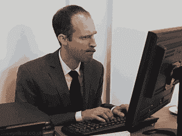
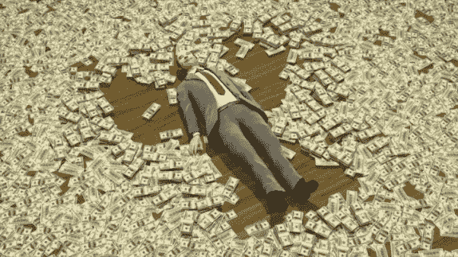
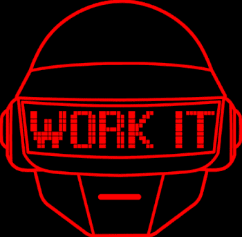

# 为什么“努力工作”并不总是答案

> 原文：<https://medium.com/swlh/why-hard-work-is-not-always-the-answer-dee67accde1a>

## 努力的真正价值到底是什么？

从很小的时候起，我们就被教导努力工作的重要性。
我们必须努力学习，在学校取得好成绩，考上一所“好”大学。我们必须努力工作找到一份“好”工作。那么我们必须努力工作来保住这份工作并获得晋升。
今天，我们告诉彼此，努力工作至关重要。
**等等！在你愤怒地离开这个帖子，不要关注我之前，请允许我解释一下。**

# 什么是‘努力’？

> 巨大的努力或耐力。

毫无疑问，努力工作是至关重要的。
很多年了，我在学校的时候，充满了自我批评。我想如果我不努力学习所有的课程，我会以失败告终。当我没有尽全力时，我感到内疚。

我当时没有意识到的是，在有助于取得成就的努力工作和毫无价值的努力工作之间有一条细微的界限。努力工作以取得成就需要意志、实践和专注。
但是**一直**努力有什么好处呢？
是为了纪律吗？还是只是为了觉得自己重要？

我们不能总是努力工作。我们的能量是有限的。那么，为什么我认为我必须努力学习所有的课程，即使是我不喜欢的课程？为什么它成了我的负担？
**答案很简单。就像你一样，我被告知努力工作是一种义务。**

# 它开始是一种价值观，现在是一种规范

我们都一遍又一遍地背诵这种“努力工作”的价值观，但我们并没有真正实践它的意义。

> 创业者的第一法则？好好努力！我是如何成功的？我努力了！

虽然这两种说法可能都是真的，但它们不再能打动人了。没有人不同意努力工作会导致成功。我们都相信。但是不知何故，我们把它变成了恐惧。我工作努力吗？大概不会。我应该更加努力工作。哦，伙计，我不配得到任何东西，因为我还不够努力。

我们忘记了如何衡量努力。
今天，我们只用奖励来衡量它。
我们反复说“我每天都在努力”。但是为什么我们认为长时间工作意味着努力工作呢？
因为我们得到奖赏。**钱**。这就是我们坚持不懈的原因。我们重视我们在办公室的“努力工作”时间和银行存款。也许这就是我们每天工作超过 12 小时的原因。
**想一想—**
谁更努力？首席执行官还是打扫办公室的人？
是工作时间更长的人吗？是赚的多的那个人吗？体力劳动算吗？

回报很大。奖励往往是努力工作的结果。但是我们鼓励所有类型的奖励吗？

# 金钱是我们努力工作得到的唯一回报吗？

> “拍电影很辛苦。这就像当医生一样:你长时间工作，非常辛苦，而且是情绪化、紧张的工作。如果你不真正喜欢它，那它就不值得。”~乔治·卢卡斯

它 **是我们追逐奖励的天性。毕竟，我们通过获得的回报来评价自己和对方。既然金钱似乎是我们唯一的奖励，那么我们自然会无休止地追逐它。这就是为什么我们对失业感到尴尬。我们为做兼职感到羞耻，就好像我们违反了一条不成文的“努力工作”的法则。当我说我有多努力写歌和写文章时，我记不清有多少次人们朝我翻白眼。毕竟有了钱奖励才算数吧？**

我们不重视其他奖励，因为我们没有意识到它们。作为父母，当你看到你的孩子帮助一个朋友时，你会感到满足。这是你的奖励。当你写完一篇新的博文时，你会感到快乐。这是你的奖励。当你学会如何弹吉他并最终弹奏出你喜欢的歌曲时，那种美妙的感觉就是你的回报。这些都和钱无关。
**它们是无形的。它们来自内部。**

**我们的生活中只有两种奖励:**
1。钱
2。成就感。你能给自己最好的礼物。

正如我在之前的帖子中提到的，金钱只是工具。这是一个重要的工具，但不是最重要的。

‘GoPro Sessions’ — a project I **worked hard** on. Check it out!

# 定义“努力工作”的 4 个步骤

> "当实现被推迟时，欲望会增加."
> 
> ~皮埃尔·高乃依

当我们缺乏生活的意义时，我们最终会找到我们可以得到的回报。钱。成就感的缺乏驱使我们追逐越来越多的钱，花更多的钱，试图填补这个空白。

**想一想你为自己感到快乐和自豪的时刻。** 你做了什么？为什么你会有这样的感觉？
花一两分钟时间反思一下。

成就感只能来自内心。

> “成功不是偶然的。这需要努力工作、坚持不懈、学习、研究、牺牲，最重要的是，热爱你正在做的事情或学习做的事情。”*~贝利*

也就是说，努力工作的价值基于:

*   **一个意义** —首先，我们需要有一个意义。去寻找‘为什么’——
    我们努力工作的原因。这就是我们如何[塑造我们的目标](/@saaroron/wake-up-your-dreams-are-not-dreams-b2881a9a112c)。
*   **个人技能** —我们必须运用我们的[独特技能](/@saaroron/this-is-how-i-discovered-my-superpower-b2f1a67fb100)，而不仅仅是我们从别处获得的技能。你的想法和我的不同。你的创造力和我的不同。不要害怕使用它。
*   **焦点** —不言自明。我们必须保持专注。
*   **坚持和忍耐——努力工作的美妙之处在于接受事情需要时间。事实上，坚持不懈有助于获得更大的成就感。相信自己。**

那么，在哪种情况下我会更努力地工作呢—
当我每天花 12 个小时将数据输入到电子表格中时，还是当我运用我的创造性思维找到一种解决方案，使我的数据输入速度提高 5 倍时？

# 我们实际上应该多努力？

找到我们的奖励之间的平衡是至关重要的，我们可以通过定义我们的足够来做到这一点。我们的努力工作可以得到满足感和金钱的回报，不一定非此即彼。但是一旦我们达到“足够”的时候，仅仅为了金钱的回报而努力工作就应该停止。任何超出它的工作都是有害的，无论是身体上还是精神上。

以职业篮球运动员欧米·卡斯比为例。卡斯皮拒绝了一份 450 万美元的合同，只为 NBA 冠军金州勇士队效力。他本可以获得双倍的薪水，但他选择了与勇士队签订一份 NBA 最低合同。对他来说，为冠军效力的奖励比额外的一笔钱更有价值。
你可能会想，“嗯，当你已经赚了几百万美元的时候，捐出 250 万美元很容易。”但问题是——你不一定要挣几百万。你不需要等。**现在就去做。** 重新评估你的奖励，让它们与你的“足够”相匹配。

充实感值得生活中所有的努力。应该一直鼓励这种做法。事实上，这才是我们真正应该珍惜彼此的方式。

## **你努力是为了什么？**

如果你的努力没有得到金钱上的回报，你会破坏你的努力吗？试着写下三次你获得的成就感。你在那里发现类似的模式了吗？
你能在生活的其他领域实施吗？

> 如果你觉得那是你想做的，就一起鼓掌👏

# 感谢阅读！欢迎[关注我](/@saaroron)。

 [## 在这一生中找到你自己的足够的重要性

### 当你认为极简主义是一种饮食时会发生什么

medium.com](/swlh/what-happens-when-you-find-your-enough-in-this-lifetime-65fdc4844aa6)  [## 朝九晚五？更像是七比七！

### 为什么你可能一天工作超过 12 个小时

medium.com](/swlh/nine-to-five-more-like-seven-to-seven-580ebbae47a4) 

## 这篇文章发表在 [The Startup](https://medium.com/swlh) 上，这是 Medium 最大的创业刊物，拥有 318，120 多名读者。

## 在这里订阅接收[我们的头条新闻](http://growthsupply.com/the-startup-newsletter/)。

