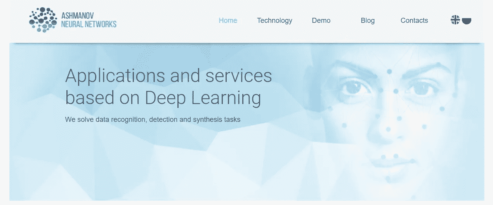
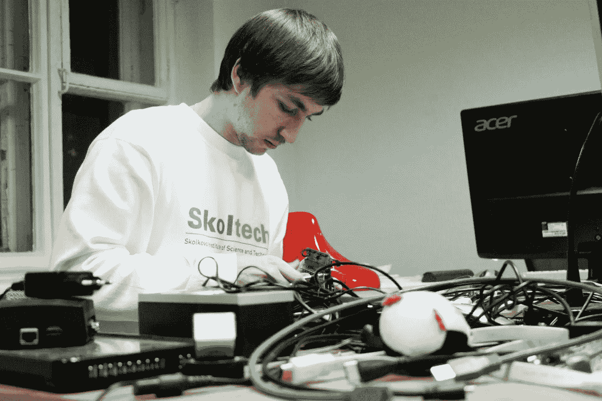
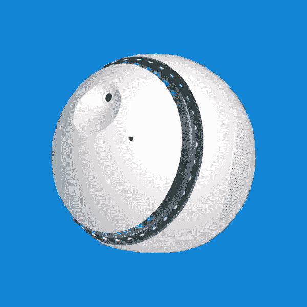

# 为什么要有自己的事业，如何停止疑虑

> 原文：<https://medium.com/swlh/why-have-your-own-business-and-how-to-stop-having-doubts-bffe1a7282c3>

在我看来，做好自己的事情更深远。有更多的机会，没有界限，没有上限，你将永远到达并卡在下面，最终无法进步。

总的来说，我喜欢把人们组织成能够赚钱和创造新设计的结构。理性地说，我认为这比在某家公司工作有更大的潜力。

我叫斯坦尼斯拉夫·阿什马诺夫，我想告诉你我的故事。我会和你分享我是如何开始自己的生意的，我是如何获得成功的，我甚至会让你知道我与亚马逊竞争的计划。

# **《做自己的事》**

我和一个朋友、同学，现在是我们的技术总监合伙开始了我的第一次创业。在这家名为 Ashmanov 神经网络的公司成立之初，只有我们两个人。我们甚至没有办公室，起初，我们远程工作。

首先，我们致力于移动应用；我们为 iPhone 和 Android 开发了应用程序。后来，我们开始在神经网络和[机器学习](/swlh/the-7-best-data-science-and-machine-learning-podcasts-e8f0d5a4a419)领域寻找客户，因为我们看到了一个有前途的领域，在这个领域我们有很好的知识。

The website of my first company.

我们的第一笔大交易发生在 2016 年。这是一个针对两个主要操作系统的大型移动应用程序，我们只有一个月的时间来制作它。我们从这笔交易中赚了大钱，这让我们可以雇用更多的人。2015 年，只有我们两个人。到 2016 年我们有四个人。到了 2017 年，我们是 8 个人的团队。现在，有十六个。每年我们的规模都增长两倍，到目前为止，我们的收入也沿着同样的道路增长。

# **我的第二份工作**

今年，我被任命为“纳米语义实验室”公司的主管，该公司从事交互式界面和商业聊天机器人的开发。前任主管感到厌倦，并说他们不知道如何前进，他们不知道如何发展业务，以便有更多的订单，从而增加收入。这是我晋升为总经理的时候:我从“阿什马诺夫神经网络”获得的经验赋予了我这样做的权力。现在两家公司都在一个办公室工作，正在积极互动。这种协同作用来自于这样一个事实，我们有两个团队非常紧密地合作。

有什么变化吗？的确如此。由于交易周期大约是 6-8 个月，所以很难估计财务结果，但公司的氛围已经完全改变了。就在我进来的时候，公司获得了一些新的能量。这需要一个新的视角来评估已经存在的东西:我改变了一些东西，开始了一些新的过程。

这家公司的公共关系非常薄弱，参加的会议很少，也没有为专门的网点写任何文章。因此，我启动了公关和营销流程。我开始了客户经理培训，这样他们就可以为他们的客户处理额外的销售。此外，我决定提高商务部的奖金，确保他们更感兴趣。

基本上，团队复活了。新项目正在发生，新产品正在生产，一切都开始变得更快。我们现在正在寻找新的市场，关注着阿联酋和中国的发展方向。以前，“纳米学”只在俄罗斯联邦有效。但这项技术实际上是多语言的，这意味着我们可以为任何国家创建聊天机器人。

# **接近亚马逊**

我的父亲伊戈尔·阿什马诺夫(Igor Ashmanov)从事人工智能开发多年。有一次，他有了一个想法:制作一个不仅以文本形式(就像他对聊天机器人所做的那样)而且以语音形式进行对话的人工智能怎么样？实际上，他在 2010 年就开始了这个项目。当时，亚马逊甚至还没有开始规划他们的虚拟助手。至少，即使他们知道，他们也对此保密。

那时我没有参与这个项目，我只是旁观者。我的父亲找到了有才华的人，他们创造了第一个虚拟助理原型——所谓的智能扬声器。然而，在 2013 年，团队和我父亲发生了争执，团队离开了，带走了技术、人员和项目本身。

那时我已经对这个地区产生了浓厚的兴趣。这就是为什么我为这个项目找到了自己的团队，并决定是时候自己加入这个团队了。现在我只对获得一些管理经验感兴趣，但我也渴望获得一些软件开发的经验。

Me.

我们想出了这个项目的名字“Lexy ”,来源于单词“lexicon ”,因为这是一个用自然语言处理语言学和交流的项目。为了项目，我编程，教“Lexy”新功能，积极参与所有流程，因为我们是一个小的创业公司。

Lexy (currently, SOVA smart speaker).

Lexy 是一个小型设备，配备有摄像头，运动检测传感器和各种其他传感器。该设备看起来像一个足球，它通过普通的电源插座充电。Lexy 会背诗，讲笑话，看时事新闻。它可以搜索互联网上的任何信息，并大声读出搜索结果；它可以跟踪所有源聚合器中的新闻，并大声朗读出来。更有甚者，Lexy 会下棋，‘字蛇’游戏，战舰；它可以就几乎任何话题进行对话。我们甚至决定赋予 Lexy 人类的情感:它可以感到愤怒，被冒犯，或者感到快乐。

2016 年春天，我们参加了创业大赛，竞争获得斯科尔科沃创新中心基金会资助委员会的 7 万美元资助。我们不仅参与了，还赢了！我们的任务是训练机器人更好地理解人类的询问。这就是为什么我们决定将这笔资金用于开发一种在嘈杂环境中和远距离进行人类语音识别的解决方案。这就是我们开发自己的麦克风阵列的方式，它远远超过了目前市场上的同类产品。

许多当地大众媒体都谈到了 Lexy。我们甚至上了今日俄罗斯，他们在广播中为我们做了一个片段。

从技术上来说，我们将 Lexy 带入了大规模生产:我们为家庭、主板和麦克风阵列制作了模具。那时和现在一样，我们大规模生产几十份、几百份、几千份，你需要一大笔钱来建立适当的销售渠道。当时，我们没有足够的资源在全球推广这个项目。

## 总是完成你已经开始的事情

**每次一款新设备问世，都很难让人们相信这是他们需要的东西。你必须向人们证明，他们会从中获得某种利益。如果设备真的有用，那么它会一直存在，这就是智能助手目前的情况。**

我仍然被实现这个项目的巨大愿望所激励。事实上，当我负责“纳米学”时，我意识到如果我把“神经网络”、“纳米学”和“Lexy”联合起来，我们可以做的不仅仅是一个“智能助手”。这就是 SOVA 项目的诞生。它不仅本身是一个智能虚拟助手，而且是一个开放的平台，用于创建不同的语音助手和智能模块。

语音助手现在是一个非常标准的东西。苹果、谷歌、亚马逊和其他公司都有自己的。每个都有自己不同的功能和口音。有一个智能秘书功能，可以给你建议，给你发送提醒，或者给你关于汇率或天气的信息。语音助手现在支持与灯泡、插座、家用电器和其他电子设备一起工作:所有这些都被称为物联网技术，当然还有智能家居。

我认为现在是进入“智能”技术市场的最佳时机。它正在为未来做准备，对于任何企业或初创公司来说，这都是最好的切入点。我们没有像 Lexy 那样成功，但现在我们是一个强大的专家团队。我们不努力取代亚马逊或成为第二个谷歌。竞争确实是一种驱动力。我们知道与如此强大的巨型公司竞争是很困难的；有时这甚至可能是可怕的，我们肯定意识到了这一点。然而，我们也知道我们可以为市场提供一些东西。我们认为消费者必须有选择的权利。

想象你的生活是一辆车，你的怀疑是一个刹车踏板。这就是阻止人们前进的原因。成功的故事证明，大多数知名企业家在他们的旅程开始时都必须克服重大的保留和理解。我很高兴与你分享我自己的一些智慧，希望能帮助你战胜任何疑虑:

1.  寻找志同道合的人。你是环境的产物。学会驾驭它。如果有人告诉你，你的想法不值得，那你就走对了。
2.  **探索竞争对手的经验。不要只关注成功的故事，仔细审视失败的故事。**
3.  **设想你的想法会失败。想象一下你最糟糕的情况:你一无所有。这个令人生畏的练习将帮助你认识到什么是危险的，以及无论如何成功对你来说是多么重要。**
4.  找到激励你的动力。对一些人来说，这就是金钱，尽管我认为金钱很难成为动力的来源。对我来说，金钱只是衡量成功的一种方式。在一些基本的想法中寻找动力:你所爱的人的幸福和安康，环游世界的可能性，你生命中的一个特定的人，你能想到的。我所做的一切都是为了我的家人。

你为什么对自己的工作充满热情？收到读者的来信，我总是很兴奋。请在下面的评论中告诉我:你在做什么，你在哪里找到了动力。

## 这篇文章发表在 [The Startup](https://medium.com/swlh) 上，这是 Medium 最大的创业刊物，拥有+ 377，008 名读者。

## 在这里订阅接收[我们的头条新闻](http://growthsupply.com/the-startup-newsletter/)。

