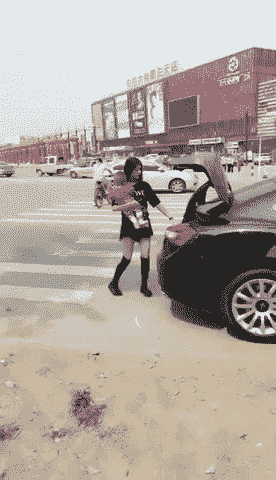

# 为什么拥有 0 美元比拥有 1 美元好得多

> 原文：<https://medium.com/swlh/why-having-0-is-much-better-than-having-1-15729410c2d1>

## (或 5 美元，或 100 美元)

# **钱**。

**为什么我们如此喜欢吃它？
是为了生存吗？茁壮成长？或者只是一种感觉活着的方式？**

我对金钱的主要问题是它如何剥夺了我们的清晰。它创造了一幅生活应该是什么样子的虚假画面。我们应该尽可能多地拥有它，这已经成为一个普遍的假设。但是金钱真的会影响我们的成长吗？

我出生在一个典型的中产阶级家庭。我的父母都从事朝九晚五的工作，作为一个家庭，我们从未面临任何重大的财务问题。我的父母对待金钱的态度很保守。我经常看着他们整理账单，在损益表上添加数字。当我十几岁时，我母亲决定辞职。我的父母意识到我爸爸的工资足够养活整个家庭。我记得我的父母是如何告诉我和我的兄弟姐妹，我们将比以前花更少的钱。从那时起，我们买的东西越来越少，去度假的次数也越来越少。对十几岁的我来说，这起初似乎很可怕。我花了几个月的时间适应这种新情况，才明白我赢得了和妈妈在一起的时间。这是如何避免为你不需要的东西买单的重要一课。我母亲辞去了工作，为我们大家树立了榜样。为什么？因为她不再享受了，想转行。我们进行了一次公开讨论，她告诉我们，只有我们更理性地消费，她才能戒烟。直到今天，这是我学到的关于选择和做对自己有益的事情的最有价值的一课。

在之前的帖子中，我提到作为中产阶级，我们必须承认我们的生存是有保障的。我知道，如果我发现自己缺少生存所需的钱，我会想办法去创造钱。这就是为什么我的生存是有保障的——我对此有信心。有了安全的生存，我们就有机会过上充实的生活。我们有义务永远不要让这个难以置信的机会溜走。

# 投资 5 美元的最佳方式

几年前，我读了[蒂娜·齐莉格](https://medium.com/u/f0ff034d3bf9?source=post_page-----15729410c2d1--------------------------------)的精彩著作《我希望我 20 岁时就知道的事》(*很高兴知道你是灵媒，蒂娜！*)。仅举几个例子，Seelig 是斯坦福大学的教授、作家和企业家。在她的书中，她提到了她曾经给她的班级布置的一个有趣的作业。她的学生被分成几个小组。每个小组都收到一个信封，里面有 5 美元作为初始投资。目标是在 2 小时内尽可能多的赚钱。他们被告知，稍后，每组将有 3 分钟时间陈述他们选择做的事情。

根据 Seelig 的说法，大多数人经常以一种共同的方式思考，从而提出类似的想法。有人说他们会在赌场花 5 美元。其他人说，他们将设立一个柠檬水摊位，并用他们的 5 美元投资购买原料。但是西利格鼓励她的学生拓展他们的思维。他们选择做的事情相当聪明。
例如，一个小组解决了当地的需求。在当地的餐馆总是有很长的等待队伍，人们需要一段时间才能得到一张桌子。学生们决定同时去几家不同的餐馆排队。他们一排到第一个，就把自己的位置卖给了其他等候的人。自从他们和别人交换了现货，他们总是以另一个现货结束。获得 650 美元的第一组人甚至没有用完他们的 2 小时限制。你可能会好奇，他们是怎么做到的？那个小组的学生有了突破性的想法。他们使用了事实上最有价值的资源:他们的三分钟陈述。这个小组将他们 3 分钟的演讲时间卖给了一家想要招聘学生的公司。他们制作了一个简短的广告，并在课堂上播放。

所有创新小组都有一个相似之处:他们完全忽略了给予他们的 5 美元投资。
他们意识到他们的 5 美元一文不值，并找到了一种有效的方法来创造金钱，而不管他们最初的投资。

# 金钱=一种工具

在我的生活中，有很多时候，我对一个问题的看法过于狭隘，很快就陷入了死胡同。
当我们只使用普通的思维模式时，就会发生这种情况。那些我们都在使用的主流方式。
**我们的思维被我们的生活模式所遮蔽**。例如，金钱常常让我们看不到自己的意义、价值和创造力。金钱在我们的生活中扮演着重要的角色。也许是最重要的。
**但钱被高估了。我过去几乎每时每刻都在想钱。
我会一天几次查看我的银行账户余额，计算我的收入，比较价格……
别误会。监督我们的开支是至关重要的。这让我们能够控制自己的财务。但是重要性和痴迷之间只有一线之隔。** 我被迷住了。我没花多少钱。其实恰恰相反。我太在意过极简主义的生活，以至于浪费了太多的精力去完善它。我的清晰逐渐开始消失。

当金钱成为我们的理想时，我们考虑如何最好地投资给我们的 5 美元，而不是跳出框框思考。这就是为什么认识到金钱只是一种工具是至关重要的。
最好的投资不是金钱。最好的投资在你自己身上。你的价值观、激情和目标都毫无价值，除非你让它们变得有价值。

# ~要创新~

如果现在有额外的 1000 美元，你会做什么？一万美元或者十万美元怎么样？你会以不同的方式追求你的激情和目标吗，或者这会让你失去创造力吗？不考虑金钱你能实现你的目标**吗？**

很容易把钱当借口。

> “我付不起公关费用，所以我的业务停滞不前”
> 
> “我需要更多的钱，否则我将无法录制另一张专辑”

听起来很熟悉？
这第二句话是我自己说的。我反复对自己说了一段时间。我在限制自己，用钱做借口。而是应该用自己的创造力想出来的。

事实是，许多企业很少需要钱来运转。
作为一个音乐人，我很佩服那些最先用 Youtube 这个平台推广自己音乐的人。那时，Youtube 仅仅是一个充满有趣的猫视频的网站。这些音乐家很有创新精神，在一个他们没有竞争对手的地方找到了曝光机会。他们没有采用主流的方式(打演唱会、花钱做公关)，而是找到了一种脱颖而出的方式。
这是一个非常棒的想法，如今 Youtube 已经成为音乐人推销自己的另一种主流方式。
你可能认为这种创新思维不能应用到你的工作中，但事实并非如此。也许你在想:*嘿，我不能让我的生意起飞，因为我需要钱来开发我的产品。*
好吧，你会对第一批用 Kickstarter 的创业者说什么？他们找到了一个难以置信的方法来资助他们的项目，并让人们大肆宣传。更有甚者，他们让人们在产品还没准备好的时候就付款，从而降低了他们的风险。世界告诉他们不会成功，但他们回答说— *是的，我们会*！我最终发现有很多方法可以录制我的专辑。我可以用我的技能(而不是金钱)来换取工作室的时间。我甚至可以通过 Kickstarter 从我的粉丝那里获得资金。今天，我在为自己建的一个小工作室里创作新的素材。这可能不是一个豪华的工作室，但它为我的工作提供了合适的环境。

# 释放你的特殊技能

有创造力的人明白金钱是一种工具，但并不总是最重要的工具。
你的企业并不是因为你投资或可能投资的金额而与众不同。无论你是经营博客、创业、喜剧表演还是写书，**你的创业都是特别的*感谢*你**。只有了解了我们的独特之处，我们才能(轻松地)定义我们的业务的独特之处。

*-我的工作有什么独特之处？我最重要的技能是什么？
——这些东西如何定义我的作品？我是在运用我的创造力，还是只运用主流的思维方式？我对金钱着迷了吗？还是我只是把它当成了另一种工具？*

如果你保持清晰的思维，事情就会发生。不管你的目标是什么，前进的唯一道路就是你独特的思维。这是你与众不同的唯一方式。这需要时间，但你必须保持自信和耐心。

你记得你朋友给你讲的那个故事吗？他的祖父是如何来到美国，钱包里只有 1 美元，却实现了他所有的目标？也许那个故事终究不是童话。也许这是真的。但是只有当他的祖父无视他的 1 美元钞票时，这才有可能。

## 这篇文章发表在《创业公司》杂志上，这是 Medium 最大的创业刊物，有 310，538 人关注。

## 订阅接收[我们的头条](http://growthsupply.com/the-startup-newsletter/)。

