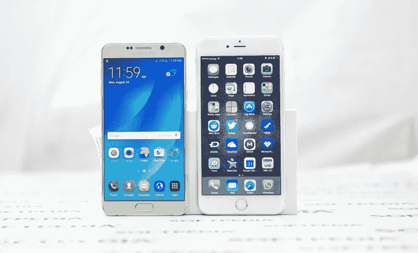
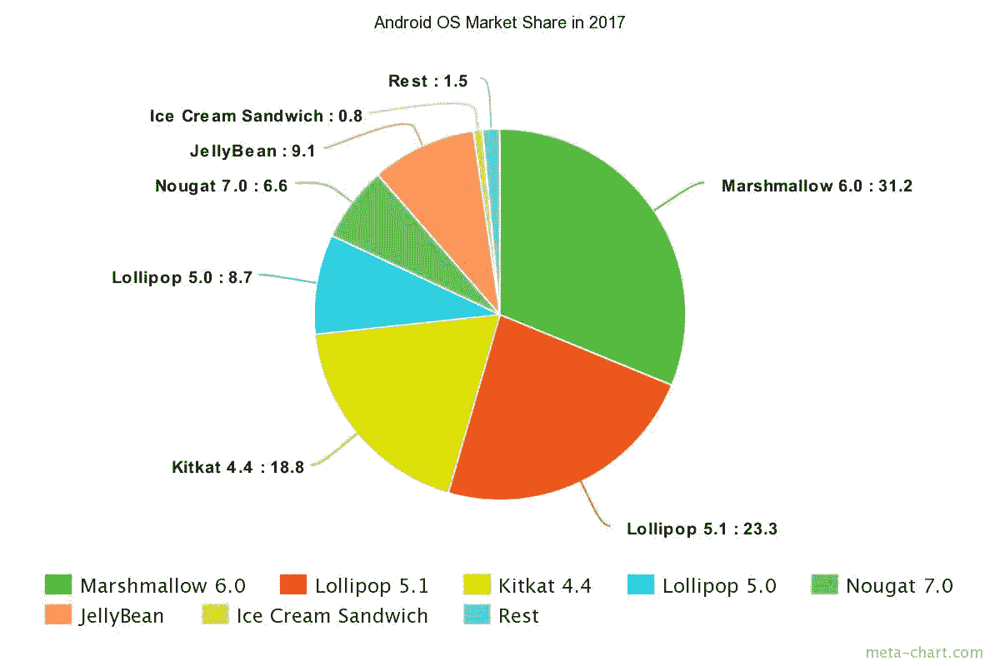
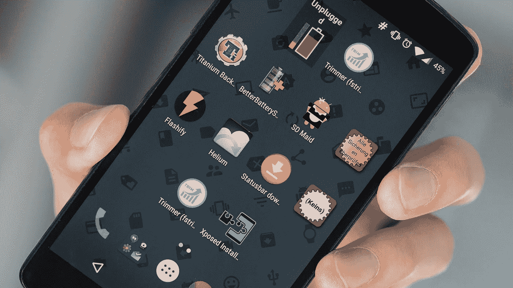

# 为什么同时拥有 IOS 和 Android 应用程序版本如此重要

> 原文：<https://medium.com/swlh/why-having-both-ios-and-android-app-versions-is-so-important-8a74115b979d>

目前，安卓和 iOS 操作系统的智能手机是全球用户中最受欢迎的，但它们的市场份额远远不相等。NEO Group 的统计报告显示，Android 智能手机在美国市场的份额约为 61%，而 iOS 仅占 29%。

# iOS 的优势——精致且开箱即用

尽管 Android 设备的分布比 iPhones 广泛得多，但最好的应用程序往往首先在 iOS 上推出:Twitter 的 Periscope 应用程序就是一个很好的例子，它的 Android 版本在很久以后才获得批准。为什么会这样？首先，iPhone 用户可能会为出版商提供更可靠的收入来源:从统计数据来看，他们更富有，愿意在他们需要的应用程序上花更多的钱。

第二个原因是苹果和他们在让开发者的生活变得更容易方面所做的令人难以置信的工作。

众所周知，去年苹果推出了新的编程语言 Swift，这不仅是为了简化应用程序开发，也是为了帮助开发人员避免他们在使用其他语言时经常犯的错误。《彭博邮报》询问的消息来源称，Swift 几乎立刻成为了开发者的最爱，变得非常受欢迎。

与此同时，为 Android 这样一个分散的平台开发应用程序是一个要求更高的过程:程序员需要为他们的应用程序创建几个版本，以便在旧的操作系统版本上工作，因为软件在装有 Android 的设备上通常更新非常慢。

Source: meta-chart.com

现在使用最多的版本是两年前推出的棉花糖。第二广为流传的是三年前发行的棒棒糖。去年首次亮相的安卓牛轧糖只能在全球 6.6%的安卓设备上找到。

# Android 的优势——灵活且易于定制的平台

当然，我们前面说的一切并不意味着 iOS 就比 Android 好。移动应用开发者继续支持和推出新的足够好的谷歌操作系统应用。这是有原因的。我们决定让你知道 Android 在 iOS 之前拥有的主要和最重要的优势。

1.  值得注意的是，Android 的受众更大。这就是为什么许多用户会不耐烦地等待一个应用程序在 Google Play 中发布，这部分观众不容忽视。
2.  如果你对你的 iOS 设备的工作方式不满意，你将无法用它做些什么。苹果实际上没有给他们的 iPhone 和 iPad 用户任何选择。拥有 Android 手机的人可以很容易地下载解决方案，使他们能够改变操作系统参数，只需扔掉无用的功能，就可以扩展他们的功能。
3.  这个安卓优势是上一个的后续。它在这个列表上是因为相当多的人认为这是选择 Android 而不是 iOS 的唯一理由。你不能以任何方式彻底改变你的 iPhone 的界面，所以对于定制粉丝来说，最好的系统无疑是 Android。你可以安装一个新的启动器，改变系统字体，设置一个小工具系统——你的手机会看起来(和感觉！)绝对不一样。
4.  如果版主从 App Store 中删除一个应用程序，99%的 iPhone 和 iPad 用户将无法安装它。当然，也有极端的选择，比如“越狱”和安装所需的调整，但破解最新的 iPhone 型号需要很长时间，而且不是每个人都愿意浪费时间和精力安装它。而且，这简直违背了用户的许可协议。反过来，安卓用户可以在网上找到他们需要的 APK 文件，然后简单地安装它。你不会被强迫使用 Google Play。

所以，如果你的产品在一个平台上成功了，准备把它移植到另一个平台上，如果你想让你的项目盈利，这是无法避免的。

# 最成功的应用程序在两个平台上都可以使用

有时开发者甚至不会停下来，同时在两个平台上发布应用程序。对于设计师来说，这只能意味着一件事:他们需要为其他平台调整应用程序的用户界面和 UX，并努力保持产品设计的完整性。

用户界面的多平台适配有三种方式:

1)在所有平台上保持品牌的完整性。

2)遵循每个所需平台的规范。

3)试图找到前两种方式之间的平衡。

我们决定分析这三种方法，并针对每种方法给出一个流行的应用程序示例，以便您可以选择适合您需求的方法。

***1:保持品牌的完整性***

在所有平台上保持统一的设计，而忽略集成的组件，这是起草用户界面设计的最简单、最快和最经济的方法。但当涉及到程序部分时，情况将会相反:如果不使用平台的内置 UI 元素，就很难为应用程序创建一个独特的 UI，其开发将比只使用标准组件更昂贵。

开发者成功走上这条道路的一个例子是 **VSCO Cam** 。

视觉供应的第一个 VSCO Cam 版本于 2012 年在 iOS 上发布。一年后，照片编辑器凭借巨大的人气进入了 Android 市场。它几乎复制了其 iOS 兄弟的界面，但有趣的是，这两个平台都没有接近当时在两个平台上设定的视觉设计标准。

在这种情况下，忽略主流指导方针似乎完全没问题。VSCO 的创造者们认为创意是生活中最重要的事情之一，当你看到他们如何制作一款应用时，这一点变得越来越明显:这是品牌的一部分，而品牌又是创意社区的一部分。这正是艺术的完整性对 VSCO·坎姆如此重要的原因。

***什么时候我应该优先考虑品牌的完整性？***

1) **相同的用户使用不同的渠道(个人电脑、iPad、iPhone、Android)访问您的服务**

使用各种渠道接触客户的公司通常非常重视品牌的完整性。但这只有在这些用户在不同平台和设备类型(iOS、Android、web)上访问应用程序时才有意义。

例如，如果用户可以同时通过 iOS 和 Android 设备以及 PC 访问音乐服务。在这种情况下，不同平台的版本看起来是一样的，因为对于开发人员来说，保证平台之间的简单平稳的过渡是很重要的。

2) **自定义 UI 组件允许客户直观地使用应用程序，并使界面看起来更有吸引力**

该领域的一些研究人员将用户体验分解为四个组成部分:内心感受、言语化可能性、简单性和“神奇体验”(后者基本上是指不费吹灰之力获得一个有价值的结果)。结合这四个组成部分有助于设计师创造完整的 UX，无论他们是否遵循指导方针。总而言之，定制组件通常有助于达到比标准组件更高的可视化和交互性水平。

还需要注意的是，操作系统之间的差异可能会导致应用程序在一个平台上运行良好，而在另一个平台上运行糟糕。

***2:聚焦平台独特设计***

与品牌的完整性不同，平台定位需要更多的时间和金钱(如果我们只谈论界面设计的话)。为了让应用程序符合目标平台的规范和标准，在转移设计时，许多 UI 和 UX 元素应该从头开始制作。

在这种情况下，焦点从品牌的完整性转移到 UX，因为用户倾向于习惯他们使用的平台；如果是这样的话，通过一个已经众所周知的设计对一个应用程序进行简单和几乎直观的理解会给你带来很多好处。

这个领域最突出的例子就是**电报**信使。

Telegram 已经在 iOS 和 Android 上同时推出，开发人员决定专注于功能，而不是在两个平台上进行设计。所以，设计师决定我只是遵循两个平台的标准。

iOS 和 Android 上的 Telegram 版本与这些平台上的应用程序完全不同。IOS 版本完全遵循苹果的指导方针，看起来像一个标准的 iOS 7+应用程序:导航栏右侧有一个按钮，你可以用它来编写新信息，左侧是编辑按钮，屏幕下方是一个带有不同菜单部分的 tap 栏，上方是当前部分的名称。

Android 版本是谷歌材料设计的一个很好的例子。有一个方便导航的汉堡菜单，右上角的简单搜索按钮，当然还有浮动按钮——材料设计的核心和灵魂。

***何时最好考虑平台的标准***

1) **众多竞争对手激励创业者尽快推出应用并获得用户群**

尽管需要为每个平台创建单独的设计概念，但设计中的平台导向将允许设计师更快地将您的想法变为现实。一旦这款应用出现在市场上，下载它的用户就已经熟悉了界面元素。设计师不会经历创意危机，也不需要发明不寻常的东西——他们只需要遵循指导方针。

2) **苹果和谷歌的设计潮流受到观众的热烈欢迎**

谷歌做出的超级明智的品牌决定没有给我们留下太多选择:如果你把一个应用从 iOS 升级到 Android，重新思考它以满足材料设计标准几乎是一种需要。

3) **如果你的应用有复杂的功能和界面**

每个手机应用程序都应该简单易用，即使它有数百万个重要的功能。如果你的 app 内容多，功能性高，最好尽量适合平台。

***3:混合***

如果你想遵循这种方法，你需要考虑两种类型的用户:那些已经熟悉你的产品的用户和那些从未使用过它的用户。属于第一类的人忠于品牌，而后者习惯于平台的独特功能。

选择这种方式的设计师应该遵循一种相当外交的方法，因为他们捍卫品牌的利益，同时旨在与用户建立友好的关系。他们需要找出，哪些界面元素使产品脱颖而出，并为某个平台找到特定的功能，这不会伤害品牌的声誉。

让我们来看看**脸书**。

一方面，脸书是一个知名度很高的品牌，另一方面，它是一个拥有大量用户的多平台网络。混合方法是开发人员最可行的方法，他们最终成功地创造了一个用户友好的，非常受欢迎的产品。

iOS 和 Android 版的脸书看起来很相似，但同时都感觉是其平台的原生版。脸书的设计师遵循了这些指导方针，但也考虑到了用户的兴趣:他们选择了简约的设计风格，为内容留出了更多空间，这是他们应用程序的主要组成部分。

iOS 版本使用屏幕下方的标准导航栏和搜索栏。在 Android 版本中，你可以使用 tap bar 从一个部分切换到另一个部分。点击栏通常位于屏幕顶部。

***什么时候需要采用混合法？***

混合方法是一种让用户体验为你的品牌说话的方法。我们相信这是跨平台项目的最佳方式。这给了你聚集忠实观众的机会。此外，它让设计师将关注点从指南转移到品牌的身份，最终生产出一个平衡和精致的产品。

这种方式唯一的缺点是，对于一个在项目开发的第一阶段就花不起太多钱和时间的小初创公司来说，几乎不可能遵循。

尽管乍一看混合方法似乎是最有利的，但我们坚持认为没有单一的理想方法来设计应用程序。每个案例都是独特的。在进行设计时，你应该记住你是为真实的人做的，他们会在真实世界的真实设备中使用它。说实话，最重要的不是品牌，不是平台，甚至不是你的创意。

因此，iOS 和 Android 开发的底线是——**项目应该围绕用户体验来构建，并关注用户需求**。

用户并不真正关心你使用了什么方法，或者你如何使界面适应这个或那个平台。不管你喜欢与否，但大多数用户唯一关心的是你的公司给他们的体验。如果是积极的，你就会成功。

如果您还有任何问题或希望获得专家的帮助，请随时[联系我们](https://octodev.net/contact-us/)，我们将尽力满足您的需求！

*本文原载于* [*Octodev 博客*](https://octodev.net/why-having-both-ios-and-android-app-versions-is-so-important/) *。*

如果你喜欢这篇文章，请点击下面的拍手图标，让我知道！

## 这个故事发表在 [The Startup](https://medium.com/swlh) 上，这里有 263，100+人聚集在一起阅读 Medium 关于创业的主要故事。

## 在这里订阅接收[我们的头条新闻](http://growthsupply.com/the-startup-newsletter/)。

