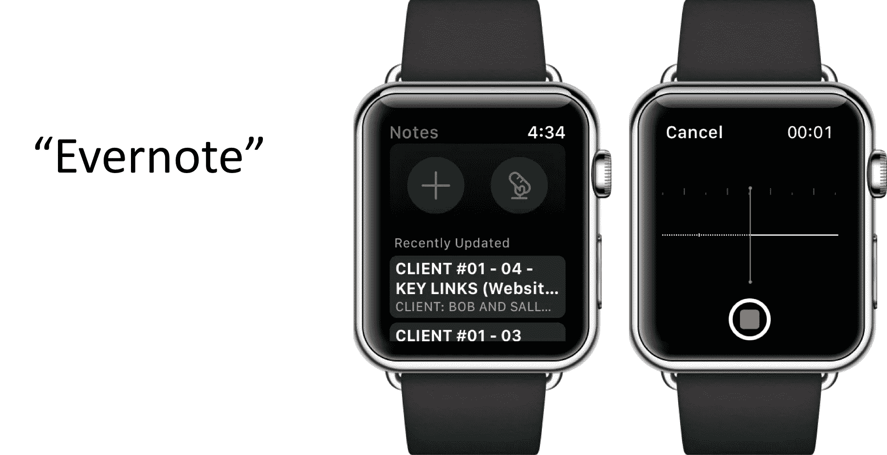
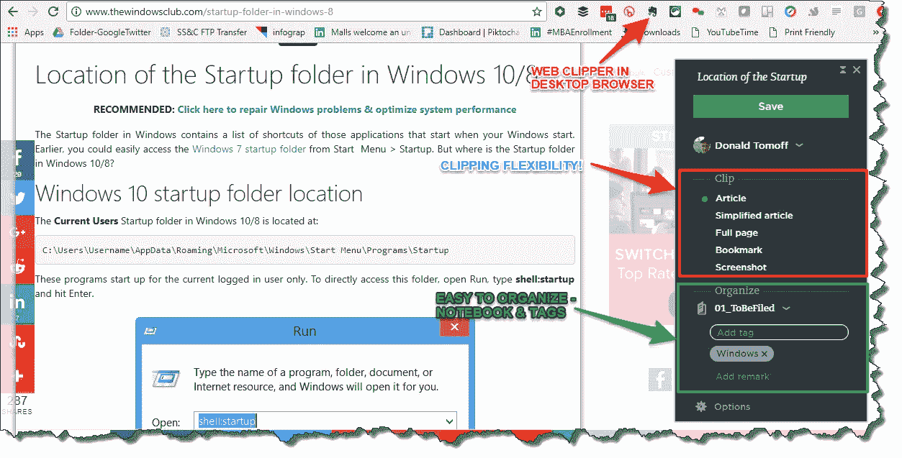
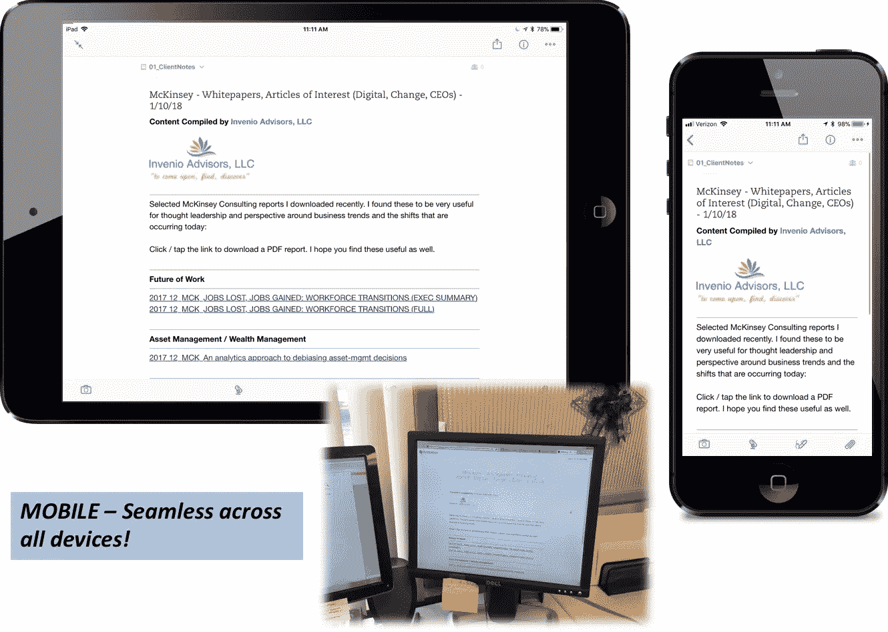
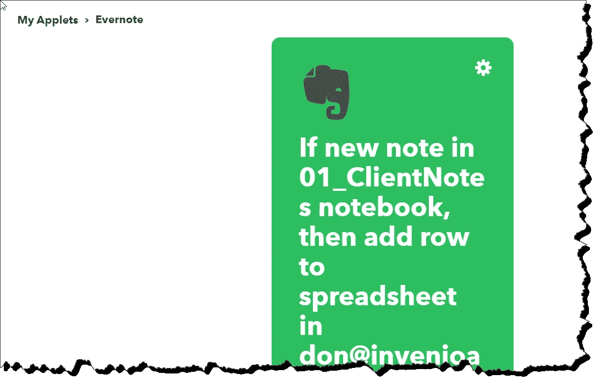
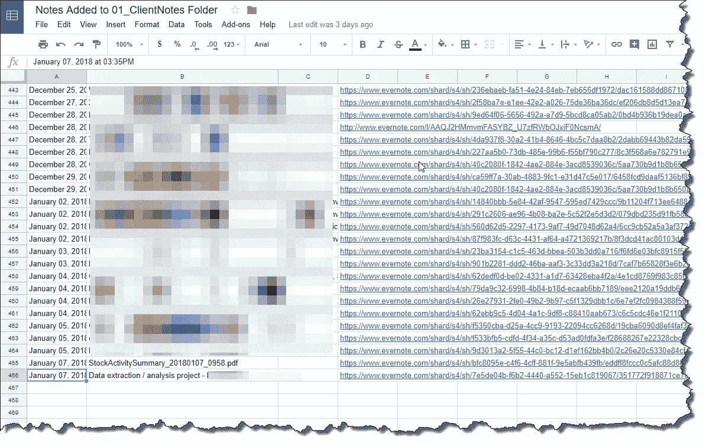
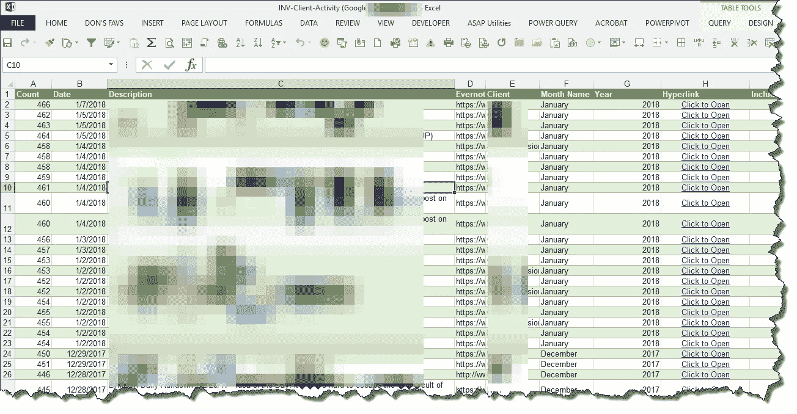
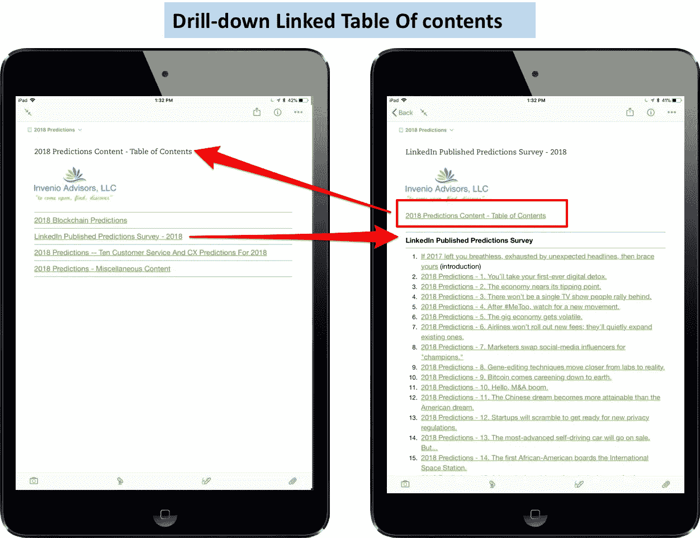
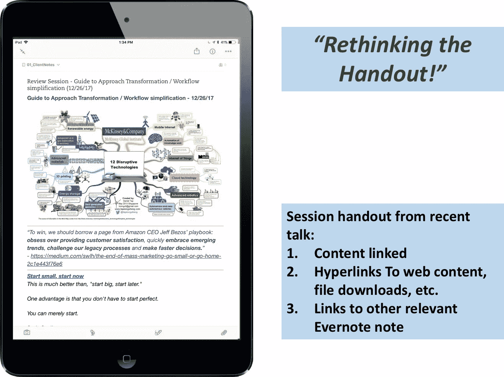
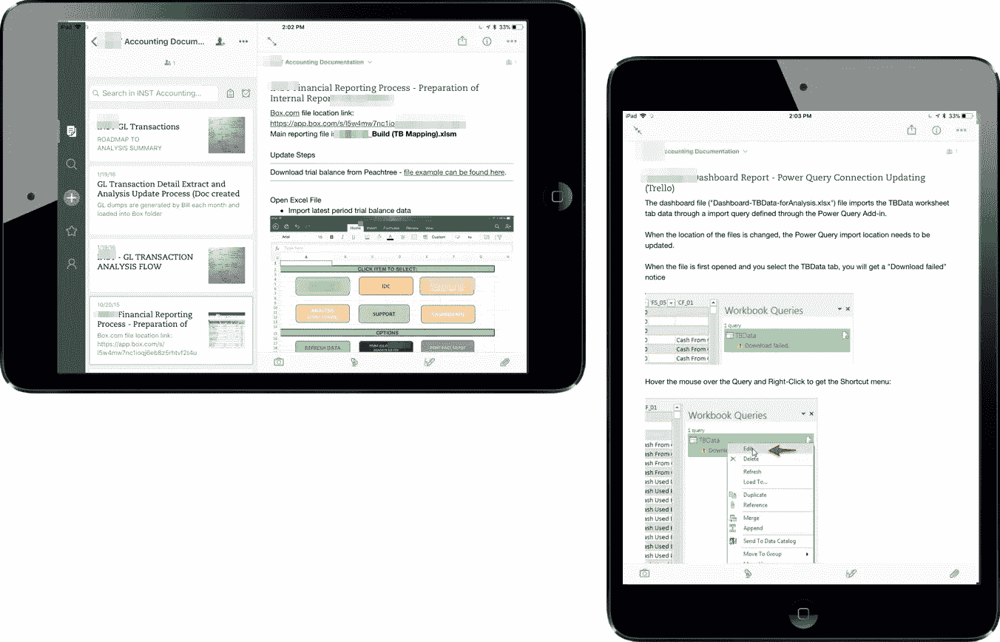
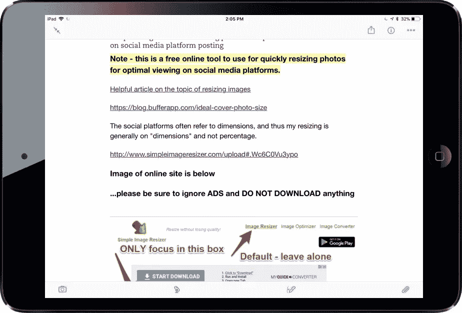

# 我永远无法放弃#Evernote 的 6 个理由…

> 原文：<https://medium.com/swlh/why-i-can-never-give-up-evernote-4407b7bd33a0>

## 至少我希望我不必

我从 2008 年开始使用 Evernote，它是我工作流程中不可或缺的工具。

为什么？以下是我的六大理由:

## 1 —从任何设备获取内容都非常容易。

How I quickly add an audio note into Evernote

Evernote Web Clipper makes content capture simple from web browser!

## 2——搜索和找到我需要的任何东西都非常快。

> “Evernote 中的搜索框是所有奇迹发生的地方。我们稍后会谈到这种魔力，但首先我想承认这是人们在 Evernote 中搜索某些东西最常见的方式。它像搜索引擎一样工作，所以你已经知道如何使用它。”

 [## 你应该使用的 20 个 Evernote 搜索功能

### 使用 Evernote 是一回事，掌握 Evernote 完全是另一回事。如果你是 Evernote 的新手，我不…

www.makeuseof.com](https://www.makeuseof.com/tag/20-evernote-search-features-you-should-be-using/) 

只要花一点点时间*熟悉搜索命令，就会有很大的不同！除此之外，你会学到更多，因为你更频繁地使用它！*

*这是我制作的可下载的搜索提示卡:*

*Evernote Search Tips & Tricks — Downloadable Reference Card*

## *3 —可从任何设备访问(移动设备对我来说至关重要！).*

**

*Evernote Note on the iPad, iPhone and Desktop — Seamless!*

## *4 — Evernote 已经成为我的随身(迷你)CRM 工具。*

*我在我的“***01 _ 客户笔记*** ”笔记本里跟踪 Evernote 里所有的客户工作/项目。*

*整合 Evernote 和 IFTTT ( [见 IFTTT 应用程序这里](https://ifttt.com/applets/53473691d-if-new-note-in-01_clientnotes-notebook-then-add-row-to-spreadsheet-in-don-invenioadvisorsllc-com-s-google-drive))使我能够在 Google Sheets 中创建一个链接回 Evernote 的自动列表。*

**

*IFTTT app — When new note is added to a notebook, create a new row in Google Spreadsheet*

**

*IFTTT automated spreadsheet — posting Client notes to Google Sheets*

*我已经将这个过程自动化，将其导入 Microsoft Excel，这样我的桌面上就有了一个快速参考列表。*

**

*Microsoft Excel Import — With Analysis Dashboards Flexibility*

## *5 —我喜欢它作为分享内容的资源*

*我经常与客户、我的网络、我接受培训的人等分享内容。Evernote 因其灵活性而成为我的巨大资源！*

*这里有两个例子:*

**

*2018 Predictions Content Collection — Shared with a Group I’m In*

**

*“Rethinking The Handout” — sample Linked Document from previous talk I gave*

## *6 — Evernote 是一个很棒的过程文档工具*

*我经常审查并帮助客户审查、重新思考和更新业务流程——随之而来的是大量的流程文档！*

*这是我(和许多其他人)以前在微软 Word 中使用的功能，但我现在发现我在 Word 中使用的文档少了很多，因为 Evernote 对我的工作流程有很多其他优势。*

**

*Sample Process Documentation Notebook — Sharing and Updating among Team responsible for maintaining*

**

*Reference Documentation — Reference available to entire team*

# *结论*

*给你。我永远无法放弃 Evernote 的六个快速理由！*

*无论是 Evernote、OneNote 还是其他笔记工具，对我来说，绑定到桌面或笔记本电脑上是一场失败的游戏，这一点已经变得很明显。*

*这六种方法中的任何一种能解决你的问题吗？*

*如果有，肯定考虑 Evernote。我不会回去的！*

## *关于唐*

**

> *“是时候改变了”*

*Don 热衷于帮助专业人士和组织跟上并适应我们所处的不断变化的商业世界。*

## *“你是做什么的？”*

*我经常被问到这个问题。我的回应(不是你想的那样！)?点击这里查看！*

## *和唐联系！*

*[LinkedIn](https://www.linkedin.com/in/dontomoff) ， [Flipboard](https://flipboard.com/@dtomoff) ， [Twitter](https://twitter.com/@dtomoffcpa) ， [Snapchat](https://www.snapchat.com/add/dtomoff)*

*[或者，谷歌我……我无处不在](https://www.google.com/webhp?sourceid=chrome-instant&ion=1&espv=2&ie=UTF-8#q=don%20tomoff%2C%20invenio%20advisors)*

**

## *这篇文章发表在 [The Startup](https://medium.com/swlh) 上，这是 Medium 最大的创业刊物，拥有 283，454+人关注。*

## *在此订阅接收[我们的头条新闻](http://growthsupply.com/the-startup-newsletter/)。*

**