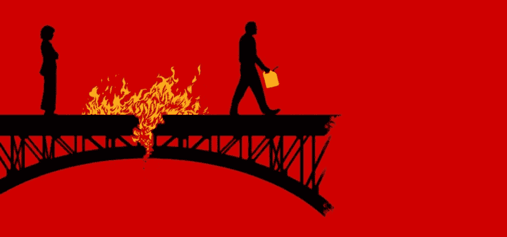
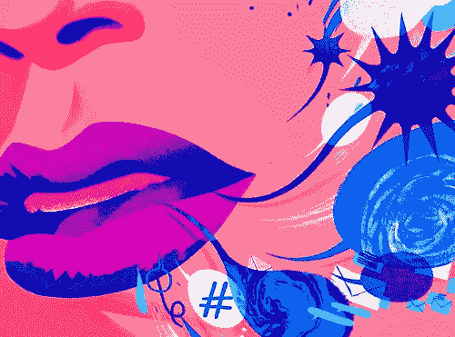
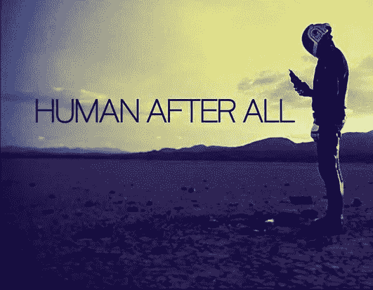

# 为什么我每天都选择职业自杀。

> 原文：<https://medium.com/swlh/why-i-choose-career-suicide-every-day-d72ff8a964a0>

在许多人看来，我每天都在进行职业自杀。有人会说我每天早上都在自己脸上拉屎。

我为什么这么说？

我这么说是因为我每天都在做一些在过去会是职业自杀的事情。

## 我每天做的事情被人们认为是职业自杀，但我认为对你的职业成功至关重要，这些是:

# 煽动情绪。

大多数人的职业生涯都在自动驾驶中度过。他们追逐金钱，然后想知道为什么过一会儿他们会觉得无聊。

**自动驾驶迫使你忘记情绪，并唤起他人的情绪。**自动驾驶吸走了我们的情感，让我们戴上了面具。

我选择激起人们的情感，因为这让我达到了新的高度。当人们因为你的行为而产生情绪时，他们会做出疯狂的反应。

我自己职业生涯中的一个例子是在 LinkedIn 上分享情感信息。我分享我最深、最黑暗的秘密、失败和情感斗争，这样别人才能受益。

我不断得到让人发疯的反应。这就是为什么我说的很多话已经被病毒式传播了很多次。不过，我们的目标不是成为社交媒体明星；目的是激起情感。

情感创造运动。

情感让人们更接近你，这在一个失去了很多人际交往的商业世界里有着不可思议的好处。

# 说出你的想法。

我每天都会礼貌地告诉人们“我不感兴趣”，或者*“他们让我失望了”，*或者*“我不会买的。”*

传递这些刺耳的信息被认为是职业自杀。

*“有人不高兴怎么办？”*

“如果他们告诉我的老板怎么办？”

*“如果我错了呢？”*

当我们说出你的想法时，这些问题会在我们的脑海中失控。当你礼貌地说出你的想法时，你让人们理解了你的想法。

这让他们有机会改变路线或继续下一个机会，节省每个人的时间。说出自己的想法不是职业自杀；它推动了商业的发展，也是诚实的。

# 选择创意。

我们都被一个毫无创意的幻灯片奴役了一个小时。在很多人看来，创造力是职业生涯的自杀，因为它表达了你是谁。

创造力是对一个问题给出一个非典型的答案。

创造力是将你外在的激情带入工作场所。

创造力是讲述一个个人故事来改变人们的思维方式。

创意是美好的。

你的许多同事在工作中没有创造力，然后他们想知道为什么他们缺乏激情。

# 旧事重提。

不管我们是否从事销售，我们每天都在销售——这是我们都听说过的陈词滥调，对吗？

当人们向你推销产品或服务时，他们很少会告诉你它的失败之处。如果你知道这些，也许你就不会买他们卖的东西了。

这种想法是有缺陷的。

谈论失败看起来像是职业自杀，除非你接受这样一个概念:我们大多数人犯错误的次数比我们想象的要多。

我们错的次数可能比对的次数多。

在任何情况下谈论你的失败都会拉近我们的距离，因为我们都分享这些肮脏的小秘密。事实上，我们大多数的失败看起来都是一样的。

我一直在谈论我的失败，尤其是当人们问我成功的重要时刻时。

有人问我最近在 LinkedIn 上写的一篇病毒式文章，我告诉了他们大约在同一时间发布的一篇文章，这篇文章惹恼了所有人。

我想让他们看到什么是真正的成功，并给他们一张后台通行证，让他们去看这个每个人都假装不是每天都在上演的节目。

除了几个小部分，我的大部分博客都是失败的。也就是说，直到有一天，不再是失败。直到我达到临界点。

即使我到达了临界点，我还是会继续失败，你也一样。

> “失败不是职业自杀，如果你想停止欺骗自己和其他人，你应该更多地谈论它。我们都在销售(我同意)，所以让我们开始销售真相"

# 有宏伟的愿景。

*“那个叫蒂姆的家伙吹牛，不是吗？真是笑话。”*

当我宣布我的宏伟计划和我正在做的几乎任何事情的愿景时，这是人们脑海中反复出现的想法。宏伟的愿景会让人觉得你满口胡言，已经脱离了现实。

这种想法只不过是一种限制性的信念。

> *“除非你开始在头脑中思考大事，否则你永远也不会接近那种性质的东西。你将在一个“现实的现实”的沙坑中继续玩这个小游戏，而不是在一个有些不合理的愿景中玩这个游戏*

宏伟的愿景不是夸大能够实现的目标；它们是关于突破界限，向火星发射，也许是登陆月球，这仍然非常酷！

商业世界中的许多人很少实践拥有宏伟愿景的实践，所以这是脱颖而出、被人记住和做一些大胆美味的事情的好方法。

真正的职业自杀是拥有平庸的愿景，不能做到最好，这甚至是不可想象的。

# 提及你的健康挑战。

我已经得到了我应得的一份。从与癌症的擦肩而过，到汞中毒，再到几乎让我职业生涯陷入瘫痪的压力水平——我目睹了这一切，也分享了所有这些。

我注意到，我的同事认为谈论你的健康挑战是一种软弱的表现，因为没有人愿意为一个可能生病或濒临死亡的人工作、合作或雇佣。

事实正好相反:**除非你谈论你的健康挑战，否则你永远不会直面你的死亡**这意味着你会认为你在这个地球上的时间是理所当然的。

这才是让你的职业生涯更上一层楼的东西，而不是什么软弱的感觉。

知道你的死亡是你生活和职业生涯各个方面的力量。

> *“软弱之后是巨大的力量”*

# 与众不同比变得更好更容易。

像我一样，像别人描述的那样进行职业自杀，会让你与众不同。

你可以尝试和那些只展示他们职业生涯精彩片段的完美样本竞争，或者你可以做很多人不准备做的事情，玩一个不同的游戏。

将脆弱、真实、诚实和谦逊结合起来看起来像是职业自杀，直到你明白这就是马丁·路德·金与你从未听说过、尊重过或受到过启发的鲍勃·金的区别。

# 为什么要选择职业自杀？

你应该选择职业自杀，因为这只不过是一种错误的认知。

职业自杀现在是获得职业成功的必要条件。两者相辅相成。选择职业自杀，这样你就可以远离那些让人们挠头并想知道自己当初为什么出生的谎言。

选择激情和目标，而不是躲在让你长期生自己气的面具后面。

**职业自杀是选择成为人类。**

# 和我一起自杀吧。

我现在要发誓继续犯下这些可怕的职业自杀行为。我相信这将推动商业世界向前发展。

我想让你和我携手(我们不要做 Kumbaya 的事情)并致力于职业自杀。你真正签约的是一份你从未想过可能的职业。

我的职业生涯已经走上了这条路，我永远不会放弃。

我想让你感受到我自杀时的快乐。

【Addicted2Success.com】原帖

# *行动呼吁*

*如果你想提高你的工作效率，学习一些有价值的生活窍门，那就订阅我的私人邮件列表吧。你还将获得我的免费电子书，它将帮助你成为改变游戏规则的在线影响者。*

*[**点击这里马上订阅！**](http://timdenning.net/free-ebook)*

**

## *这个故事发表在 [The Startup](https://medium.com/swlh) 上，这是 Medium 最大的创业刊物，拥有 315，028+人关注。*

## *在这里订阅接收[我们的头条新闻](http://growthsupply.com/the-startup-newsletter/)。*

**